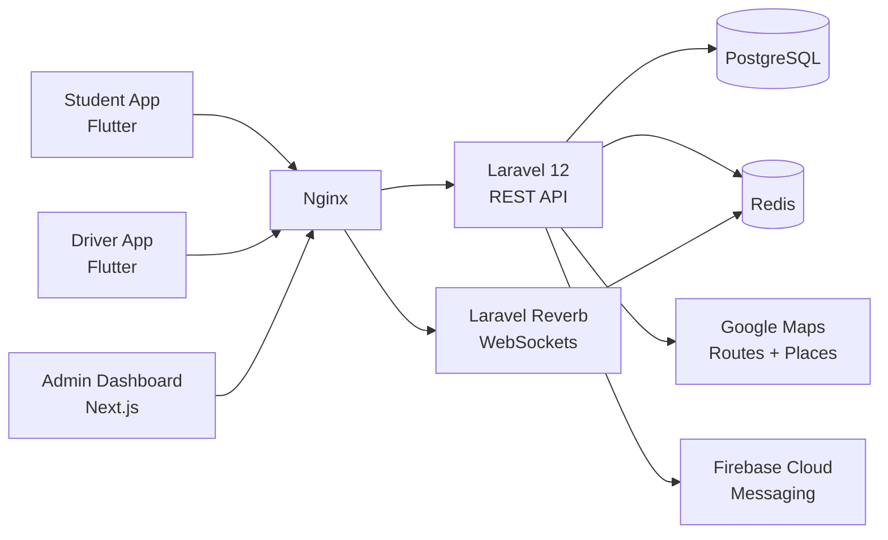

# Campus Transport Management System (CTMS)

CTMS is a centralized platform that lets a college run its entire transport operation from one place: managing buses, drivers, routes, stops, schedules and students, tracking every bus live over GPS, counting passengers in real time, calculating ETAs with Google Maps, pushing notifications to students, and handling the messy real-world events — breakdowns, replacement buses, low-occupancy merges and maintenance — through governed admin-approval workflows. It ships as three clients (a Student Flutter app, a Driver Flutter app, and a Next.js/React admin dashboard) backed by a Laravel 12 REST API with WebSocket streaming over Laravel Reverb, PostgreSQL, and Redis.

---

## Key Features

Each feature maps to one or more functional requirements (`FR-01`..`FR-15`) defined in [`./docs/00-srs.md`](./docs/00-srs.md).

| Feature | Requirement(s) | What it does |
|---|---|---|
| Role-based authentication | FR-01 | Secure JWT/Sanctum login for Admin, Driver, Student with role-based authorization and audit logging. |
| Bus management | FR-02 | Create, update, deactivate and assign buses; capacity, service dates and status tracking. |
| Driver management | FR-03 | Register drivers, capture licence/compliance data, assign to buses. |
| Student management | FR-04 | Register students, assign routes, pickup stops and transport eligibility. |
| Route & stop management | FR-05 | Define routes, ordered stops with geofences, and weekly schedules. |
| Trip management | FR-06 | Generate daily trips and assign the correct bus and driver. |
| Live GPS tracking | FR-07 | Ingest driver GPS every 5-10s and stream positions to students in real time. |
| Passenger counter | FR-08 | Driver `+1`/`-1` counting enforced against bus capacity. |
| ETA calculation | FR-09 | Live ETA per stop using the Google Maps Routes API. |
| Notifications | FR-10 | Push alerts for trip start, bus nearing stop, delay, route change, replacement and completion. |
| Vehicle incidents | FR-11 | Drivers report breakdown, accident, tyre, engine or battery issues with photo and location. |
| Replacement bus | FR-12 | System recommends available replacement buses; admin approves the assignment. |
| Smart bus consolidation | FR-13 | System recommends merging low-occupancy trips to save fuel; admin approves or rejects. |
| Maintenance | FR-14 | Every incident automatically opens a maintenance ticket. |
| Reports & analytics | FR-15 | Operational reports across trips, fleet, occupancy and incidents. |

---

## Technology Stack

| Layer | Technology |
|---|---|
| Student app | Flutter |
| Driver app | Flutter |
| Admin dashboard | Next.js / React |
| Backend API | Laravel 12 REST API |
| Realtime | Laravel Reverb (WebSockets) |
| Database | PostgreSQL |
| Cache / queues | Redis |
| Maps | Google Maps SDK + Routes API + Places API |
| Push notifications | Firebase Cloud Messaging (FCM) |
| Deployment | Docker + Nginx |

---

## High-Level Architecture

Three clients talk to a single Laravel 12 backend over HTTPS. Read/write traffic uses the REST API; live GPS and event streams use WebSockets over Laravel Reverb. PostgreSQL is the system of record, Redis backs cache, queues and presence, Google Maps powers geocoding/ETA, and FCM delivers push. Everything runs as Docker containers behind Nginx.



For the full architecture — bounded contexts, request/stream flows, container topology and scaling — see [`./docs/03-architecture.md`](./docs/03-architecture.md).

---

## Documentation Index

The complete engineering documentation suite lives in [`./docs/`](./docs/). Read them in order for a full walkthrough, or jump to the area you need.

| # | Document | Description |
|---|---|---|
| 00 | [`./docs/00-srs.md`](./docs/00-srs.md) | Software Requirements Specification — scope, roles, and functional/non-functional requirements. |
| 01 | [`./docs/01-vision-scope.md`](./docs/01-vision-scope.md) | Vision, business goals, stakeholders and in/out-of-scope boundaries. |
| 02 | [`./docs/02-glossary.md`](./docs/02-glossary.md) | Glossary of domain terms, acronyms and shared vocabulary. |
| 03 | [`./docs/03-architecture.md`](./docs/03-architecture.md) | System architecture, components, integrations and deployment topology. |
| 04 | [`./docs/04-domain-model.md`](./docs/04-domain-model.md) | Domain entities, enums, relationships and class diagrams. |
| 05 | [`./docs/05-database-design.md`](./docs/05-database-design.md) | PostgreSQL schema design, tables, keys, indexes and ER diagrams. |
| 06 | [`./docs/06-data-dictionary.md`](./docs/06-data-dictionary.md) | Field-by-field data dictionary with types and constraints. |
| 07 | [`./docs/07-api-specification.md`](./docs/07-api-specification.md) | REST API specification — endpoints, payloads, auth and error codes. |
| 08 | [`./docs/08-realtime-events.md`](./docs/08-realtime-events.md) | WebSocket channels and event contracts over Laravel Reverb. |
| 09 | [`./docs/09-use-cases.md`](./docs/09-use-cases.md) | Actor use cases and detailed scenario flows. |
| 10 | [`./docs/10-sequence-diagrams.md`](./docs/10-sequence-diagrams.md) | Sequence diagrams for core interactions across clients and services. |
| 11 | [`./docs/11-state-machines.md`](./docs/11-state-machines.md) | State machines for bus, driver, trip, incident and workflow lifecycles. |
| 12 | [`./docs/12-ui-ux-spec.md`](./docs/12-ui-ux-spec.md) | UI/UX specification, screen flows and interaction patterns per client. |
| 13 | [`./docs/13-security-design.md`](./docs/13-security-design.md) | Authentication, authorization, audit logging and threat mitigations. |
| 14 | [`./docs/14-non-functional.md`](./docs/14-non-functional.md) | Non-functional requirements — performance, availability, scalability, reliability. |
| 15 | [`./docs/15-test-plan.md`](./docs/15-test-plan.md) | Test strategy, levels, cases and acceptance criteria. |
| 16 | [`./docs/16-deployment-devops.md`](./docs/16-deployment-devops.md) | Docker/Nginx deployment, CI/CD and DevOps operations. |
| 17 | [`./docs/17-project-plan.md`](./docs/17-project-plan.md) | Project plan, milestones, phasing and delivery schedule. |
| 18 | [`./docs/18-risk-register.md`](./docs/18-risk-register.md) | Risk register with likelihood, impact and mitigation strategies. |
| 19 | [`./docs/19-traceability-matrix.md`](./docs/19-traceability-matrix.md) | Requirements traceability matrix linking FRs to design, API and tests. |

---

## Repository Layout

```text
BusM/
├── README.md            # This file — project overview and documentation index
├── docs/                # Engineering documentation suite (00..19)
├── backend/             # Laravel 12 REST API + Reverb (to be scaffolded)
├── apps/
│   ├── student/         # Flutter student app (to be scaffolded)
│   └── driver/          # Flutter driver app (to be scaffolded)
├── dashboard/           # Next.js / React admin dashboard (to be scaffolded)
└── docker-compose.yml   # Local orchestration: api, reverb, postgres, redis, nginx
```

The `docs/` directory is authoritative today; the code directories above are the intended layout for implementation.

---

## Quickstart & Next Steps

Bring the platform up in the following order. Read [`./docs/16-deployment-devops.md`](./docs/16-deployment-devops.md) alongside these steps.

### 1. Scaffold the backend (Laravel 12 + Reverb)

```bash
composer create-project laravel/laravel backend
cd backend
composer require laravel/reverb laravel/sanctum
php artisan install:broadcasting   # wires up Reverb
php artisan migrate                 # against PostgreSQL
```

Configure `.env` for PostgreSQL, Redis, Google Maps keys and FCM credentials. Model the schema from [`./docs/05-database-design.md`](./docs/05-database-design.md) and expose endpoints per [`./docs/07-api-specification.md`](./docs/07-api-specification.md).

### 2. Scaffold the Flutter apps

```bash
flutter create apps/student
flutter create apps/driver
```

Wire the student app to live tracking/ETA and the driver app to GPS streaming and passenger counting, following the realtime contracts in [`./docs/08-realtime-events.md`](./docs/08-realtime-events.md) and screens in [`./docs/12-ui-ux-spec.md`](./docs/12-ui-ux-spec.md).

### 3. Scaffold the admin dashboard (Next.js / React)

```bash
npx create-next-app@latest dashboard
```

Build fleet monitoring, approvals (merge and replacement) and reports against the same API.

### 4. Run the stack

```bash
docker-compose up --build
```

This starts the API, Reverb, PostgreSQL, Redis and Nginx together. Once healthy, seed reference data, create an Admin, then work through the primary workflow: create routes and schedules, assign drivers and students, start a trip, and watch live tracking, ETA and notifications flow end to end.

---

## Cross-references

- [`./docs/00-srs.md`](./docs/00-srs.md) — requirements source of truth
- [`./docs/03-architecture.md`](./docs/03-architecture.md) — system architecture
- [`./docs/04-domain-model.md`](./docs/04-domain-model.md) — domain model
- [`./docs/07-api-specification.md`](./docs/07-api-specification.md) — API contracts
- [`./docs/16-deployment-devops.md`](./docs/16-deployment-devops.md) — deployment and DevOps
- [`./docs/19-traceability-matrix.md`](./docs/19-traceability-matrix.md) — requirements traceability
