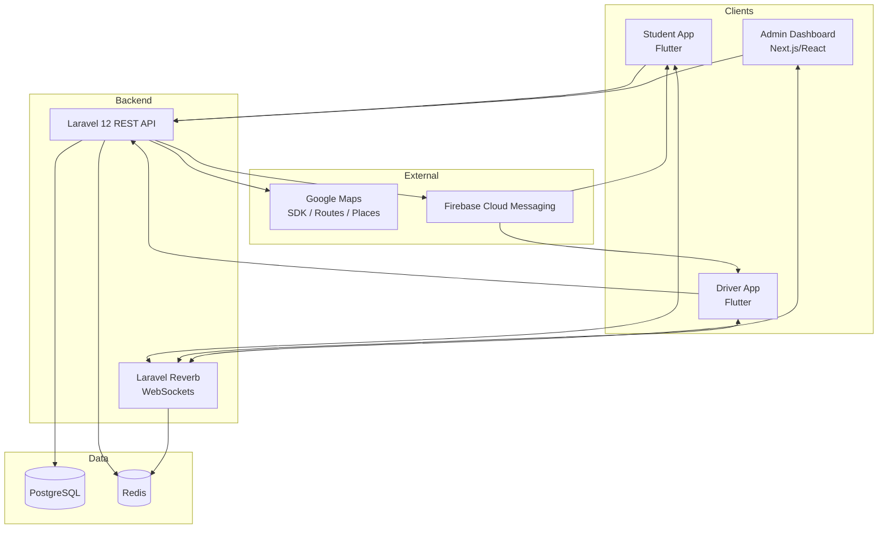
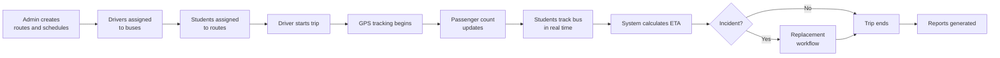
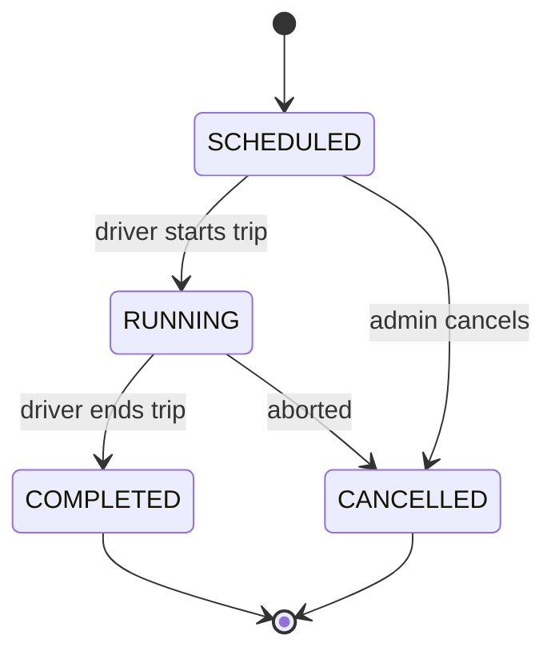
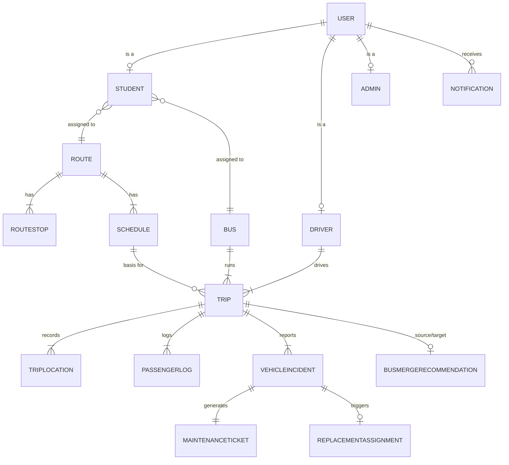

# Software Requirements Specification — Campus Transport Management System (CTMS)

**Document ID:** 00-srs
**Version:** 1.0
**Status:** Maintained source of truth for requirements
**System:** Campus Transport Management System (CTMS)
**Audience:** College Management, Transport Department, Engineering, QA, Maintenance Team

---

## 1. Introduction

### 1.1 Purpose

This Software Requirements Specification (SRS) defines the complete functional and non-functional requirements for the **Campus Transport Management System (CTMS)** — a centralized platform that enables a college to manage its bus fleet, drivers, routes, trips, and students with real-time GPS tracking, live passenger counting, push notifications, fleet monitoring, incident management, bus replacement, and transport optimization.

This document is the authoritative, maintained requirements baseline. All downstream engineering artifacts — architecture, data model, API contracts, and test plans — trace back to the requirement identifiers (FR-01 … FR-15 and the non-functional requirements) defined here.

### 1.2 Scope

CTMS is a multi-application platform composed of three client surfaces and a shared backend:

- **Student mobile app** (Flutter) — view assigned bus, live tracking, ETA, current stop, notifications.
- **Driver mobile app** (Flutter) — trip lifecycle, GPS sharing, passenger counting, incident reporting, SOS.
- **Transport admin dashboard** (Next.js/React) — fleet, route, driver, student, and trip administration; live monitoring; approvals; reports.
- **Backend** (Laravel 12 REST API + WebSockets via Laravel Reverb) — business logic, real-time streaming, persistence, integrations.

The platform covers the full operational lifecycle: route and stop management, trip scheduling, live GPS tracking, passenger counting, ETA calculation via Google Maps, notifications, vehicle incident handling, replacement-bus workflow, smart bus consolidation (merge) recommendations, maintenance ticketing, and operational reporting and analytics.

### 1.3 Definitions and Acronyms

| Term | Definition |
|------|------------|
| CTMS | Campus Transport Management System |
| SRS | Software Requirements Specification |
| FR | Functional Requirement |
| NFR | Non-Functional Requirement |
| ETA | Estimated Time of Arrival |
| GPS | Global Positioning System |
| FCM | Firebase Cloud Messaging |
| JWT | JSON Web Token |
| Geofence | Virtual radius around a stop used to detect bus arrival |
| Trip | A single scheduled run of a bus along a route on a given date |
| Merge / Consolidation | Combining low-occupancy trips onto one bus to save fuel |

### 1.4 References

- Sibling documents: `01-architecture.md`, `02-data-model.md`, `03-api-spec.md`, `04-realtime-tracking.md`, `05-workflows.md`, `06-security.md`, `07-test-plan.md`.

---

## 2. Overall Description

### 2.1 Product Perspective

CTMS is a greenfield, self-contained platform deployed with Docker + Nginx. It integrates externally with **Google Maps** (SDK, Routes API, Places API) for geospatial and ETA services and with **Firebase Cloud Messaging** for push delivery. Persistence is on **PostgreSQL**, with **Redis** used for caching and real-time fan-out support alongside **Laravel Reverb** WebSockets.

### 2.2 Stakeholders

| Stakeholder | Interest in CTMS |
|-------------|------------------|
| College Management | Oversight, cost control, safety assurance, analytics. |
| Transport Department | Day-to-day fleet operations, scheduling, approvals, monitoring. |
| Drivers | Trip execution, GPS sharing, passenger counting, incident/SOS reporting. |
| Students | Assigned bus visibility, live tracking, ETA, stop information, notifications. |
| Maintenance Team | Servicing buses from incident-generated maintenance tickets. |

### 2.3 User Roles and Capabilities

| Role | Capabilities |
|------|--------------|
| **Admin** | Manage buses, routes, drivers, students; schedule trips; monitor live fleet; approve bus merge; assign replacement buses; view reports. |
| **Driver** | Login; start trip; end trip; share GPS; increase/decrease passenger count; report vehicle issues; send SOS. |
| **Student** | View assigned bus; live tracking; view ETA; view current stop; receive notifications. |

---

## 3. Functional Requirements

Each requirement is identified by a stable ID (FR-01 … FR-15). IDs are permanent and MUST be preserved across revisions.

### FR-01 — Authentication
Role-based secure login for **Admin**, **Driver**, and **Student**. Authentication uses JWT/Sanctum tokens over HTTPS. Every authenticated session is bound to a `UserRole` (ADMIN, DRIVER, STUDENT) which governs authorization. Supports `login`, `logout`, and `changePassword`.

### FR-02 — Bus Management
Create, update, deactivate, and assign buses. A bus in `MAINTENANCE` status MUST NOT be assignable to a trip. Buses carry identity, technical, capacity, GPS, and compliance-expiry attributes (see Domain Model).

### FR-03 — Driver Management
Register drivers and assign buses to them. Driver records include licensing, identity, joining, and availability data. Each driver has a `DriverStatus` (AVAILABLE, ON_TRIP, LEAVE, OFF_DUTY).

### FR-04 — Student Management
Register students and assign routes. A student may be assigned a bus (`busId`), a route (`routeId`), and a pickup stop (`pickupStopId`), with transport enabled/disabled via `transportEnabled`.

### FR-05 — Route Management
Create routes, stops, and schedules. A route has an ordered list of `RouteStop` entries (sequence, geofence radius, expected arrival) and one or more `Schedule` entries per day-of-week.

### FR-06 — Trip Management
Create daily trips and assign buses and drivers. A trip references a schedule, bus, driver, and route and moves through `TripStatus` (SCHEDULED, RUNNING, COMPLETED, CANCELLED).

### FR-07 — Live GPS Tracking
Receive GPS updates every **5–10 seconds** from the driver device during a running trip. Each update is stored as a `TripLocation` (latitude, longitude, speed, heading, accuracy, timestamp) and streamed in real time to authorized students and admins over WebSockets.

### FR-08 — Passenger Counter
The driver updates the live passenger count using **+1 / −1** buttons. Each action writes a `PassengerLog` (action Board/Exit, count after action, timestamp). The count MUST never exceed the bus capacity.

### FR-09 — ETA Calculation
Calculate ETA using the **Google Maps Routes API**, based on the bus's current location and the sequence of upcoming stops. ETA is surfaced to students per stop.

### FR-10 — Notifications
Notify students of transport events: **trip started**, **bus nearing stop**, **delay**, **route changes**, **replacement bus**, and **trip completed**. Delivery is via Firebase Cloud Messaging; each notification is persisted as a `Notification` record.

### FR-11 — Vehicle Incident
The driver reports a vehicle incident: **breakdown**, **accident**, **tyre puncture**, **engine issue**, or **battery issue**. Each incident (`VehicleIncident`) captures issue type, severity, description, optional image, geolocation, and status.

### FR-12 — Replacement Bus
The system recommends available replacement buses following an incident; the **admin approves** the assignment. A `ReplacementAssignment` records the replacement bus, replacement driver, ETA, and status.

### FR-13 — Smart Bus Consolidation
The system recommends merging low-occupancy trips to reduce fuel consumption; the **admin approves or rejects** each recommendation. A `BusMergeRecommendation` records source/target trips, passenger counts, estimated fuel saved, distance increase, and status.

### FR-14 — Maintenance
Automatically create a maintenance ticket from every incident. Each `VehicleIncident` generates exactly one `MaintenanceTicket` with ticket number, assigned technician, status, repair window, estimated cost, and remarks.

### FR-15 — Reports
Generate operational reports and analytics — trip history, occupancy, fuel savings, incidents, maintenance, and fleet utilization — for management and the transport department.

### 3.1 Functional Requirements Traceability Matrix

| FR ID | Requirement | Primary Role(s) | Key Entities |
|-------|-------------|-----------------|--------------|
| FR-01 | Authentication | All | User, Student, Driver, Admin |
| FR-02 | Bus Management | Admin | Bus |
| FR-03 | Driver Management | Admin | Driver, Bus |
| FR-04 | Student Management | Admin | Student, Route, RouteStop |
| FR-05 | Route Management | Admin | Route, RouteStop, Schedule |
| FR-06 | Trip Management | Admin | Trip, Schedule, Bus, Driver |
| FR-07 | Live GPS Tracking | Driver, Student, Admin | Trip, TripLocation |
| FR-08 | Passenger Counter | Driver | PassengerLog, Trip, Bus |
| FR-09 | ETA Calculation | Student | Trip, RouteStop |
| FR-10 | Notifications | Student | Notification |
| FR-11 | Vehicle Incident | Driver | VehicleIncident |
| FR-12 | Replacement Bus | Admin | ReplacementAssignment, Bus, Driver |
| FR-13 | Smart Bus Consolidation | Admin | BusMergeRecommendation, Trip |
| FR-14 | Maintenance | Maintenance Team | MaintenanceTicket, VehicleIncident |
| FR-15 | Reports | Admin, Management | All operational entities |

---

## 4. Non-Functional Requirements

| NFR ID | Category | Requirement |
|--------|----------|-------------|
| NFR-01 | Performance | REST API response time **< 2 seconds**. |
| NFR-02 | Performance | GPS update interval **5–10 seconds** during a running trip. |
| NFR-03 | Availability | Target uptime **99.9%**. |
| NFR-04 | Security | All traffic over **HTTPS**. |
| NFR-05 | Security | **JWT/Sanctum** authentication. |
| NFR-06 | Security | **Role-based authorization** (ADMIN, DRIVER, STUDENT). |
| NFR-07 | Security | **Audit logs** for sensitive and administrative actions. |
| NFR-08 | Scalability | **Multi-campus** support; thousands of students; hundreds of buses. |
| NFR-09 | Reliability | **Offline GPS buffering** on the driver device with **automatic synchronization** on reconnect. |

---

## 5. External Interface Requirements

### 5.1 User Interfaces
- **Student app (Flutter):** map view with live bus marker, ETA, current stop, notification center.
- **Driver app (Flutter):** trip controls (start/end), GPS status, +1/−1 passenger buttons, incident form, SOS button.
- **Admin dashboard (Next.js/React):** management CRUD screens, live fleet map, merge/replacement approval queues, reports.

### 5.2 Hardware Interfaces
- GPS-enabled driver device (assumption A-01) providing periodic location fixes to the driver app.

### 5.3 Software / API Interfaces

| Interface | Provider | Used For |
|-----------|----------|----------|
| Google Maps SDK | Google | Map rendering in apps and dashboard |
| Google Maps Routes API | Google | ETA calculation (FR-09) |
| Google Maps Places API | Google | Stop/place lookup during route creation |
| Firebase Cloud Messaging | Google/Firebase | Push notification delivery (FR-10) |
| REST API | Laravel 12 | All CRUD and command operations |
| WebSockets | Laravel Reverb | Real-time location and event streaming (FR-07) |

### 5.4 Communication Interfaces
- HTTPS for all REST traffic; secure WebSocket (WSS) for real-time channels; FCM for push.

---

## 6. System Workflow

**Narrative:** Admin creates routes and schedules → drivers are assigned to buses → students are assigned to routes → driver starts the trip → GPS tracking begins → passenger count updates → students track the bus in real time → the system calculates ETA → incidents trigger the replacement workflow → the trip ends and reports are generated.

### 6.1 Trip Lifecycle States

---

## 7. Business Rules

| BR ID | Rule |
|-------|------|
| BR-01 | Passenger count MUST never exceed the bus capacity. |
| BR-02 | Only **one active driver per bus** during a trip. |
| BR-03 | A bus in **maintenance** cannot be assigned. |
| BR-04 | Bus merge requires **admin approval**. |
| BR-05 | Replacement bus requires **admin approval**. |
| BR-06 | Students can only view **their assigned bus**. |
| BR-07 | Every incident creates a **maintenance record**. |

---

## 8. Assumptions and Dependencies

| ID | Assumption |
|----|------------|
| A-01 | Every bus has a GPS-enabled driver device. |
| A-02 | Drivers have internet connectivity during trips. |
| A-03 | Students have registered college accounts. |
| A-04 | Google Maps services are available. |

---

## 9. Future Enhancements

- Parent portal.
- RFID/NFC-based passenger counting.
- AI demand prediction.
- Route optimization.
- Fuel analytics.
- Predictive maintenance.
- Multi-college SaaS offering.

---

## 10. Technology Stack

| Layer | Technology |
|-------|-----------|
| Student app | Flutter |
| Driver app | Flutter |
| Admin dashboard | Next.js / React |
| Backend API | Laravel 12 REST API |
| Real-time | WebSockets via Laravel Reverb |
| Database | PostgreSQL |
| Cache | Redis |
| Maps | Google Maps SDK + Routes API + Places API |
| Notifications | Firebase Cloud Messaging |
| Deployment | Docker + Nginx |

---

## 11. Domain Model Summary

The domain comprises 17 entities (with an abstract `User` base) plus four enums. Primary keys are UUIDs; attribute names are camelCase (mapped to snake_case columns in the database documentation); core entities carry `createdAt`/`updatedAt` timestamps.

### 11.1 Core Entity Relationships

### 11.2 Entities and Key Attributes

| Entity | Key Attributes |
|--------|----------------|
| **User** (abstract) | id, firstName, lastName, gender, dateOfBirth, email (unique), phone, passwordHash, profilePhoto, addressLine1/2, city, state, postalCode, isActive, lastLogin, createdAt, updatedAt |
| **Student** (extends User) | studentId, rollNumber, admissionNumber, department, course, year, section, semester, busId, routeId, pickupStopId, guardianName, guardianPhone, transportEnabled |
| **Driver** (extends User) | employeeId, drivingLicenseNumber, licenseExpiry, aadhaarNumber, joiningDate, emergencyContact, assignedBusId, available, status |
| **Admin** (extends User) | employeeId, designation, officePhone |
| **Bus** | id, busNumber, registrationNumber, chassisNumber, engineNumber, manufacturer, model, manufacturingYear, capacity, currentPassengers, fuelType, mileage, gpsEnabled, gpsDeviceId, status, lastServiceDate, nextServiceDate, insuranceExpiry, permitExpiry |
| **Route** | id, routeCode, routeName, source, destination, totalDistance, estimatedDuration, active |
| **RouteStop** | id, routeId, stopName, landmark, latitude, longitude, sequence, geofenceRadius, expectedArrival |
| **Schedule** | id, routeId, busId, dayOfWeek, departureTime, arrivalTime, active |
| **Trip** | id, scheduleId, busId, driverId, routeId, tripDate, startTime, endTime, status, passengerCount, averageSpeed, delayMinutes |
| **TripLocation** | id, tripId, latitude, longitude, speed, heading, accuracy, timestamp |
| **PassengerLog** | id, tripId, action, countAfterAction, timestamp |
| **VehicleIncident** | id, tripId, busId, driverId, issueType, severity, description, imageUrl, latitude, longitude, status, reportedAt |
| **MaintenanceTicket** | id, incidentId, busId, ticketNumber, assignedTechnician, status, repairStart, repairEnd, estimatedCost, remarks |
| **BusMergeRecommendation** | id, sourceTripId, targetTripId, sourcePassengers, targetPassengers, mergedPassengers, estimatedFuelSaved, distanceIncrease, status, approvedBy |
| **ReplacementAssignment** | id, incidentId, replacementBusId, replacementDriverId, etaMinutes, assignedAt, status |
| **Notification** | id, receiverId, title, message, type, isRead, sentAt |
| **Announcement** | id, title, description, audience, publishAt, expireAt |

> Note: The `Driver` entity intentionally omits an erroneous duplicate "employee name" field from the raw source; a driver's name comes from the `User` base.

### 11.3 Enumerations

| Enum | Values |
|------|--------|
| UserRole | ADMIN, DRIVER, STUDENT |
| BusStatus | AVAILABLE, RUNNING, MAINTENANCE, BREAKDOWN, OFFLINE |
| DriverStatus | AVAILABLE, ON_TRIP, LEAVE, OFF_DUTY |
| TripStatus | SCHEDULED, RUNNING, COMPLETED, CANCELLED |

---

## 12. Success Criteria

| # | Success Criterion | Linked Requirement(s) |
|---|-------------------|-----------------------|
| SC-01 | Admin, Driver, and Student can each log in securely with role-appropriate access. | FR-01, NFR-04, NFR-05, NFR-06 |
| SC-02 | Admin can fully manage buses, drivers, students, routes, schedules, and trips. | FR-02 … FR-06 |
| SC-03 | A running trip streams GPS every 5–10 seconds to students and admins in real time. | FR-07, NFR-02 |
| SC-04 | Passenger count updates live and never exceeds bus capacity. | FR-08, BR-01 |
| SC-05 | Students see accurate ETA and current stop for their assigned bus only. | FR-09, BR-06 |
| SC-06 | Students receive push notifications for all defined transport events. | FR-10 |
| SC-07 | Driver incidents create a maintenance ticket and can trigger admin-approved replacement. | FR-11, FR-12, FR-14, BR-05, BR-07 |
| SC-08 | Low-occupancy trips generate merge recommendations that admins approve or reject. | FR-13, BR-04 |
| SC-09 | Operational reports and analytics are generated for management. | FR-15 |
| SC-10 | Platform meets performance, availability, and reliability targets. | NFR-01, NFR-03, NFR-09 |

---

## 13. Cross-references

- `01-architecture.md` — system architecture and deployment topology.
- `02-data-model.md` — full database schema, snake_case columns, indexes, migrations.
- `03-api-spec.md` — REST endpoints and WebSocket channels per FR.
- `04-realtime-tracking.md` — GPS ingestion, buffering, and Reverb streaming (FR-07).
- `05-workflows.md` — incident, replacement, and merge approval workflows (FR-11 … FR-14).
- `06-security.md` — authentication, authorization, and audit logging (NFR-04 … NFR-07).
- `07-test-plan.md` — verification of FR-01 … FR-15 and success criteria.
