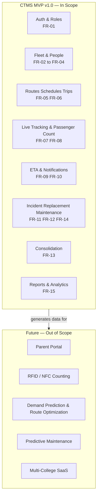
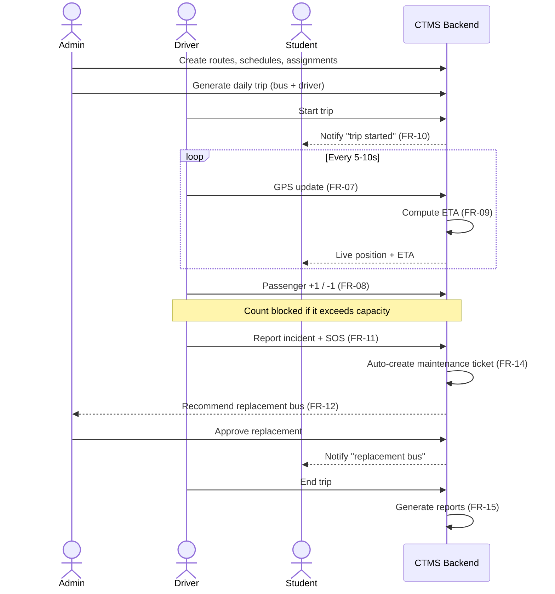

# CTMS — Vision & Scope

**Campus Transport Management System (CTMS)**
Document 01 of the CTMS Engineering Documentation Suite • SRS baseline v1.0

---

## 1. Purpose of This Document

This Vision & Scope document establishes *why* the Campus Transport Management System exists, *what* it will and will not do, and *how success will be measured*. It is the anchor for every downstream engineering artifact — architecture, domain model, API contracts, data model, and test strategy. Where later documents make design trade-offs, they trace back to the objectives and scope boundaries fixed here.

CTMS is a centralized platform that lets a college run its bus fleet as a coordinated, observable operation: buses, drivers, routes, trips, and students managed from a single control plane, with real-time GPS tracking, passenger counting, incident-driven replacement, low-occupancy consolidation, maintenance, and analytics.

---

## 2. Problem Statement

College transport today is run manually and opaquely. The operation works, but only because individuals hold state in their heads, on paper, and in scattered chat messages. This creates concrete, recurring failures.

| Pain point | How it happens today | Consequence |
|---|---|---|
| **No live location** | Students and parents phone the driver or the transport office to ask "where is the bus?" | Crowded stops, missed buses, students waiting in unsafe conditions, office overwhelmed with calls |
| **Guesswork ETAs** | Arrival times are estimated from memory and "usual" traffic | Students plan around unreliable times; chronic lateness goes unmeasured |
| **Manual headcounts** | Drivers count heads or rely on rough memory | No occupancy data; overloading past capacity goes undetected |
| **Slow incident response** | A breakdown is reported by phone; the office scrambles to find a spare bus and driver | Long roadside waits, ad-hoc replacement decisions, no audit trail |
| **Empty buses burning fuel** | Two half-full buses run parallel routes because nobody sees combined occupancy | Wasted fuel and driver hours with no data to justify change |
| **Paper maintenance** | Issues are noted informally; service dates tracked in a diary or spreadsheet | Missed services, expired permits/insurance discovered late, no incident-to-repair link |
| **No operational memory** | Trips, delays, and incidents are not recorded systematically | Management cannot see trends, justify budgets, or hold the operation accountable |

The root cause is the absence of a **single source of truth** and a **real-time data feed** from the vehicles. CTMS addresses both: it digitizes the transport domain (buses, drivers, routes, trips, students) and streams live telemetry (GPS, passenger counts, incidents) into a system that all three roles — Admin, Driver, Student — act on through purpose-built apps.

---

## 3. Business Objectives

The platform is justified by five business objectives. Each maps to measurable success criteria in Section 10.

1. **Visibility** — Give students and management real-time knowledge of where every bus is and when it will arrive, eliminating "where is the bus?" phone calls.
2. **Safety & accountability** — Ensure capacity limits are never exceeded, incidents are logged with evidence, and every operator action is auditable.
3. **Operational resilience** — Turn a breakdown from a scramble into a workflow: detect, recommend a replacement, approve, notify, and continue service with minimal delay.
4. **Cost efficiency** — Surface low-occupancy trips and recommend consolidation to cut fuel and driver hours, with the college retaining approval control.
5. **Data-driven management** — Produce operational reports and analytics so the transport department can measure reliability, plan capacity, and justify decisions.

---

## 4. Goals and Non-Goals

### 4.1 Goals

- A **role-based platform** serving Admin (dashboard), Driver (mobile), and Student (mobile) from one backend and one data model.
- **Live GPS tracking** with 5–10 second update cadence, offline buffering, and automatic sync on reconnect.
- **Google Maps–backed ETAs** that students can trust for daily planning.
- **Driver-operated passenger counting** with hard enforcement of bus capacity.
- **Incident → replacement → maintenance** as one connected, admin-governed workflow.
- **Consolidation recommendations** for low-occupancy trips, always gated by admin approval.
- **Actionable notifications** to students for the moments that matter (trip started, bus nearing stop, delay, route change, replacement, trip completed).
- **Reports & analytics** covering tracking, punctuality, incidents, and fuel savings.
- A **secure, scalable** foundation (HTTPS, JWT/Sanctum, role-based authorization, audit logs) ready for multi-campus growth.

### 4.2 Non-Goals

These are explicitly **not** objectives of CTMS v1.0. They may be reconsidered later (Section 6.2), but designing for them now is out of scope.

- **Not** a payments, fee-collection, or transport-billing system.
- **Not** an HR or payroll system for drivers (it stores operational identity, not salary/attendance-for-pay).
- **Not** a public/consumer transit app — access is limited to registered college accounts.
- **Not** a replacement for statutory vehicle records (RTO, insurance underwriting); it tracks expiries for operational alerting only.
- **Not** an autonomous dispatcher — the system *recommends*; a human admin *approves* every merge and every replacement.
- **Not** a hardware/IoT counting solution in v1.0 — passenger counting is driver-operated (RFID/NFC is future).
- **Not** a parent-facing product in v1.0 (parent portal is future).

---

## 5. Stakeholder Analysis

| Stakeholder | Role in system | Primary interest | Interest | Influence | Engagement strategy |
|---|---|---|---|---|---|
| **College Management** | Sponsor | Cost control, safety reputation, accountability | High | High | Dashboard KPIs, periodic analytics reports; sign-off on scope and budget |
| **Transport Department** | Admin (primary operator) | Smooth daily operations, fast incident handling | High | High | Owns the admin dashboard; drives all approval workflows; primary UAT group |
| **Drivers** | Field operator | Simple tools, quick SOS, fair workload | High | Medium | Minimal-friction driver app; single-tap trip/passenger/SOS actions; field training |
| **Students** | End consumer | Reliable ETA, live tracking, timely alerts | High | Low | Lightweight student app; opt-in notifications; feedback channel |
| **Maintenance Team** | Repair operator | Clear tickets, service scheduling | Medium | Medium | Auto-generated maintenance tickets from incidents; ticket status tracking |
| **IT / DevOps** | Platform operator | Uptime, security, deployability | Medium | Medium | Docker + Nginx deployment, audit logs, monitoring; owns the 99.9% uptime target |

**Reading the matrix:** High-interest/high-influence stakeholders (Management, Transport Dept.) are *managed closely* — they set scope and approve releases. Drivers and the Maintenance team are *kept satisfied and involved* through low-friction tooling and training. Students, though numerous and high-interest, have low process influence and are *kept informed* through the product itself.

---

## 6. Scope

### 6.1 In Scope — MVP (v1.0)

The MVP delivers the full happy-path operation end to end, plus the two flagship optimizations (replacement, consolidation).

| # | Capability | Maps to |
|---|---|---|
| 1 | Role-based secure login (Admin / Driver / Student) | FR-01 |
| 2 | Bus management — create, update, deactivate, assign | FR-02 |
| 3 | Driver management — register, assign to buses | FR-03 |
| 4 | Student management — register, assign to routes | FR-04 |
| 5 | Route, stop & schedule management | FR-05 |
| 6 | Daily trip creation with bus + driver assignment | FR-06 |
| 7 | Live GPS tracking (5–10 s updates, offline buffering) | FR-07 |
| 8 | Driver passenger counter (+1 / −1, capacity-enforced) | FR-08 |
| 9 | ETA calculation via Google Maps Routes API | FR-09 |
| 10 | Student notifications (start, nearing, delay, route change, replacement, completed) | FR-10 |
| 11 | Vehicle incident reporting (breakdown, accident, tyre, engine, battery) + SOS | FR-11 |
| 12 | Replacement bus recommendation + admin approval | FR-12 |
| 13 | Smart bus consolidation recommendation + admin approval | FR-13 |
| 14 | Automatic maintenance ticket from every incident | FR-14 |
| 15 | Operational reports & analytics | FR-15 |

**Also in the MVP baseline (non-functional):** HTTPS everywhere, JWT/Sanctum auth, role-based authorization, audit logs, Redis-cached reads, WebSocket push via Laravel Reverb, FCM notifications, Dockerized deployment behind Nginx, and multi-campus-ready data modeling (even if a single campus launches first).

### 6.2 Out of Scope — Deferred to Future Releases

| Deferred item | Why deferred | Target |
|---|---|---|
| Parent portal | Distinct audience & auth; not on the critical path | Future |
| RFID/NFC passenger counting | Requires hardware rollout; driver counting suffices for v1.0 | Future |
| AI demand prediction | Needs a corpus of historical trip data CTMS will first generate | Future |
| Automated route optimization | Builds on demand data + consolidation learnings | Future |
| Fuel analytics (deep) | v1.0 estimates fuel saved from consolidation; full analytics later | Future |
| Predictive maintenance | Depends on accumulated maintenance/incident history | Future |
| Multi-college SaaS | v1.0 is multi-campus within one college; multi-tenant SaaS later | Future |

### 6.3 Scope Boundary Diagram

---

## 7. High-Level Feature List Mapped to Functional Requirements

| Feature | Actor(s) | Description | FR |
|---|---|---|---|
| Authentication | All | Role-based secure login with JWT/Sanctum; roles ADMIN, DRIVER, STUDENT | FR-01 |
| Bus Management | Admin | Create/update/deactivate/assign buses; a bus in MAINTENANCE cannot be assigned | FR-02 |
| Driver Management | Admin | Register drivers, assign buses; one active driver per bus per trip | FR-03 |
| Student Management | Admin | Register students, assign route and pickup stop | FR-04 |
| Route Management | Admin | Define routes, ordered stops (with geofence radius), and schedules | FR-05 |
| Trip Management | Admin | Create daily trips from schedules; assign bus + driver | FR-06 |
| Live GPS Tracking | Driver → Student/Admin | GPS every 5–10 s; offline buffering with auto-sync | FR-07 |
| Passenger Counter | Driver | +1 / −1 buttons; count never exceeds capacity | FR-08 |
| ETA Calculation | System → Student | Google Maps Routes API ETA per stop | FR-09 |
| Notifications | System → Student | Trip started, nearing stop, delay, route change, replacement, completed | FR-10 |
| Vehicle Incident | Driver | Report breakdown/accident/tyre/engine/battery with photo + location; SOS | FR-11 |
| Replacement Bus | System → Admin | Recommend available replacement; admin approves assignment | FR-12 |
| Smart Consolidation | System → Admin | Recommend merging low-occupancy trips; admin approves/rejects | FR-13 |
| Maintenance | System | Auto-create a maintenance ticket from every incident | FR-14 |
| Reports & Analytics | Admin / Management | Operational and performance reporting | FR-15 |

---

## 8. Primary Workflow (Vision Narrative)

The vision in one sentence: **an admin plans it, a driver runs it, a student sees it, and the system watches everything — recommending, alerting, and recording so the operation improves every day.**

---

## 9. Assumptions and Constraints

**Assumptions**
- Every bus carries a GPS-enabled driver device.
- Drivers have internet connectivity during trips (with offline buffering as a safety net).
- Students hold registered college accounts.
- Google Maps services (SDK, Routes API, Places API) are available.

**Constraints (fixed by the SRS)**
- Technology stack is fixed: Flutter (student & driver apps), Next.js/React (admin dashboard), Laravel 12 REST + WebSockets (Reverb), PostgreSQL, Redis, Google Maps, Firebase Cloud Messaging, Docker + Nginx.
- API responses must return in under 2 seconds; GPS cadence 5–10 seconds.
- Target uptime 99.9%.
- Every incident **must** create a maintenance record; merges and replacements **require** admin approval; students can view only their assigned bus.

---

## 10. Success Criteria and KPIs

Success is measured, not asserted. The following KPIs are the acceptance yardstick for v1.0 and the baseline for future improvement.

| # | KPI | Definition | Target (v1.0) |
|---|---|---|---|
| K1 | **GPS tracking accuracy** | Share of active trips reporting a location within the 5–10 s window | ≥ 95% of updates on-cadence |
| K2 | **Tracking availability** | Trips with continuous live position (gaps auto-filled by buffer sync) | ≥ 98% of trip duration covered |
| K3 | **ETA reliability** | Trips where predicted ETA is within ±3 minutes of actual arrival at stop | ≥ 85% of stop arrivals |
| K4 | **Notification timeliness** | "Bus nearing stop" alerts delivered before actual arrival | ≥ 90% delivered ≥ 2 min ahead |
| K5 | **Incident response time** | Median time from incident report to approved replacement assignment | ≤ 10 minutes |
| K6 | **Fuel saved via consolidation** | Estimated fuel saved from approved merges vs. running trips separately | ≥ 10% on eligible low-occupancy trip-pairs |
| K7 | **Capacity compliance** | Trips where passenger count never exceeded bus capacity | 100% (hard rule) |
| K8 | **Maintenance coverage** | Incidents that produced a maintenance ticket | 100% (hard rule) |
| K9 | **Platform performance** | API responses under 2 s | ≥ 99% of requests |
| K10 | **Availability** | System uptime | ≥ 99.9% monthly |
| K11 | **Adoption** | Students actively using live tracking on assigned routes | ≥ 70% of transport-enabled students |

**Baseline note:** K1–K5 are only measurable *because* CTMS records trips, locations, and incidents — the platform is its own measurement instrument. The "hard rule" KPIs (K7, K8) are enforced in code and are pass/fail rather than target percentages.

---

## 11. Release Themes

| Release | Theme | Outcome |
|---|---|---|
| **v1.0 (MVP)** | See it, run it, recover from it | Full happy-path operation + replacement + consolidation, live tracking, reports |
| **v1.x** | Refine & report | Deeper analytics, notification tuning, dashboard polish from UAT feedback |
| **Future** | Predict & scale | Parent portal, RFID/NFC counting, demand prediction, route optimization, predictive maintenance, multi-college SaaS |

---

## Cross-references

- `02-srs.md` — full Software Requirements Specification (functional & non-functional detail behind FR-01…FR-15).
- `03-domain-model.md` — the 17-entity domain model and enums referenced throughout this document.
- `04-architecture.md` — system architecture realizing the fixed technology stack and non-functional targets.
- `05-api-spec.md` — REST + WebSocket contracts for the workflows described in Section 8.
- `06-data-model.md` — PostgreSQL schema (snake_case) mapping the domain model.
