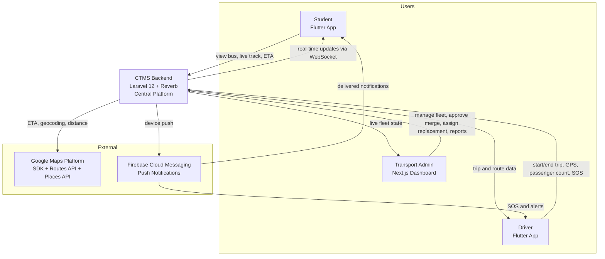
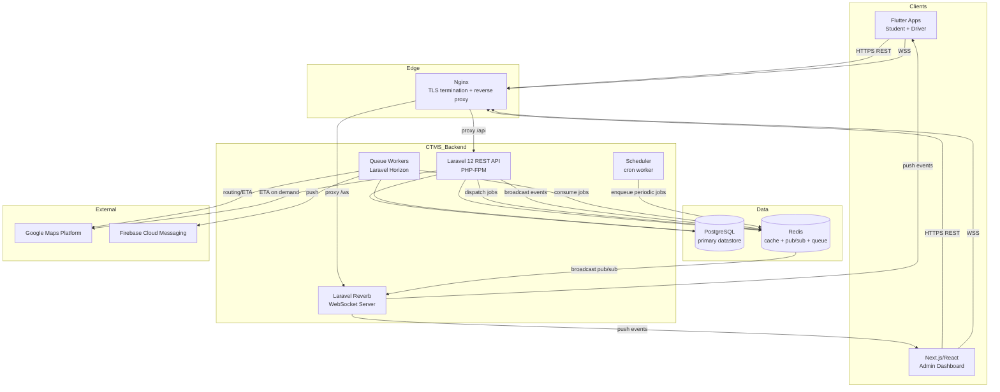
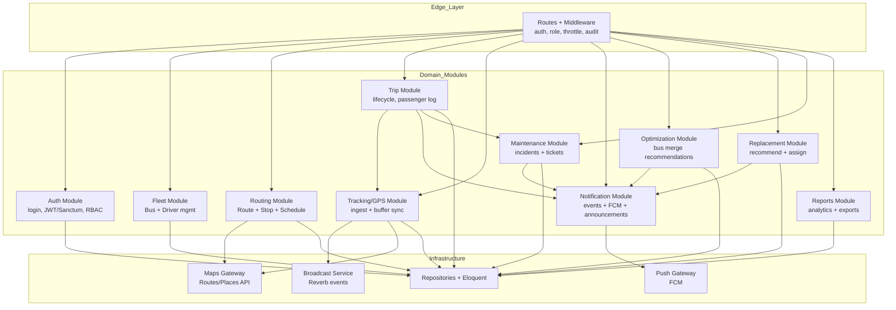
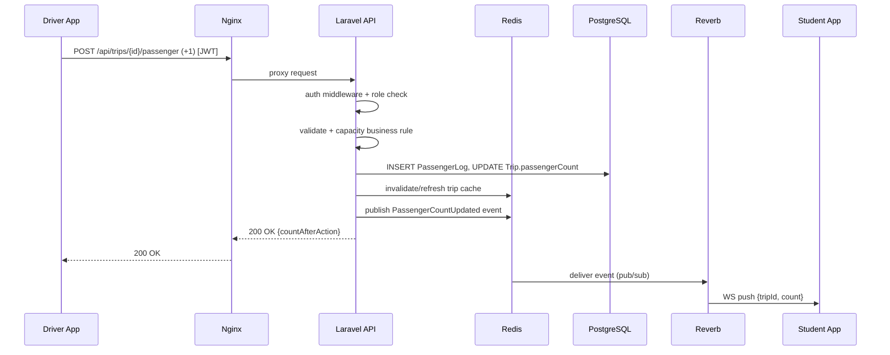
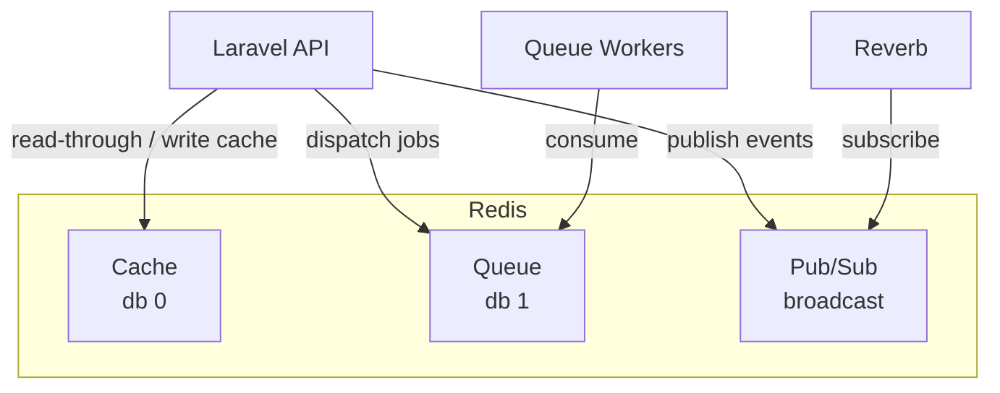
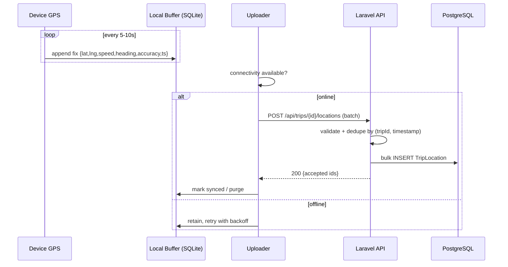
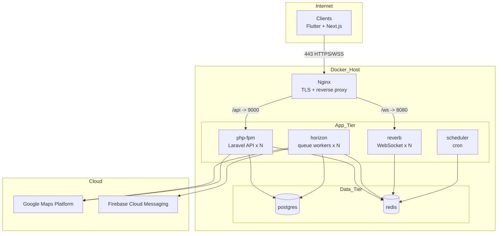

# CTMS — System Architecture

**Document:** 03 — System Architecture
**System:** Campus Transport Management System (CTMS)
**Version:** 1.0
**Audience:** Engineering, DevOps, Technical Leadership

---

## 1. Purpose & Scope

This document describes the runtime and deployment architecture of the Campus Transport Management System (CTMS). It follows a **C4-style** decomposition — moving from a high-level System Context, down through Containers, into the Backend Component/Module breakdown — and then explains the cross-cutting mechanics that make the platform real: request flow, the real-time broadcast path, Redis usage, offline GPS buffering, and the Docker deployment topology behind Nginx.

The architecture is constrained by the fixed technology stack: **Laravel 12 + Reverb** (REST API + WebSockets), **PostgreSQL** (primary datastore), **Redis** (cache, broadcast pub/sub, queue backend), **Flutter** (Student and Driver apps), **Next.js/React** (Admin dashboard), **Google Maps Platform** (SDK + Routes API + Places API), **Firebase Cloud Messaging** (push), and **Docker + Nginx** (deployment).

---

## 2. Architectural Goals & Drivers

| Driver | Source | Architectural Response |
|---|---|---|
| Real-time fleet visibility | FR-07, FR-10 | WebSocket fan-out via Laravel Reverb, GPS ingest every 5–10s |
| Low-latency API | NFR Performance (<2s) | Redis caching, indexed PostgreSQL, async queue workers |
| High availability | NFR Availability (99.9%) | Stateless API containers, horizontal scaling, health checks behind Nginx |
| Reliability on flaky mobile networks | NFR Reliability | Offline GPS buffering on driver device + server-side idempotent sync |
| Multi-campus scale | NFR Scalability | Stateless services, tenant-scoped data, connection pooling |
| Security | NFR Security | HTTPS/TLS at Nginx, JWT/Sanctum auth, role-based authorization, audit logs |

---

## 3. Level 1 — System Context

CTMS sits between three client applications and two external platforms. Students and Drivers use Flutter mobile apps; Transport Admins use a Next.js dashboard. The CTMS backend is the single system of record and the integration hub toward Google Maps Platform (routing/ETA/geocoding) and Firebase Cloud Messaging (push delivery).

**Key interactions**

| Actor | Sends to CTMS | Receives from CTMS |
|---|---|---|
| Student | Auth, view-bus / ETA requests | Live location, ETA, current stop, notifications (WS + FCM) |
| Driver | GPS pings, passenger +1/-1, trip lifecycle, incidents, SOS | Assigned trip, route, replacement instructions |
| Admin | CRUD on buses/routes/drivers/students, approvals | Live fleet dashboard, recommendations, reports |
| Google Maps | Routing/geocoding queries | ETA, polylines, distances, place data |
| FCM | Push send requests | Delivery acknowledgements |

---

## 4. Level 2 — Container Diagram

Inside the CTMS boundary, responsibilities split across independently deployable containers. The **Laravel API** handles synchronous request/response. **Laravel Reverb** holds WebSocket connections and broadcasts. **Queue workers** process asynchronous jobs (notifications, ETA recomputation, ticket creation, recommendations). **PostgreSQL** is the source of truth. **Redis** is the shared backbone for cache, broadcast pub/sub, and the queue.

**Container responsibilities**

| Container | Tech | Responsibility | State |
|---|---|---|---|
| Flutter Apps | Flutter/Dart | Student + Driver UX, GPS capture, offline buffer | Local (SQLite/Hive) |
| Admin Dashboard | Next.js/React | Fleet management UI, live map, approvals, reports | Stateless (browser) |
| Laravel API | Laravel 12, PHP-FPM | REST endpoints, auth, business rules, validation | Stateless |
| Reverb | Laravel Reverb | Persistent WebSocket connections, channel auth, fan-out | Connection state only |
| Queue Workers | Laravel Horizon | Async jobs: notifications, ETA, tickets, recommendations | Stateless |
| Scheduler | Laravel scheduler | Periodic tasks: schedule materialization, cleanup | Stateless |
| PostgreSQL | PostgreSQL | System of record for all 17 entities | Durable |
| Redis | Redis | Cache, broadcast pub/sub, queue backend | Ephemeral/durable-ish |

---

## 5. Level 3 — Backend Component / Module Breakdown

The Laravel API is organized into cohesive domain modules. Each module exposes controllers + form requests at the HTTP edge, delegates to service classes for business rules, and persists through Eloquent models/repositories. Cross-cutting concerns (auth, audit, broadcasting) wrap all modules.

**Module map**

| Module | Primary Entities | FRs | Notes |
|---|---|---|---|
| Auth | User, Admin, Driver, Student | FR-01 | Role-based login, token issuance, RBAC middleware |
| Fleet | Bus, Driver | FR-02, FR-03 | Assignment rules, status transitions |
| Routing | Route, RouteStop, Schedule | FR-05 | Stops with geofence radius, day-of-week schedules |
| Trip | Trip, PassengerLog | FR-06, FR-08 | Lifecycle SCHEDULED→RUNNING→COMPLETED, capacity guard |
| Tracking/GPS | TripLocation | FR-07 | Batch ingest, offline sync, broadcast latest fix |
| Notification | Notification, Announcement | FR-10 | Event-driven, WS + FCM dual delivery |
| Optimization | BusMergeRecommendation | FR-13 | Low-occupancy merge suggestions, admin approval |
| Replacement | ReplacementAssignment | FR-12 | Recommend available bus/driver, admin approval |
| Maintenance | VehicleIncident, MaintenanceTicket | FR-11, FR-14 | Every incident auto-creates a ticket |
| Reports | (aggregates) | FR-15 | Operational + analytics, cached, exportable |

---

## 6. Request Flow (Synchronous Path)

A representative write request — the Driver pressing **+1** on the passenger counter — traverses the stack as follows.

**Steps**

1. **TLS + proxy** — Nginx terminates HTTPS and forwards to PHP-FPM.
2. **AuthN/AuthZ** — Sanctum/JWT middleware validates the token; role middleware confirms the caller is the active driver on the trip.
3. **Validation + business rules** — Form request validates payload; the service enforces *passenger count must never exceed bus capacity* and *only one active driver per bus*.
4. **Persistence** — `PassengerLog` row inserted (action Board/Exit) and `Trip.passengerCount` updated inside a DB transaction.
5. **Cache + broadcast** — Trip cache refreshed in Redis; a broadcast event is published for real-time consumers.
6. **Response** — Synchronous `200` returns immediately (target <2s); the WebSocket fan-out happens independently.

---

## 7. Real-Time Broadcast Path

Real-time is the heart of CTMS. GPS fixes, passenger counts, ETA changes, trip lifecycle events, and notifications all flow through the same broadcast spine: **Laravel event → Redis pub/sub → Reverb → subscribed clients**.

```mermaid
flowchart LR
    EV[Domain Event<br/>e.g. LocationUpdated] --> DISP[Laravel Broadcast<br/>ShouldBroadcast]
    DISP --> RPUB[(Redis<br/>pub/sub channel)]
    RPUB --> RVB[Laravel Reverb]
    RVB -->|trip.&#123;id&#125; channel| STU[Student subscribers]
    RVB -->|fleet channel| ADM[Admin dashboard]
    RVB -->|private driver channel| DRV[Driver app]
```

**Channel model**

| Channel | Type | Subscribers | Events |
|---|---|---|---|
| `trip.{tripId}` | Presence/Private | Students on that bus, Admin | LocationUpdated, PassengerCountUpdated, EtaUpdated, TripStatusChanged |
| `fleet.{campusId}` | Private | Admin dashboard | Live positions of all running trips, incidents, status changes |
| `driver.{driverId}` | Private | Individual driver | Replacement assignment, admin directives, SOS ack |

**Authorization** — Channel subscriptions are authorized server-side. A student may subscribe **only** to the `trip` channel of their assigned bus (business rule: *students can only view their assigned bus*). Reverb calls back into the Laravel `/broadcasting/auth` endpoint before granting a subscription.

**Why this path** — Publishing events to Redis rather than pushing directly from PHP-FPM decouples the request lifecycle from the WebSocket layer. The API process finishes and returns; Reverb (a separate long-lived process) picks the event off Redis and fans it out. This keeps API latency low and lets Reverb and workers scale independently.

---

## 8. Redis Usage (Cache + Broadcast + Queue)

Redis plays three distinct roles. Logical separation is maintained via key prefixes and dedicated databases/connections.

| Role | What it stores / carries | Examples | TTL / Policy |
|---|---|---|---|
| **Cache** | Hot read models, computed values, rate-limit counters | Latest trip location, ETA per stop, route/stop lookups, dashboard aggregates, report snapshots | Short TTL (5–30s for live data; minutes for reports); invalidate on write |
| **Broadcast (pub/sub)** | Transient event payloads to Reverb | LocationUpdated, PassengerCountUpdated, EtaUpdated, NotificationCreated | No persistence; fire-and-forward |
| **Queue** | Durable job list for async work | SendPushNotification, RecalculateEta, CreateMaintenanceTicket, GenerateReport, EvaluateMergeRecommendation | Retried with backoff; failed jobs to `failed_jobs` |

**Cache strategy for live GPS** — The most recently accepted `TripLocation` per active trip is cached (`trip:{id}:loc`) so that a Student opening the app gets an instant last-known position without a DB read, while the WebSocket keeps it current thereafter.

**Queue rationale** — Anything slow, external, or fan-out-heavy is deferred to a job: FCM delivery (FR-10), Google Maps ETA calls (FR-09), ticket creation from incidents (FR-14), and recommendation computation (FR-12, FR-13). This protects the <2s API SLA and isolates external-service failures behind retry policies. Horizon supervises worker pools and provides queue metrics.

---

## 9. Offline GPS Buffering & Sync Strategy

Drivers lose connectivity in tunnels, dead zones, and campus basements. GPS must never be dropped — it is buffered on the device and synchronized when connectivity returns (NFR Reliability).

**Design points**

- **Device buffer** — Every fix is written first to a local SQLite/Hive store on the Flutter driver app, tagged with `tripId` and a monotonic client timestamp. The buffer is the durable local queue.
- **Batch upload** — The uploader drains the buffer in batches (not one-by-one), reducing round trips and enabling efficient bulk inserts.
- **Idempotency / dedupe** — The server treats `(tripId, timestamp)` as the natural idempotency key. Replays after a flaky ACK are deduped, so a retried batch never double-inserts.
- **Ordering & interpolation** — Fixes carry client timestamps; the server orders by timestamp. Gaps are visible for later ETA/average-speed computation rather than silently filled.
- **Real-time vs. backfill** — Only the *latest* fix drives the live broadcast/cache. A late sync of historical fixes updates the trail and analytics but does not re-broadcast a stale "current" position.
- **Backpressure** — On reconnect the uploader uses exponential backoff and caps batch size to avoid overwhelming the API after long outages.

---

## 10. Deployment Topology (Docker + Nginx)

CTMS ships as a set of Docker services orchestrated behind Nginx. Nginx terminates TLS (HTTPS/WSS), serves as reverse proxy, and routes `/api` to PHP-FPM and `/ws` to Reverb. Stateless services scale horizontally; stateful services (PostgreSQL, Redis) are singletons (or managed/replicated in production).

**Docker services**

| Service | Image basis | Scales | Exposed | Notes |
|---|---|---|---|---|
| `nginx` | nginx | 1 (LB in prod) | 443 | TLS termination, static assets, proxy |
| `php-fpm` (api) | php:8.3-fpm + Laravel 12 | Horizontal | internal :9000 | Stateless REST |
| `reverb` | php:8.3-cli + Reverb | Horizontal | internal :8080 | Long-lived WS process |
| `horizon` | php:8.3-cli | Horizontal | — | Queue workers |
| `scheduler` | php:8.3-cli | 1 | — | `schedule:run` cron |
| `postgres` | postgres | 1 (replica in prod) | internal :5432 | Primary datastore |
| `redis` | redis | 1 (cluster in prod) | internal :6379 | Cache + queue + pub/sub |

**Scaling notes** — Because the API, Reverb, and workers are stateless, each can be scaled by adding container replicas. Sticky sessions are unnecessary for the API (token auth); WebSocket connections are long-lived and load-balanced at connect time. Redis and PostgreSQL are the coordination points and are the primary vertical/replication scaling concerns for multi-campus growth.

---

## 11. Security Architecture

| Layer | Control |
|---|---|
| Transport | HTTPS/TLS terminated at Nginx; WSS for WebSockets |
| Authentication | JWT/Laravel Sanctum tokens issued at login (FR-01) |
| Authorization | Role-based middleware (ADMIN/DRIVER/STUDENT); channel-auth for WebSockets |
| Data scoping | Students restricted to their assigned bus/trip; campus-scoped queries |
| Auditing | Audit logs on privileged actions (approvals, assignments, CRUD) |
| Secrets | Google Maps keys, FCM credentials, DB/Redis creds injected via env, never in client |
| External calls | Maps/FCM keys held server-side only; clients never call Google/FCM with privileged keys directly for privileged operations |

---

## 12. Architecture Decisions

| ID | Decision | Alternatives Considered | Rationale |
|---|---|---|---|
| AD-01 | Laravel Reverb for WebSockets | Pusher (SaaS), Soketi, socket.io | First-party Laravel integration, self-hosted (no per-message SaaS cost), scales with the stack; keeps real-time data on-prem |
| AD-02 | Redis as cache + queue + pub/sub backbone | Separate Memcached + RabbitMQ | One dependency covering three needs; native Laravel drivers; simpler ops for a college-scale deployment |
| AD-03 | PostgreSQL as single system of record | MySQL, MongoDB | Strong relational integrity for 17 related entities, rich geospatial + JSON support, UUID PKs |
| AD-04 | Async queue for external calls (Maps, FCM) | Synchronous inline calls | Protects <2s API SLA; isolates third-party latency/failures behind retries |
| AD-05 | Device-side offline GPS buffer with idempotent batch sync | Server-side only, drop-on-disconnect | Meets reliability NFR; dedupe by (tripId, timestamp) prevents duplicate trails |
| AD-06 | Stateless API/worker/WS containers behind Nginx | Monolithic single process | Horizontal scaling for multi-campus; independent scaling of read/write/real-time load |
| AD-07 | Broadcast via event → Redis → Reverb (decoupled) | Push directly from request process | Keeps request latency low; lets real-time layer scale/fail independently |
| AD-08 | UUID primary keys | Auto-increment integers | Safe for multi-campus/distributed generation; non-enumerable IDs |
| AD-09 | JWT/Sanctum token auth | Session cookies | Stateless, mobile-friendly, works uniformly across Flutter + Next.js clients |
| AD-10 | Docker + Nginx deployment | Bare-metal/VM install | Reproducible environments, easy replica scaling, clean TLS/proxy edge |

---

## 13. Cross-Cutting Concerns Summary

- **Idempotency** — GPS batch sync and job retries are idempotent by natural keys.
- **Observability** — Horizon for queue metrics; structured logs; health-check endpoints polled by Nginx/orchestrator.
- **Consistency** — Write paths use DB transactions; caches are invalidated on write, not merely expired.
- **Backpressure & retries** — Exponential backoff on device uploads and queued external calls.
- **Tenancy** — Campus-scoped data access supports the multi-campus scalability requirement.

---

## Cross-references

- `01-srs.md` — Software Requirements Specification (FR-01…FR-15, NFRs, stakeholders)
- `02-domain-model.md` — Entity/attribute definitions and relationships referenced above
- `04-database-design.md` — PostgreSQL schema, snake_case columns, indexes, UUID keys
- `05-api-design.md` — REST endpoints and WebSocket channel contracts
- `06-realtime-and-tracking.md` — Detailed GPS ingest, broadcast, and offline sync specification
- `07-security.md` — AuthN/AuthZ, RBAC, audit logging details
- `08-deployment.md` — Docker Compose services, Nginx config, CI/CD and scaling
