# Domain Model & Class Specification

**Campus Transport Management System (CTMS) — SRS v1.0**
**Document 04 — Domain Model & Class Specification**

---

## 1. Purpose & Scope

This document is the authoritative specification of the CTMS **domain model**: the 17 core entities, their attributes, behaviours (methods), inheritance hierarchy, associations with multiplicities, and the four controlled enumerations that constrain their states. It is the single reference that binds together the database schema, the Laravel 12 Eloquent models, the REST/WebSocket API contracts, and the Flutter/Next.js client models.

Every field, enum value, and functional-requirement reference (FR-01 … FR-15) in this document uses the exact naming defined in the CTMS SRS. Attribute names are shown in **camelCase** (as used in application code and API payloads); the physical PostgreSQL columns map to **snake_case** (documented in the database design doc). UUIDs are used as primary keys throughout, and core entities carry `createdAt` / `updatedAt` timestamps.

> **Source-artifact correction:** the raw domain source contained a duplicate/erroneous `employee name` field on `Driver`. It is **omitted** here — a driver's name is inherited from the abstract `User` base (`firstName` / `lastName`).

---

## 2. Class Diagram (all 17 entities)

The diagram below covers the full model: the abstract `User` base with its three subtypes, and all operational entities with associations and multiplicities. Enums are documented separately in §5.

```mermaid
classDiagram
    class User {
        <<abstract>>
        +UUID id
        +String firstName
        +String lastName
        +Gender gender
        +Date dateOfBirth
        +String email
        +String phone
        +String passwordHash
        +String profilePhoto
        +String addressLine1
        +String addressLine2
        +String city
        +String state
        +String postalCode
        +Boolean isActive
        +DateTime lastLogin
        +DateTime createdAt
        +DateTime updatedAt
        +login()
        +logout()
        +changePassword()
        +updateProfile()
    }

    class Student {
        +String studentId
        +String rollNumber
        +String admissionNumber
        +String department
        +String course
        +Integer year
        +String section
        +Integer semester
        +UUID busId
        +UUID routeId
        +UUID pickupStopId
        +String guardianName
        +String guardianPhone
        +Boolean transportEnabled
        +viewBus()
        +viewETA()
        +receiveNotification()
    }

    class Driver {
        +String employeeId
        +String drivingLicenseNumber
        +Date licenseExpiry
        +String aadhaarNumber
        +Date joiningDate
        +String emergencyContact
        +UUID assignedBusId
        +Boolean available
        +DriverStatus status
        +startTrip()
        +endTrip()
        +increasePassenger()
        +decreasePassenger()
        +reportIssue()
        +sendSOS()
    }

    class Admin {
        +String employeeId
        +String designation
        +String officePhone
        +assignDriver()
        +assignBus()
        +createRoute()
        +approveMerge()
        +assignReplacement()
    }

    class Bus {
        +UUID id
        +String busNumber
        +String registrationNumber
        +Integer capacity
        +Integer currentPassengers
        +BusStatus status
        +assignDriver()
        +assignRoute()
        +updateStatus()
    }

    class Route {
        +UUID id
        +String routeCode
        +String routeName
        +Decimal totalDistance
        +Integer estimatedDuration
        +Boolean active
    }

    class RouteStop {
        +UUID id
        +UUID routeId
        +String stopName
        +Double latitude
        +Double longitude
        +Integer sequence
        +Double geofenceRadius
    }

    class Schedule {
        +UUID id
        +UUID routeId
        +UUID busId
        +DayOfWeek dayOfWeek
        +Time departureTime
        +Time arrivalTime
        +Boolean active
    }

    class Trip {
        +UUID id
        +UUID scheduleId
        +UUID busId
        +UUID driverId
        +UUID routeId
        +Date tripDate
        +TripStatus status
        +Integer passengerCount
        +Integer delayMinutes
    }

    class TripLocation {
        +UUID id
        +UUID tripId
        +Double latitude
        +Double longitude
        +Double speed
        +Double heading
        +Double accuracy
        +DateTime timestamp
    }

    class PassengerLog {
        +UUID id
        +UUID tripId
        +PassengerAction action
        +Integer countAfterAction
        +DateTime timestamp
    }

    class VehicleIncident {
        +UUID id
        +UUID tripId
        +UUID busId
        +UUID driverId
        +String issueType
        +Severity severity
        +String description
        +IncidentStatus status
        +DateTime reportedAt
    }

    class MaintenanceTicket {
        +UUID id
        +UUID incidentId
        +UUID busId
        +String ticketNumber
        +String assignedTechnician
        +TicketStatus status
        +Decimal estimatedCost
    }

    class BusMergeRecommendation {
        +UUID id
        +UUID sourceTripId
        +UUID targetTripId
        +Integer mergedPassengers
        +Decimal estimatedFuelSaved
        +MergeStatus status
        +UUID approvedBy
    }

    class ReplacementAssignment {
        +UUID id
        +UUID incidentId
        +UUID replacementBusId
        +UUID replacementDriverId
        +Integer etaMinutes
        +DateTime assignedAt
        +ReplacementStatus status
    }

    class Notification {
        +UUID id
        +UUID receiverId
        +String title
        +String message
        +NotificationType type
        +Boolean isRead
        +DateTime sentAt
    }

    class Announcement {
        +UUID id
        +String title
        +String description
        +Audience audience
        +DateTime publishAt
        +DateTime expireAt
    }

    User <|-- Student
    User <|-- Driver
    User <|-- Admin

    Route "1" --> "1..*" RouteStop : has
    Route "1" --> "1..*" Schedule : defines
    Route "1" --> "0..*" Trip : covers
    Bus "1" --> "0..*" Trip : runs
    Driver "1" --> "0..*" Trip : drives
    Schedule "1" --> "0..*" Trip : instantiates
    Trip "1" --> "0..*" TripLocation : tracks
    Trip "1" --> "0..*" PassengerLog : records
    Trip "1" --> "0..*" VehicleIncident : raises
    VehicleIncident "1" --> "1" MaintenanceTicket : creates
    VehicleIncident "1" --> "0..1" ReplacementAssignment : triggers
    Student "*" --> "1" Route : assignedTo
    Student "*" --> "1" Bus : assignedTo
    Student "*" --> "1" RouteStop : pickupAt
    Trip "1" --> "0..1" BusMergeRecommendation : sourceOf
    Notification "*" --> "1" User : receivedBy
    Admin "1" --> "0..*" BusMergeRecommendation : approves
```

> The class diagram deliberately abbreviates attribute lists for the operational entities to keep the Mermaid render legible. The **complete, authoritative attribute set for every entity is given in the per-entity tables in §4**.

---

## 3. Inheritance Model

CTMS uses a single abstract base, `User`, specialised into three concrete roles. This is a classic **Single Table Inheritance / role-discriminator** shape: shared identity, contact, address, and credential data live once on `User`; role-specific attributes and behaviours live on the subtype.

| Aspect | Detail |
|--------|--------|
| Base type | `User` (abstract — never instantiated directly) |
| Subtypes | `Student`, `Driver`, `Admin` |
| Discriminator | `UserRole` enum (`ADMIN`, `DRIVER`, `STUDENT`) |
| Shared identity | `firstName`, `lastName`, `email` (unique), `phone`, `passwordHash` |
| Shared behaviour | `login`, `logout`, `changePassword`, `updateProfile` |
| Persistence note | Implemented in Laravel via a `users` table + role-specific profile tables (or STI with a `role` column); each subtype exposes its own Eloquent model. |

A driver's or student's display name is **always** derived from the inherited `User.firstName` / `User.lastName`. The subtypes must not redeclare name fields.

---

## 4. Entity Attribute & Method Specifications

### 4.1 User (abstract base)

Shared foundation for all human actors. Not instantiated directly.

| Field | Type | Description |
|-------|------|-------------|
| id | UUID | Primary key |
| firstName | String | Given name |
| lastName | String | Family name |
| gender | Gender (Enum) | Male / Female / Other |
| dateOfBirth | Date | Date of birth |
| email | String (unique) | Login identity; unique across all users |
| phone | String | Contact number |
| passwordHash | String | Bcrypt/Argon2 hashed credential |
| profilePhoto | String | URL/path to avatar image |
| addressLine1 | String | Primary address line |
| addressLine2 | String | Secondary address line |
| city | String | City |
| state | String | State/province |
| postalCode | String | Postal/ZIP code |
| isActive | Boolean | Whether the account is enabled |
| lastLogin | DateTime | Timestamp of most recent login |
| createdAt | DateTime | Record creation timestamp |
| updatedAt | DateTime | Record last-update timestamp |

**Methods:** `login()`, `logout()`, `changePassword()`, `updateProfile()`

---

### 4.2 Student (extends User)

Represents a college student who is a transport passenger. Supports FR-04, FR-07, FR-09, FR-10.

| Field | Type | Description |
|-------|------|-------------|
| studentId | String | Institution-issued student identifier |
| rollNumber | String | Class roll number |
| admissionNumber | String | Admission/enrolment number |
| department | String | Academic department |
| course | String | Programme/course of study |
| year | Integer | Year of study |
| section | String | Class section |
| semester | Integer | Current semester |
| busId | UUID (FK) | Assigned bus → `Bus.id` |
| routeId | UUID (FK) | Assigned route → `Route.id` |
| pickupStopId | UUID (FK) | Assigned pickup stop → `RouteStop.id` |
| guardianName | String | Guardian/parent name |
| guardianPhone | String | Guardian contact number |
| transportEnabled | Boolean | Whether student uses transport service |

**Methods:** `viewBus()`, `viewETA()`, `receiveNotification()`

---

### 4.3 Driver (extends User)

Represents a bus driver operating trips and reporting incidents. Supports FR-03, FR-06, FR-07, FR-08, FR-11.

| Field | Type | Description |
|-------|------|-------------|
| employeeId | String | HR/employee identifier |
| drivingLicenseNumber | String | Driving licence number |
| licenseExpiry | Date | Licence expiry date |
| aadhaarNumber | String | National ID (Aadhaar) number |
| joiningDate | Date | Date of joining |
| emergencyContact | String | Emergency contact number |
| assignedBusId | UUID (FK) | Currently assigned bus → `Bus.id` |
| available | Boolean | Whether driver is available for assignment |
| status | DriverStatus (Enum) | AVAILABLE / ON_TRIP / LEAVE / OFF_DUTY |

**Methods:** `startTrip()`, `endTrip()`, `increasePassenger()`, `decreasePassenger()`, `reportIssue()`, `sendSOS()`

> **Correction applied:** the erroneous `employee name` field from the raw source is intentionally dropped. Name is inherited from `User`.

---

### 4.4 Admin (extends User)

Represents transport department administrators. Supports FR-02, FR-03, FR-05, FR-06, FR-12, FR-13.

| Field | Type | Description |
|-------|------|-------------|
| employeeId | String | HR/employee identifier |
| designation | String | Job title/designation |
| officePhone | String | Office contact number |

**Methods:** `assignDriver()`, `assignBus()`, `createRoute()`, `approveMerge()`, `assignReplacement()`

---

### 4.5 Bus

A physical vehicle in the fleet. Supports FR-02, FR-08, FR-12, FR-14.

| Field | Type | Description |
|-------|------|-------------|
| id | UUID | Primary key |
| busNumber | String | Fleet/display number |
| registrationNumber | String | Government registration plate |
| chassisNumber | String | Vehicle chassis number |
| engineNumber | String | Engine serial number |
| manufacturer | String | Vehicle manufacturer |
| model | String | Vehicle model |
| manufacturingYear | Integer | Year of manufacture |
| capacity | Integer | Maximum seating/passenger capacity |
| currentPassengers | Integer | Live passenger count on active trip |
| fuelType | String | Fuel type (diesel/petrol/CNG/EV) |
| mileage | Decimal | Fuel efficiency (km/l or equivalent) |
| gpsEnabled | Boolean | Whether GPS device is fitted |
| gpsDeviceId | String | GPS device identifier |
| status | BusStatus (Enum) | AVAILABLE / RUNNING / MAINTENANCE / BREAKDOWN / OFFLINE |
| lastServiceDate | Date | Date of last service |
| nextServiceDate | Date | Scheduled next service date |
| insuranceExpiry | Date | Insurance expiry date |
| permitExpiry | Date | Transport permit expiry date |

**Methods:** `assignDriver()`, `assignRoute()`, `updateStatus()`

---

### 4.6 Route

A defined transport path from source to destination. Supports FR-05, FR-09.

| Field | Type | Description |
|-------|------|-------------|
| id | UUID | Primary key |
| routeCode | String | Short unique route code |
| routeName | String | Human-readable route name |
| source | String | Origin location |
| destination | String | Terminal location |
| totalDistance | Decimal | Total route distance (km) |
| estimatedDuration | Integer | Estimated duration in minutes |
| active | Boolean | Whether route is currently active |

**Methods:** — (managed via Admin operations)

---

### 4.7 RouteStop

An ordered stop along a route with geofence for arrival detection. Supports FR-05, FR-10.

| Field | Type | Description |
|-------|------|-------------|
| id | UUID | Primary key |
| routeId | UUID (FK) | Parent route → `Route.id` |
| stopName | String | Stop name |
| landmark | String | Nearby landmark |
| latitude | Double | Stop latitude |
| longitude | Double | Stop longitude |
| sequence | Integer | Order of stop along the route |
| geofenceRadius | Double | Geofence radius in metres for arrival trigger |
| expectedArrival | Time | Expected arrival time at this stop |

**Methods:** —

---

### 4.8 Schedule

A recurring day-of-week timetable binding a bus to a route. Supports FR-05, FR-06.

| Field | Type | Description |
|-------|------|-------------|
| id | UUID | Primary key |
| routeId | UUID (FK) | Route → `Route.id` |
| busId | UUID (FK) | Assigned bus → `Bus.id` |
| dayOfWeek | DayOfWeek (Enum) | Day the schedule applies |
| departureTime | Time | Scheduled departure |
| arrivalTime | Time | Scheduled arrival |
| active | Boolean | Whether schedule is active |

**Methods:** —

---

### 4.9 Trip

A single instantiated journey. Supports FR-06, FR-07, FR-08, FR-13, FR-15.

| Field | Type | Description |
|-------|------|-------------|
| id | UUID | Primary key |
| scheduleId | UUID (FK) | Originating schedule → `Schedule.id` |
| busId | UUID (FK) | Bus running the trip → `Bus.id` |
| driverId | UUID (FK) | Driver operating the trip → `Driver.id` |
| routeId | UUID (FK) | Route covered → `Route.id` |
| tripDate | Date | Calendar date of the trip |
| startTime | DateTime | Actual trip start time |
| endTime | DateTime | Actual trip end time |
| status | TripStatus (Enum) | SCHEDULED / RUNNING / COMPLETED / CANCELLED |
| passengerCount | Integer | Current/last known passenger count |
| averageSpeed | Double | Average speed over the trip |
| delayMinutes | Integer | Delay against schedule, in minutes |

**Methods:** — (state transitions driven by Driver methods `startTrip` / `endTrip`)

---

### 4.10 TripLocation

A single GPS ping recorded during a trip. Supports FR-07 (5–10s interval, offline buffering).

| Field | Type | Description |
|-------|------|-------------|
| id | UUID | Primary key |
| tripId | UUID (FK) | Parent trip → `Trip.id` |
| latitude | Double | Latitude at ping time |
| longitude | Double | Longitude at ping time |
| speed | Double | Instantaneous speed |
| heading | Double | Compass heading in degrees |
| accuracy | Double | GPS accuracy radius (metres) |
| timestamp | DateTime | Time the fix was captured |

**Methods:** —

---

### 4.11 PassengerLog

An audit entry each time the passenger count changes. Supports FR-08.

| Field | Type | Description |
|-------|------|-------------|
| id | UUID | Primary key |
| tripId | UUID (FK) | Parent trip → `Trip.id` |
| action | PassengerAction (Enum) | Board / Exit |
| countAfterAction | Integer | Passenger count after this action |
| timestamp | DateTime | Time of the action |

**Methods:** —

---

### 4.12 VehicleIncident

A driver-reported vehicle problem or emergency. Supports FR-11, FR-12, FR-14.

| Field | Type | Description |
|-------|------|-------------|
| id | UUID | Primary key |
| tripId | UUID (FK) | Trip during which incident occurred → `Trip.id` |
| busId | UUID (FK) | Affected bus → `Bus.id` |
| driverId | UUID (FK) | Reporting driver → `Driver.id` |
| issueType | String | breakdown / accident / tyre puncture / engine / battery |
| severity | Severity (Enum) | Incident severity level |
| description | Text | Free-text description |
| imageUrl | String | Attached photo evidence URL |
| latitude | Double | Incident latitude |
| longitude | Double | Incident longitude |
| status | IncidentStatus (Enum) | Lifecycle status |
| reportedAt | DateTime | Time reported |

**Methods:** —

---

### 4.13 MaintenanceTicket

A repair ticket auto-created from an incident. Supports FR-14.

| Field | Type | Description |
|-------|------|-------------|
| id | UUID | Primary key |
| incidentId | UUID (FK) | Originating incident → `VehicleIncident.id` |
| busId | UUID (FK) | Bus under maintenance → `Bus.id` |
| ticketNumber | String | Human-readable ticket reference |
| assignedTechnician | String | Technician handling the repair |
| status | TicketStatus (Enum) | Lifecycle status |
| repairStart | DateTime | Repair start time |
| repairEnd | DateTime | Repair completion time |
| estimatedCost | Decimal | Estimated repair cost |
| remarks | Text | Technician remarks |

**Methods:** —

---

### 4.14 BusMergeRecommendation

A system-generated suggestion to merge two low-occupancy trips. Supports FR-13.

| Field | Type | Description |
|-------|------|-------------|
| id | UUID | Primary key |
| sourceTripId | UUID (FK) | Trip proposed to be merged out → `Trip.id` |
| targetTripId | UUID (FK) | Trip receiving passengers → `Trip.id` |
| sourcePassengers | Integer | Passengers on source trip |
| targetPassengers | Integer | Passengers on target trip |
| mergedPassengers | Integer | Combined passenger count after merge |
| estimatedFuelSaved | Decimal | Projected fuel saving |
| distanceIncrease | Decimal | Extra distance added by merge |
| status | MergeStatus (Enum) | Recommendation lifecycle |
| approvedBy | UUID (FK) | Approving admin → `Admin.id` |

**Methods:** —

---

### 4.15 ReplacementAssignment

Assignment of a replacement bus/driver after an incident. Supports FR-12.

| Field | Type | Description |
|-------|------|-------------|
| id | UUID | Primary key |
| incidentId | UUID (FK) | Triggering incident → `VehicleIncident.id` |
| replacementBusId | UUID (FK) | Replacement bus → `Bus.id` |
| replacementDriverId | UUID (FK) | Replacement driver → `Driver.id` |
| etaMinutes | Integer | Replacement ETA in minutes |
| assignedAt | DateTime | Time the assignment was approved |
| status | ReplacementStatus (Enum) | Assignment lifecycle |

**Methods:** —

---

### 4.16 Notification

A per-user push/in-app message. Supports FR-10 (delivered via Firebase Cloud Messaging).

| Field | Type | Description |
|-------|------|-------------|
| id | UUID | Primary key |
| receiverId | UUID (FK) | Recipient user → `User.id` |
| title | String | Notification title |
| message | Text | Notification body |
| type | NotificationType (Enum) | Notification category |
| isRead | Boolean | Whether the recipient has read it |
| sentAt | DateTime | Time dispatched |

**Methods:** —

---

### 4.17 Announcement

A broadcast message to an audience segment. Supports FR-10, FR-15.

| Field | Type | Description |
|-------|------|-------------|
| id | UUID | Primary key |
| title | String | Announcement title |
| description | Text | Announcement body |
| audience | Audience (Enum) | Target audience segment |
| publishAt | DateTime | Scheduled publish time |
| expireAt | DateTime | Expiry time |

**Methods:** —

---

## 5. Enumerations

The following four enums are the **canonical controlled vocabularies** of the domain. Their values are fixed and must be used verbatim across DB, API, and clients.

### 5.1 UserRole
Discriminates the concrete `User` subtype and drives role-based authorization (FR-01).

| Value | Meaning |
|-------|---------|
| ADMIN | Transport administrator |
| DRIVER | Bus driver |
| STUDENT | Student passenger |

### 5.2 BusStatus
Operational state of a bus. Gates assignment (a bus in `MAINTENANCE` cannot be assigned).

| Value | Meaning |
|-------|---------|
| AVAILABLE | Idle and assignable |
| RUNNING | Currently on an active trip |
| MAINTENANCE | Under maintenance; not assignable |
| BREAKDOWN | Broken down in the field |
| OFFLINE | GPS/comms offline or decommissioned |

### 5.3 DriverStatus
Availability state of a driver.

| Value | Meaning |
|-------|---------|
| AVAILABLE | Free for assignment |
| ON_TRIP | Actively driving a trip |
| LEAVE | On approved leave |
| OFF_DUTY | Not on shift |

### 5.4 TripStatus
Lifecycle of a trip.

| Value | Meaning |
|-------|---------|
| SCHEDULED | Created but not yet started |
| RUNNING | In progress; GPS streaming |
| COMPLETED | Ended normally |
| CANCELLED | Aborted before completion |

> **Supporting enums used by individual entities** (Gender, DayOfWeek, PassengerAction Board/Exit, Severity, IncidentStatus, TicketStatus, MergeStatus, ReplacementStatus, NotificationType, Audience) are defined in-line in the respective attribute tables above. The four enums in this section are the primary state machines governing the core operational flow.

---

## 6. Relationships Summary

| # | From | Cardinality | To | Nature | Notes |
|---|------|-------------|-----|--------|-------|
| 1 | User | 1 → 1 | Student / Driver / Admin | Inheritance | Abstract base specialised into three roles |
| 2 | Route | 1 → 1..* | RouteStop | Composition | A route owns its ordered stops |
| 3 | Route | 1 → 1..* | Schedule | Aggregation | A route has recurring schedules |
| 4 | Route | 1 → 0..* | Trip | Association | Trips cover a route |
| 5 | Bus | 1 → 0..* | Trip | Association | A bus runs many trips over time |
| 6 | Driver | 1 → 0..* | Trip | Association | A driver drives many trips |
| 7 | Schedule | 1 → 0..* | Trip | Association | Trips are instantiated from schedules |
| 8 | Trip | 1 → 0..* | TripLocation | Composition | GPS ping stream (5–10s) |
| 9 | Trip | 1 → 0..* | PassengerLog | Composition | Board/Exit audit trail |
| 10 | Trip | 1 → 0..* | VehicleIncident | Association | Incidents raised during a trip |
| 11 | VehicleIncident | 1 → 1 | MaintenanceTicket | Composition | Every incident creates a ticket |
| 12 | VehicleIncident | 1 → 0..1 | ReplacementAssignment | Association | Incident may trigger a replacement |
| 13 | Trip | 1 → 0..1 | BusMergeRecommendation | Association | As source/target of a merge suggestion |
| 14 | Admin | 1 → 0..* | BusMergeRecommendation | Association | Admin approves merges (`approvedBy`) |
| 15 | Student | * → 1 | Route | Association | Student assigned to one route |
| 16 | Student | * → 1 | Bus | Association | Student assigned to one bus |
| 17 | Student | * → 1 | RouteStop | Association | Student has one pickup stop |
| 18 | User | 1 → 0..* | Notification | Association | Notifications delivered per user |

---

## 7. Domain Invariants (Business Rules)

These invariants are enforced at the model/service layer and mirror the SRS business rules:

| Rule | Enforcing entities |
|------|--------------------|
| `currentPassengers` must never exceed `Bus.capacity` | Bus, PassengerLog, Driver.increasePassenger |
| Only one active driver per bus during a trip | Trip, Driver (status `ON_TRIP`), Bus (status `RUNNING`) |
| A bus in `MAINTENANCE` cannot be assigned | Bus.status, Schedule, Trip |
| Bus merge requires admin approval | BusMergeRecommendation.status, Admin.approveMerge |
| Replacement bus requires admin approval | ReplacementAssignment.status, Admin.assignReplacement |
| Students can only view their assigned bus | Student.busId scoping in API authorization |
| Every incident creates a maintenance record | VehicleIncident → MaintenanceTicket (1:1) |

---

## 8. Cross-references

- `01-srs.md` — System requirements & functional specification (FR-01 … FR-15)
- `02-architecture.md` — System architecture (Laravel 12, Reverb, PostgreSQL, Redis)
- `03-use-cases.md` — Actor use cases and workflows
- `05-database-design.md` — Physical PostgreSQL schema (snake_case columns, indexes, FKs)
- `06-api-specification.md` — REST/WebSocket endpoints and payload contracts
- `07-state-machines.md` — BusStatus, DriverStatus, TripStatus, and incident/ticket lifecycles
