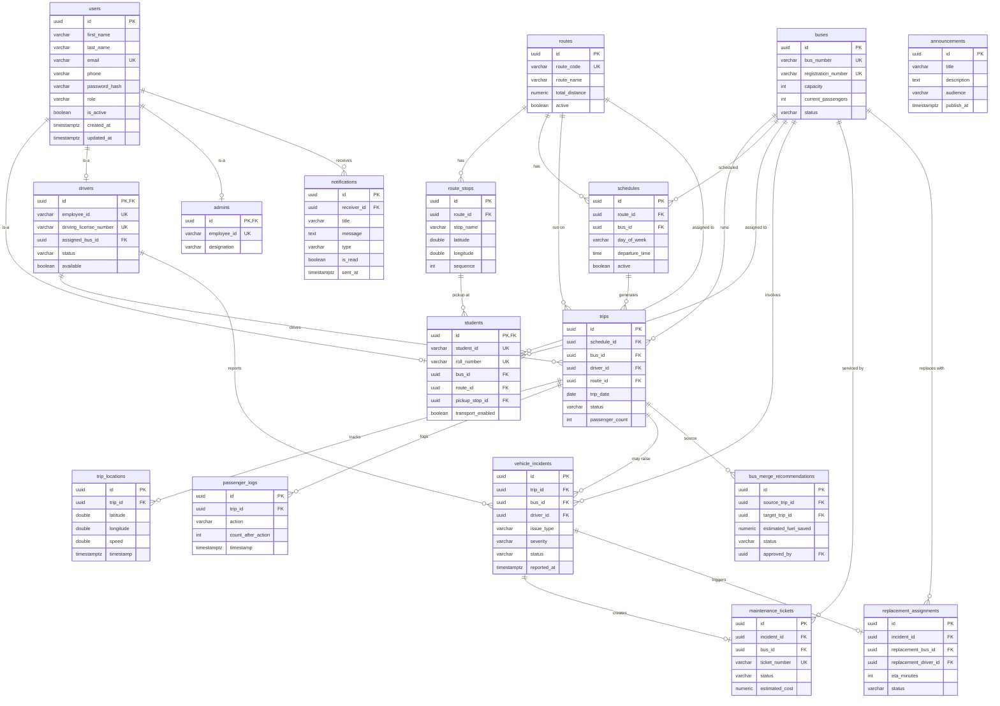

# CTMS — Database Design

**Document:** 05 — Database Design
**System:** Campus Transport Management System (CTMS)
**Database:** PostgreSQL 16 (primary), Redis 7 (cache/queue/broadcast)
**ORM/Migrations:** Laravel 12 Eloquent + migrations
**Version:** 1.0

---

## 1. Purpose and Scope

This document is the authoritative physical data model for the CTMS backend. It translates the 17-entity domain model from the SRS into a normalized PostgreSQL schema, specifies every table's columns, keys, constraints, and indexes, records the key design decisions (single-table inheritance vs. profile tables, enum strategy, geospatial and composite indexing, soft-delete, timestamp conventions), and provides representative `CREATE TABLE` DDL for the core tables.

All identifiers in the physical schema are **snake_case**. Domain attributes documented in camelCase in the SRS map directly (e.g. `firstName` -> `first_name`, `busId` -> `bus_id`). All primary keys are **UUID v4** (`uuid` type, generated with `gen_random_uuid()` from the `pgcrypto` extension).

---

## 2. Conventions

| Concern | Convention |
| --- | --- |
| Primary keys | `uuid` column named `id`, default `gen_random_uuid()` |
| Foreign keys | `<entity>_id uuid`, named after the referenced table's singular form |
| Naming | snake_case tables (plural) and columns; enum types singular |
| Timestamps | `created_at timestamptz`, `updated_at timestamptz` on all core entities; append-only telemetry tables carry only their own event `timestamp` / `sent_at` etc. |
| Time zone | All temporal columns are `timestamptz` stored in UTC; app layer localizes to campus time |
| Money / distance / mileage | `numeric` (fixed precision) — never `float` for money |
| Coordinates | `double precision` for latitude/longitude; PostGIS `geography(Point,4326)` generated column on `trip_locations` and `route_stops` for spatial queries |
| Booleans | `boolean not null default ...` — never nullable |
| Soft delete | `is_active boolean` flag on master/reference data (see §4.4); telemetry and log tables are never soft-deleted |
| Text vs varchar | `varchar(n)` for bounded fields, `text` for free-form (`description`, `remarks`, `message`) |
| Enums | Postgres `CHECK` constraints backed by a lookup convention (see §4.2) |

**Required extensions:**

```sql
CREATE EXTENSION IF NOT EXISTS "pgcrypto";   -- gen_random_uuid()
CREATE EXTENSION IF NOT EXISTS "postgis";    -- geography types + GiST spatial indexes
```

---

## 3. Entity-Relationship Diagram



---

## 4. Key Design Decisions

### 4.1 User inheritance: `users` table + role profile tables (RECOMMENDED)

The domain model has an abstract `User` base with three concrete subtypes: `Student`, `Driver`, `Admin`. Three physical strategies exist:

| Strategy | Description | Verdict |
| --- | --- | --- |
| **Single Table Inheritance (STI)** | One wide `users` table with every subtype column, most `NULL`. | Rejected — dozens of always-null columns; no way to enforce "a driver must have a license"; wide row bloat. |
| **Concrete Table (per-subtype only)** | Separate `students`, `drivers`, `admins` tables, no shared table. | Rejected — duplicates all identity columns; email uniqueness across roles becomes cross-table and unenforceable by a single constraint; a single `receiver_id` FK for notifications has no single target. |
| **Class Table Inheritance — `users` + profile tables** | Shared identity in `users`; role-specific columns in `students` / `drivers` / `admins`, each PK is also an FK to `users.id`. | **RECOMMENDED.** |

**Decision:** Use a shared `users` table carrying all `User` base attributes plus a `role` discriminator (`ADMIN`/`DRIVER`/`STUDENT`), and one profile table per role whose primary key **is** the foreign key to `users.id` (a 1:1 identifying relationship). Benefits:

- Global `email` uniqueness enforced by one constraint on `users`.
- `notifications.receiver_id` and audit references point at one stable `users.id`.
- Role-specific `NOT NULL` invariants (e.g. `drivers.driving_license_number`) are enforced in the profile table.
- Authentication (FR-01) reads one narrow `users` row; role resolution is a single join.

A `users` row and its profile row are created in the same transaction. `role` is immutable after creation (enforced in the application/service layer; a user does not change role — a new account is provisioned instead).

### 4.2 Enum strategy: CHECK constraints (RECOMMENDED)

Two viable approaches for the SRS enums (`UserRole`, `BusStatus`, `DriverStatus`, `TripStatus`, plus inline enums like `gender`, `severity`, `action`, `audience`, notification `type`, incident `status`):

| Option | Pros | Cons |
| --- | --- | --- |
| **Native Postgres `ENUM` type** | Compact storage, type safety at DB level. | Adding a value requires `ALTER TYPE`; removing/renaming is painful; Laravel migrations model them awkwardly; ordering surprises. |
| **`varchar` + `CHECK` constraint** | Trivial to extend (edit the CHECK), readable in queries, maps cleanly to Laravel enum casts, easy to diff in migrations. | Slightly larger storage; constraint must be kept in sync with app enum. |

**Decision:** Use **`varchar` columns guarded by `CHECK` constraints** for all enumerations. Values are stored as the exact uppercase tokens from the SRS (`AVAILABLE`, `RUNNING`, `MAINTENANCE`, `BREAKDOWN`, `OFFLINE`, etc.). Laravel `Enum` casts mirror them in the application layer. Where a set is expected to grow (issue types, notification types), the CHECK is the single point of change. Native Postgres enums remain an acceptable alternative for the four closed status enums; the schema below standardizes on CHECK constraints for uniformity.

Canonical value sets:

| Column | Allowed values |
| --- | --- |
| `users.role` | `ADMIN`, `DRIVER`, `STUDENT` |
| `users.gender` | `MALE`, `FEMALE`, `OTHER` |
| `buses.status` | `AVAILABLE`, `RUNNING`, `MAINTENANCE`, `BREAKDOWN`, `OFFLINE` |
| `drivers.status` | `AVAILABLE`, `ON_TRIP`, `LEAVE`, `OFF_DUTY` |
| `trips.status` | `SCHEDULED`, `RUNNING`, `COMPLETED`, `CANCELLED` |
| `schedules.day_of_week` | `MONDAY`..`SUNDAY` |
| `passenger_logs.action` | `BOARD`, `EXIT` |
| `vehicle_incidents.severity` | `LOW`, `MEDIUM`, `HIGH`, `CRITICAL` |
| `vehicle_incidents.status` | `REPORTED`, `ACKNOWLEDGED`, `RESOLVED` |
| `maintenance_tickets.status` | `OPEN`, `IN_PROGRESS`, `COMPLETED`, `CANCELLED` |
| `bus_merge_recommendations.status` | `PENDING`, `APPROVED`, `REJECTED` |
| `replacement_assignments.status` | `PROPOSED`, `APPROVED`, `EN_ROUTE`, `COMPLETED`, `CANCELLED` |
| `notifications.type` | `TRIP_STARTED`, `NEARING_STOP`, `DELAY`, `ROUTE_CHANGE`, `REPLACEMENT`, `TRIP_COMPLETED` |
| `announcements.audience` | `ALL`, `STUDENTS`, `DRIVERS`, `ADMINS` |

### 4.3 Geospatial indexing on `trip_locations`

`trip_locations` is the highest-write table: GPS points arrive every 5–10 s per active trip (FR-07). Two access patterns dominate: (a) "latest point for a trip" for live tracking, and (b) proximity/geofence checks for "bus nearing stop" notifications (FR-10) and ETA (FR-09).

**Decision:**

- Store raw `latitude`/`longitude` as `double precision`, plus a **generated `geography(Point,4326)` column** `geog` for spatial math.
- Create a **GiST index** on `geog` for `ST_DWithin` geofence queries against `route_stops`.
- Create a composite btree index `(trip_id, timestamp DESC)` so "latest location for trip X" is an index-only backward scan.
- `route_stops` also carries a `geog` generated column with a GiST index so the geofence join is spatial on both sides.
- Partition consideration: `trip_locations` is a candidate for **monthly range partitioning on `timestamp`** at scale (thousands of students, hundreds of buses). The DDL below is written to be partition-ready (the `timestamp` column is `NOT NULL` and part of every hot index).

### 4.4 Composite index `trips(bus_id, trip_date)`

The scheduler and fleet monitor repeatedly ask "what trips did this bus run on this date / is running today". The business rule *only one active driver per bus during a trip* and the *bus-in-maintenance-cannot-be-assigned* check both filter trips by bus and date.

**Decision:** Composite btree index `idx_trips_bus_date ON trips (bus_id, trip_date)`. Additional supporting indexes: `(driver_id, trip_date)`, `(route_id, trip_date)`, and a **partial unique index** enforcing at most one non-terminal (`RUNNING`) trip per bus (§ trips table).

### 4.5 Soft delete via `is_active`

**Decision:** Master and reference entities (`users`, `students`, `drivers`, `admins` via `users`, `buses`, `routes`, `schedules`) use a boolean `is_active` / `active` flag rather than a `deleted_at` tombstone. Rationale: the SRS explicitly models `isActive` / `active` / `transportEnabled` as domain state (a deactivated bus is *deactivated*, not *deleted*), and referential history (which bus ran which trip) must survive deactivation. Rows are never hard-deleted from these tables during normal operation. Telemetry and event tables (`trip_locations`, `passenger_logs`, `notifications`, incidents, tickets) are **append-only** and carry no soft-delete flag; they are pruned by retention jobs, not user action.

> Note: The schema uses `is_active` on `users`/`buses` and `active` on `routes`/`schedules` to match the exact SRS attribute names. Application code treats both identically.

### 4.6 `created_at` / `updated_at`

All core entities carry `created_at timestamptz NOT NULL DEFAULT now()` and `updated_at timestamptz NOT NULL DEFAULT now()`. Laravel maintains `updated_at` on write; a database `BEFORE UPDATE` trigger is optional as a belt-and-braces guarantee. High-frequency append-only tables (`trip_locations`, `passenger_logs`) omit `updated_at` (rows are immutable) and use their own event `timestamp` instead of `created_at`.

---

## 5. Table Catalog

| # | Table | Kind | Soft-delete | Notes |
| --- | --- | --- | --- | --- |
| 1 | `users` | Master (identity) | `is_active` | Shared base for all roles |
| 2 | `students` | Profile (1:1 users) | via users | FR-04 |
| 3 | `drivers` | Profile (1:1 users) | via users | FR-03 |
| 4 | `admins` | Profile (1:1 users) | via users | — |
| 5 | `buses` | Master | `is_active` (+ `status`) | FR-02 |
| 6 | `routes` | Master | `active` | FR-05 |
| 7 | `route_stops` | Reference (child of route) | via route | FR-05, spatial |
| 8 | `schedules` | Reference | `active` | FR-05 |
| 9 | `trips` | Operational | none (status lifecycle) | FR-06 |
| 10 | `trip_locations` | Telemetry (append-only) | none | FR-07, spatial, high-volume |
| 11 | `passenger_logs` | Telemetry (append-only) | none | FR-08 |
| 12 | `vehicle_incidents` | Operational | none (status lifecycle) | FR-11 |
| 13 | `maintenance_tickets` | Operational | none (status lifecycle) | FR-14 |
| 14 | `bus_merge_recommendations` | Operational | none (status lifecycle) | FR-13 |
| 15 | `replacement_assignments` | Operational | none (status lifecycle) | FR-12 |
| 16 | `notifications` | Event (append-only) | none | FR-10 |
| 17 | `announcements` | Content | `publish_at`/`expire_at` window | Broadcast |

---

## 6. Per-Table Specification

### 6.1 `users`

Shared identity for all roles (FR-01).

| Column | Type | Null | Default | Notes |
| --- | --- | --- | --- | --- |
| id | uuid | no | gen_random_uuid() | PK |
| first_name | varchar(80) | no | | |
| last_name | varchar(80) | no | | |
| gender | varchar(10) | yes | | CHECK MALE/FEMALE/OTHER |
| date_of_birth | date | yes | | |
| email | varchar(190) | no | | UNIQUE |
| phone | varchar(20) | yes | | |
| password_hash | varchar(255) | no | | bcrypt/argon2 |
| profile_photo | varchar(255) | yes | | object-store URL |
| address_line1 | varchar(150) | yes | | |
| address_line2 | varchar(150) | yes | | |
| city | varchar(80) | yes | | |
| state | varchar(80) | yes | | |
| postal_code | varchar(12) | yes | | |
| role | varchar(10) | no | | CHECK ADMIN/DRIVER/STUDENT |
| is_active | boolean | no | true | soft-delete flag |
| last_login | timestamptz | yes | | set on login |
| created_at | timestamptz | no | now() | |
| updated_at | timestamptz | no | now() | |

- **PK:** `id`
- **Unique:** `email`
- **Indexes:** `unique(email)`; `idx_users_role_active (role, is_active)`; `idx_users_phone (phone)`

### 6.2 `students` (profile, FR-04)

| Column | Type | Null | Default | Notes |
| --- | --- | --- | --- | --- |
| id | uuid | no | | PK **and** FK -> users.id |
| student_id | varchar(30) | no | | UNIQUE, college student id |
| roll_number | varchar(30) | no | | UNIQUE |
| admission_number | varchar(30) | yes | | |
| department | varchar(80) | yes | | |
| course | varchar(80) | yes | | |
| year | smallint | yes | | |
| section | varchar(10) | yes | | |
| semester | smallint | yes | | |
| bus_id | uuid | yes | | FK -> buses.id |
| route_id | uuid | yes | | FK -> routes.id |
| pickup_stop_id | uuid | yes | | FK -> route_stops.id |
| guardian_name | varchar(120) | yes | | |
| guardian_phone | varchar(20) | yes | | |
| transport_enabled | boolean | no | true | |
| created_at | timestamptz | no | now() | |
| updated_at | timestamptz | no | now() | |

- **PK:** `id` (identifying FK to `users`, `ON DELETE CASCADE`)
- **Unique:** `student_id`, `roll_number`
- **FKs:** `bus_id`->buses, `route_id`->routes, `pickup_stop_id`->route_stops (all `ON DELETE SET NULL`)
- **Indexes:** `idx_students_route (route_id)`; `idx_students_bus (bus_id)` — supports "students can only view their assigned bus" and route rosters.

### 6.3 `drivers` (profile, FR-03)

| Column | Type | Null | Default | Notes |
| --- | --- | --- | --- | --- |
| id | uuid | no | | PK **and** FK -> users.id |
| employee_id | varchar(30) | no | | UNIQUE |
| driving_license_number | varchar(40) | no | | UNIQUE |
| license_expiry | date | yes | | |
| aadhaar_number | varchar(20) | yes | | UNIQUE, encrypted at rest |
| joining_date | date | yes | | |
| emergency_contact | varchar(20) | yes | | |
| assigned_bus_id | uuid | yes | | FK -> buses.id |
| available | boolean | no | true | |
| status | varchar(12) | no | 'AVAILABLE' | CHECK AVAILABLE/ON_TRIP/LEAVE/OFF_DUTY |
| created_at | timestamptz | no | now() | |
| updated_at | timestamptz | no | now() | |

- **PK:** `id` (identifying FK to `users`, `ON DELETE CASCADE`)
- **Unique:** `employee_id`, `driving_license_number`, `aadhaar_number`
- **FKs:** `assigned_bus_id`->buses (`ON DELETE SET NULL`)
- **Indexes:** `idx_drivers_status (status)`; `idx_drivers_available (available) WHERE available` (partial — replacement-bus driver lookup, FR-12)

### 6.4 `admins` (profile)

| Column | Type | Null | Default | Notes |
| --- | --- | --- | --- | --- |
| id | uuid | no | | PK **and** FK -> users.id |
| employee_id | varchar(30) | no | | UNIQUE |
| designation | varchar(80) | yes | | |
| office_phone | varchar(20) | yes | | |
| created_at | timestamptz | no | now() | |
| updated_at | timestamptz | no | now() | |

- **PK:** `id` (identifying FK to `users`, `ON DELETE CASCADE`)
- **Unique:** `employee_id`

### 6.5 `buses` (FR-02)

| Column | Type | Null | Default | Notes |
| --- | --- | --- | --- | --- |
| id | uuid | no | gen_random_uuid() | PK |
| bus_number | varchar(20) | no | | UNIQUE, fleet id |
| registration_number | varchar(20) | no | | UNIQUE, RTO plate |
| chassis_number | varchar(40) | yes | | UNIQUE |
| engine_number | varchar(40) | yes | | |
| manufacturer | varchar(60) | yes | | |
| model | varchar(60) | yes | | |
| manufacturing_year | smallint | yes | | |
| capacity | int | no | | > 0 |
| current_passengers | int | no | 0 | 0..capacity |
| fuel_type | varchar(20) | yes | | |
| mileage | numeric(6,2) | yes | | km/l |
| gps_enabled | boolean | no | true | |
| gps_device_id | varchar(60) | yes | | UNIQUE when present |
| status | varchar(12) | no | 'AVAILABLE' | CHECK AVAILABLE/RUNNING/MAINTENANCE/BREAKDOWN/OFFLINE |
| last_service_date | date | yes | | |
| next_service_date | date | yes | | |
| insurance_expiry | date | yes | | |
| permit_expiry | date | yes | | |
| is_active | boolean | no | true | soft-delete |
| created_at | timestamptz | no | now() | |
| updated_at | timestamptz | no | now() | |

- **PK:** `id`
- **Unique:** `bus_number`, `registration_number`, `chassis_number`, partial unique on `gps_device_id`
- **Checks:** `capacity > 0`; `current_passengers BETWEEN 0 AND capacity` (business rule: count never exceeds capacity)
- **Indexes:** `idx_buses_status (status)`; `idx_buses_available (status) WHERE status = 'AVAILABLE'` (replacement/merge candidate lookup)

### 6.6 `routes` (FR-05)

| Column | Type | Null | Default | Notes |
| --- | --- | --- | --- | --- |
| id | uuid | no | gen_random_uuid() | PK |
| route_code | varchar(20) | no | | UNIQUE |
| route_name | varchar(120) | no | | |
| source | varchar(120) | yes | | |
| destination | varchar(120) | yes | | |
| total_distance | numeric(7,2) | yes | | km |
| estimated_duration | int | yes | | minutes |
| active | boolean | no | true | soft-delete |
| created_at | timestamptz | no | now() | |
| updated_at | timestamptz | no | now() | |

- **PK:** `id` · **Unique:** `route_code` · **Index:** `idx_routes_active (active)`

### 6.7 `route_stops` (FR-05, spatial)

| Column | Type | Null | Default | Notes |
| --- | --- | --- | --- | --- |
| id | uuid | no | gen_random_uuid() | PK |
| route_id | uuid | no | | FK -> routes.id, CASCADE |
| stop_name | varchar(120) | no | | |
| landmark | varchar(150) | yes | | |
| latitude | double precision | no | | |
| longitude | double precision | no | | |
| geog | geography(Point,4326) | yes | generated | `ST_MakePoint(longitude, latitude)` |
| sequence | int | no | | order along route |
| geofence_radius | double precision | yes | 120 | metres |
| expected_arrival | time | yes | | |
| created_at | timestamptz | no | now() | |
| updated_at | timestamptz | no | now() | |

- **PK:** `id` · **FK:** `route_id`->routes (`ON DELETE CASCADE`)
- **Unique:** `(route_id, sequence)` — no two stops share a position on a route
- **Indexes:** `idx_route_stops_route (route_id, sequence)`; **GiST** `idx_route_stops_geog USING gist (geog)`

### 6.8 `schedules` (FR-05)

| Column | Type | Null | Default | Notes |
| --- | --- | --- | --- | --- |
| id | uuid | no | gen_random_uuid() | PK |
| route_id | uuid | no | | FK -> routes.id |
| bus_id | uuid | yes | | FK -> buses.id |
| day_of_week | varchar(9) | no | | CHECK MONDAY..SUNDAY |
| departure_time | time | no | | |
| arrival_time | time | yes | | |
| active | boolean | no | true | |
| created_at | timestamptz | no | now() | |
| updated_at | timestamptz | no | now() | |

- **PK:** `id` · **FKs:** `route_id`->routes (CASCADE), `bus_id`->buses (SET NULL)
- **Indexes:** `idx_schedules_route_day (route_id, day_of_week)`; `idx_schedules_bus (bus_id)`

### 6.9 `trips` (FR-06)

| Column | Type | Null | Default | Notes |
| --- | --- | --- | --- | --- |
| id | uuid | no | gen_random_uuid() | PK |
| schedule_id | uuid | yes | | FK -> schedules.id |
| bus_id | uuid | no | | FK -> buses.id |
| driver_id | uuid | no | | FK -> drivers.id |
| route_id | uuid | no | | FK -> routes.id |
| trip_date | date | no | | |
| start_time | timestamptz | yes | | set on startTrip |
| end_time | timestamptz | yes | | set on endTrip |
| status | varchar(10) | no | 'SCHEDULED' | CHECK SCHEDULED/RUNNING/COMPLETED/CANCELLED |
| passenger_count | int | no | 0 | live count |
| average_speed | double precision | yes | | km/h |
| delay_minutes | int | no | 0 | |
| created_at | timestamptz | no | now() | |
| updated_at | timestamptz | no | now() | |

- **PK:** `id`
- **FKs:** `schedule_id`->schedules (SET NULL), `bus_id`->buses (RESTRICT), `driver_id`->drivers (RESTRICT), `route_id`->routes (RESTRICT)
- **Indexes:** **`idx_trips_bus_date (bus_id, trip_date)`** (§4.4); `idx_trips_driver_date (driver_id, trip_date)`; `idx_trips_route_date (route_id, trip_date)`; `idx_trips_status (status)`
- **Business-rule constraint (one active driver/bus per running trip):**
  `CREATE UNIQUE INDEX uniq_bus_running ON trips (bus_id) WHERE status = 'RUNNING';`
  and `CREATE UNIQUE INDEX uniq_driver_running ON trips (driver_id) WHERE status = 'RUNNING';`

### 6.10 `trip_locations` (FR-07, telemetry, append-only, spatial)

| Column | Type | Null | Default | Notes |
| --- | --- | --- | --- | --- |
| id | uuid | no | gen_random_uuid() | PK |
| trip_id | uuid | no | | FK -> trips.id |
| latitude | double precision | no | | |
| longitude | double precision | no | | |
| geog | geography(Point,4326) | yes | generated | `ST_MakePoint(longitude, latitude)` |
| speed | double precision | yes | | km/h |
| heading | double precision | yes | | degrees 0..360 |
| accuracy | double precision | yes | | metres |
| timestamp | timestamptz | no | | device event time |

- **PK:** `id` · **FK:** `trip_id`->trips (`ON DELETE CASCADE`)
- **Indexes:** **`idx_triploc_trip_ts (trip_id, timestamp DESC)`** (latest point); **GiST** `idx_triploc_geog USING gist (geog)` (geofence); optional BRIN on `timestamp` if range-partitioned.
- **No `updated_at`** — rows are immutable. Retention job prunes points older than the reporting window (raw GPS kept N days; aggregates retained).

### 6.11 `passenger_logs` (FR-08, telemetry, append-only)

| Column | Type | Null | Default | Notes |
| --- | --- | --- | --- | --- |
| id | uuid | no | gen_random_uuid() | PK |
| trip_id | uuid | no | | FK -> trips.id |
| action | varchar(6) | no | | CHECK BOARD/EXIT |
| count_after_action | int | no | | resulting count, <= bus capacity |
| timestamp | timestamptz | no | now() | |

- **PK:** `id` · **FK:** `trip_id`->trips (CASCADE)
- **Index:** `idx_passlog_trip_ts (trip_id, timestamp)`

### 6.12 `vehicle_incidents` (FR-11)

| Column | Type | Null | Default | Notes |
| --- | --- | --- | --- | --- |
| id | uuid | no | gen_random_uuid() | PK |
| trip_id | uuid | yes | | FK -> trips.id |
| bus_id | uuid | no | | FK -> buses.id |
| driver_id | uuid | no | | FK -> drivers.id |
| issue_type | varchar(30) | no | | breakdown/accident/tyre/engine/battery |
| severity | varchar(10) | no | | CHECK LOW/MEDIUM/HIGH/CRITICAL |
| description | text | yes | | |
| image_url | varchar(255) | yes | | |
| latitude | double precision | yes | | |
| longitude | double precision | yes | | |
| status | varchar(14) | no | 'REPORTED' | CHECK REPORTED/ACKNOWLEDGED/RESOLVED |
| reported_at | timestamptz | no | now() | |
| created_at | timestamptz | no | now() | |
| updated_at | timestamptz | no | now() | |

- **PK:** `id` · **FKs:** `trip_id`->trips (SET NULL), `bus_id`->buses (RESTRICT), `driver_id`->drivers (RESTRICT)
- **Indexes:** `idx_incidents_bus (bus_id)`; `idx_incidents_status (status)`; `idx_incidents_reported (reported_at DESC)`
- **Business rule:** every incident creates a maintenance record — enforced by an application-layer transaction (or DB trigger) that inserts a `maintenance_tickets` row on incident creation.

### 6.13 `maintenance_tickets` (FR-14)

| Column | Type | Null | Default | Notes |
| --- | --- | --- | --- | --- |
| id | uuid | no | gen_random_uuid() | PK |
| incident_id | uuid | yes | | FK -> vehicle_incidents.id, UNIQUE |
| bus_id | uuid | no | | FK -> buses.id |
| ticket_number | varchar(30) | no | | UNIQUE, human ref |
| assigned_technician | varchar(120) | yes | | |
| status | varchar(12) | no | 'OPEN' | CHECK OPEN/IN_PROGRESS/COMPLETED/CANCELLED |
| repair_start | timestamptz | yes | | |
| repair_end | timestamptz | yes | | |
| estimated_cost | numeric(10,2) | yes | | |
| remarks | text | yes | | |
| created_at | timestamptz | no | now() | |
| updated_at | timestamptz | no | now() | |

- **PK:** `id` · **FKs:** `incident_id`->vehicle_incidents (SET NULL), `bus_id`->buses (RESTRICT)
- **Unique:** `ticket_number`; `incident_id` (1:1 incident->ticket)
- **Indexes:** `idx_tickets_bus (bus_id)`; `idx_tickets_status (status)`

### 6.14 `bus_merge_recommendations` (FR-13)

| Column | Type | Null | Default | Notes |
| --- | --- | --- | --- | --- |
| id | uuid | no | gen_random_uuid() | PK |
| source_trip_id | uuid | no | | FK -> trips.id |
| target_trip_id | uuid | no | | FK -> trips.id |
| source_passengers | int | yes | | |
| target_passengers | int | yes | | |
| merged_passengers | int | yes | | must be <= target bus capacity |
| estimated_fuel_saved | numeric(8,2) | yes | | litres |
| distance_increase | numeric(7,2) | yes | | km |
| status | varchar(10) | no | 'PENDING' | CHECK PENDING/APPROVED/REJECTED |
| approved_by | uuid | yes | | FK -> admins.id |
| created_at | timestamptz | no | now() | |
| updated_at | timestamptz | no | now() | |

- **PK:** `id` · **FKs:** `source_trip_id`/`target_trip_id`->trips (CASCADE), `approved_by`->admins (SET NULL)
- **Check:** `source_trip_id <> target_trip_id`
- **Indexes:** `idx_merge_status (status)`; `idx_merge_source (source_trip_id)`

### 6.15 `replacement_assignments` (FR-12)

| Column | Type | Null | Default | Notes |
| --- | --- | --- | --- | --- |
| id | uuid | no | gen_random_uuid() | PK |
| incident_id | uuid | no | | FK -> vehicle_incidents.id |
| replacement_bus_id | uuid | no | | FK -> buses.id |
| replacement_driver_id | uuid | yes | | FK -> drivers.id |
| eta_minutes | int | yes | | |
| assigned_at | timestamptz | yes | | set on admin approval |
| status | varchar(10) | no | 'PROPOSED' | CHECK PROPOSED/APPROVED/EN_ROUTE/COMPLETED/CANCELLED |
| created_at | timestamptz | no | now() | |
| updated_at | timestamptz | no | now() | |

- **PK:** `id` · **FKs:** `incident_id`->vehicle_incidents (CASCADE), `replacement_bus_id`->buses (RESTRICT), `replacement_driver_id`->drivers (SET NULL)
- **Indexes:** `idx_repl_incident (incident_id)`; `idx_repl_status (status)`

### 6.16 `notifications` (FR-10, append-only event)

| Column | Type | Null | Default | Notes |
| --- | --- | --- | --- | --- |
| id | uuid | no | gen_random_uuid() | PK |
| receiver_id | uuid | no | | FK -> users.id |
| title | varchar(150) | no | | |
| message | text | no | | |
| type | varchar(20) | no | | CHECK TRIP_STARTED/NEARING_STOP/DELAY/ROUTE_CHANGE/REPLACEMENT/TRIP_COMPLETED |
| is_read | boolean | no | false | |
| sent_at | timestamptz | no | now() | FCM dispatch time |

- **PK:** `id` · **FK:** `receiver_id`->users (CASCADE)
- **Indexes:** `idx_notif_receiver_unread (receiver_id, is_read, sent_at DESC)` — supports the app's "my unread notifications" query cheaply.

### 6.17 `announcements`

| Column | Type | Null | Default | Notes |
| --- | --- | --- | --- | --- |
| id | uuid | no | gen_random_uuid() | PK |
| title | varchar(150) | no | | |
| description | text | yes | | |
| audience | varchar(10) | no | 'ALL' | CHECK ALL/STUDENTS/DRIVERS/ADMINS |
| publish_at | timestamptz | yes | now() | |
| expire_at | timestamptz | yes | | |
| created_at | timestamptz | no | now() | |
| updated_at | timestamptz | no | now() | |

- **PK:** `id` · **Index:** `idx_ann_window (audience, publish_at, expire_at)`

---

## 7. Representative DDL (core tables)

```sql
-- ============ extensions ============
CREATE EXTENSION IF NOT EXISTS "pgcrypto";
CREATE EXTENSION IF NOT EXISTS "postgis";

-- ============ users ============
CREATE TABLE users (
    id             uuid PRIMARY KEY DEFAULT gen_random_uuid(),
    first_name     varchar(80)  NOT NULL,
    last_name      varchar(80)  NOT NULL,
    gender         varchar(10)  CHECK (gender IN ('MALE','FEMALE','OTHER')),
    date_of_birth  date,
    email          varchar(190) NOT NULL,
    phone          varchar(20),
    password_hash  varchar(255) NOT NULL,
    profile_photo  varchar(255),
    address_line1  varchar(150),
    address_line2  varchar(150),
    city           varchar(80),
    state          varchar(80),
    postal_code    varchar(12),
    role           varchar(10)  NOT NULL CHECK (role IN ('ADMIN','DRIVER','STUDENT')),
    is_active      boolean      NOT NULL DEFAULT true,
    last_login     timestamptz,
    created_at     timestamptz  NOT NULL DEFAULT now(),
    updated_at     timestamptz  NOT NULL DEFAULT now(),
    CONSTRAINT uq_users_email UNIQUE (email)
);
CREATE INDEX idx_users_role_active ON users (role, is_active);
CREATE INDEX idx_users_phone       ON users (phone);

-- ============ students (profile) ============
CREATE TABLE students (
    id                 uuid PRIMARY KEY REFERENCES users(id) ON DELETE CASCADE,
    student_id         varchar(30) NOT NULL,
    roll_number        varchar(30) NOT NULL,
    admission_number   varchar(30),
    department         varchar(80),
    course             varchar(80),
    year               smallint,
    section            varchar(10),
    semester           smallint,
    bus_id             uuid REFERENCES buses(id)       ON DELETE SET NULL,
    route_id           uuid REFERENCES routes(id)      ON DELETE SET NULL,
    pickup_stop_id     uuid REFERENCES route_stops(id) ON DELETE SET NULL,
    guardian_name      varchar(120),
    guardian_phone     varchar(20),
    transport_enabled  boolean NOT NULL DEFAULT true,
    created_at         timestamptz NOT NULL DEFAULT now(),
    updated_at         timestamptz NOT NULL DEFAULT now(),
    CONSTRAINT uq_students_student_id  UNIQUE (student_id),
    CONSTRAINT uq_students_roll_number UNIQUE (roll_number)
);
CREATE INDEX idx_students_route ON students (route_id);
CREATE INDEX idx_students_bus   ON students (bus_id);

-- ============ drivers (profile) ============
CREATE TABLE drivers (
    id                     uuid PRIMARY KEY REFERENCES users(id) ON DELETE CASCADE,
    employee_id            varchar(30) NOT NULL,
    driving_license_number varchar(40) NOT NULL,
    license_expiry         date,
    aadhaar_number         varchar(20),
    joining_date           date,
    emergency_contact      varchar(20),
    assigned_bus_id        uuid REFERENCES buses(id) ON DELETE SET NULL,
    available              boolean NOT NULL DEFAULT true,
    status                 varchar(12) NOT NULL DEFAULT 'AVAILABLE'
                             CHECK (status IN ('AVAILABLE','ON_TRIP','LEAVE','OFF_DUTY')),
    created_at             timestamptz NOT NULL DEFAULT now(),
    updated_at             timestamptz NOT NULL DEFAULT now(),
    CONSTRAINT uq_drivers_employee_id UNIQUE (employee_id),
    CONSTRAINT uq_drivers_license     UNIQUE (driving_license_number),
    CONSTRAINT uq_drivers_aadhaar     UNIQUE (aadhaar_number)
);
CREATE INDEX idx_drivers_status    ON drivers (status);
CREATE INDEX idx_drivers_available ON drivers (available) WHERE available;

-- ============ admins (profile) ============
CREATE TABLE admins (
    id           uuid PRIMARY KEY REFERENCES users(id) ON DELETE CASCADE,
    employee_id  varchar(30) NOT NULL,
    designation  varchar(80),
    office_phone varchar(20),
    created_at   timestamptz NOT NULL DEFAULT now(),
    updated_at   timestamptz NOT NULL DEFAULT now(),
    CONSTRAINT uq_admins_employee_id UNIQUE (employee_id)
);

-- ============ buses ============
CREATE TABLE buses (
    id                  uuid PRIMARY KEY DEFAULT gen_random_uuid(),
    bus_number          varchar(20) NOT NULL,
    registration_number varchar(20) NOT NULL,
    chassis_number      varchar(40),
    engine_number       varchar(40),
    manufacturer        varchar(60),
    model               varchar(60),
    manufacturing_year  smallint,
    capacity            int NOT NULL CHECK (capacity > 0),
    current_passengers  int NOT NULL DEFAULT 0,
    fuel_type           varchar(20),
    mileage             numeric(6,2),
    gps_enabled         boolean NOT NULL DEFAULT true,
    gps_device_id       varchar(60),
    status              varchar(12) NOT NULL DEFAULT 'AVAILABLE'
                          CHECK (status IN ('AVAILABLE','RUNNING','MAINTENANCE','BREAKDOWN','OFFLINE')),
    last_service_date   date,
    next_service_date   date,
    insurance_expiry    date,
    permit_expiry       date,
    is_active           boolean NOT NULL DEFAULT true,
    created_at          timestamptz NOT NULL DEFAULT now(),
    updated_at          timestamptz NOT NULL DEFAULT now(),
    CONSTRAINT uq_buses_number   UNIQUE (bus_number),
    CONSTRAINT uq_buses_reg       UNIQUE (registration_number),
    CONSTRAINT uq_buses_chassis   UNIQUE (chassis_number),
    CONSTRAINT chk_buses_capacity CHECK (current_passengers BETWEEN 0 AND capacity)
);
CREATE UNIQUE INDEX uq_buses_gps ON buses (gps_device_id) WHERE gps_device_id IS NOT NULL;
CREATE INDEX idx_buses_status    ON buses (status);
CREATE INDEX idx_buses_available ON buses (status) WHERE status = 'AVAILABLE';

-- ============ routes ============
CREATE TABLE routes (
    id                 uuid PRIMARY KEY DEFAULT gen_random_uuid(),
    route_code         varchar(20)  NOT NULL,
    route_name         varchar(120) NOT NULL,
    source             varchar(120),
    destination        varchar(120),
    total_distance     numeric(7,2),
    estimated_duration int,
    active             boolean NOT NULL DEFAULT true,
    created_at         timestamptz NOT NULL DEFAULT now(),
    updated_at         timestamptz NOT NULL DEFAULT now(),
    CONSTRAINT uq_routes_code UNIQUE (route_code)
);
CREATE INDEX idx_routes_active ON routes (active);

-- ============ route_stops ============
CREATE TABLE route_stops (
    id               uuid PRIMARY KEY DEFAULT gen_random_uuid(),
    route_id         uuid NOT NULL REFERENCES routes(id) ON DELETE CASCADE,
    stop_name        varchar(120) NOT NULL,
    landmark         varchar(150),
    latitude         double precision NOT NULL,
    longitude        double precision NOT NULL,
    geog             geography(Point,4326)
                       GENERATED ALWAYS AS (ST_SetSRID(ST_MakePoint(longitude, latitude),4326)::geography) STORED,
    sequence         int NOT NULL,
    geofence_radius  double precision DEFAULT 120,
    expected_arrival time,
    created_at       timestamptz NOT NULL DEFAULT now(),
    updated_at       timestamptz NOT NULL DEFAULT now(),
    CONSTRAINT uq_route_stops_seq UNIQUE (route_id, sequence)
);
CREATE INDEX idx_route_stops_route ON route_stops (route_id, sequence);
CREATE INDEX idx_route_stops_geog  ON route_stops USING gist (geog);

-- ============ schedules ============
CREATE TABLE schedules (
    id             uuid PRIMARY KEY DEFAULT gen_random_uuid(),
    route_id       uuid NOT NULL REFERENCES routes(id) ON DELETE CASCADE,
    bus_id         uuid REFERENCES buses(id) ON DELETE SET NULL,
    day_of_week    varchar(9) NOT NULL
                     CHECK (day_of_week IN ('MONDAY','TUESDAY','WEDNESDAY','THURSDAY','FRIDAY','SATURDAY','SUNDAY')),
    departure_time time NOT NULL,
    arrival_time   time,
    active         boolean NOT NULL DEFAULT true,
    created_at     timestamptz NOT NULL DEFAULT now(),
    updated_at     timestamptz NOT NULL DEFAULT now()
);
CREATE INDEX idx_schedules_route_day ON schedules (route_id, day_of_week);
CREATE INDEX idx_schedules_bus       ON schedules (bus_id);

-- ============ trips ============
CREATE TABLE trips (
    id              uuid PRIMARY KEY DEFAULT gen_random_uuid(),
    schedule_id     uuid REFERENCES schedules(id) ON DELETE SET NULL,
    bus_id          uuid NOT NULL REFERENCES buses(id)   ON DELETE RESTRICT,
    driver_id       uuid NOT NULL REFERENCES drivers(id) ON DELETE RESTRICT,
    route_id        uuid NOT NULL REFERENCES routes(id)  ON DELETE RESTRICT,
    trip_date       date NOT NULL,
    start_time      timestamptz,
    end_time        timestamptz,
    status          varchar(10) NOT NULL DEFAULT 'SCHEDULED'
                      CHECK (status IN ('SCHEDULED','RUNNING','COMPLETED','CANCELLED')),
    passenger_count int NOT NULL DEFAULT 0,
    average_speed   double precision,
    delay_minutes   int NOT NULL DEFAULT 0,
    created_at      timestamptz NOT NULL DEFAULT now(),
    updated_at      timestamptz NOT NULL DEFAULT now()
);
CREATE INDEX idx_trips_bus_date    ON trips (bus_id, trip_date);
CREATE INDEX idx_trips_driver_date ON trips (driver_id, trip_date);
CREATE INDEX idx_trips_route_date  ON trips (route_id, trip_date);
CREATE INDEX idx_trips_status      ON trips (status);
-- one active driver / bus per running trip (business rule)
CREATE UNIQUE INDEX uniq_bus_running    ON trips (bus_id)    WHERE status = 'RUNNING';
CREATE UNIQUE INDEX uniq_driver_running ON trips (driver_id) WHERE status = 'RUNNING';

-- ============ trip_locations (high-volume telemetry) ============
CREATE TABLE trip_locations (
    id        uuid PRIMARY KEY DEFAULT gen_random_uuid(),
    trip_id   uuid NOT NULL REFERENCES trips(id) ON DELETE CASCADE,
    latitude  double precision NOT NULL,
    longitude double precision NOT NULL,
    geog      geography(Point,4326)
                GENERATED ALWAYS AS (ST_SetSRID(ST_MakePoint(longitude, latitude),4326)::geography) STORED,
    speed     double precision,
    heading   double precision,
    accuracy  double precision,
    "timestamp" timestamptz NOT NULL
);
CREATE INDEX idx_triploc_trip_ts ON trip_locations (trip_id, "timestamp" DESC);
CREATE INDEX idx_triploc_geog    ON trip_locations USING gist (geog);

-- ============ passenger_logs ============
CREATE TABLE passenger_logs (
    id                 uuid PRIMARY KEY DEFAULT gen_random_uuid(),
    trip_id            uuid NOT NULL REFERENCES trips(id) ON DELETE CASCADE,
    action             varchar(6) NOT NULL CHECK (action IN ('BOARD','EXIT')),
    count_after_action int NOT NULL,
    "timestamp"        timestamptz NOT NULL DEFAULT now()
);
CREATE INDEX idx_passlog_trip_ts ON passenger_logs (trip_id, "timestamp");

-- ============ vehicle_incidents ============
CREATE TABLE vehicle_incidents (
    id          uuid PRIMARY KEY DEFAULT gen_random_uuid(),
    trip_id     uuid REFERENCES trips(id)   ON DELETE SET NULL,
    bus_id      uuid NOT NULL REFERENCES buses(id)   ON DELETE RESTRICT,
    driver_id   uuid NOT NULL REFERENCES drivers(id) ON DELETE RESTRICT,
    issue_type  varchar(30) NOT NULL,
    severity    varchar(10) NOT NULL CHECK (severity IN ('LOW','MEDIUM','HIGH','CRITICAL')),
    description text,
    image_url   varchar(255),
    latitude    double precision,
    longitude   double precision,
    status      varchar(14) NOT NULL DEFAULT 'REPORTED'
                  CHECK (status IN ('REPORTED','ACKNOWLEDGED','RESOLVED')),
    reported_at timestamptz NOT NULL DEFAULT now(),
    created_at  timestamptz NOT NULL DEFAULT now(),
    updated_at  timestamptz NOT NULL DEFAULT now()
);
CREATE INDEX idx_incidents_bus      ON vehicle_incidents (bus_id);
CREATE INDEX idx_incidents_status   ON vehicle_incidents (status);
CREATE INDEX idx_incidents_reported ON vehicle_incidents (reported_at DESC);

-- ============ maintenance_tickets ============
CREATE TABLE maintenance_tickets (
    id                  uuid PRIMARY KEY DEFAULT gen_random_uuid(),
    incident_id         uuid REFERENCES vehicle_incidents(id) ON DELETE SET NULL,
    bus_id              uuid NOT NULL REFERENCES buses(id) ON DELETE RESTRICT,
    ticket_number       varchar(30) NOT NULL,
    assigned_technician varchar(120),
    status              varchar(12) NOT NULL DEFAULT 'OPEN'
                          CHECK (status IN ('OPEN','IN_PROGRESS','COMPLETED','CANCELLED')),
    repair_start        timestamptz,
    repair_end          timestamptz,
    estimated_cost      numeric(10,2),
    remarks             text,
    created_at          timestamptz NOT NULL DEFAULT now(),
    updated_at          timestamptz NOT NULL DEFAULT now(),
    CONSTRAINT uq_tickets_number   UNIQUE (ticket_number),
    CONSTRAINT uq_tickets_incident UNIQUE (incident_id)
);
CREATE INDEX idx_tickets_bus    ON maintenance_tickets (bus_id);
CREATE INDEX idx_tickets_status ON maintenance_tickets (status);

-- ============ bus_merge_recommendations ============
CREATE TABLE bus_merge_recommendations (
    id                   uuid PRIMARY KEY DEFAULT gen_random_uuid(),
    source_trip_id       uuid NOT NULL REFERENCES trips(id) ON DELETE CASCADE,
    target_trip_id       uuid NOT NULL REFERENCES trips(id) ON DELETE CASCADE,
    source_passengers    int,
    target_passengers    int,
    merged_passengers    int,
    estimated_fuel_saved numeric(8,2),
    distance_increase    numeric(7,2),
    status               varchar(10) NOT NULL DEFAULT 'PENDING'
                           CHECK (status IN ('PENDING','APPROVED','REJECTED')),
    approved_by          uuid REFERENCES admins(id) ON DELETE SET NULL,
    created_at           timestamptz NOT NULL DEFAULT now(),
    updated_at           timestamptz NOT NULL DEFAULT now(),
    CONSTRAINT chk_merge_distinct CHECK (source_trip_id <> target_trip_id)
);
CREATE INDEX idx_merge_status ON bus_merge_recommendations (status);
CREATE INDEX idx_merge_source ON bus_merge_recommendations (source_trip_id);

-- ============ replacement_assignments ============
CREATE TABLE replacement_assignments (
    id                    uuid PRIMARY KEY DEFAULT gen_random_uuid(),
    incident_id           uuid NOT NULL REFERENCES vehicle_incidents(id) ON DELETE CASCADE,
    replacement_bus_id    uuid NOT NULL REFERENCES buses(id)   ON DELETE RESTRICT,
    replacement_driver_id uuid REFERENCES drivers(id) ON DELETE SET NULL,
    eta_minutes           int,
    assigned_at           timestamptz,
    status                varchar(10) NOT NULL DEFAULT 'PROPOSED'
                            CHECK (status IN ('PROPOSED','APPROVED','EN_ROUTE','COMPLETED','CANCELLED')),
    created_at            timestamptz NOT NULL DEFAULT now(),
    updated_at            timestamptz NOT NULL DEFAULT now()
);
CREATE INDEX idx_repl_incident ON replacement_assignments (incident_id);
CREATE INDEX idx_repl_status   ON replacement_assignments (status);

-- ============ notifications ============
CREATE TABLE notifications (
    id          uuid PRIMARY KEY DEFAULT gen_random_uuid(),
    receiver_id uuid NOT NULL REFERENCES users(id) ON DELETE CASCADE,
    title       varchar(150) NOT NULL,
    message     text NOT NULL,
    type        varchar(20) NOT NULL
                  CHECK (type IN ('TRIP_STARTED','NEARING_STOP','DELAY','ROUTE_CHANGE','REPLACEMENT','TRIP_COMPLETED')),
    is_read     boolean NOT NULL DEFAULT false,
    sent_at     timestamptz NOT NULL DEFAULT now()
);
CREATE INDEX idx_notif_receiver_unread ON notifications (receiver_id, is_read, sent_at DESC);

-- ============ announcements ============
CREATE TABLE announcements (
    id          uuid PRIMARY KEY DEFAULT gen_random_uuid(),
    title       varchar(150) NOT NULL,
    description text,
    audience    varchar(10) NOT NULL DEFAULT 'ALL'
                  CHECK (audience IN ('ALL','STUDENTS','DRIVERS','ADMINS')),
    publish_at  timestamptz DEFAULT now(),
    expire_at   timestamptz,
    created_at  timestamptz NOT NULL DEFAULT now(),
    updated_at  timestamptz NOT NULL DEFAULT now()
);
CREATE INDEX idx_ann_window ON announcements (audience, publish_at, expire_at);
```

---

## 8. Referential Integrity Summary

| Child | FK column(s) | Parent | On delete |
| --- | --- | --- | --- |
| students | id | users | CASCADE |
| students | bus_id / route_id / pickup_stop_id | buses / routes / route_stops | SET NULL |
| drivers | id | users | CASCADE |
| drivers | assigned_bus_id | buses | SET NULL |
| admins | id | users | CASCADE |
| route_stops | route_id | routes | CASCADE |
| schedules | route_id | routes | CASCADE |
| schedules | bus_id | buses | SET NULL |
| trips | bus_id / driver_id / route_id | buses / drivers / routes | RESTRICT |
| trips | schedule_id | schedules | SET NULL |
| trip_locations | trip_id | trips | CASCADE |
| passenger_logs | trip_id | trips | CASCADE |
| vehicle_incidents | bus_id / driver_id | buses / drivers | RESTRICT |
| vehicle_incidents | trip_id | trips | SET NULL |
| maintenance_tickets | incident_id | vehicle_incidents | SET NULL |
| maintenance_tickets | bus_id | buses | RESTRICT |
| bus_merge_recommendations | source_trip_id / target_trip_id | trips | CASCADE |
| bus_merge_recommendations | approved_by | admins | SET NULL |
| replacement_assignments | incident_id | vehicle_incidents | CASCADE |
| replacement_assignments | replacement_bus_id | buses | RESTRICT |
| replacement_assignments | replacement_driver_id | drivers | SET NULL |
| notifications | receiver_id | users | CASCADE |

`RESTRICT` is used wherever historical/operational lineage must be preserved (you cannot delete a bus that has trips or incidents — deactivate it via `is_active`/`status` instead). `CASCADE` is used only for true ownership (a trip owns its GPS points; a route owns its stops).

---

## 9. Business Rules Enforced at the Data Layer

| Business rule (SRS) | Enforcement |
| --- | --- |
| Passenger count must never exceed bus capacity | `CHECK (current_passengers BETWEEN 0 AND capacity)` on `buses`; app validates `passenger_logs.count_after_action` against capacity |
| Only one active driver per bus during a trip | Partial unique indexes `uniq_bus_running`, `uniq_driver_running` on `trips` |
| A bus in maintenance cannot be assigned | App/service check on `buses.status NOT IN ('MAINTENANCE','BREAKDOWN')` before trip/schedule assignment |
| Bus merge requires admin approval | `status` defaults `PENDING`; `approved_by` set only on approval |
| Replacement bus requires admin approval | `status` defaults `PROPOSED`; `assigned_at`/`APPROVED` set on approval |
| Students can only view their assigned bus | `students.bus_id` scopes all student-facing queries; enforced in authorization layer |
| Every incident creates a maintenance record | Transactional insert of `maintenance_tickets` on `vehicle_incidents` create (1:1 via `uq_tickets_incident`) |

---

## 10. Performance and Scale Notes

- **Redis** fronts the live-tracking read path: the latest `trip_locations` point per running trip is cached and broadcast via Laravel Reverb, so the hot DB index (`idx_triploc_trip_ts`) is used mainly for reconnection backfill and reports, not every client poll.
- **Offline GPS buffering** (reliability NFR): the driver app queues points offline and bulk-inserts on reconnect; `trip_locations` accepts out-of-order `timestamp` values and the `(trip_id, timestamp DESC)` index keeps ordering correct.
- **Partitioning path:** when `trip_locations` growth warrants it, convert to monthly `RANGE` partitions on `timestamp`; the current DDL keeps `timestamp NOT NULL` and in every hot index to make this a non-breaking migration.
- **Reports (FR-15):** analytics run against read replicas / materialized rollups (per-trip distance, average occupancy, fuel saved) refreshed off-peak, keeping OLAP load off the write primary.
- **99.9% availability:** enforced at deployment (Docker + Nginx, replicated Postgres, Redis) — the schema supports it via append-only telemetry (no long lock contention) and narrow hot indexes.

---

## Cross-references

- `01-srs.md` — Software Requirements Specification (FR/NFR source of truth)
- `02-architecture.md` — System architecture, Reverb/Redis/FCM topology
- `03-domain-model.md` — Conceptual domain model and class diagram
- `04-api-design.md` — REST endpoints and payloads that read/write these tables
- `06-migrations-and-seeders.md` — Laravel 12 migration and seeder implementation
- `07-realtime-and-tracking.md` — GPS ingestion, geofencing, and broadcast design
