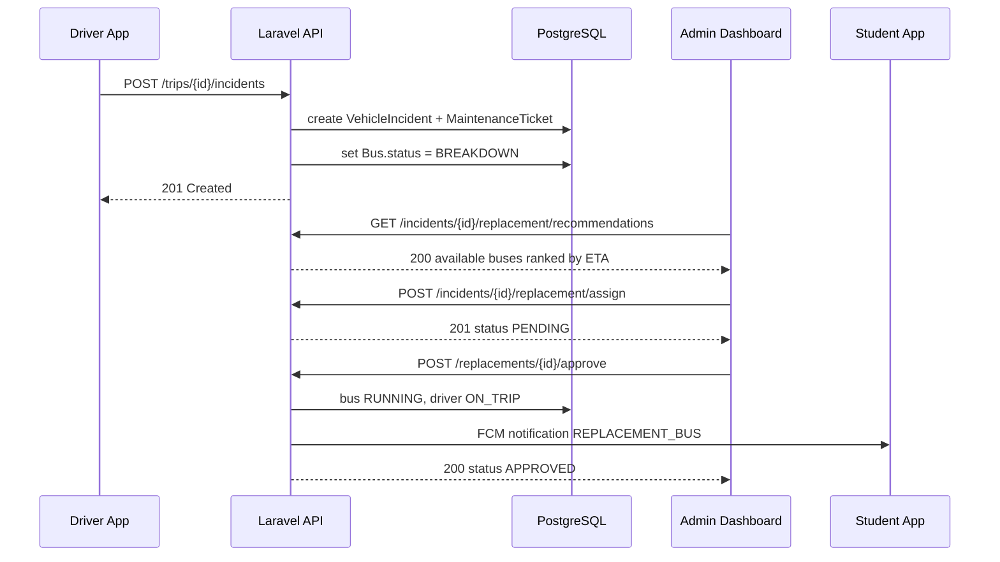

# CTMS REST API Specification

**Document:** 07 — REST API Specification
**System:** Campus Transport Management System (CTMS)
**Version:** 1.0
**Stack:** Laravel 12 REST API + Laravel Reverb (WebSockets), PostgreSQL, Redis, Google Maps (Routes/Places), Firebase Cloud Messaging, Docker + Nginx

---

## 1. Introduction

This document is the authoritative contract for the CTMS HTTP REST API consumed by the three client applications:

| Client | Technology | Primary Roles |
|--------|-----------|---------------|
| Student app | Flutter | `STUDENT` |
| Driver app | Flutter | `DRIVER` |
| Admin dashboard | Next.js / React | `ADMIN` |

The API is served by a Laravel 12 backend. Real-time streams (live GPS, ETA push, notifications) are delivered over **Laravel Reverb** WebSocket channels and are described in `08-realtime-websockets.md`; this document covers only the request/response REST surface. Each resource group below is mapped to its functional requirement (`FR-01` … `FR-15`).

---

## 2. Global Conventions

### 2.1 Base URL & Versioning

```
https://api.ctms.college.edu/api/v1
```

- All endpoints are prefixed with `/api/v1`.
- The version segment is mandatory. Breaking changes ship under `/api/v2`.
- All traffic is **HTTPS only** (enforced at Nginx; HTTP is 301-redirected).

### 2.2 Authentication (FR-01)

- Authentication uses **Laravel Sanctum** personal access tokens (Bearer tokens).
- Every protected request MUST include:

```
Authorization: Bearer <sanctum-token>
Accept: application/json
Content-Type: application/json
```

- Tokens carry an abilities/role claim (`ADMIN`, `DRIVER`, `STUDENT`) enforced by route middleware.
- Missing/invalid token → `401 Unauthorized`. Valid token but insufficient role → `403 Forbidden`.

### 2.3 Standard Request Headers

| Header | Required | Notes |
|--------|----------|-------|
| `Authorization` | Yes (except login) | `Bearer <token>` |
| `Accept` | Yes | Must be `application/json` |
| `Content-Type` | On write | `application/json` |
| `X-Device-Id` | Recommended | Device identifier for FCM token binding |
| `X-Idempotency-Key` | Optional | Deduplicates POSTs (GPS batch, passenger events) |

### 2.4 Success Envelope

All 2xx responses use a uniform envelope:

```json
{
  "success": true,
  "message": "Human-readable summary.",
  "data": { },
  "meta": null
}
```

- `data` holds the resource or collection.
- `meta` holds pagination or contextual metadata (null when not applicable).

### 2.5 Error Envelope

All 4xx/5xx responses use:

```json
{
  "success": false,
  "message": "Validation failed.",
  "error": {
    "code": "VALIDATION_ERROR",
    "details": { }
  }
}
```

| `error.code` | HTTP | Meaning |
|--------------|------|---------|
| `VALIDATION_ERROR` | 422 | Field validation failed (see 2.7) |
| `UNAUTHENTICATED` | 401 | Missing/invalid/expired token |
| `FORBIDDEN` | 403 | Role/ownership check failed |
| `NOT_FOUND` | 404 | Resource does not exist |
| `CONFLICT` | 409 | Business-rule conflict (e.g. bus already on trip) |
| `CAPACITY_EXCEEDED` | 422 | Passenger count would exceed bus capacity |
| `RATE_LIMITED` | 429 | Throttle exceeded |
| `SERVER_ERROR` | 500 | Unhandled server error |

### 2.6 HTTP Status Codes

| Code | Used for |
|------|----------|
| `200 OK` | Successful GET / PUT / PATCH / action |
| `201 Created` | Resource created via POST |
| `202 Accepted` | Async accepted (GPS batch buffered) |
| `204 No Content` | Successful DELETE / logout |
| `400 Bad Request` | Malformed JSON / bad query params |
| `401 Unauthorized` | Auth failure |
| `403 Forbidden` | Authorization failure |
| `404 Not Found` | Unknown resource |
| `409 Conflict` | Business-rule conflict |
| `422 Unprocessable Entity` | Validation / capacity errors |
| `429 Too Many Requests` | Throttled |
| `500 Internal Server Error` | Server fault |

### 2.7 Validation Error Format

`422` responses list per-field messages under `error.details`:

```json
{
  "success": false,
  "message": "The given data was invalid.",
  "error": {
    "code": "VALIDATION_ERROR",
    "details": {
      "email": ["The email field is required."],
      "capacity": ["The capacity must be at least 1."]
    }
  }
}
```

### 2.8 Pagination

List endpoints accept `page`, `perPage` (default `20`, max `100`), `sort`, and `filter[...]` query params. The `meta` block returns:

```json
{
  "success": true,
  "message": "OK",
  "data": [ ],
  "meta": {
    "pagination": {
      "page": 1,
      "perPage": 20,
      "total": 137,
      "totalPages": 7
    }
  }
}
```

Sorting example: `?sort=-createdAt,busNumber` (prefix `-` = descending).
Filtering example: `?filter[status]=RUNNING&filter[routeId]=<uuid>`.

### 2.9 Identifiers, Timestamps & Casing

- All primary keys are **UUID** strings.
- JSON payloads use **camelCase** field names (mapped to snake_case columns server-side).
- All timestamps are **ISO-8601 UTC** (e.g. `2026-07-10T08:15:30Z`).
- Monetary/decimal fields are returned as JSON numbers (fixed scale where noted).

### 2.10 Rate Limiting

| Bucket | Limit |
|--------|-------|
| Auth (`/auth/login`) | 10 / min / IP |
| GPS ingest (`/tracking/gps`) | 20 / min / trip (5–10 s cadence) |
| Default authenticated | 120 / min / user |

Throttle responses return `429` with headers `X-RateLimit-Limit`, `X-RateLimit-Remaining`, `Retry-After`.

### 2.11 Audit & Security

Every state-changing request is written to an immutable **audit log** (actor, role, IP, endpoint, entity, before/after). All approval actions (merge, replacement) record `approvedBy`.

---

## 3. Resource → FR Map

| Section | Resource Group | FR |
|---------|----------------|----|
| 4 | Authentication | FR-01 |
| 5 | Buses | FR-02 |
| 6 | Drivers | FR-03 |
| 7 | Students | FR-04 |
| 8 | Routes | FR-05 |
| 9 | Route Stops | FR-05 |
| 10 | Schedules | FR-05 / FR-06 |
| 11 | Trips (start/end) | FR-06 |
| 12 | Tracking (GPS) | FR-07 / FR-09 |
| 13 | Passengers | FR-08 |
| 14 | Incidents & SOS | FR-11 |
| 15 | Replacement Bus | FR-12 |
| 16 | Bus Consolidation (Merge) | FR-13 |
| 17 | Maintenance Tickets | FR-14 |
| 18 | Notifications | FR-10 |
| 19 | Reports & Analytics | FR-15 |

---

## 4. Authentication (FR-01)

| Method | Path | Role | Description |
|--------|------|------|-------------|
| POST | `/auth/login` | Public | Authenticate and issue Sanctum token |
| POST | `/auth/logout` | Any | Revoke current token |
| GET | `/auth/me` | Any | Return the authenticated user profile |
| POST | `/auth/refresh` | Any | Rotate token (revoke current, issue new) |
| POST | `/auth/change-password` | Any | Change password for current user |
| POST | `/auth/fcm-token` | Driver, Student | Register/refresh FCM device token |

**Business rules:** login is role-aware — the `role` returned drives which app features unlock. Inactive users (`isActive=false`) are rejected with `403`.

### 4.1 `POST /auth/login`

Request:

```json
{
  "email": "priya.driver@college.edu",
  "password": "S3cur3!pass",
  "deviceName": "pixel-7-driver-app"
}
```

Response `200`:

```json
{
  "success": true,
  "message": "Login successful.",
  "data": {
    "token": "142|9fA2c...redacted",
    "tokenType": "Bearer",
    "user": {
      "id": "a1f0c2d4-...-uuid",
      "firstName": "Priya",
      "lastName": "Nair",
      "email": "priya.driver@college.edu",
      "role": "DRIVER",
      "isActive": true,
      "lastLogin": "2026-07-10T07:59:11Z"
    }
  },
  "meta": null
}
```

Errors: `422` (missing fields), `401` (bad credentials → `error.code=UNAUTHENTICATED`), `403` (inactive account).

### 4.2 `GET /auth/me`

Response `200` (Driver example, role-specific fields merged from `User` + `Driver`):

```json
{
  "success": true,
  "message": "OK",
  "data": {
    "id": "a1f0c2d4-...-uuid",
    "firstName": "Priya",
    "lastName": "Nair",
    "email": "priya.driver@college.edu",
    "phone": "+91-9876500011",
    "role": "DRIVER",
    "employeeId": "DRV-2091",
    "assignedBusId": "b7e1...-uuid",
    "available": true,
    "status": "AVAILABLE"
  },
  "meta": null
}
```

### 4.3 `POST /auth/logout`

Revokes the current access token. Response `204 No Content`.

### 4.4 `POST /auth/refresh`

Response `200`:

```json
{
  "success": true,
  "message": "Token refreshed.",
  "data": { "token": "143|newToken...", "tokenType": "Bearer" },
  "meta": null
}
```

---

## 5. Buses (FR-02)

| Method | Path | Role | Description |
|--------|------|------|-------------|
| GET | `/buses` | Admin | List buses (filter by status/route) |
| POST | `/buses` | Admin | Create a bus |
| GET | `/buses/{id}` | Admin | Get bus detail |
| PUT | `/buses/{id}` | Admin | Update bus |
| PATCH | `/buses/{id}/status` | Admin | Update `BusStatus` |
| DELETE | `/buses/{id}` | Admin | Deactivate (soft) bus |
| POST | `/buses/{id}/assign-driver` | Admin | Assign a driver to the bus |
| POST | `/buses/{id}/assign-route` | Admin | Assign a route to the bus |
| GET | `/buses/available` | Admin | List buses eligible for assignment/replacement |

**Business rules:** a bus in `MAINTENANCE` or `BREAKDOWN` **cannot** be assigned to a driver/route/trip (`409 CONFLICT`). `capacity` must be ≥ 1. `busNumber` and `registrationNumber` are unique.

### 5.1 `POST /buses`

Request:

```json
{
  "busNumber": "CTMS-14",
  "registrationNumber": "TN09AB1234",
  "chassisNumber": "MB1234CHS9981",
  "engineNumber": "ENG778812",
  "manufacturer": "Tata",
  "model": "Starbus Ultra",
  "manufacturingYear": 2022,
  "capacity": 52,
  "fuelType": "DIESEL",
  "mileage": 6.40,
  "gpsEnabled": true,
  "gpsDeviceId": "GPS-DEV-0091",
  "insuranceExpiry": "2027-03-31",
  "permitExpiry": "2027-06-30"
}
```

Response `201`:

```json
{
  "success": true,
  "message": "Bus created.",
  "data": {
    "id": "b7e1...-uuid",
    "busNumber": "CTMS-14",
    "registrationNumber": "TN09AB1234",
    "capacity": 52,
    "currentPassengers": 0,
    "status": "AVAILABLE",
    "gpsEnabled": true,
    "createdAt": "2026-07-10T08:20:00Z"
  },
  "meta": null
}
```

### 5.2 `PATCH /buses/{id}/status`

Request:

```json
{ "status": "MAINTENANCE" }
```

Valid `BusStatus`: `AVAILABLE`, `RUNNING`, `MAINTENANCE`, `BREAKDOWN`, `OFFLINE`.
Attempting to set `RUNNING` on a bus without an active trip → `409 CONFLICT`.

---

## 6. Drivers (FR-03)

| Method | Path | Role | Description |
|--------|------|------|-------------|
| GET | `/drivers` | Admin | List drivers (filter by status/available) |
| POST | `/drivers` | Admin | Register a driver |
| GET | `/drivers/{id}` | Admin | Get driver detail |
| PUT | `/drivers/{id}` | Admin | Update driver |
| PATCH | `/drivers/{id}/status` | Admin | Update `DriverStatus` |
| DELETE | `/drivers/{id}` | Admin | Deactivate driver |
| POST | `/drivers/{id}/assign-bus` | Admin | Assign bus to driver |
| GET | `/drivers/available` | Admin | List drivers free for assignment |

**Business rules:** a driver already `ON_TRIP` cannot be assigned to a second active trip (`409`). Driver must have a non-expired `licenseExpiry`. Registering a driver creates the underlying `User` (role `DRIVER`) atomically.

### 6.1 `POST /drivers`

Request:

```json
{
  "firstName": "Priya",
  "lastName": "Nair",
  "email": "priya.driver@college.edu",
  "phone": "+91-9876500011",
  "gender": "Female",
  "dateOfBirth": "1990-05-14",
  "employeeId": "DRV-2091",
  "drivingLicenseNumber": "TN0920190001234",
  "licenseExpiry": "2029-05-14",
  "aadhaarNumber": "XXXXXXXX9012",
  "joiningDate": "2023-06-01",
  "emergencyContact": "+91-9876500099"
}
```

Response `201`:

```json
{
  "success": true,
  "message": "Driver registered.",
  "data": {
    "id": "a1f0c2d4-...-uuid",
    "employeeId": "DRV-2091",
    "role": "DRIVER",
    "available": true,
    "status": "AVAILABLE",
    "assignedBusId": null
  },
  "meta": null
}
```

---

## 7. Students (FR-04)

| Method | Path | Role | Description |
|--------|------|------|-------------|
| GET | `/students` | Admin | List students (filter by route/dept) |
| POST | `/students` | Admin | Register a student |
| GET | `/students/{id}` | Admin | Get student detail |
| PUT | `/students/{id}` | Admin | Update student |
| DELETE | `/students/{id}` | Admin | Deactivate student |
| POST | `/students/{id}/assign-route` | Admin | Assign route, bus & pickup stop |
| GET | `/students/me/bus` | Student | View own assigned bus (FR-10) |

**Business rules:** a student may `viewBus` only for their **own** assigned bus (`403` otherwise). `transportEnabled=false` students are excluded from trip notifications.

### 7.1 `POST /students/{id}/assign-route`

Request:

```json
{
  "routeId": "r33c...-uuid",
  "busId": "b7e1...-uuid",
  "pickupStopId": "s902...-uuid"
}
```

Response `200`:

```json
{
  "success": true,
  "message": "Route assigned to student.",
  "data": {
    "studentId": "STU-4471",
    "routeId": "r33c...-uuid",
    "busId": "b7e1...-uuid",
    "pickupStopId": "s902...-uuid",
    "transportEnabled": true
  },
  "meta": null
}
```

### 7.2 `GET /students/me/bus`

Response `200`:

```json
{
  "success": true,
  "message": "OK",
  "data": {
    "busId": "b7e1...-uuid",
    "busNumber": "CTMS-14",
    "routeName": "North Campus Loop",
    "pickupStopName": "Anna Nagar Gate",
    "activeTripId": "t551...-uuid",
    "tripStatus": "RUNNING"
  },
  "meta": null
}
```

---

## 8. Routes (FR-05)

| Method | Path | Role | Description |
|--------|------|------|-------------|
| GET | `/routes` | Admin, Student | List routes (Students see assigned only) |
| POST | `/routes` | Admin | Create a route |
| GET | `/routes/{id}` | Admin, Student | Get route with stops |
| PUT | `/routes/{id}` | Admin | Update route |
| DELETE | `/routes/{id}` | Admin | Deactivate route |

### 8.1 `POST /routes`

Request:

```json
{
  "routeCode": "NCL-01",
  "routeName": "North Campus Loop",
  "source": "Anna Nagar",
  "destination": "College Main Gate",
  "totalDistance": 18.6,
  "estimatedDuration": 55,
  "active": true
}
```

Response `201`:

```json
{
  "success": true,
  "message": "Route created.",
  "data": {
    "id": "r33c...-uuid",
    "routeCode": "NCL-01",
    "routeName": "North Campus Loop",
    "totalDistance": 18.6,
    "estimatedDuration": 55,
    "active": true
  },
  "meta": null
}
```

---

## 9. Route Stops (FR-05)

| Method | Path | Role | Description |
|--------|------|------|-------------|
| GET | `/routes/{routeId}/stops` | Admin, Student | List stops ordered by `sequence` |
| POST | `/routes/{routeId}/stops` | Admin | Add a stop |
| PUT | `/stops/{id}` | Admin | Update a stop |
| DELETE | `/stops/{id}` | Admin | Remove a stop |
| PATCH | `/routes/{routeId}/stops/reorder` | Admin | Reorder stop sequence |

**Business rules:** `sequence` is unique per route. `geofenceRadius` (meters) drives the "bus nearing stop" notification (FR-10) evaluated against live GPS.

### 9.1 `POST /routes/{routeId}/stops`

Request:

```json
{
  "stopName": "Anna Nagar Gate",
  "landmark": "Opposite Metro Station",
  "latitude": 13.0846,
  "longitude": 80.2101,
  "sequence": 1,
  "geofenceRadius": 120.0,
  "expectedArrival": "08:05:00"
}
```

Response `201`:

```json
{
  "success": true,
  "message": "Stop added.",
  "data": {
    "id": "s902...-uuid",
    "routeId": "r33c...-uuid",
    "stopName": "Anna Nagar Gate",
    "sequence": 1,
    "geofenceRadius": 120.0,
    "expectedArrival": "08:05:00"
  },
  "meta": null
}
```

---

## 10. Schedules (FR-05 / FR-06)

| Method | Path | Role | Description |
|--------|------|------|-------------|
| GET | `/schedules` | Admin | List schedules (filter route/day/bus) |
| POST | `/schedules` | Admin | Create a schedule |
| GET | `/schedules/{id}` | Admin | Get schedule detail |
| PUT | `/schedules/{id}` | Admin | Update schedule |
| DELETE | `/schedules/{id}` | Admin | Deactivate schedule |

### 10.1 `POST /schedules`

Request:

```json
{
  "routeId": "r33c...-uuid",
  "busId": "b7e1...-uuid",
  "dayOfWeek": "MONDAY",
  "departureTime": "08:00:00",
  "arrivalTime": "08:55:00",
  "active": true
}
```

Response `201`:

```json
{
  "success": true,
  "message": "Schedule created.",
  "data": {
    "id": "sc71...-uuid",
    "routeId": "r33c...-uuid",
    "busId": "b7e1...-uuid",
    "dayOfWeek": "MONDAY",
    "departureTime": "08:00:00",
    "arrivalTime": "08:55:00",
    "active": true
  },
  "meta": null
}
```

**Business rule:** the assigned bus must not be in `MAINTENANCE`/`BREAKDOWN` at schedule activation (`409`).

---

## 11. Trips (FR-06)

| Method | Path | Role | Description |
|--------|------|------|-------------|
| GET | `/trips` | Admin | List trips (filter date/status/route) |
| POST | `/trips` | Admin | Create a daily trip from a schedule |
| GET | `/trips/{id}` | Admin, Driver, Student | Get trip detail |
| GET | `/trips/today` | Driver | Driver's trips for today |
| POST | `/trips/{id}/start` | Driver | Start trip (begins GPS tracking) |
| POST | `/trips/{id}/end` | Driver | End trip (finalizes counts & report) |
| PATCH | `/trips/{id}/cancel` | Admin | Cancel a scheduled trip |

**Business rules:**
- Only **one active driver per bus** during a trip. Starting a trip on a bus that already has a `RUNNING` trip → `409 CONFLICT`.
- A trip cannot be started on a bus in `MAINTENANCE`/`BREAKDOWN` → `409`.
- `POST /start` transitions `TripStatus` `SCHEDULED → RUNNING`, sets `Bus.status=RUNNING`, `Driver.status=ON_TRIP`, and emits the `trip started` notification (FR-10).
- `POST /end` transitions `RUNNING → COMPLETED`, sets `Bus.status=AVAILABLE`, `Driver.status=AVAILABLE`, computes `averageSpeed`/`delayMinutes`, and emits `trip completed`.

### 11.1 `POST /trips`

Request:

```json
{
  "scheduleId": "sc71...-uuid",
  "busId": "b7e1...-uuid",
  "driverId": "a1f0...-uuid",
  "routeId": "r33c...-uuid",
  "tripDate": "2026-07-10"
}
```

Response `201`:

```json
{
  "success": true,
  "message": "Trip created.",
  "data": {
    "id": "t551...-uuid",
    "status": "SCHEDULED",
    "tripDate": "2026-07-10",
    "passengerCount": 0
  },
  "meta": null
}
```

### 11.2 `POST /trips/{id}/start`

Request:

```json
{ "latitude": 13.0846, "longitude": 80.2101, "odometer": 45210 }
```

Response `200`:

```json
{
  "success": true,
  "message": "Trip started.",
  "data": {
    "id": "t551...-uuid",
    "status": "RUNNING",
    "startTime": "2026-07-10T08:01:12Z",
    "busStatus": "RUNNING",
    "driverStatus": "ON_TRIP"
  },
  "meta": null
}
```

Errors: `409 CONFLICT` (bus already running / in maintenance), `403` (driver not assigned to this trip).

### 11.3 `POST /trips/{id}/end`

Response `200`:

```json
{
  "success": true,
  "message": "Trip completed.",
  "data": {
    "id": "t551...-uuid",
    "status": "COMPLETED",
    "startTime": "2026-07-10T08:01:12Z",
    "endTime": "2026-07-10T08:57:40Z",
    "passengerCount": 0,
    "averageSpeed": 24.6,
    "delayMinutes": 3
  },
  "meta": null
}
```

---

## 12. Tracking — Live GPS (FR-07 / FR-09)

| Method | Path | Role | Description |
|--------|------|------|-------------|
| POST | `/trips/{id}/tracking/gps` | Driver | Ingest GPS point(s) (5–10 s cadence) |
| GET | `/trips/{id}/tracking/latest` | Admin, Student | Latest known location + ETA |
| GET | `/trips/{id}/tracking/history` | Admin | Full location breadcrumb trail |
| GET | `/trips/{id}/eta` | Student, Admin | ETA to student's stop (Routes API) |

**Business rules:**
- GPS ingest accepts a **batch** to support offline buffering + auto-sync (NFR reliability). Buffered points carry their original `timestamp`.
- Accepted points are written to `TripLocation`, cached in Redis (`trip:{id}:location`), and broadcast on the Reverb channel `trip.{id}` (see `08-realtime-websockets.md`).
- ETA is computed via **Google Maps Routes API** from the latest point to the student's `pickupStopId`; results are cached in Redis (TTL 15 s) to stay within API quotas.
- Students may query tracking **only for their assigned bus's active trip** (`403` otherwise).

### 12.1 `POST /trips/{id}/tracking/gps`

Request (batch, offline-buffered):

```json
{
  "points": [
    { "latitude": 13.0851, "longitude": 80.2109, "speed": 22.4, "heading": 210.0, "accuracy": 6.0, "timestamp": "2026-07-10T08:10:05Z" },
    { "latitude": 13.0860, "longitude": 80.2118, "speed": 25.1, "heading": 208.0, "accuracy": 5.5, "timestamp": "2026-07-10T08:10:12Z" }
  ]
}
```

Response `202 Accepted`:

```json
{
  "success": true,
  "message": "2 location points accepted.",
  "data": { "acceptedCount": 2, "rejectedCount": 0, "lastTimestamp": "2026-07-10T08:10:12Z" },
  "meta": null
}
```

### 12.2 `GET /trips/{id}/tracking/latest`

Response `200`:

```json
{
  "success": true,
  "message": "OK",
  "data": {
    "tripId": "t551...-uuid",
    "latitude": 13.0860,
    "longitude": 80.2118,
    "speed": 25.1,
    "heading": 208.0,
    "timestamp": "2026-07-10T08:10:12Z",
    "nextStop": { "stopName": "Koyambedu Junction", "etaMinutes": 6 }
  },
  "meta": null
}
```

### 12.3 `GET /trips/{id}/eta`

Response `200`:

```json
{
  "success": true,
  "message": "OK",
  "data": {
    "tripId": "t551...-uuid",
    "destinationStopId": "s915...-uuid",
    "etaMinutes": 12,
    "distanceRemaining": 4.8,
    "source": "google-routes-api",
    "calculatedAt": "2026-07-10T08:10:13Z"
  },
  "meta": null
}
```

---

## 13. Passengers (FR-08)

| Method | Path | Role | Description |
|--------|------|------|-------------|
| POST | `/trips/{id}/passengers/increment` | Driver | Board +1 |
| POST | `/trips/{id}/passengers/decrement` | Driver | Exit −1 |
| GET | `/trips/{id}/passengers/log` | Admin, Driver | Passenger event log |
| GET | `/trips/{id}/passengers/count` | Admin, Driver, Student | Current count |

**Business rules:**
- `increment` fails with `422 CAPACITY_EXCEEDED` when `currentPassengers + 1 > Bus.capacity` — passenger count must **never** exceed capacity.
- `decrement` clamps at `0` (cannot go negative → `409 CONFLICT` if count is already 0).
- Each accepted action writes a `PassengerLog` row (`action` = `Board`/`Exit`, `countAfterAction`) and updates `Trip.passengerCount` and `Bus.currentPassengers` atomically.
- Send `X-Idempotency-Key` to prevent double counting on retries.

### 13.1 `POST /trips/{id}/passengers/increment`

Response `200`:

```json
{
  "success": true,
  "message": "Passenger boarded.",
  "data": {
    "tripId": "t551...-uuid",
    "action": "Board",
    "countAfterAction": 31,
    "capacity": 52,
    "timestamp": "2026-07-10T08:06:41Z"
  },
  "meta": null
}
```

Capacity error `422`:

```json
{
  "success": false,
  "message": "Passenger count would exceed bus capacity.",
  "error": { "code": "CAPACITY_EXCEEDED", "details": { "capacity": 52, "current": 52 } }
}
```

---

## 14. Incidents & SOS (FR-11)

| Method | Path | Role | Description |
|--------|------|------|-------------|
| GET | `/incidents` | Admin | List incidents (filter status/bus) |
| POST | `/trips/{id}/incidents` | Driver | Report a vehicle incident |
| GET | `/incidents/{id}` | Admin, Driver | Get incident detail |
| PATCH | `/incidents/{id}/status` | Admin | Update incident status |
| POST | `/trips/{id}/sos` | Driver | Send emergency SOS alert |

**Business rules:**
- `issueType` ∈ {`BREAKDOWN`, `ACCIDENT`, `TYRE_PUNCTURE`, `ENGINE_ISSUE`, `BATTERY_ISSUE`}.
- **Every incident automatically creates a `MaintenanceTicket`** (FR-14) in the same transaction.
- A `BREAKDOWN`/`ACCIDENT` incident sets `Bus.status=BREAKDOWN` and triggers the **replacement bus** recommendation workflow (FR-12).
- SOS immediately notifies Admin + Transport Department via FCM and broadcasts on Reverb; it is high-priority and rate-limit exempt.

### 14.1 `POST /trips/{id}/incidents`

Request:

```json
{
  "busId": "b7e1...-uuid",
  "issueType": "TYRE_PUNCTURE",
  "severity": "HIGH",
  "description": "Rear-left tyre blown near Koyambedu flyover.",
  "imageUrl": "https://cdn.ctms.college.edu/incidents/abc.jpg",
  "latitude": 13.0712,
  "longitude": 80.1998
}
```

Response `201`:

```json
{
  "success": true,
  "message": "Incident reported. Maintenance ticket created.",
  "data": {
    "id": "i701...-uuid",
    "tripId": "t551...-uuid",
    "busId": "b7e1...-uuid",
    "issueType": "TYRE_PUNCTURE",
    "severity": "HIGH",
    "status": "OPEN",
    "reportedAt": "2026-07-10T08:22:10Z",
    "maintenanceTicketId": "m880...-uuid",
    "busStatus": "BREAKDOWN"
  },
  "meta": null
}
```

### 14.2 `POST /trips/{id}/sos`

Request:

```json
{ "latitude": 13.0712, "longitude": 80.1998, "note": "Need immediate assistance." }
```

Response `201`:

```json
{
  "success": true,
  "message": "SOS dispatched to Transport Department.",
  "data": { "sosId": "sos12...-uuid", "notifiedRoles": ["ADMIN"], "dispatchedAt": "2026-07-10T08:22:15Z" },
  "meta": null
}
```

---

## 15. Replacement Bus (FR-12)

| Method | Path | Role | Description |
|--------|------|------|-------------|
| GET | `/incidents/{id}/replacement/recommendations` | Admin | System-recommended available replacement buses |
| POST | `/incidents/{id}/replacement/assign` | Admin | Create a replacement assignment (pending) |
| POST | `/replacements/{id}/approve` | Admin | Approve replacement assignment |
| POST | `/replacements/{id}/reject` | Admin | Reject replacement assignment |
| GET | `/replacements/{id}` | Admin | Get replacement assignment detail |

**Business rules:**
- Recommendations list only buses with `status=AVAILABLE` and free drivers (`DriverStatus=AVAILABLE`), ranked by proximity/ETA.
- A replacement **requires admin approval** — assignment is created in `PENDING` and only takes effect on approve.
- On approval: replacement bus → `RUNNING`, replacement driver → `ON_TRIP`, students on the affected route receive a `replacement bus` notification (FR-10).

### 15.1 `GET /incidents/{id}/replacement/recommendations`

Response `200`:

```json
{
  "success": true,
  "message": "OK",
  "data": [
    {
      "busId": "b920...-uuid",
      "busNumber": "CTMS-22",
      "capacity": 52,
      "driverId": "d340...-uuid",
      "driverName": "Ravi Kumar",
      "etaMinutes": 9,
      "distanceKm": 3.1
    }
  ],
  "meta": null
}
```

### 15.2 `POST /incidents/{id}/replacement/assign`

Request:

```json
{
  "replacementBusId": "b920...-uuid",
  "replacementDriverId": "d340...-uuid",
  "etaMinutes": 9
}
```

Response `201`:

```json
{
  "success": true,
  "message": "Replacement assignment created (pending approval).",
  "data": {
    "id": "ra55...-uuid",
    "incidentId": "i701...-uuid",
    "replacementBusId": "b920...-uuid",
    "replacementDriverId": "d340...-uuid",
    "etaMinutes": 9,
    "status": "PENDING",
    "assignedAt": "2026-07-10T08:24:00Z"
  },
  "meta": null
}
```

### 15.3 `POST /replacements/{id}/approve`

Response `200`:

```json
{
  "success": true,
  "message": "Replacement approved and dispatched.",
  "data": { "id": "ra55...-uuid", "status": "APPROVED", "approvedBy": "adm01...-uuid" },
  "meta": null
}
```

---

## 16. Bus Consolidation — Merge (FR-13)

| Method | Path | Role | Description |
|--------|------|------|-------------|
| GET | `/merge/recommendations` | Admin | List low-occupancy merge recommendations |
| POST | `/merge/recommendations/generate` | Admin | Trigger merge analysis for active trips |
| GET | `/merge/recommendations/{id}` | Admin | Get merge recommendation detail |
| POST | `/merge/recommendations/{id}/approve` | Admin | Approve merge |
| POST | `/merge/recommendations/{id}/reject` | Admin | Reject merge |

**Business rules:**
- The system recommends merging two low-occupancy trips when `sourcePassengers + targetPassengers ≤ targetBus.capacity`, estimating `estimatedFuelSaved` and `distanceIncrease`.
- Merge **requires admin approval** — status flows `PENDING → APPROVED`/`REJECTED`.
- On approval, source-trip students are reassigned and receive a `route changes` notification (FR-10); the source trip is cancelled.

### 16.1 `GET /merge/recommendations`

Response `200`:

```json
{
  "success": true,
  "message": "OK",
  "data": [
    {
      "id": "mr09...-uuid",
      "sourceTripId": "t551...-uuid",
      "targetTripId": "t552...-uuid",
      "sourcePassengers": 8,
      "targetPassengers": 21,
      "mergedPassengers": 29,
      "estimatedFuelSaved": 3.75,
      "distanceIncrease": 2.10,
      "status": "PENDING"
    }
  ],
  "meta": { "pagination": { "page": 1, "perPage": 20, "total": 1, "totalPages": 1 } }
}
```

### 16.2 `POST /merge/recommendations/{id}/approve`

Response `200`:

```json
{
  "success": true,
  "message": "Merge approved. Source trip consolidated.",
  "data": { "id": "mr09...-uuid", "status": "APPROVED", "approvedBy": "adm01...-uuid" },
  "meta": null
}
```

---

## 17. Maintenance Tickets (FR-14)

| Method | Path | Role | Description |
|--------|------|------|-------------|
| GET | `/maintenance/tickets` | Admin | List tickets (filter status/bus) |
| GET | `/maintenance/tickets/{id}` | Admin | Get ticket detail |
| PATCH | `/maintenance/tickets/{id}` | Admin | Update ticket (technician/status/cost) |
| POST | `/maintenance/tickets/{id}/close` | Admin | Close ticket & return bus to service |

**Business rules:**
- Tickets are **auto-created from incidents** (FR-11) — there is no manual create endpoint.
- Closing a ticket sets `repairEnd` and, if no other open tickets exist for the bus, transitions `Bus.status` from `MAINTENANCE`/`BREAKDOWN` back to `AVAILABLE`.

### 17.1 `PATCH /maintenance/tickets/{id}`

Request:

```json
{
  "assignedTechnician": "Suresh (Bay 3)",
  "status": "IN_PROGRESS",
  "repairStart": "2026-07-10T09:00:00Z",
  "estimatedCost": 4200.00,
  "remarks": "Tyre replacement + alignment."
}
```

Response `200`:

```json
{
  "success": true,
  "message": "Ticket updated.",
  "data": {
    "id": "m880...-uuid",
    "ticketNumber": "MT-2026-0091",
    "incidentId": "i701...-uuid",
    "busId": "b7e1...-uuid",
    "status": "IN_PROGRESS",
    "estimatedCost": 4200.00
  },
  "meta": null
}
```

---

## 18. Notifications (FR-10)

| Method | Path | Role | Description |
|--------|------|------|-------------|
| GET | `/notifications` | Any | List notifications for current user |
| GET | `/notifications/unread-count` | Any | Count of unread notifications |
| PATCH | `/notifications/{id}/read` | Any | Mark one as read |
| PATCH | `/notifications/read-all` | Any | Mark all as read |
| GET | `/announcements` | Any | List active announcements |
| POST | `/announcements` | Admin | Publish an announcement |

**Notification `type` values (FR-10):** `TRIP_STARTED`, `BUS_NEARING_STOP`, `DELAY`, `ROUTE_CHANGE`, `REPLACEMENT_BUS`, `TRIP_COMPLETED`. Delivery is via **Firebase Cloud Messaging** push plus in-app persistence in the `Notification` table; only the target `receiverId` may read their notifications.

### 18.1 `GET /notifications`

Response `200`:

```json
{
  "success": true,
  "message": "OK",
  "data": [
    {
      "id": "n771...-uuid",
      "title": "Bus nearing your stop",
      "message": "CTMS-14 is 2 minutes from Anna Nagar Gate.",
      "type": "BUS_NEARING_STOP",
      "isRead": false,
      "sentAt": "2026-07-10T08:03:50Z"
    }
  ],
  "meta": { "pagination": { "page": 1, "perPage": 20, "total": 5, "totalPages": 1 } }
}
```

### 18.2 `POST /announcements`

Request:

```json
{
  "title": "Route NCL-01 diverted tomorrow",
  "description": "Roadwork on Anna Nagar main road; pickup shifts to Gate 2.",
  "audience": "STUDENTS",
  "publishAt": "2026-07-10T18:00:00Z",
  "expireAt": "2026-07-12T00:00:00Z"
}
```

Response `201`:

```json
{
  "success": true,
  "message": "Announcement published.",
  "data": { "id": "an33...-uuid", "audience": "STUDENTS", "publishAt": "2026-07-10T18:00:00Z" },
  "meta": null
}
```

---

## 19. Reports & Analytics (FR-15)

| Method | Path | Role | Description |
|--------|------|------|-------------|
| GET | `/reports/trips` | Admin | Trip summary report (date range) |
| GET | `/reports/occupancy` | Admin | Average occupancy per route/bus |
| GET | `/reports/incidents` | Admin | Incident frequency by type/bus |
| GET | `/reports/fuel-savings` | Admin | Estimated fuel saved from merges |
| GET | `/reports/maintenance` | Admin | Maintenance cost & downtime |
| GET | `/reports/analytics/dashboard` | Admin | Aggregate KPIs for dashboard |

All report endpoints accept `from`, `to` (ISO dates), optional `routeId`/`busId` filters, and `format=json|csv` (default `json`).

### 19.1 `GET /reports/analytics/dashboard`

Response `200`:

```json
{
  "success": true,
  "message": "OK",
  "data": {
    "period": { "from": "2026-07-01", "to": "2026-07-10" },
    "totalTrips": 412,
    "completedTrips": 401,
    "cancelledTrips": 11,
    "avgOccupancyPct": 63.4,
    "onTimePct": 88.2,
    "incidents": { "total": 7, "breakdown": 2, "tyrePuncture": 3, "other": 2 },
    "estimatedFuelSavedLitres": 148.5,
    "activeBuses": 22,
    "busesInMaintenance": 3
  },
  "meta": null
}
```

### 19.2 `GET /reports/occupancy`

Response `200`:

```json
{
  "success": true,
  "message": "OK",
  "data": [
    { "routeCode": "NCL-01", "routeName": "North Campus Loop", "avgPassengers": 29.4, "capacity": 52, "utilizationPct": 56.5 }
  ],
  "meta": null
}
```

---

## 20. End-to-End API Sequence (Incident → Replacement)



---

## 21. Standard Endpoint Behavior Summary

| Concern | Rule |
|---------|------|
| Auth | Bearer Sanctum token on all except `/auth/login` |
| Envelope | `success` + `data`/`error` on every response |
| Pagination | `page`/`perPage` on all list endpoints |
| Validation | `422` with `error.details` per field |
| Capacity cap | Enforced on passenger increment (FR-08) |
| Single active driver | Enforced on trip start (FR-06) |
| No-assign-in-maintenance | Enforced on bus/driver/trip assignment (FR-02/06) |
| Approval gates | Merge (FR-13) & Replacement (FR-12) require admin approval |
| Auto-maintenance | Every incident creates a ticket (FR-14) |
| Audit | All writes + approvals logged |

---

## Cross-references

- `02-srs.md` — full software requirements specification and FR definitions.
- `03-domain-model.md` — entity/attribute/enum reference used by these payloads.
- `04-database-schema.md` — PostgreSQL tables (snake_case column mapping).
- `05-architecture.md` — service boundaries, Redis caching, Nginx routing.
- `06-authentication-authorization.md` — Sanctum tokens, roles, audit logging.
- `08-realtime-websockets.md` — Laravel Reverb channels for GPS, ETA and notifications.
- `09-notifications-fcm.md` — Firebase Cloud Messaging payloads and topics.
- `10-reports-analytics.md` — report definitions and KPI formulas.
