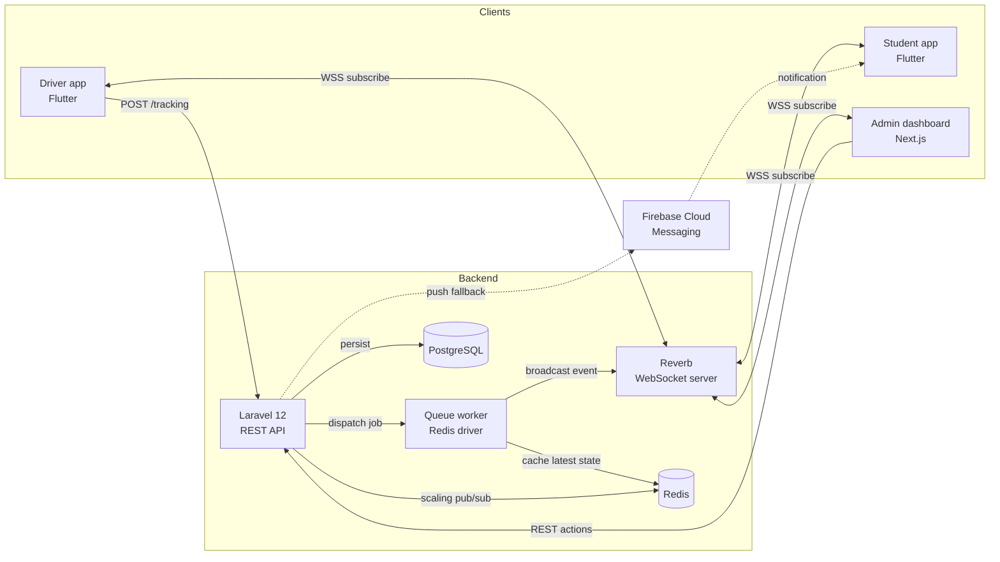
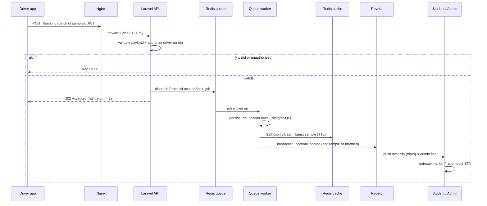
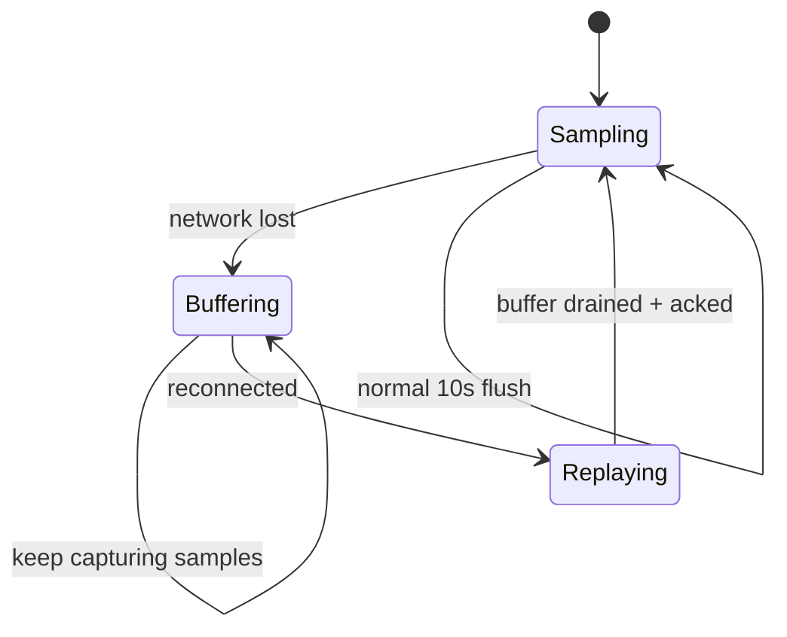
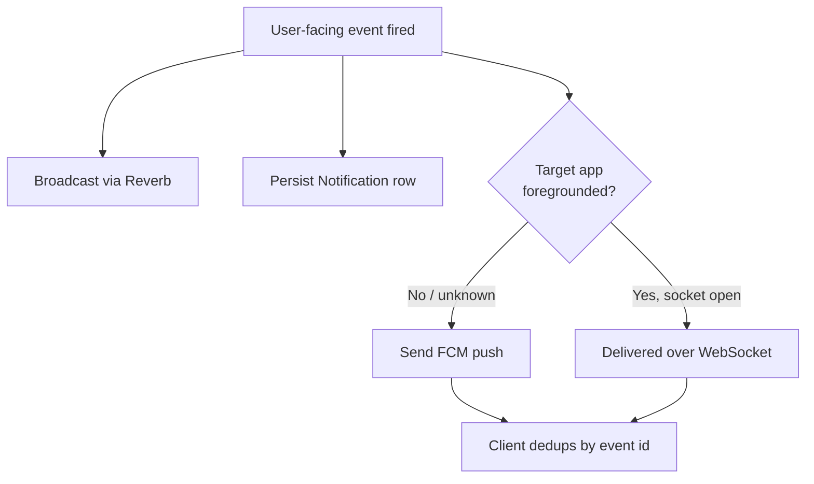

# Realtime & WebSocket Events

**Campus Transport Management System (CTMS) — Engineering Documentation Suite**
**Document 08 — Realtime & WebSocket Events**
**Version 1.0**

---

## 1. Purpose & Scope

CTMS is a live system. The core value — students watching their bus crawl toward
their stop, admins staring at a moving fleet, drivers firing an SOS — collapses if
data arrives late or unreliably. This document specifies the realtime transport
layer that carries these events: the **Laravel Reverb** WebSocket server, the
channel topology and authorization model, the full event contract, and the GPS
ingestion pipeline from driver device to subscriber screen.

It covers:

- Reverb server design and the broadcasting stack (Laravel 12 → Redis → Reverb → clients).
- The **channel catalog** with private/presence authorization rules.
- The **event contract** — every broadcast event, its channel, trigger, and payload schema.
- GPS ingest sequence, the **5–10s cadence**, client-side **batching**, **offline buffering + replay**, and **FCM push fallback** when the app is backgrounded.

This document realizes the realtime portions of **FR-07** (Live GPS Tracking),
**FR-08** (Passenger Counter), **FR-09** (ETA), **FR-10** (Notifications),
**FR-11** (Vehicle Incident), **FR-12** (Replacement Bus), and **FR-13** (Smart
Bus Consolidation).

---

## 2. Broadcasting Architecture

### 2.1 Component Overview



### 2.2 Why Reverb

Laravel Reverb is a first-party WebSocket server speaking the **Pusher protocol**,
so Laravel's `broadcast()` helper, `Echo` clients, and channel authorization work
out of the box. It runs as a long-lived process behind Nginx (WSS termination),
scales horizontally using Redis as its pub/sub backplane, and supports private and
presence channels with signed authorization — exactly the primitives CTMS needs.

### 2.3 Broadcasting Flow (server side)

1. A controller or job creates a domain event implementing `ShouldBroadcast`.
2. The event is pushed onto the **Redis queue** (`broadcast` queue) so the HTTP
   request returns fast (NFR: API response < 2s).
3. A queue worker serializes the event's `broadcastWith()` payload and publishes
   it to Reverb over the Pusher protocol.
4. Reverb fans the message out to every authorized subscriber of the target channel.

> All broadcast events are **queued** (`ShouldBroadcast`, not
> `ShouldBroadcastNow`) except `SosRaised`, which is dispatched synchronously to
> minimize latency on a safety-critical path.

### 2.4 Connection & Deployment Facts

| Concern | Decision |
| --- | --- |
| Transport | WebSocket over TLS (`wss://`) terminated at Nginx |
| Protocol | Pusher protocol (Reverb native) |
| Client libraries | `laravel-echo` + `pusher-js` (Next.js); `pusher_client` / `laravel_echo` equivalents (Flutter) |
| Horizontal scaling | Reverb `REVERB_SCALING_ENABLED=true` with Redis pub/sub backplane |
| Auth endpoint | `POST /broadcasting/auth` (Sanctum/JWT guarded) |
| Heartbeat | Pusher ping/pong; client reconnect with exponential backoff |
| Max message size | 10 KB (payloads are intentionally small — see batching) |

---

## 3. Channel Catalog

All CTMS channels are **private** or **presence** — there are no public channels,
because every payload is scoped to a route, trip, or user. Authorization is
resolved in `routes/channels.php` and enforced against the authenticated user's
role and ownership. This satisfies the business rule *"students can only view
their assigned bus"* and the security requirement for role-based authorization.

| Channel | Type | Subscribers | Authorization rule |
| --- | --- | --- | --- |
| `trip.{tripId}` | Private | Students on the trip's route, the trip's driver, admins | User is a Student whose `busId`/`routeId` matches the trip, OR the assigned Driver, OR any Admin |
| `student.{studentId}` | Private | One student | `auth()->id()` maps to the Student and `studentId` matches |
| `driver.{driverId}` | Private | One driver | `auth()->id()` maps to the Driver and `driverId` matches |
| `admin.fleet` | Presence | All admins | User role is `ADMIN` |

### 3.1 Channel Semantics

- **`trip.{tripId}`** — the workhorse. Carries live location, ETA-affecting
  events, passenger count changes, and lifecycle events for a single active trip.
  A student's app subscribes only to the trip bound to their `busId`; it never
  learns the `tripId` of another route.
- **`student.{studentId}`** — the personal, per-student delivery channel for
  targeted notifications (nearing *your* stop, *your* replacement bus). Mirrors
  the `Notification.receiverId` relationship.
- **`driver.{driverId}`** — server → driver directives: merge decisions,
  replacement assignments, admin acknowledgement of an SOS.
- **`admin.fleet`** — a **presence** channel so the dashboard also gets a live
  roster of which admins are currently monitoring. Receives a firehose of
  fleet-wide events (every location update, every incident, every recommendation).

### 3.2 Authorization Definitions (illustrative)

```php
// routes/channels.php
Broadcast::channel('trip.{tripId}', function (User $user, string $tripId) {
    $trip = Trip::findOrFail($tripId);
    if ($user->role === UserRole::ADMIN) return true;
    if ($user->role === UserRole::DRIVER) return $user->driver?->id === $trip->driverId;
    return $user->student?->busId === $trip->busId; // Student on this bus
});

Broadcast::channel('student.{studentId}', fn (User $u, string $id) => $u->student?->id === $id);
Broadcast::channel('driver.{driverId}',   fn (User $u, string $id) => $u->driver?->id === $id);

Broadcast::channel('admin.fleet', function (User $user) {
    return $user->role === UserRole::ADMIN
        ? ['id' => $user->id, 'name' => $user->firstName.' '.$user->lastName]
        : false; // presence payload
});
```

---

## 4. Event Contract

Every broadcast event below implements `ShouldBroadcast`. `broadcastAs()` sets the
public event name (the string clients bind to); `broadcastWith()` defines the
payload. Timestamps are ISO-8601 UTC. IDs are UUIDs matching the domain model.

### 4.1 Event Reference Table

| Event (`broadcastAs`) | Channel(s) | Trigger | FR |
| --- | --- | --- | --- |
| `LocationUpdated` | `trip.{tripId}`, `admin.fleet` | Driver GPS sample ingested via `POST /tracking` | FR-07 |
| `TripStarted` | `trip.{tripId}`, `admin.fleet` | Driver taps **Start Trip**; `Trip.status → RUNNING` | FR-06, FR-10 |
| `NearingStop` | `trip.{tripId}`, `student.{studentId}` | Bus enters a `RouteStop.geofenceRadius` for an upcoming stop | FR-10 |
| `DelayDetected` | `trip.{tripId}`, `admin.fleet` | ETA vs `expectedArrival` exceeds delay threshold | FR-09, FR-10 |
| `RouteChanged` | `trip.{tripId}`, `admin.fleet` | Admin edits the active route/stop sequence | FR-05, FR-10 |
| `ReplacementAssigned` | `trip.{tripId}`, `student.{studentId}`, `driver.{driverId}` | Admin approves a `ReplacementAssignment` | FR-12, FR-10 |
| `TripCompleted` | `trip.{tripId}`, `admin.fleet` | Driver taps **End Trip**; `Trip.status → COMPLETED` | FR-06, FR-10, FR-15 |
| `MergeRecommended` | `admin.fleet` | System generates a `BusMergeRecommendation` | FR-13 |
| `SosRaised` | `admin.fleet`, `driver.{driverId}` | Driver taps **SOS** | FR-11 |
| `PassengerCountChanged` | `trip.{tripId}`, `admin.fleet` | Driver taps **+1 / -1**; `PassengerLog` written | FR-08 |

### 4.2 Payload Schemas

**`LocationUpdated`**

| Field | Type | Notes |
| --- | --- | --- |
| `tripId` | uuid | FK Trip |
| `busId` | uuid | FK Bus |
| `latitude` | double | |
| `longitude` | double | |
| `speed` | double | km/h, from `TripLocation.speed` |
| `heading` | double | degrees 0–359 |
| `accuracy` | double | metres |
| `timestamp` | iso-8601 | device sample time |

**`TripStarted`**

| Field | Type | Notes |
| --- | --- | --- |
| `tripId` | uuid | |
| `busId` / `driverId` / `routeId` | uuid | assigned entities |
| `routeName` | string | denormalized for display |
| `startTime` | iso-8601 | |
| `status` | enum | `RUNNING` |

**`NearingStop`**

| Field | Type | Notes |
| --- | --- | --- |
| `tripId` | uuid | |
| `stopId` | uuid | FK RouteStop entered geofence |
| `stopName` | string | |
| `sequence` | int | stop order |
| `etaMinutes` | int | from FR-09 |
| `distanceMeters` | double | bus → stop |

**`DelayDetected`**

| Field | Type | Notes |
| --- | --- | --- |
| `tripId` | uuid | |
| `delayMinutes` | int | `Trip.delayMinutes` |
| `affectedStopId` | uuid | next impacted stop |
| `reason` | string\|null | e.g. `traffic` |
| `newEtaMinutes` | int | recomputed ETA |

**`RouteChanged`**

| Field | Type | Notes |
| --- | --- | --- |
| `tripId` | uuid | |
| `routeId` | uuid | |
| `changeType` | enum | `STOP_ADDED` / `STOP_REMOVED` / `RESEQUENCED` |
| `message` | string | human-readable summary |
| `revisedStops` | array | `[{stopId, stopName, sequence}]` |

**`ReplacementAssigned`**

| Field | Type | Notes |
| --- | --- | --- |
| `tripId` | uuid | trip being rescued |
| `incidentId` | uuid | FK VehicleIncident |
| `replacementBusId` | uuid | |
| `replacementBusNumber` | string | display |
| `replacementDriverId` | uuid | |
| `etaMinutes` | int | `ReplacementAssignment.etaMinutes` |
| `status` | enum | assignment status |

**`TripCompleted`**

| Field | Type | Notes |
| --- | --- | --- |
| `tripId` | uuid | |
| `endTime` | iso-8601 | |
| `passengerCount` | int | final |
| `averageSpeed` | double | |
| `delayMinutes` | int | final |
| `status` | enum | `COMPLETED` |

**`MergeRecommended`**

| Field | Type | Notes |
| --- | --- | --- |
| `recommendationId` | uuid | FK BusMergeRecommendation |
| `sourceTripId` / `targetTripId` | uuid | |
| `sourcePassengers` / `targetPassengers` | int | |
| `mergedPassengers` | int | must be ≤ target bus capacity |
| `estimatedFuelSaved` | decimal | litres |
| `distanceIncrease` | decimal | km |
| `status` | enum | `PENDING` |

**`SosRaised`**

| Field | Type | Notes |
| --- | --- | --- |
| `incidentId` | uuid\|null | if incident created |
| `tripId` | uuid | |
| `busId` / `driverId` | uuid | |
| `latitude` / `longitude` | double | last known position |
| `severity` | enum | |
| `reportedAt` | iso-8601 | |

**`PassengerCountChanged`**

| Field | Type | Notes |
| --- | --- | --- |
| `tripId` | uuid | |
| `action` | enum | `Board` / `Exit` |
| `countAfterAction` | int | never exceeds `Bus.capacity` |
| `capacity` | int | for occupancy % on dashboard |
| `timestamp` | iso-8601 | |

> **Business-rule guard:** the API rejects a `Board` action if
> `countAfterAction > Bus.capacity` **before** any event is broadcast, so
> subscribers never see an over-capacity count.

---

## 5. GPS Ingestion Pipeline

The dominant realtime traffic is GPS. Hundreds of buses each emitting a sample
every 5–10 seconds must be validated, persisted, cached, and fanned out without
blocking the HTTP request or overwhelming subscribers.

### 5.1 End-to-End Sequence



### 5.2 Cadence (5–10s)

The driver device samples GPS every **5–10 seconds** (NFR + FR-07). This interval
balances freshness against battery drain and server load. The backend treats the
device timestamp as authoritative for ordering; out-of-order samples (older than
the cached `last` timestamp) are persisted for history but **not** re-broadcast.

### 5.3 Batching

To cut request volume and preserve battery, the driver app **batches** samples:

- Samples accumulate in a local ring buffer.
- Every **~10 seconds** (or when the buffer reaches N=5 samples) the app flushes
  one `POST /tracking` containing an ordered array of samples.
- The server persists all samples in the batch but broadcasts **only the newest**
  `LocationUpdated` per trip (older samples in the same batch update history/DB
  only). This keeps the WebSocket fan-out at roughly one message per trip per
  cadence window regardless of batch size.

```json
POST /tracking
{
  "tripId": "…uuid…",
  "samples": [
    {"lat": 17.4451, "lng": 78.3498, "speed": 34.2, "heading": 118, "accuracy": 6, "timestamp": "2026-07-10T09:12:41Z"},
    {"lat": 17.4460, "lng": 78.3510, "speed": 31.8, "heading": 120, "accuracy": 5, "timestamp": "2026-07-10T09:12:51Z"}
  ]
}
```

### 5.4 Offline Buffering & Replay

Per NFR (Reliability: *offline GPS buffering, automatic synchronization*) and the
assumption that connectivity may drop mid-trip:

- When `POST /tracking` fails (no network / 5xx), the driver app **retains the
  buffer** in local persistent storage (SQLite/Hive) instead of discarding it.
- Samples keep accumulating locally, tagged with their real capture timestamps.
- On **reconnect**, the app replays buffered batches in chronological order.
- The server **deduplicates** using `(tripId, timestamp)` and orders by device
  timestamp, so the trip's `TripLocation` history is complete and correctly
  sequenced even though delivery was delayed.
- Only the single most-recent sample across the replayed set is broadcast live —
  subscribers jump the marker to the true current position rather than replaying a
  stale animation.



### 5.5 FCM Push Fallback (Backgrounded Apps)

A WebSocket subscription only lives while the app is foregrounded and the socket
is open. Mobile OSes suspend background sockets. Therefore, user-facing events
that matter even when the app is closed are **also** delivered via **Firebase
Cloud Messaging** (FR-10).

| Condition | Delivery path |
| --- | --- |
| Student app foreground + socket open | Reverb WebSocket (`trip.{tripId}` / `student.{studentId}`) |
| Student app backgrounded / killed | FCM data+notification push |
| Driver app foreground | Reverb `driver.{driverId}` |
| Driver app backgrounded | FCM (esp. `ReplacementAssigned`, admin SOS ack) |

**Fallback logic:** for events in `{TripStarted, NearingStop, DelayDetected,
RouteChanged, ReplacementAssigned, TripCompleted}`, the backend broadcasts over
Reverb **and** dispatches an FCM message to the target user's device tokens. The
client **deduplicates** by event id: if the WebSocket already delivered the event,
the FCM handler is a no-op; if the socket was down, FCM is the primary delivery
and a `Notification` row (`isRead=false`) is persisted regardless. High-frequency
events (`LocationUpdated`, `PassengerCountChanged`) are **never** pushed via FCM —
they are meaningful only in the live map view.



---

## 6. Reliability, Ordering & Security

| Concern | Mechanism |
| --- | --- |
| Fast HTTP return | GPS ingest returns `202` immediately; processing is queued on Redis |
| Ordering | Device timestamp is authoritative; stale samples not re-broadcast |
| Deduplication | `(tripId, timestamp)` on ingest; event id on client for WS/FCM overlap |
| Backpressure | Broadcast only newest sample per trip per window; batch DB writes |
| Auth on connect | `POST /broadcasting/auth` verifies JWT/Sanctum + channel rule |
| Scoping | Private/presence channels enforce role & ownership (students see only their bus) |
| Audit | SOS, replacement, merge, route-change events written to audit log (security NFR) |
| Horizontal scale | Reverb + Redis backplane; stateless workers; multi-campus ready |

---

## 7. Cross-references

- `01-srs-overview.md` — system requirements and FR catalog.
- `02-domain-model.md` — entity definitions, enums, relationships.
- `03-api-reference.md` — REST endpoints including `POST /tracking` and `/broadcasting/auth`.
- `05-tracking-eta.md` — GPS tracking internals and Google Maps ETA calculation (FR-07, FR-09).
- `07-notifications.md` — FCM integration, notification types, delivery guarantees (FR-10).
- `09-incident-replacement.md` — incident, SOS, replacement, and merge workflows (FR-11, FR-12, FR-13).
- `11-deployment.md` — Reverb, Nginx, Redis, and Docker deployment topology.
