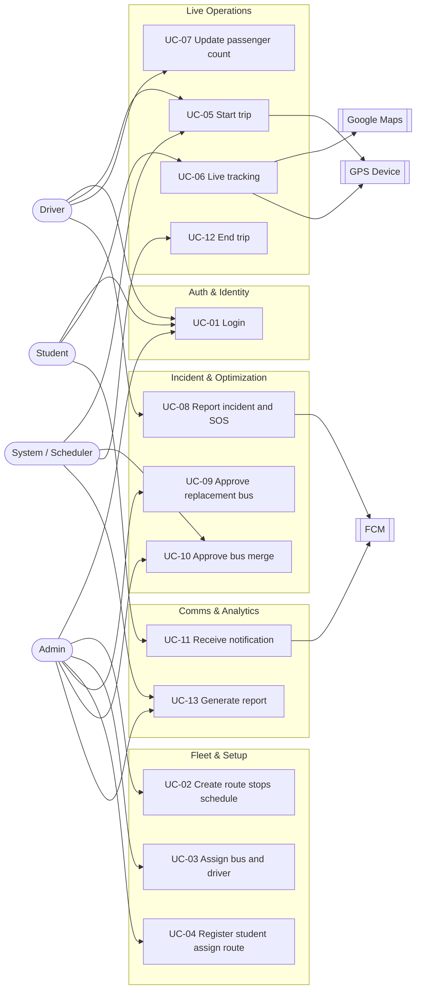
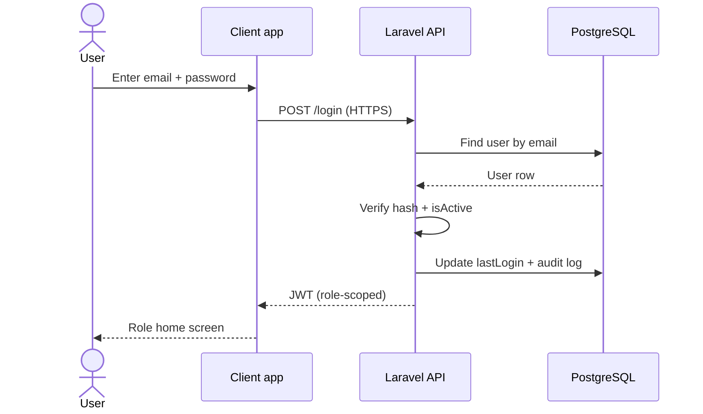
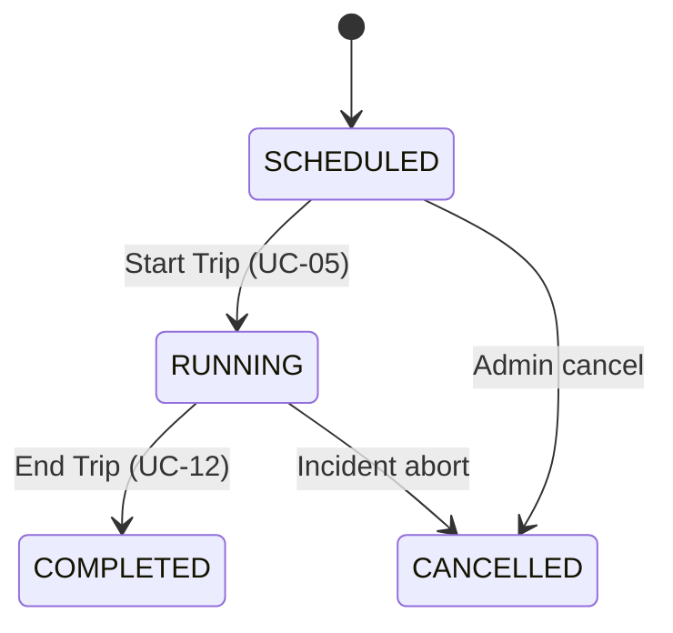
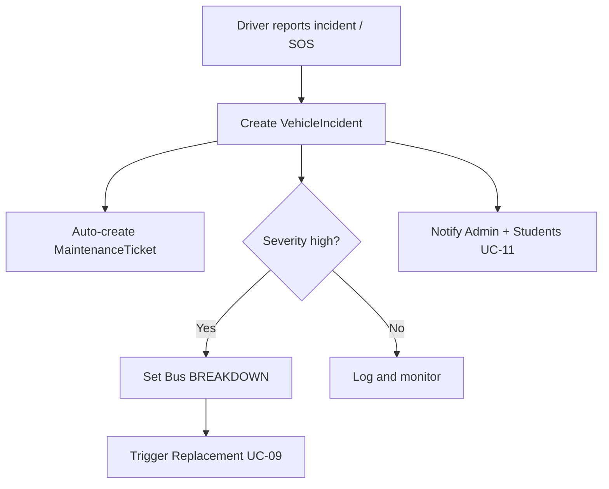

# CTMS — Use Cases

**Document:** 09 — Use Cases
**System:** Campus Transport Management System (CTMS)
**SRS Baseline:** v1.0
**Status:** Engineering blueprint (build-ready)

This document defines the actors, the use-case landscape, and fully-dressed
descriptions for the primary flows of the Campus Transport Management System.
Each use case is traced to one or more functional requirements (FR-01 .. FR-15)
so that requirements coverage can be verified end to end.

---

## 1. Actor Catalog

An actor is any external entity that exchanges information with CTMS to achieve a
goal. CTMS has three human primary actors and one non-human (time/event-driven)
actor, plus a set of external systems that participate as supporting actors.

| Actor | Type | Role (SRS) | Goals in CTMS | Primary apps / surfaces |
|-------|------|-----------|---------------|--------------------------|
| **Admin** | Human, primary | ADMIN | Manage fleet, routes, drivers, students; schedule trips; monitor live fleet; approve merges and replacements; view reports | Admin dashboard (Next.js/React) |
| **Driver** | Human, primary | DRIVER | Log in, start/end trips, share GPS, update passenger count, report incidents, send SOS | Driver app (Flutter) |
| **Student** | Human, primary | STUDENT | View assigned bus, live-track, view ETA and current stop, receive notifications | Student app (Flutter) |
| **System / Scheduler** | Non-human, primary | — | Fire time-based jobs: materialize daily trips from schedules, evaluate consolidation opportunities, compute ETAs, generate report snapshots, expire announcements | Laravel scheduler / queue workers |
| **GPS Device** | External, supporting | — | Emit location fixes every 5–10 s from the driver device | Driver app GPS + OS location services |
| **Google Maps Platform** | External, supporting | — | Provide Routes API (ETA), Places API, map tiles/SDK | REST calls from backend + SDK in apps |
| **Firebase Cloud Messaging** | External, supporting | — | Deliver push notifications to student/driver/admin devices | FCM |
| **Maintenance Team** | Human, supporting | — | Consume auto-created maintenance tickets (out of primary UC scope, referenced in FR-14) | Admin dashboard (maintenance view) |

**Actor notes**

- The **System / Scheduler** actor is what distinguishes *scheduled* work
  (daily trip creation, periodic consolidation evaluation, report snapshots)
  from *user-initiated* work. It is a first-class actor because several use
  cases have no human trigger.
- **GPS Device**, **Google Maps**, and **FCM** are supporting actors: they never
  initiate a use case but are required for several to succeed. When any is
  unavailable, the reliability rules (offline GPS buffering, retry, degraded
  ETA) apply.

---

## 2. Use-Case Overview (by module)

The diagram below groups use cases by module and connects each primary actor to
the use cases it initiates. Supporting systems are shown where they are essential
to the flow.

---

## 3. Use Case ↔ Functional Requirement Traceability

| UC ID | Use Case | Primary Actor | FR(s) |
|-------|----------|---------------|-------|
| UC-01 | Login | Admin / Driver / Student | FR-01 |
| UC-02 | Create route + stops + schedule | Admin | FR-05 |
| UC-03 | Assign bus & driver | Admin | FR-02, FR-03, FR-06 |
| UC-04 | Register student & assign route | Admin | FR-04 |
| UC-05 | Start trip | Driver | FR-06, FR-07, FR-10 |
| UC-06 | Live tracking | Student | FR-07, FR-09 |
| UC-07 | Update passenger count | Driver | FR-08 |
| UC-08 | Report incident + SOS | Driver | FR-11, FR-14, FR-10 |
| UC-09 | Approve replacement bus | Admin | FR-12, FR-10 |
| UC-10 | Approve bus merge | Admin | FR-13, FR-10 |
| UC-11 | Receive notification | Student | FR-10 |
| UC-12 | End trip | Driver / Scheduler | FR-06, FR-15 |
| UC-13 | Generate report | Admin / Scheduler | FR-15 |

---

## 4. Fully-Dressed Use Cases

Each use case follows the same structure: identity, actors, stakeholders,
preconditions, guarantees (postconditions), main success scenario, and
alternate/exception flows. Business rules and enum transitions from the domain
model are referenced explicitly.

---

### UC-01 — Login (Authentication)

| Field | Value |
|-------|-------|
| **ID** | UC-01 |
| **Name** | Role-based secure login |
| **Primary actor** | Admin, Driver, or Student |
| **FR mapping** | FR-01 |
| **Scope** | CTMS backend (Laravel) + all three clients |
| **Level** | User goal |
| **Trigger** | User opens app and submits credentials |

**Stakeholders & interests**

- *User*: wants fast, secure access scoped to their role.
- *College Management*: wants unauthorized access blocked and every login audited.

**Preconditions**

- The user has a registered account (`User.isActive = true`).
- Client can reach the API over HTTPS.

**Success guarantee (postconditions)**

- A signed JWT/Sanctum token is issued, scoped to the user's `UserRole`.
- `User.lastLogin` is updated; an audit-log entry is written.

**Main success scenario**

1. User enters email + password and submits.
2. Client POSTs credentials over HTTPS to the auth endpoint.
3. System looks up the user by unique `email`.
4. System verifies the password against `passwordHash`.
5. System confirms `isActive = true`.
6. System issues a role-scoped token (`ADMIN` / `DRIVER` / `STUDENT`).
7. System updates `lastLogin`, writes an audit-log record.
8. Client stores the token and routes the user to the role home screen.

**Alternate flows**

- *2a. Remembered session*: a valid non-expired token exists → skip to step 8.
- *6a. Driver device registration*: on driver login, the FCM device token and
  GPS capability flag are registered/refreshed for later trip use.

**Exception flows**

- *4a. Bad credentials*: return generic "invalid credentials" (no user
  enumeration); increment failed-attempt counter; audit the failure.
- *5a. Deactivated account* (`isActive = false`): deny with "account disabled".
- *E1. Network failure*: client shows retry; no partial session created.

---

### UC-02 — Create Route + Stops + Schedule

| Field | Value |
|-------|-------|
| **ID** | UC-02 |
| **Name** | Create route, stops and schedule |
| **Primary actor** | Admin |
| **FR mapping** | FR-05 |
| **Level** | User goal |
| **Trigger** | Admin opens Route Management and chooses "New Route" |

**Preconditions**

- Admin is authenticated with `UserRole = ADMIN`.
- Google Places API is available for stop geocoding/lookup.

**Success guarantee**

- A `Route` is persisted with one or more ordered `RouteStop` records and at
  least one `Schedule`.
- `Route.active = true` once validated.

**Main success scenario**

1. Admin enters route header: `routeCode`, `routeName`, `source`, `destination`,
   `totalDistance`, `estimatedDuration`.
2. Admin adds stops: for each, `stopName`, `landmark`, `latitude`, `longitude`,
   `sequence`, `geofenceRadius`, `expectedArrival` (Places API assists lookup).
3. System validates `sequence` values are unique and contiguous.
4. Admin defines one or more schedules: `dayOfWeek`, `departureTime`,
   `arrivalTime` (bus assignment may be deferred to UC-03).
5. System validates `departureTime < arrivalTime`.
6. System persists `Route`, `RouteStop[]`, `Schedule[]` in a single transaction.
7. System sets `Route.active = true` and confirms to the admin.

**Alternate flows**

- *4a. Schedule without bus*: `Schedule.busId` is left null; the bus is bound in
  UC-03. `Schedule.active` stays `false` until a bus is assigned.
- *2a. Reorder stops*: admin drags to reorder → system recomputes `sequence`.

**Exception flows**

- *3a. Duplicate/gap in sequence*: reject with field-level error; no persistence.
- *E1. Places API unavailable*: admin may enter lat/long manually; a warning is
  logged that geofence coordinates are unverified.
- *6a. Duplicate `routeCode`*: reject (uniqueness violation).

---

### UC-03 — Assign Bus & Driver

| Field | Value |
|-------|-------|
| **ID** | UC-03 |
| **Name** | Assign bus and driver to a schedule/trip |
| **Primary actor** | Admin |
| **FR mapping** | FR-02, FR-03, FR-06 |
| **Level** | User goal |
| **Trigger** | Admin assigns resources to a `Schedule` or a materialized `Trip` |

**Preconditions**

- Route and at least one `Schedule` exist (UC-02).
- Candidate `Bus.status = AVAILABLE` and candidate `Driver.available = true` with
  `Driver.status = AVAILABLE`.

**Success guarantee**

- `Schedule.busId` (and/or `Trip.busId`, `Trip.driverId`) is set.
- `Bus.status` and `Driver.status` reflect the assignment for the trip window.

**Main success scenario**

1. Admin selects a `Schedule`/`Trip` needing resources.
2. System lists eligible buses (`status = AVAILABLE`, not in `MAINTENANCE`).
3. Admin selects a bus; system validates capacity/permit/insurance not expired.
4. System lists eligible drivers (`available = true`, `status = AVAILABLE`).
5. Admin selects a driver.
6. System validates **one active driver per bus** business rule.
7. System writes the assignment; sets `Driver.assignedBusId`, updates statuses.
8. System confirms; notifies the driver (UC-11 channel) of the assignment.

**Business rules enforced**

- A bus in `MAINTENANCE` (or `BREAKDOWN`/`OFFLINE`) **cannot** be assigned.
- Only **one active driver per bus** during a trip.
- Passenger capacity is validated later at runtime (UC-07), but capacity is
  recorded here for reference.

**Exception flows**

- *3a. No available bus*: admin is told the fleet is fully committed; may reuse
  the consolidation view (UC-10) to free capacity.
- *6a. Driver already bound to another active trip*: reject the assignment.
- *3b. Expired permit/insurance*: block assignment, surface the expiry date.

---

### UC-04 — Register Student & Assign Route

| Field | Value |
|-------|-------|
| **ID** | UC-04 |
| **Name** | Register student and assign route/bus/pickup |
| **Primary actor** | Admin |
| **FR mapping** | FR-04 |
| **Level** | User goal |
| **Trigger** | Admin creates or edits a student's transport profile |

**Preconditions**

- Admin authenticated. Target route, bus, and pickup stop exist.

**Success guarantee**

- A `Student` record exists (extending `User`) with `routeId`, `busId`,
  `pickupStopId` set and `transportEnabled = true`.

**Main success scenario**

1. Admin enters student identity (`User` fields) + academic fields
   (`rollNumber`, `admissionNumber`, `department`, `course`, `year`, `section`,
   `semester`) + `guardianName`, `guardianPhone`.
2. Admin selects `routeId`; system loads that route's stops.
3. Admin selects `pickupStopId` (must belong to the chosen route).
4. Admin selects `busId` (must serve the chosen route via a schedule).
5. System sets `transportEnabled = true` and persists.
6. System confirms and provisions the student app account.

**Business rule enforced**

- A student can only ever view/track their **assigned** bus (`Student.busId`),
  enforced downstream in UC-06.

**Exception flows**

- *3a. Stop not on route*: reject; force re-selection.
- *4a. Bus not serving route*: reject; suggest valid buses.
- *5a. Duplicate `rollNumber`/`admissionNumber`*: reject (uniqueness).
- *1a. Transport not required*: admin may set `transportEnabled = false`;
  student is registered but excluded from tracking/notifications.

---

### UC-05 — Start Trip

| Field | Value |
|-------|-------|
| **ID** | UC-05 |
| **Name** | Driver starts a scheduled trip |
| **Primary actor** | Driver (may be pre-materialized by Scheduler) |
| **FR mapping** | FR-06, FR-07, FR-10 |
| **Level** | User goal |
| **Trigger** | Driver taps "Start Trip" for today's assigned trip |

**Preconditions**

- A `Trip` exists for `tripDate = today` in `status = SCHEDULED`, assigned to
  this driver and bus.
- `Bus.status = AVAILABLE`; driver device GPS is enabled.

**Success guarantee**

- `Trip.status = RUNNING`, `Trip.startTime` set.
- `Bus.status = RUNNING`, `Driver.status = ON_TRIP`.
- GPS streaming begins; students on the route are notified "trip started".

**Main success scenario**

1. Driver opens today's trip card and taps **Start Trip**.
2. System verifies trip is `SCHEDULED` and bus is not in `MAINTENANCE`/`BREAKDOWN`.
3. System sets `Trip.status = RUNNING`, `startTime = now`.
4. System sets `Bus.status = RUNNING`, `Driver.status = ON_TRIP`.
5. Driver app begins emitting `TripLocation` fixes every 5–10 s (FR-07).
6. System broadcasts location over WebSockets (Reverb) and pushes a
   "trip started" notification to assigned students (UC-11).
7. Passenger counter UI is enabled (UC-07).

**Alternate flows**

- *1a. Scheduler pre-check*: the Scheduler actor materializes the day's `Trip`
  rows from active `Schedule`s before drivers arrive, so step 1 always finds a
  `SCHEDULED` trip.

**Exception flows**

- *2a. Bus unavailable* (`MAINTENANCE`/`BREAKDOWN`): block start; prompt admin
  to assign a replacement (UC-09).
- *5a. GPS disabled*: block start until location permission is granted.
- *E1. No connectivity*: trip starts locally; `TripLocation` fixes are buffered
  and synced when the network returns (reliability: offline GPS buffering).

---

### UC-06 — Live Tracking (Student)

| Field | Value |
|-------|-------|
| **ID** | UC-06 |
| **Name** | Student live-tracks assigned bus with ETA |
| **Primary actor** | Student |
| **FR mapping** | FR-07, FR-09 |
| **Level** | User goal |
| **Trigger** | Student opens the live map for their assigned bus |

**Preconditions**

- Student is authenticated and `transportEnabled = true`.
- The student's assigned bus has a `Trip` in `status = RUNNING`.

**Success guarantee**

- Student sees the live bus position, current/next stop, and an ETA to their
  `pickupStopId`.

**Main success scenario**

1. Student opens "Track my bus".
2. System resolves `Student.busId` → active `RUNNING` trip.
3. Client subscribes to the trip's location channel (Reverb WebSocket).
4. System streams the latest `TripLocation` (lat/long/speed/heading).
5. System computes ETA to the student's pickup stop using **Google Maps Routes
   API** (FR-09), factoring current position and traffic.
6. Client renders the bus marker, current stop, and ETA on the Google Map.
7. ETA refreshes as new fixes arrive; `Trip.delayMinutes` updates if behind
   schedule.

**Business rule enforced**

- Student may only subscribe to **their own** assigned bus's channel; requests
  for other buses are authorization-denied.

**Alternate / exception flows**

- *2a. No active trip*: show "Bus not running yet" with the scheduled
  departure time.
- *5a. Routes API unavailable*: fall back to a distance/average-speed estimate
  from `Route.estimatedDuration` and mark the ETA "approximate".
- *4a. Stale GPS* (no fix > interval): show "last seen" timestamp; if the fix is
  buffered offline, ETA is held until sync resumes.

---

### UC-07 — Update Passenger Count

| Field | Value |
|-------|-------|
| **ID** | UC-07 |
| **Name** | Driver increases/decreases passenger count |
| **Primary actor** | Driver |
| **FR mapping** | FR-08 |
| **Level** | Subfunction |
| **Trigger** | Passenger boards or exits; driver taps +1 / -1 |

**Preconditions**

- An active `Trip` in `status = RUNNING` for this driver.

**Success guarantee**

- `Trip.passengerCount` and `Bus.currentPassengers` reflect the new count.
- A `PassengerLog` row is written (`action` = Board/Exit, `countAfterAction`,
  `timestamp`).

**Main success scenario**

1. Driver taps **+1** (board) or **-1** (exit).
2. System validates the new count against **`Bus.capacity`**.
3. System increments/decrements `Trip.passengerCount` and
   `Bus.currentPassengers`.
4. System appends a `PassengerLog` entry (Board/Exit + `countAfterAction`).
5. Updated occupancy is available to consolidation evaluation (UC-10).

**Business rule enforced**

- `passengerCount` **must never exceed** `Bus.capacity`. A **+1** that would
  breach capacity is rejected with a "bus full" message and no log is written.

**Exception flows**

- *1a. Decrement below zero*: reject; count floors at 0.
- *E1. Offline*: counter operates locally; `PassengerLog` entries are queued and
  synced in order when connectivity returns.

---

### UC-08 — Report Incident + SOS

| Field | Value |
|-------|-------|
| **ID** | UC-08 |
| **Name** | Driver reports a vehicle incident and/or sends SOS |
| **Primary actor** | Driver |
| **FR mapping** | FR-11, FR-14, FR-10 |
| **Level** | User goal |
| **Trigger** | Vehicle problem occurs, or emergency SOS is pressed |

**Preconditions**

- Driver is authenticated; a `Trip` is `RUNNING` (SOS also allowed pre-trip).

**Success guarantee**

- A `VehicleIncident` is created (`issueType`, `severity`, `description`, optional
  `imageUrl`, geo-coordinates, `status`, `reportedAt`).
- A `MaintenanceTicket` is auto-created and linked (FR-14).
- Admin is alerted; if severity warrants, the replacement workflow (UC-09) is
  triggered and students are notified (UC-11).

**Main success scenario**

1. Driver selects `issueType` (breakdown / accident / tyre puncture / engine /
   battery) and `severity`, adds a `description`, optionally attaches a photo.
2. System captures current lat/long from the last GPS fix.
3. System creates a `VehicleIncident` linked to `tripId`, `busId`, `driverId`.
4. **System auto-creates a `MaintenanceTicket`** (`incidentId`, `busId`,
   generated `ticketNumber`, `status = OPEN`) — enforcing "every incident creates
   a maintenance record".
5. If severity is high (breakdown/accident): system sets `Bus.status = BREAKDOWN`
   and flags the trip for replacement (UC-09).
6. System notifies Admin and affected students (FR-10 via FCM/WebSocket).

**SOS extension**

- *1a. SOS pressed*: system immediately pushes a high-priority alert to Admin and
  Maintenance Team with live coordinates, **before** the driver fills incident
  details; the incident form is then completed as above.

**Business rules enforced**

- Every `VehicleIncident` creates exactly one `MaintenanceTicket` (1..1).
- A bus set to `BREAKDOWN`/`MAINTENANCE` cannot be assigned to new trips.

**Exception flows**

- *E1. Photo upload fails*: incident is saved without `imageUrl`; upload retried
  in background.
- *2a. No recent GPS fix*: incident saved with last-known coordinates and a
  "location approximate" flag.

---

### UC-09 — Approve Replacement Bus

| Field | Value |
|-------|-------|
| **ID** | UC-09 |
| **Name** | System recommends and admin approves a replacement bus |
| **Primary actor** | Admin |
| **FR mapping** | FR-12, FR-10 |
| **Level** | User goal |
| **Trigger** | A high-severity incident (UC-08) flags a trip for replacement |

**Preconditions**

- An open `VehicleIncident` exists with a bus now in `BREAKDOWN`.
- At least one other `Bus.status = AVAILABLE` with an available driver.

**Success guarantee**

- A `ReplacementAssignment` is created and approved (`replacementBusId`,
  `replacementDriverId`, `etaMinutes`, `assignedAt`, `status`).
- Students on the affected trip are notified of the replacement (FR-10).

**Main success scenario**

1. System detects the flagged incident and **recommends** available replacement
   buses ranked by proximity/ETA to the stranded bus.
2. Admin reviews candidates (bus, driver, `etaMinutes`).
3. Admin selects one and **approves** the assignment.
4. System creates a `ReplacementAssignment` and sets its `status = APPROVED`.
5. System reassigns the running trip's `busId`/`driverId` to the replacement.
6. System sets replacement `Bus.status = RUNNING`, driver `status = ON_TRIP`.
7. System notifies affected students: "replacement bus dispatched" + new ETA.

**Business rule enforced**

- Replacement assignment **requires admin approval** — the system only
  recommends, it never auto-dispatches.

**Exception flows**

- *1a. No available bus*: admin is informed; students are notified of the delay;
  the incident stays open pending fleet availability.
- *3a. Admin rejects all candidates*: no `ReplacementAssignment`; trip may be
  marked `CANCELLED` (see UC-12 alternate).

---

### UC-10 — Approve Bus Merge (Smart Consolidation)

| Field | Value |
|-------|-------|
| **ID** | UC-10 |
| **Name** | System recommends merging low-occupancy buses; admin approves/rejects |
| **Primary actor** | Admin (recommendation generated by Scheduler) |
| **FR mapping** | FR-13, FR-10 |
| **Level** | User goal |
| **Trigger** | Scheduler detects two low-occupancy trips on compatible routes |

**Preconditions**

- Two `RUNNING` (or `SCHEDULED`) trips exist with combined passengers ≤ a single
  bus `capacity`.

**Success guarantee**

- A `BusMergeRecommendation` reaches a terminal `status` (APPROVED/REJECTED).
- On approval, passengers are consolidated onto the target trip and the source
  trip is stood down; students are notified.

**Main success scenario**

1. Scheduler evaluates occupancy (from `PassengerLog`/`Trip.passengerCount`) and
   creates a `BusMergeRecommendation` with `sourcePassengers`,
   `targetPassengers`, `mergedPassengers`, `estimatedFuelSaved`,
   `distanceIncrease`, `status = PENDING`.
2. Admin reviews the recommendation on the dashboard.
3. Admin **approves**; system records `approvedBy` (admin) and `status = APPROVED`.
4. System validates `mergedPassengers ≤ targetBus.capacity`.
5. System reassigns source-trip students to the target bus/trip and marks the
   source trip for stand-down.
6. Source `Bus.status → AVAILABLE`, its driver `status → AVAILABLE`.
7. System notifies affected students of the new bus and updated ETA (FR-10).

**Business rule enforced**

- Bus merge **requires admin approval**; the merged count must not exceed target
  bus capacity (capacity rule).

**Alternate / exception flows**

- *3a. Admin rejects*: `status = REJECTED`; both trips continue unchanged; no
  notifications sent to students.
- *4a. Capacity would be exceeded*: system blocks approval and flags the
  recommendation invalid.

---

### UC-11 — Receive Notification (Student)

| Field | Value |
|-------|-------|
| **ID** | UC-11 |
| **Name** | Student receives an operational notification |
| **Primary actor** | Student (System is the sender) |
| **FR mapping** | FR-10 |
| **Level** | Subfunction |
| **Trigger** | A trip/fleet event occurs that concerns the student |

**Preconditions**

- Student has a valid FCM device token registered (from UC-01).

**Success guarantee**

- A `Notification` row is persisted (`receiverId`, `title`, `message`, `type`,
  `isRead = false`, `sentAt`) and delivered to the device via FCM.

**Main success scenario**

1. A source event fires: trip started (UC-05), bus nearing stop (geofence in
   UC-06), delay, route change, replacement dispatched (UC-09), or trip completed
   (UC-12).
2. System resolves the audience: students assigned to the affected bus/route.
3. System creates a `Notification` per recipient with the appropriate `type`.
4. System sends the payload via **Firebase Cloud Messaging**.
5. Student device displays the push; opening it marks `isRead = true`.

**Notification types (FR-10 catalog)**

| Event | Trigger UC | Notification `type` |
|-------|-----------|---------------------|
| Trip started | UC-05 | TRIP_STARTED |
| Bus nearing stop | UC-06 (geofence) | BUS_NEARING |
| Delay | UC-06 | DELAY |
| Route change | UC-02 update | ROUTE_CHANGE |
| Replacement bus | UC-09 | REPLACEMENT |
| Trip completed | UC-12 | TRIP_COMPLETED |

**Exception flows**

- *4a. FCM delivery fails*: the `Notification` is still persisted; delivery is
  retried; the student sees it in-app on next open.
- *2a. `transportEnabled = false`*: recipient is excluded from the audience.

---

### UC-12 — End Trip

| Field | Value |
|-------|-------|
| **ID** | UC-12 |
| **Name** | Driver ends the trip; system finalizes it |
| **Primary actor** | Driver (auto-finalized by Scheduler if abandoned) |
| **FR mapping** | FR-06, FR-15 |
| **Level** | User goal |
| **Trigger** | Driver reaches destination and taps "End Trip" |

**Preconditions**

- Trip is `RUNNING` for this driver/bus.

**Success guarantee**

- `Trip.status = COMPLETED`, `endTime` set, `averageSpeed` and `delayMinutes`
  computed and stored.
- Bus and driver return to `AVAILABLE`; trip data is available to reporting.

**Main success scenario**

1. Driver taps **End Trip** at the final stop.
2. System stops GPS streaming and closes the location channel.
3. System sets `Trip.status = COMPLETED`, `endTime = now`.
4. System computes `averageSpeed` from `TripLocation` history and finalizes
   `delayMinutes` vs schedule.
5. System sets `Bus.status = AVAILABLE`, `Driver.status = AVAILABLE`,
   `Bus.currentPassengers = 0`.
6. System notifies students "trip completed" (UC-11) and unlocks report inputs.

**Alternate flows**

- *1a. Scheduler auto-close*: if a trip stays `RUNNING` past a safety window with
  no GPS, the Scheduler finalizes it and flags the record for admin review.
- *E1. Aborted trip*: if ended due to incident with no replacement, admin may set
  `status = CANCELLED` instead of `COMPLETED`.

---

### UC-13 — Generate Report

| Field | Value |
|-------|-------|
| **ID** | UC-13 |
| **Name** | Generate operational reports and analytics |
| **Primary actor** | Admin (scheduled snapshots by Scheduler) |
| **FR mapping** | FR-15 |
| **Level** | User goal |
| **Trigger** | Admin requests a report, or Scheduler runs a periodic snapshot |

**Preconditions**

- Historical data exists: `Trip`, `TripLocation`, `PassengerLog`,
  `VehicleIncident`, `MaintenanceTicket`, `BusMergeRecommendation`.

**Success guarantee**

- A report is produced (on-screen + exportable) over the selected period and
  filters, with no mutation of source records.

**Main success scenario**

1. Admin selects a report type and range (e.g., fleet utilization, on-time
   performance, incident summary, fuel saved via merges, occupancy trends).
2. Admin applies filters (route, bus, driver, date range, campus).
3. System aggregates the underlying records (read-only; may use Redis-cached
   rollups for speed).
4. System renders tables/charts on the dashboard.
5. Admin exports (CSV/PDF) if required.

**Representative metrics**

| Report | Source entities | Example KPIs |
|--------|-----------------|--------------|
| On-time performance | Trip | avg `delayMinutes`, % on time |
| Fleet utilization | Trip, Bus | trips/bus, active vs idle |
| Occupancy | PassengerLog, Trip | avg load, peak, capacity % |
| Incidents | VehicleIncident, MaintenanceTicket | count by `issueType`/`severity`, MTTR |
| Consolidation savings | BusMergeRecommendation | total `estimatedFuelSaved` |

**Alternate / exception flows**

- *1a. Scheduled snapshot*: Scheduler generates daily/weekly report snapshots and
  caches them so admin views load instantly.
- *3a. Empty result set*: system shows "no data for the selected filters".
- *E1. Aggregation exceeds the 2 s API budget*: served from the cached rollup;
  a "as of <timestamp>" note is shown.

---

## 5. Business-Rule Coverage Matrix

| Business rule (SRS) | Enforced in |
|---------------------|-------------|
| Passenger count must never exceed capacity | UC-07, UC-10 |
| Only one active driver per bus during a trip | UC-03 |
| A bus in maintenance cannot be assigned | UC-03, UC-05, UC-08 |
| Bus merge requires admin approval | UC-10 |
| Replacement bus requires admin approval | UC-09 |
| Students can only view their assigned bus | UC-04, UC-06 |
| Every incident creates a maintenance record | UC-08 |

---

## 6. Cross-references

- `03-domain-model.md` — entities, attributes, and enums referenced throughout.
- `04-functional-requirements.md` — FR-01 .. FR-15 definitions.
- `07-data-model.md` — PostgreSQL schema (snake_case columns) for these entities.
- `08-api-specification.md` — REST + WebSocket endpoints backing each UC.
- `10-sequence-diagrams.md` — detailed sequences for start-trip, tracking, incident.
- `11-state-machines.md` — Bus/Driver/Trip status transitions used here.
- `12-notifications.md` — FCM payloads and notification type catalog (UC-11).
