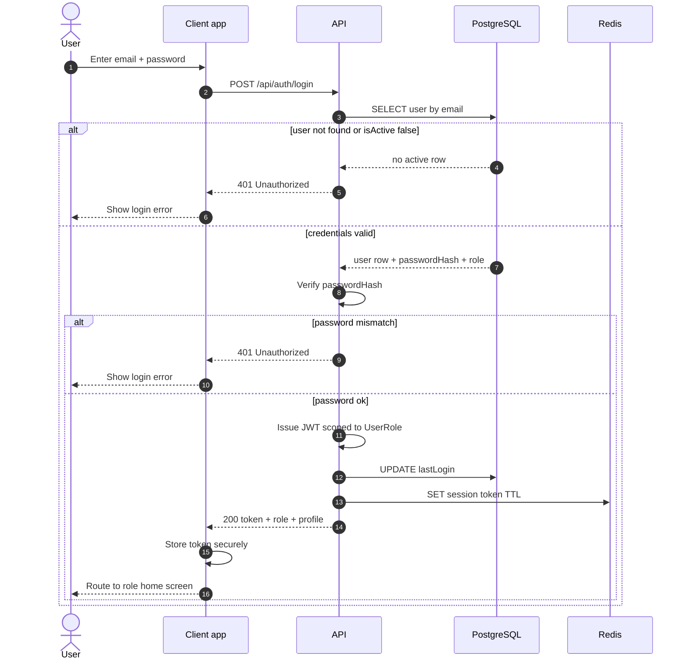
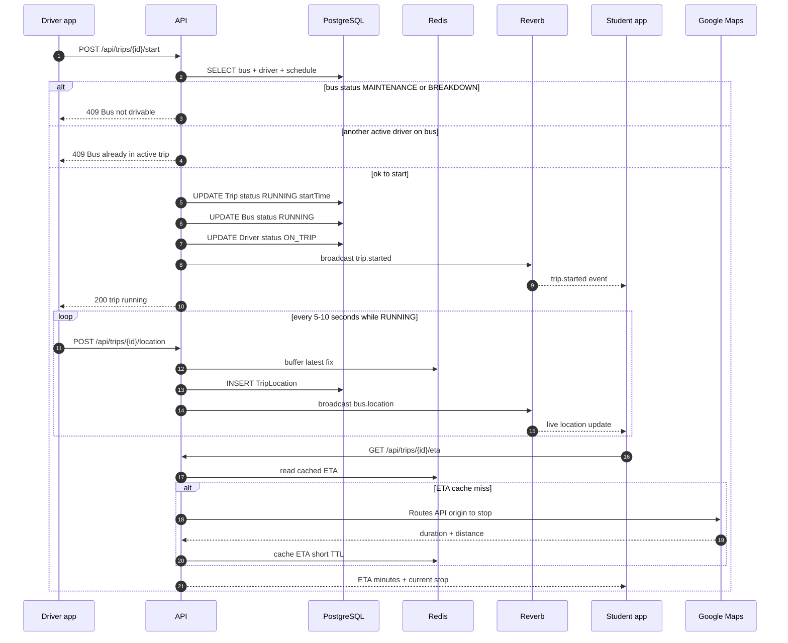
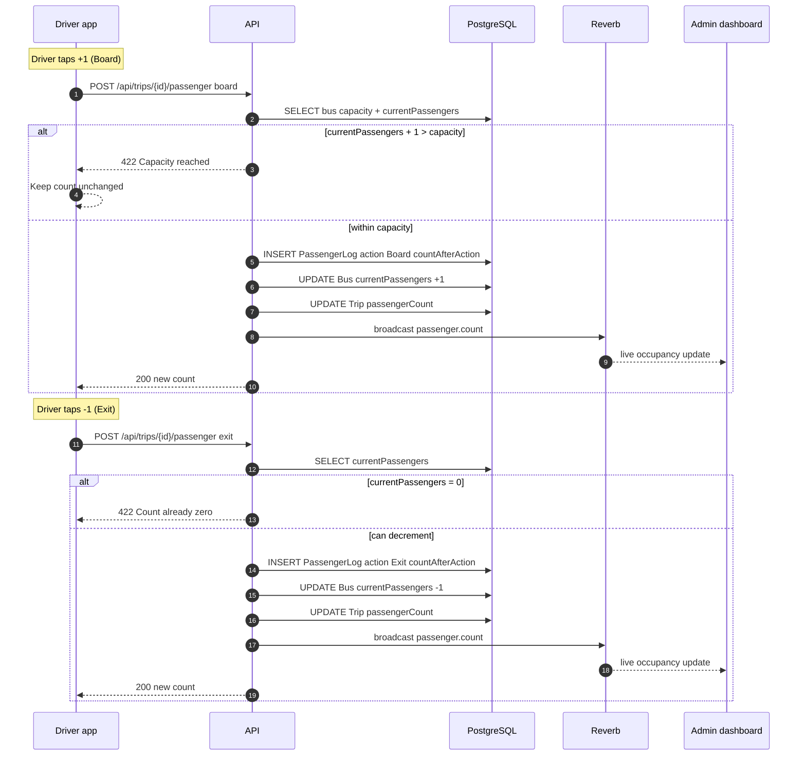
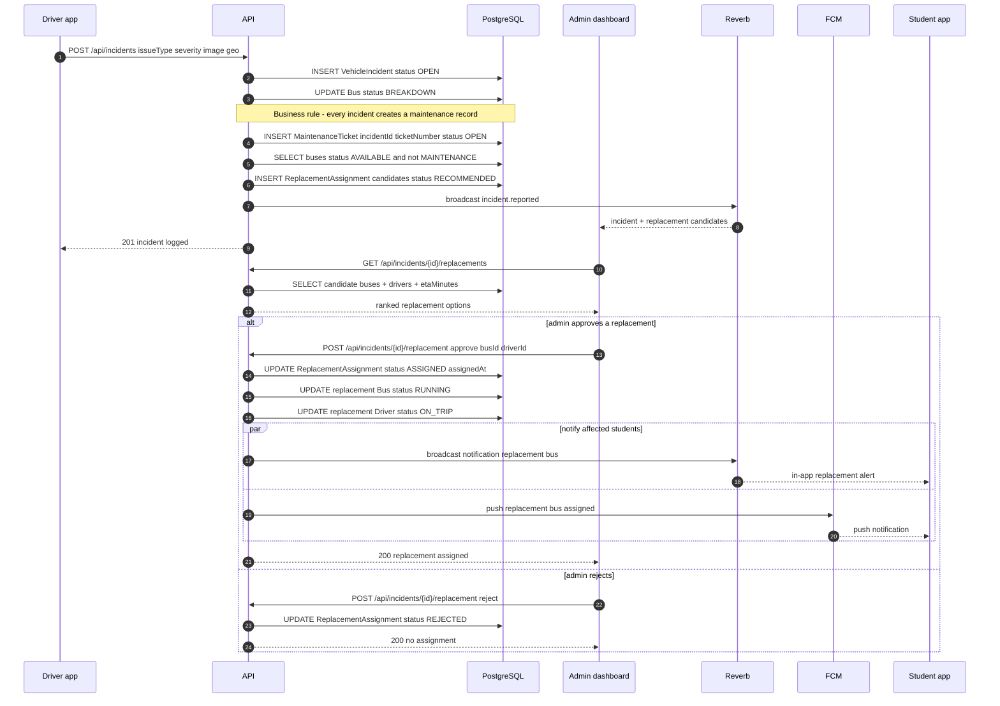
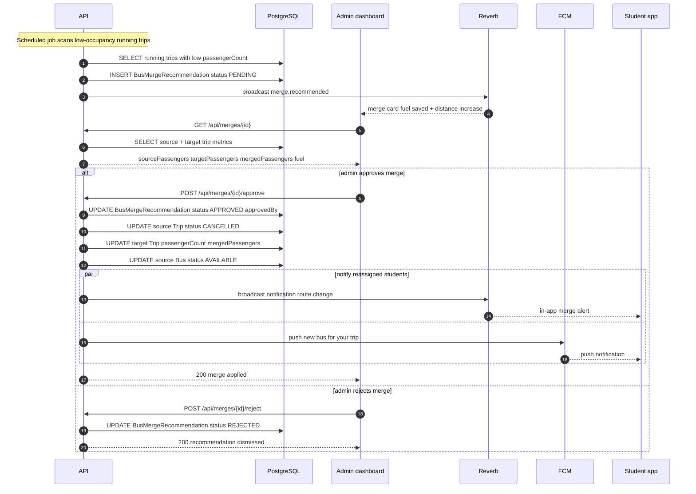
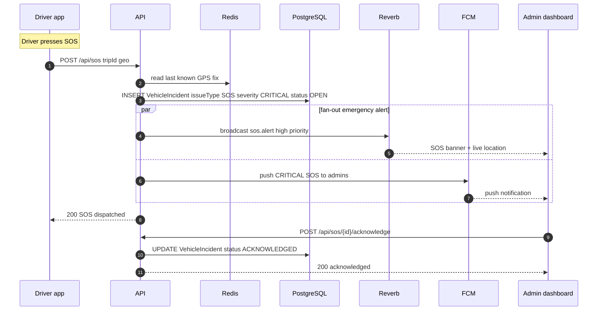
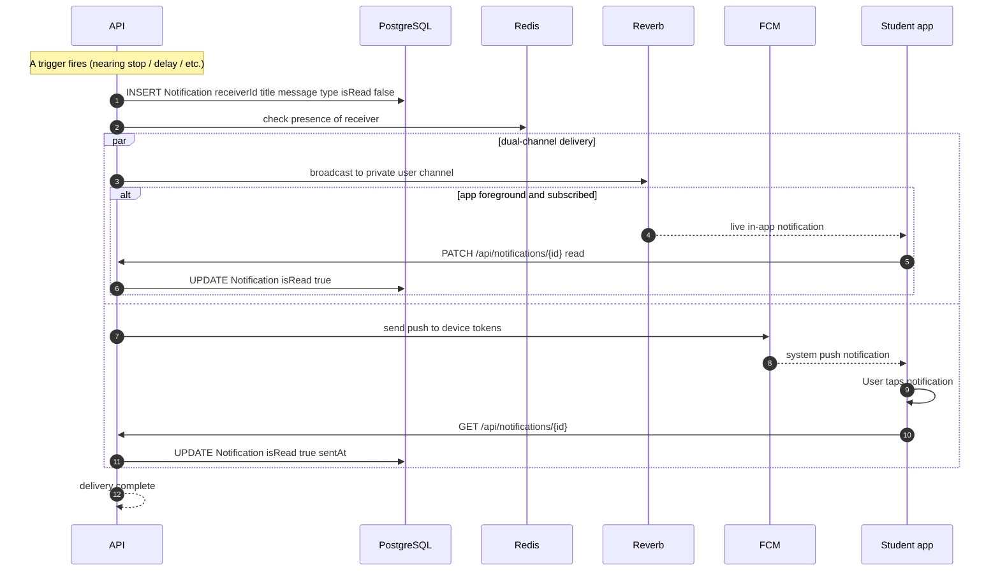
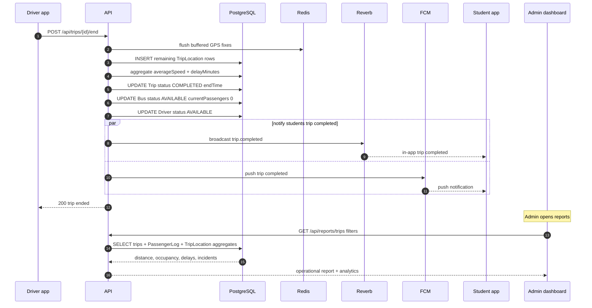

# CTMS — Sequence Diagrams

This document captures the runtime interaction sequences for the Campus Transport Management System (CTMS). Each diagram models a key end-to-end flow across the client apps (Flutter Student app, Flutter Driver app, Next.js/React Admin dashboard), the Laravel 12 REST API, the Laravel Reverb WebSocket server, Redis cache, PostgreSQL database, Google Maps services, and Firebase Cloud Messaging (FCM).

The diagrams are deliberately faithful to the domain model, enums, and functional requirements (FR-01..FR-15). They are intended as a build blueprint: participant names, message payloads, status transitions, and business-rule checkpoints match what the implementation must actually do.

## Participant legend

| Participant | Alias | Role in sequences |
|---|---|---|
| Student app | `SA` | Flutter app for Student role |
| Driver app | `DA` | Flutter app for Driver role |
| Admin dashboard | `AD` | Next.js/React dashboard for Admin role |
| API | `API` | Laravel 12 REST API + business logic |
| Reverb | `RV` | Laravel Reverb WebSocket broadcaster |
| Redis | `RD` | Cache + presence + live GPS buffer |
| PostgreSQL | `DB` | Primary datastore |
| Google Maps | `GM` | Routes API / Places API / Maps SDK |
| FCM | `FCM` | Firebase Cloud Messaging push |

Conventions used throughout:

- `alt` blocks model business-rule branches (approve/reject, capacity cap, auth failure).
- `loop` blocks model repeating behavior (GPS interval 5-10s).
- `par` blocks model fan-out notification delivery (Reverb + FCM concurrently).
- All API traffic is HTTPS; all WebSocket channels are authenticated with the JWT/Sanctum token; every write path implicitly appends an audit-log row (omitted from diagrams for readability).

---

## 1. Authentication / Login (FR-01)

Role-based secure login for Admin, Driver, and Student. The API validates credentials against the `User` base table, verifies the account is active, issues a JWT/Sanctum token scoped to the resolved `UserRole` (ADMIN / DRIVER / STUDENT), updates `lastLogin`, and caches the session in Redis for fast subsequent authorization checks.

---

## 2. Start Trip, GPS Tracking Loop, and ETA (FR-06, FR-07, FR-09)

The driver starts a scheduled trip. Business rules enforce that only one active driver exists per bus and that a bus in `MAINTENANCE` or `BREAKDOWN` cannot start a trip. On success the `Trip.status` moves to `RUNNING`, the `Bus.status` moves to `RUNNING`, and the `DriverStatus` moves to `ON_TRIP`. GPS updates then stream every 5-10 seconds; each fix is buffered in Redis, persisted to `TripLocation`, and broadcast to subscribed students via Reverb. ETA is computed on demand from the Google Maps Routes API and cached.

---

## 3. Passenger Count +1 / -1 with Capacity Cap (FR-08)

The driver adjusts the live passenger count using the +1 / -1 buttons. The core business rule is that passenger count must never exceed bus capacity. The API validates each increment against `Bus.capacity`, writes a `PassengerLog` row (`action` = Board or Exit) with `countAfterAction`, updates `Bus.currentPassengers` and `Trip.passengerCount`, and broadcasts the new occupancy.

---

## 4. Incident → Maintenance Ticket → Replacement → Approval → Assignment (FR-11, FR-12, FR-14, FR-10)

The most involved flow. A driver reports a vehicle incident (breakdown, accident, tyre puncture, engine issue, battery issue). The system automatically creates a `MaintenanceTicket` from the `VehicleIncident` (every incident creates a maintenance record), flips the bus to `BREAKDOWN`, recommends available replacement buses, and waits for admin approval. On approval the `ReplacementAssignment` is created and affected students are notified across Reverb + FCM.

---

## 5. Smart Bus Consolidation Recommendation (FR-13)

The system continuously scans running trips for low-occupancy buses on compatible routes and generates a `BusMergeRecommendation` estimating fuel saved versus the small distance increase from merging. A merge requires admin approval. On approval, passengers are consolidated onto the target trip and the source bus is freed; affected students are notified.

---

## 6. SOS Alert (FR-11 emergency path)

The driver's SOS button triggers a high-priority emergency alert. Unlike a standard incident, SOS is delivered to admins immediately and in parallel across all channels with the trip's last known location, without waiting for any recommendation workflow.

---

## 7. Notification Delivery over Reverb + FCM (FR-10)

Every user-facing notification (trip started, bus nearing stop, delay, route change, replacement bus, trip completed) is persisted as a `Notification` row and delivered on two channels: Reverb for in-app real-time updates when the app is foregrounded, and FCM for push when it is backgrounded or closed. This diagram shows the generic delivery pipeline reused by all triggers.

---

## 8. End Trip and Report Generation (FR-06, FR-15)

The driver ends the trip. The API finalizes the `Trip` (status `COMPLETED`, `endTime`, `averageSpeed`, `delayMinutes`), releases the bus and driver back to `AVAILABLE`, aggregates the trip's `TripLocation` and `PassengerLog` data into operational metrics, and makes the report available to admins. A trip-completed notification is sent to students.

---

## Sequence coverage matrix

| # | Flow | Primary FRs | Key business rule enforced |
|---|---|---|---|
| 1 | Authentication / login | FR-01 | Role-scoped token; inactive users rejected |
| 2 | Start trip + GPS loop + ETA | FR-06, FR-07, FR-09 | One active driver per bus; no start on MAINTENANCE/BREAKDOWN |
| 3 | Passenger count +1 / -1 | FR-08 | Count never exceeds capacity; never below zero |
| 4 | Incident to replacement | FR-11, FR-12, FR-14, FR-10 | Every incident creates a maintenance record; replacement needs admin approval |
| 5 | Smart bus consolidation | FR-13 | Merge requires admin approval |
| 6 | SOS alert | FR-11 | Immediate parallel emergency fan-out |
| 7 | Notification delivery | FR-10 | Persist then dual-channel deliver |
| 8 | End trip + reports | FR-06, FR-15 | Finalize trip; release bus/driver to AVAILABLE |

## Cross-references

- `01-srs.md` — Software Requirements Specification (FR-01..FR-15, NFRs).
- `03-domain-model.md` — Entities, attributes, and enums used as participants and payloads.
- `06-api-specification.md` — REST endpoint contracts referenced in each sequence.
- `07-realtime-websockets.md` — Reverb channels and broadcast event schemas.
- `08-database-schema.md` — PostgreSQL tables backing the DB participant.
- `09-state-diagrams.md` — Bus, Trip, and Driver status transitions triggered by these flows.
- `11-notifications.md` — Notification and FCM delivery configuration.
