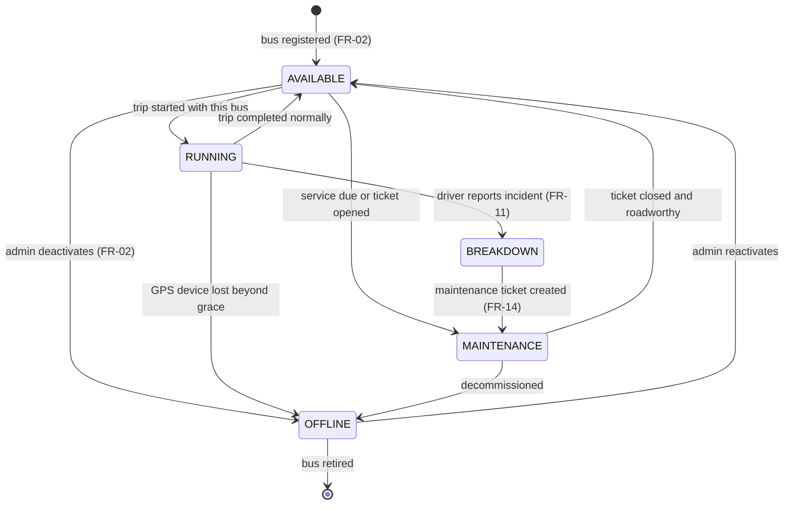
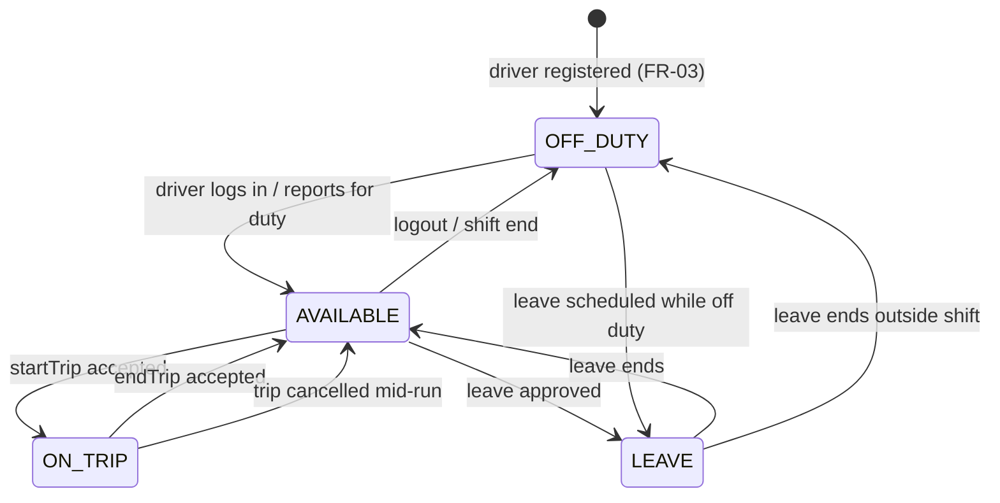
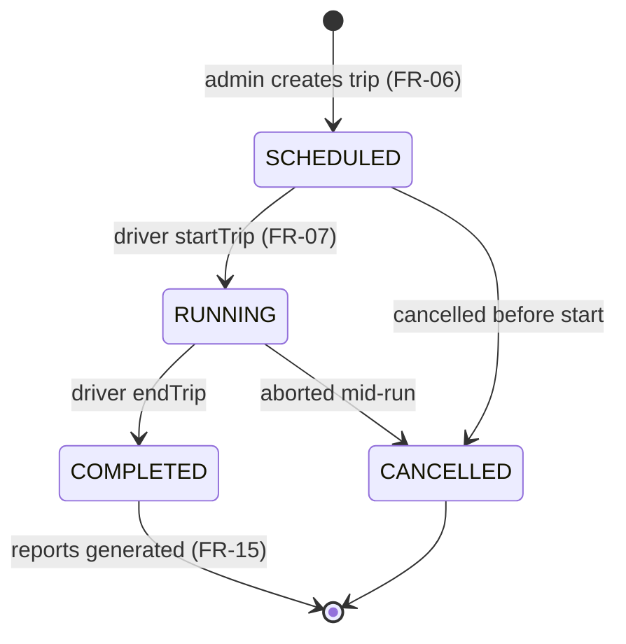
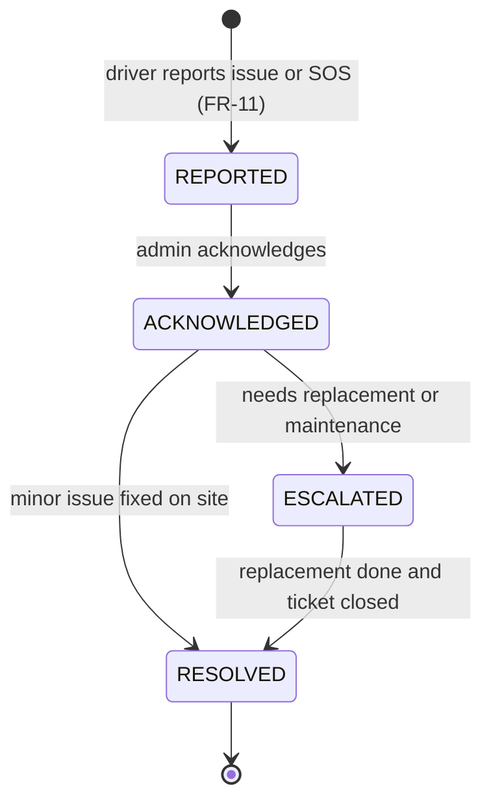
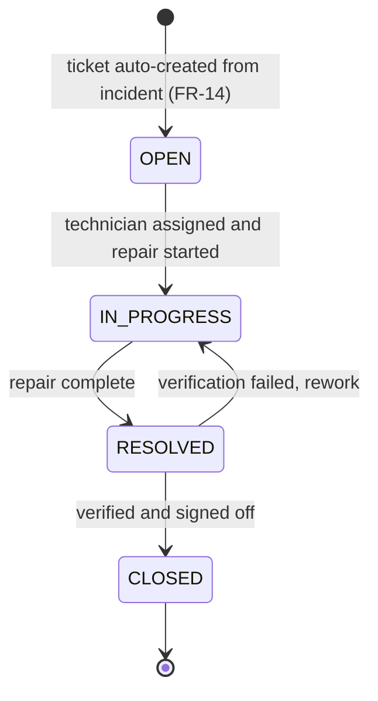
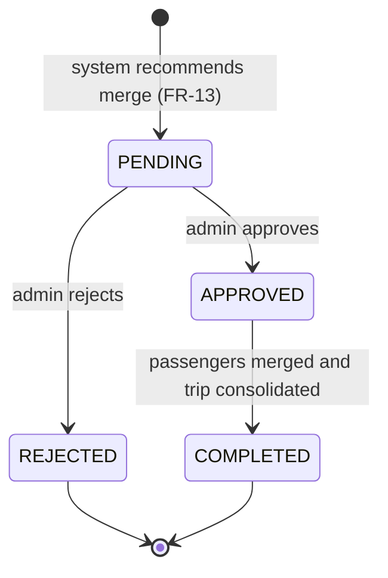
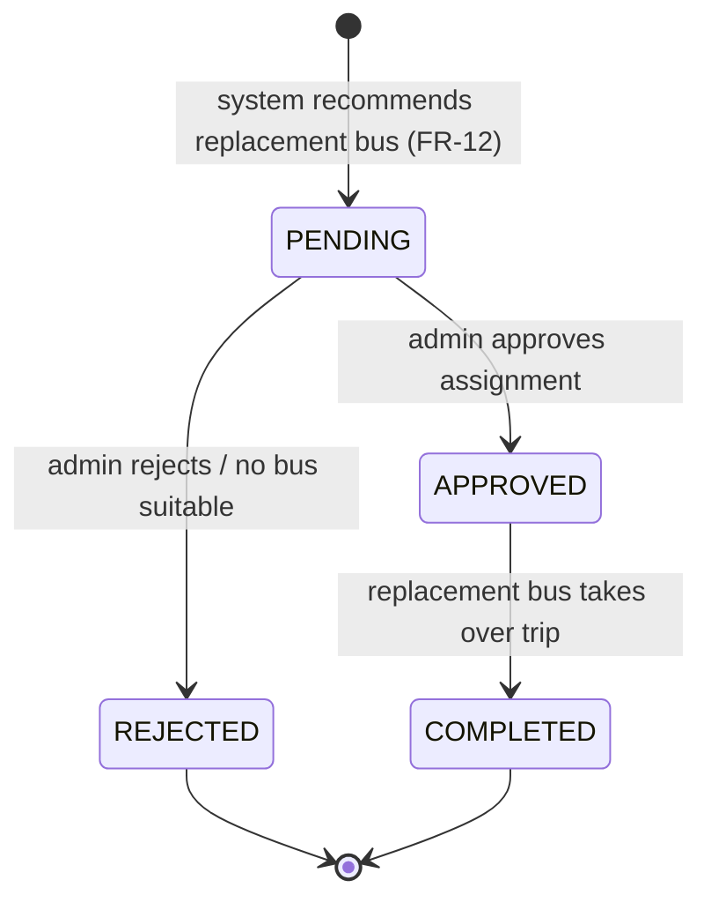
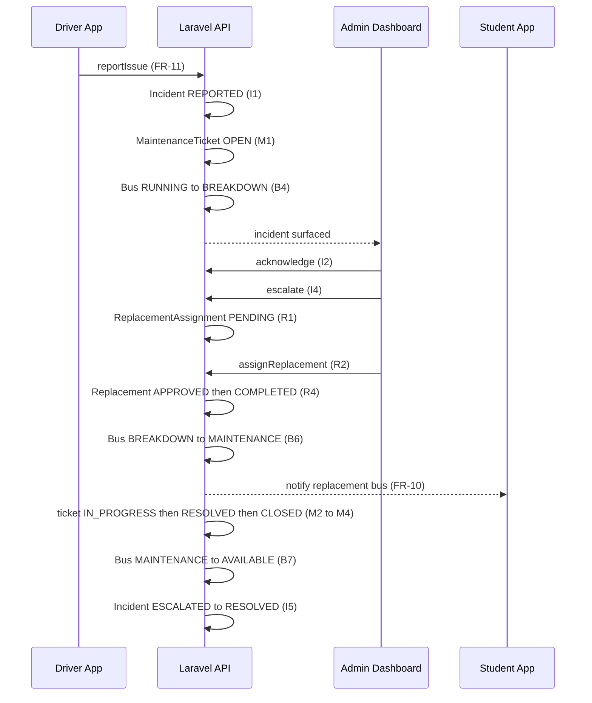

# CTMS — State Machines

**Document 11 of the CTMS Engineering Documentation Suite**
**System:** Campus Transport Management System (CTMS) — SRS v1.0
**Status:** Build blueprint (authoritative)

---

## 1. Purpose & Scope

This document is the single authoritative reference for every **finite-state lifecycle** in CTMS. Each stateful entity in the domain model carries a `status` (or equivalent) enum whose legal values, legal transitions, triggering events, and guard conditions are defined here. Backend developers (Laravel 12), mobile developers (Flutter), and dashboard developers (Next.js/React) MUST implement transitions exactly as specified so that business rules are enforced consistently across all tiers.

The following lifecycles are covered:

| # | Machine | Enum / Field | Owning Entity | Driving FRs |
|---|---------|--------------|---------------|-------------|
| 1 | Bus Status | `BusStatus` | `Bus.status` | FR-02, FR-11, FR-12, FR-14 |
| 2 | Driver Status | `DriverStatus` | `Driver.status` | FR-03, FR-06, FR-11 |
| 3 | Trip Status | `TripStatus` | `Trip.status` | FR-06, FR-07, FR-10 |
| 4 | Vehicle Incident | `VehicleIncident.status` | `VehicleIncident` | FR-11, FR-12, FR-14 |
| 5 | Maintenance Ticket | `MaintenanceTicket.status` | `MaintenanceTicket` | FR-14 |
| 6 | Bus Merge Recommendation | `BusMergeRecommendation.status` | `BusMergeRecommendation` | FR-13 |
| 7 | Replacement Assignment | `ReplacementAssignment.status` | `ReplacementAssignment` | FR-12 |

### 1.1 Enum values (canonical)

- **BusStatus:** `AVAILABLE`, `RUNNING`, `MAINTENANCE`, `BREAKDOWN`, `OFFLINE`
- **DriverStatus:** `AVAILABLE`, `ON_TRIP`, `LEAVE`, `OFF_DUTY`
- **TripStatus:** `SCHEDULED`, `RUNNING`, `COMPLETED`, `CANCELLED`
- **VehicleIncident.status:** `REPORTED`, `ACKNOWLEDGED`, `RESOLVED`, `ESCALATED`
- **MaintenanceTicket.status:** `OPEN`, `IN_PROGRESS`, `RESOLVED`, `CLOSED`
- **BusMergeRecommendation.status:** `PENDING`, `APPROVED`, `REJECTED`, `COMPLETED`
- **ReplacementAssignment.status:** `PENDING`, `APPROVED`, `REJECTED`, `COMPLETED`

> The last four enums are described in the SRS as "Enum" without literal spellings. The canonical spellings above are adopted for this document and MUST be used in migrations, model casts, and API contracts.

### 1.2 Conventions used in this document

- Every transition is `SourceState --Trigger [guard]--> TargetState`.
- **Trigger** = the domain event or actor action that requests the change (usually an API endpoint, a WebSocket event, or a scheduled job).
- **Guard** = a boolean pre-condition that MUST hold for the transition to be permitted; guards encode CTMS **business rules**.
- Illegal transitions (any pair not listed in a machine's transition table) MUST be rejected by the service layer with HTTP `409 Conflict` and written to the **audit log** (NFR-Security).
- All transitions are wrapped in a database transaction; cross-entity transitions (e.g. incident → replacement → bus) use PostgreSQL row locks (`SELECT ... FOR UPDATE`) to prevent races.

---

## 2. Bus Status Lifecycle

Governs the operational availability of every `Bus`. Central to fleet monitoring, trip assignment, incident handling, and maintenance.

### 2.1 Transition table

| # | From | To | Trigger | Guard (business rule) |
|---|------|----|---------|-----------------------|
| B1 | — | `AVAILABLE` | Bus created via FR-02 | `busNumber`, `registrationNumber`, `capacity` present; `gpsEnabled` set |
| B2 | `AVAILABLE` | `RUNNING` | Driver `startTrip` (FR-06/FR-07) | Bus assigned to the trip; **exactly one active driver per bus**; bus not in `MAINTENANCE`/`BREAKDOWN` |
| B3 | `RUNNING` | `AVAILABLE` | Driver `endTrip` | Trip transitions to `COMPLETED`; no open incident on this bus |
| B4 | `RUNNING` | `BREAKDOWN` | `VehicleIncident` reported (FR-11) with immobilising `issueType` | Incident belongs to the active trip on this bus |
| B5 | `AVAILABLE` | `MAINTENANCE` | Service scheduled or ticket opened | `nextServiceDate <= today` **or** a `MaintenanceTicket` is `OPEN`/`IN_PROGRESS` |
| B6 | `BREAKDOWN` | `MAINTENANCE` | Maintenance ticket auto-created (FR-14) | A `MaintenanceTicket` exists for the incident |
| B7 | `MAINTENANCE` | `AVAILABLE` | Ticket `CLOSED` | Related `MaintenanceTicket.status = CLOSED`; **a bus in maintenance cannot be assigned** until this fires |
| B8 | `AVAILABLE` | `OFFLINE` | Admin deactivates (FR-02) | No `SCHEDULED`/`RUNNING` trip references the bus |
| B9 | `RUNNING` | `OFFLINE` | GPS heartbeat lost > grace window | No GPS update received for > 3× max interval (30s) and offline buffer empty |
| B10 | `OFFLINE` | `AVAILABLE` | Admin reactivates | Bus roadworthy; documents (`insuranceExpiry`, `permitExpiry`) valid |
| B11 | `MAINTENANCE` | `OFFLINE` | Admin decommissions | Repair uneconomical; ticket `CLOSED` with remarks |
| B12 | `OFFLINE` | — | Bus retired | Admin confirmation; no historical FK constraints violated |

### 2.2 Notes

- `B9` interacts with **Reliability** (offline GPS buffering): the bus only flips to `OFFLINE` after the buffer-sync grace window elapses, so a tunnel or dead-zone does not spuriously offline a running bus. On buffered packets arriving late, the bus stays `RUNNING`.
- Transition `B4` (`RUNNING → BREAKDOWN`) fires the FR-12 replacement workflow and FR-10 notifications ("replacement bus") in the same transaction path.

---

## 3. Driver Status Lifecycle

Governs a `Driver`'s duty state. Enforces the rule **only one active driver per bus during a trip** together with the Trip and Bus machines.

### 3.1 Transition table

| # | From | To | Trigger | Guard (business rule) |
|---|------|----|---------|-----------------------|
| D1 | — | `OFF_DUTY` | Driver registered (FR-03) | Valid `drivingLicenseNumber`; `licenseExpiry > today` |
| D2 | `OFF_DUTY` | `AVAILABLE` | Driver login (FR-01) | Account `isActive`; license not expired; `available = true` |
| D3 | `AVAILABLE` | `ON_TRIP` | `startTrip` (FR-06) | Driver is `assignedBusId` for the trip's bus; **no other driver `ON_TRIP` for that bus**; bus `AVAILABLE`; trip `SCHEDULED` |
| D4 | `ON_TRIP` | `AVAILABLE` | `endTrip` | Trip transitions to `COMPLETED` |
| D5 | `ON_TRIP` | `AVAILABLE` | Trip cancelled mid-run | Trip transitions to `CANCELLED`; open incidents handed to replacement driver |
| D6 | `AVAILABLE` | `LEAVE` | Leave approved by admin | Driver has no `SCHEDULED`/`RUNNING` trip in leave window |
| D7 | `LEAVE` | `AVAILABLE` | Leave period ends | Current date past leave end; account still `isActive` |
| D8 | `AVAILABLE` | `OFF_DUTY` | Logout / shift end (FR-01) | Driver not `ON_TRIP` |
| D9 | `OFF_DUTY` | `LEAVE` | Leave scheduled | Approved leave record exists |
| D10 | `LEAVE` | `OFF_DUTY` | Leave ends outside shift | Outside working hours |

### 3.2 Notes

- A driver **cannot** move `AVAILABLE → LEAVE` (D6) if it would leave a `SCHEDULED` trip driverless; the dashboard forces reassignment first (Admin `assignDriver`).
- `sendSOS` (FR-11) does **not** change `DriverStatus`; it raises an incident and notifications but the driver remains `ON_TRIP` until relieved.

---

## 4. Trip Status Lifecycle

Governs a daily `Trip` from creation to completion. Drives GPS tracking (FR-07), passenger logging (FR-08), ETA (FR-09), and notifications (FR-10).

### 4.1 Transition table

| # | From | To | Trigger | Guard (business rule) |
|---|------|----|---------|-----------------------|
| T1 | — | `SCHEDULED` | Admin creates trip from `Schedule` (FR-06) | `busId`, `driverId`, `routeId` set; bus not in `MAINTENANCE`/`BREAKDOWN`; driver not on `LEAVE` |
| T2 | `SCHEDULED` | `RUNNING` | Driver `startTrip` (FR-07) | Driver `AVAILABLE`; bus `AVAILABLE`; **one active driver per bus**; `tripDate = today`; sets `startTime` |
| T3 | `SCHEDULED` | `CANCELLED` | Admin cancels before start | No `TripLocation` yet recorded |
| T4 | `RUNNING` | `COMPLETED` | Driver `endTrip` | Bus reached final `RouteStop` (or admin override); sets `endTime`, freezes `passengerCount` |
| T5 | `RUNNING` | `CANCELLED` | Aborted mid-run (breakdown, no replacement) | Active incident with no viable `ReplacementAssignment`; students notified (FR-10) |

### 4.2 Notes

- On `T2` the Bus goes `AVAILABLE → RUNNING` (B2) and the Driver goes `AVAILABLE → ON_TRIP` (D3) in the **same transaction**.
- On `T4`/`T5` the Bus returns to `AVAILABLE` (B3) and Driver to `AVAILABLE` (D4/D5).
- `passengerCount` on `Trip` is derived from `PassengerLog` and **must never exceed the bus `capacity`** while `RUNNING` (enforced in FR-08, not a Trip transition guard, but validated at every board event).
- `COMPLETED` is terminal for operations; FR-15 reads completed trips for analytics.

---

## 5. Vehicle Incident Lifecycle

Governs a `VehicleIncident` raised by a driver (FR-11). Bridges into the Maintenance (FR-14) and Replacement (FR-12) machines.

### 5.1 Transition table

| # | From | To | Trigger | Guard (business rule) |
|---|------|----|---------|-----------------------|
| I1 | — | `REPORTED` | Driver `reportIssue`/`sendSOS` (FR-11) | Valid `issueType` (breakdown, accident, tyre puncture, engine issue, battery issue); linked `tripId`, `busId`, `driverId`; **every incident creates a maintenance record** (see M1) |
| I2 | `REPORTED` | `ACKNOWLEDGED` | Admin acknowledges on dashboard | Admin authenticated; incident unassigned |
| I3 | `ACKNOWLEDGED` | `RESOLVED` | Minor issue cleared on site | `severity` = low; bus can resume; no replacement needed |
| I4 | `ACKNOWLEDGED` | `ESCALATED` | Escalate | `severity` = high **or** bus immobilised (`BusStatus = BREAKDOWN`) |
| I5 | `ESCALATED` | `RESOLVED` | Replacement completed + ticket closed | `ReplacementAssignment.status = COMPLETED` **and** `MaintenanceTicket.status = CLOSED` |

### 5.2 Notes

- `I1` always spawns a `MaintenanceTicket` (`M1`) to satisfy the business rule *every incident creates a maintenance record* — even a low-severity incident that is later resolved on site keeps a paper trail.
- `I4` (`ESCALATED`) triggers the FR-12 replacement recommendation (`R1`) and drives the Bus to `BREAKDOWN` (`B4`).

---

## 6. Maintenance Ticket Lifecycle

Governs a `MaintenanceTicket` auto-created from an incident (FR-14) and worked by the Maintenance Team.

### 6.1 Transition table

| # | From | To | Trigger | Guard (business rule) |
|---|------|----|---------|-----------------------|
| M1 | — | `OPEN` | Incident reported (FR-14) | `incidentId` set; `ticketNumber` generated; `busId` copied from incident |
| M2 | `OPEN` | `IN_PROGRESS` | Technician assigned + `repairStart` set | `assignedTechnician` not null; bus `BusStatus = MAINTENANCE` (B5/B6) |
| M3 | `IN_PROGRESS` | `RESOLVED` | Repair complete | `repairEnd` set; `estimatedCost` recorded |
| M4 | `RESOLVED` | `CLOSED` | Verified & signed off | Admin/lead sign-off; on close, allows Bus `MAINTENANCE → AVAILABLE` (B7) |
| M5 | `RESOLVED` | `IN_PROGRESS` | Verification failed | Post-repair check failed; `remarks` updated |

### 6.2 Notes

- The bus **cannot** leave `MAINTENANCE` until the ticket reaches `CLOSED` (`M4` → `B7`), enforcing *a bus in maintenance cannot be assigned*.
- `M4` closing the last ticket for an incident is a pre-condition of incident transition `I5` when combined with replacement completion.

---

## 7. Bus Merge Recommendation Lifecycle (FR-13)

Governs a `BusMergeRecommendation` produced by the Smart Bus Consolidation engine. **Bus merge requires admin approval.**

### 7.1 Transition table

| # | From | To | Trigger | Guard (business rule) |
|---|------|----|---------|-----------------------|
| G1 | — | `PENDING` | Consolidation engine emits recommendation (FR-13) | Two `RUNNING`/`SCHEDULED` trips on compatible routes; combined `mergedPassengers <= target bus capacity`; `estimatedFuelSaved > 0` |
| G2 | `PENDING` | `APPROVED` | Admin `approveMerge` | Admin authenticated; `mergedPassengers <= targetBus.capacity` still holds; `approvedBy` set |
| G3 | `PENDING` | `REJECTED` | Admin rejects | Admin authenticated; `distanceIncrease` deemed unacceptable or occupancy risen |
| G4 | `APPROVED` | `COMPLETED` | Passengers merged, source trip closed | Source trip students reassigned & notified (FR-10 "route changes"); source bus freed |

### 7.2 Notes

- Guard `G2` re-validates capacity at approval time because live passenger counts (FR-08) may have changed between recommendation and approval.
- On `G4` the source `Trip` is `COMPLETED`/`CANCELLED` and its bus returns to `AVAILABLE`; affected students get notifications.

---

## 8. Replacement Assignment Lifecycle (FR-12)

Governs a `ReplacementAssignment` created when an escalated incident immobilises a bus. **Replacement bus requires admin approval.**

### 8.1 Transition table

| # | From | To | Trigger | Guard (business rule) |
|---|------|----|---------|-----------------------|
| R1 | — | `PENDING` | Incident `ESCALATED` (I4) recommends replacement (FR-12) | Candidate bus `BusStatus = AVAILABLE`; candidate driver `AVAILABLE`; `replacementBusId`, `replacementDriverId`, `etaMinutes` set |
| R2 | `PENDING` | `APPROVED` | Admin `assignReplacement` | Admin authenticated; replacement bus **still** `AVAILABLE`; not in `MAINTENANCE` |
| R3 | `PENDING` | `REJECTED` | Admin rejects / no suitable bus | No eligible bus, or admin declines; incident may stay `ESCALATED` and trip may `CANCELLED` (T5) |
| R4 | `APPROVED` | `COMPLETED` | Replacement bus takes over trip | Replacement bus `RUNNING` on the trip; students notified "replacement bus" (FR-10); enables incident `I5` |

### 8.2 Notes

- `R2` locks the candidate bus row (`FOR UPDATE`) so the same replacement bus cannot be approved for two incidents concurrently.
- `R3` rejection with no alternative is the trigger for Trip `RUNNING → CANCELLED` (T5).

---

## 9. Cross-Machine Orchestration (Breakdown → Replacement → Maintenance)

The highest-value coupling in CTMS is the breakdown flow. The sequence below shows how the seven machines cooperate in one transaction chain.

### 9.1 Invariants across machines

| Invariant | Enforced by |
|-----------|-------------|
| One active driver per bus during a trip | D3 + T2 guards + row lock on bus |
| Passenger count never exceeds capacity | FR-08 board validation + G2 re-check |
| A bus in maintenance cannot be assigned | B5/B6 entry + B7 exit gated on M4 |
| Bus merge requires admin approval | G2 (`approvedBy` mandatory) |
| Replacement bus requires admin approval | R2 (admin-only trigger) |
| Every incident creates a maintenance record | I1 → M1 in same transaction |
| Students view only their assigned bus | Enforced at read layer, not a transition |

---

## 10. Implementation Guidance

- **Enum storage:** persist each status as a PostgreSQL `varchar` with a `CHECK` constraint (or native `ENUM` type) and cast to a PHP 8 backed enum in the Laravel model. Never store free text.
- **Transition service:** implement one `*StatusService` per machine exposing `canTransition(from, to)` and `transition(entity, to, context)`. All controllers/jobs route through it; no model writes `status` directly.
- **Guards:** encode each guard as a small invokable rule class; failing a guard throws a `TransitionDenied` exception → HTTP `409` + audit log entry.
- **Concurrency:** wrap multi-entity transitions in `DB::transaction` with `lockForUpdate()` on the bus and driver rows.
- **Events & notifications:** each successful transition dispatches a Laravel event; FR-10 notifications and Reverb WebSocket broadcasts subscribe to these events (e.g. `TripStarted`, `ReplacementAssigned`).
- **Audit:** log `{entity, id, from, to, trigger, actorId, guardsPassed, timestamp}` for every attempted transition (success and denial) to satisfy Security NFR.
- **Testing:** every transition table row maps to at least one feature test; every illegal pair maps to a `409` assertion.

---

## Cross-references

- `02-domain-model.md` — entity definitions, attributes, and enums.
- `03-database-schema.md` — PostgreSQL tables, enum types, and constraints.
- `05-functional-requirements.md` — FR-01..FR-15 detail.
- `07-api-specification.md` — endpoints that trigger transitions.
- `09-business-rules.md` — full catalogue of guard conditions.
- `10-sequence-diagrams.md` — end-to-end flows referencing these machines.
- `12-notifications.md` — FR-10 events emitted on transitions.
- `14-incident-replacement-workflow.md` — deep dive on the breakdown chain.
