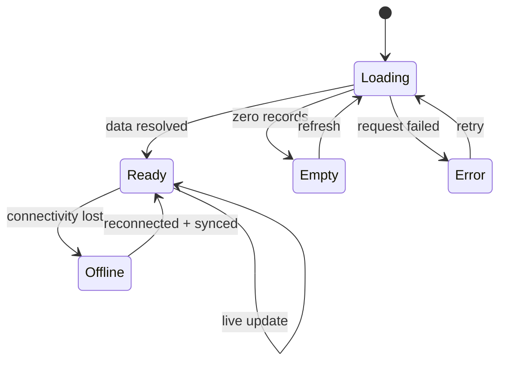
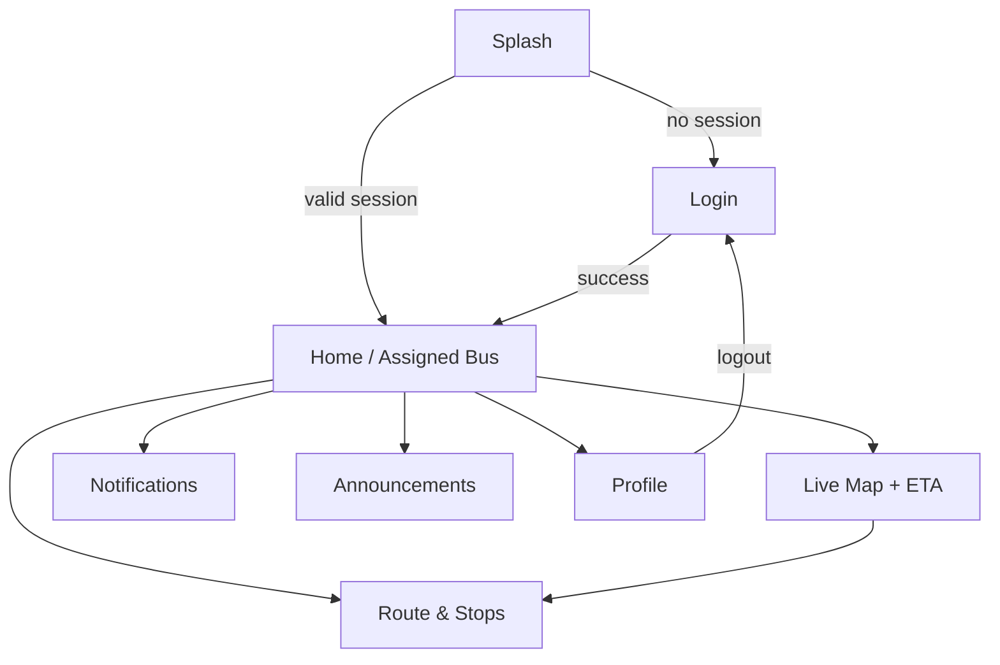
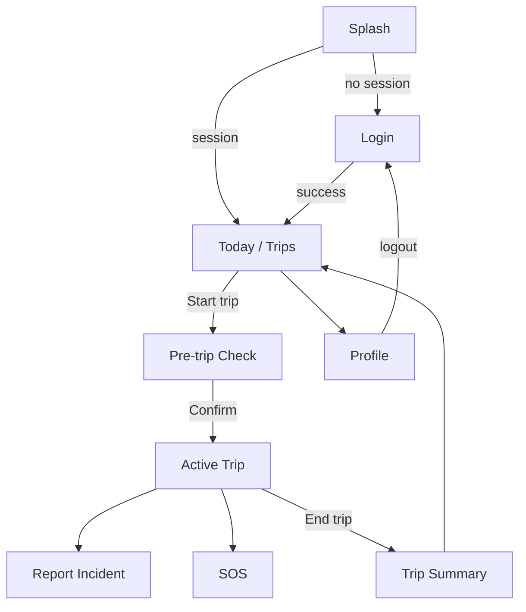
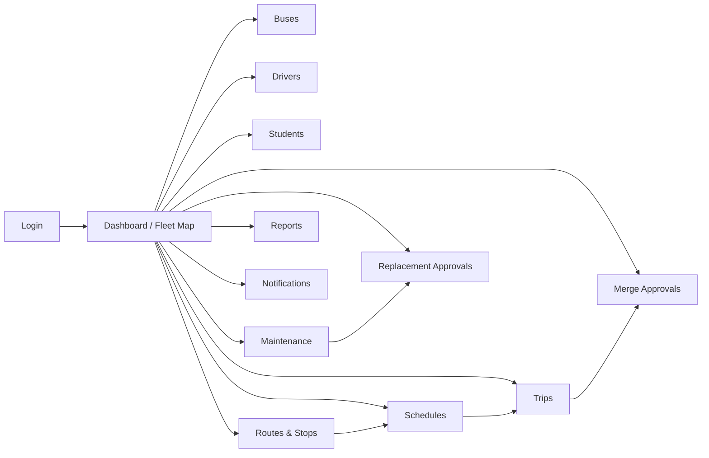

# CTMS — UI/UX Specification

**Document:** 12 · UI/UX Specification
**System:** Campus Transport Management System (CTMS)
**Version:** 1.0
**Status:** Baseline for build

This document defines the user-facing surface of CTMS across its three clients — the **Student Flutter app**, the **Driver Flutter app**, and the **Admin Next.js/React dashboard**. For each client it provides a screen inventory, a Mermaid navigation map, low-fidelity wireframes for the key screens, and the interaction states, shared components, and role-based visibility rules that engineers and designers build against.

The scope maps directly to the functional requirements FR-01…FR-15 and the domain model defined in the SRS. Every screen below cross-references the FRs it satisfies so that UI work stays traceable to requirements.

---

## 1. Cross-Client Design Principles

| Principle | Rule |
|-----------|------|
| Role-first | Each app targets exactly one role. Student and Driver apps never expose admin actions; the dashboard never exposes trip-operation controls a driver owns. |
| Real-time honesty | Any live value (bus position, ETA, passenger count) shows its freshness. Stale data is visually degraded, never presented as live. |
| Offline tolerance | Driver app must remain usable with no connectivity (GPS buffering, queued actions). Student and Admin degrade to last-known state with a clear banner. |
| One primary action per screen | Mobile screens surface a single dominant CTA. Secondary actions are demoted to overflow or sheets. |
| Confirm the irreversible | End trip, SOS, merge approval, replacement assignment, and bus deactivation require explicit confirmation. |
| Accessibility | Minimum 44×44 dp touch targets, WCAG AA contrast, dynamic type support in Flutter, keyboard navigation and ARIA roles in the dashboard. |

### 1.1 Universal UI States

Every data-bound screen implements this state machine.



| State | Student app | Driver app | Admin dashboard |
|-------|-------------|------------|-----------------|
| Loading | Skeleton cards / shimmer map tile | Skeleton trip card | Table skeleton rows, chart placeholders |
| Empty | "No bus assigned yet" illustration | "No trips scheduled today" | Empty-table zero-state with primary create CTA |
| Error | Inline retry banner | Toast + retry, non-blocking | Toast + inline error region on the failed widget |
| Offline | Amber banner "Showing last known position" | Amber pill "Offline — GPS buffering (N points)" | Amber banner "Reconnecting… live data paused" |
| Success | Snackbar confirmation | Green snackbar | Toast (top-right) |

### 1.2 Shared Component Library

| Component | Description | Used by |
|-----------|-------------|---------|
| `RoleBadge` | Colored chip showing ADMIN / DRIVER / STUDENT | all |
| `StatusPill` | Renders BusStatus / DriverStatus / TripStatus enum with color | all |
| `LiveMap` | Google Maps SDK canvas with bus marker, route polyline, stop pins, geofence circles | Student, Admin |
| `ETAChip` | ETA in minutes with freshness dot (green < 15s, amber < 60s, red stale) | Student, Admin |
| `ConnectivityBanner` | Global offline / reconnecting banner | all |
| `ConfirmSheet` / `ConfirmDialog` | Destructive-action confirmation | all |
| `PassengerStepper` | +1 / −1 counter with capacity guard | Driver |
| `NotificationTile` | Icon + title + body + timestamp + unread dot | Student, Admin |
| `DataTable` | Sortable, filterable, paginated table with row actions | Admin |
| `ApprovalCard` | Side-by-side comparison + Approve / Reject | Admin |

Color mapping for status enums (used by `StatusPill`):

| Enum value | Color intent |
|------------|--------------|
| AVAILABLE / SCHEDULED | Neutral blue |
| RUNNING / ON_TRIP | Green |
| MAINTENANCE / LEAVE | Amber |
| BREAKDOWN / CANCELLED | Red |
| OFFLINE / OFF_DUTY | Grey |
| COMPLETED | Slate |

---

## 2. Student Flutter App

The student experience is read-only and single-purpose: know which bus is mine, where it is, and when it arrives. Every screen honors the business rule that **students can only view their assigned bus**.

### 2.1 Screen Inventory

| # | Screen | Purpose | FR | Key states |
|---|--------|---------|-----|-----------|
| S1 | Splash / Auth check | Restore session, route to Login or Home | FR-01 | Loading |
| S2 | Login | Role-based student sign-in | FR-01 | Loading, Error |
| S3 | Home / Assigned Bus | Show assigned bus, route, pickup stop, trip status | FR-02, FR-04, FR-06 | Ready, Empty (no bus), Offline |
| S4 | Live Map + ETA | Real-time bus position, route polyline, ETA to my stop | FR-07, FR-09 | Ready, Offline (last known), Error |
| S5 | Stops / Route detail | Ordered stop list, my pickup stop highlighted, expected arrival | FR-05 | Ready |
| S6 | Notifications | Trip started, nearing stop, delay, replacement, completed | FR-10 | Ready, Empty |
| S7 | Announcements | Broadcast messages by audience | FR-10 | Ready, Empty |
| S8 | Profile | View profile, change password, logout, transport status | FR-01 | Ready |

### 2.2 Navigation Map



Bottom navigation tabs: **Home · Map · Alerts · Profile**. Route & Stops and Announcements are reached from Home.

### 2.3 Wireframes

**S2 — Login**

```
+------------------------------------------+
|                                          |
|              [  CTMS logo  ]             |
|          Campus Transport System         |
|                                          |
|   Email / Roll Number                    |
|   [____________________________]         |
|                                          |
|   Password                               |
|   [____________________________] (o)     |
|                                          |
|   [ ] Remember me      Forgot password?  |
|                                          |
|   [           LOG IN            ]        |
|                                          |
|   Signing in as: Student                 |
|   ---------------------------------      |
|   Error: Invalid credentials  (red)      |
+------------------------------------------+
```
States: idle → Loading (button spinner, inputs disabled) → Error (inline red text) → route to S3.

**S3 — Home / Assigned Bus**

```
+------------------------------------------+
| Hi, Anita        [role: STUDENT]  (bell) |
| Reconnecting… live data paused   (amber) |
+------------------------------------------+
| MY BUS                                   |
| +--------------------------------------+ |
| | Bus 12  (KA-01-AB-1234)   [RUNNING]  | |
| | Route R-07  Campus -> Hostel Gate    | |
| | Driver: R. Kumar                     | |
| | My stop: Library Circle (#4)         | |
| +--------------------------------------+ |
|                                          |
| ETA TO MY STOP                           |
| +--------------------------------------+ |
| |   ~ 8 min   (o live)   Delay +3 min  | |
| +--------------------------------------+ |
|                                          |
| [   VIEW LIVE MAP   ]                    |
|                                          |
| RECENT ALERTS                            |
|  - Trip started              7:32 AM     |
|  - Bus nearing your stop     7:58 AM     |
+------------------------------------------+
| Home |  Map  |  Alerts  |  Profile       |
+------------------------------------------+
```
Empty state (transportEnabled = false or no busId): replace MY BUS card with "No bus assigned. Contact the transport office."

**S4 — Live Map + ETA**

```
+------------------------------------------+
| < Live Tracking          Bus 12 [RUNNING]|
+------------------------------------------+
|                                          |
|        [   GOOGLE MAP CANVAS   ]         |
|      * bus marker (heading arrow)        |
|      -- route polyline --                |
|      (o) my pickup stop pin              |
|      .. geofence circle ..               |
|                                          |
+------------------------------------------+
| ETA to Library Circle:  ~ 8 min (o live) |
| Current speed: 34 km/h   Next stop: #3   |
| Last update: 4s ago                      |
| [ Recenter ]                [ My stop ]  |
+------------------------------------------+
```
Offline: map dims, freshness dot turns red, banner "Showing last known position (2 min ago)". Data source: TripLocation stream over Reverb WebSocket; ETA from FR-09 Google Routes API.

**S6 — Notifications**

```
+------------------------------------------+
| < Notifications              [Mark all]  |
+------------------------------------------+
| (o) Bus nearing your stop      7:58 AM   |
|     Bus 12 is 1 stop away.               |
| ---------------------------------------- |
|     Delay reported             7:45 AM   |
|     Route R-07 delayed ~5 min.           |
| ---------------------------------------- |
|     Replacement bus assigned   Yesterday |
|     Bus 19 now serves your route.        |
| ---------------------------------------- |
|     Trip completed             Yesterday |
+------------------------------------------+
```
Unread rows carry a leading dot and bold title. Empty: "You're all caught up." Notification.type drives the leading icon.

### 2.4 Role-Based Visibility (Student)

- Sees only records where `Trip.busId == Student.busId` and `Route == Student.routeId`.
- No passenger counter, no trip controls, no other students' data.
- Notifications filtered to `receiverId == currentUser.id` plus Announcements matching audience.

---

## 3. Driver Flutter App

The driver app is an operational tool used one-handed, often in motion, sometimes offline. It optimizes for large targets, minimal reading, and instant safety access (SOS). It enforces **one active driver per bus per trip** and the **passenger count never exceeds capacity** rule.

### 3.1 Screen Inventory

| # | Screen | Purpose | FR | Key states |
|---|--------|---------|-----|-----------|
| D1 | Splash / Auth check | Restore session | FR-01 | Loading |
| D2 | Login | Driver sign-in | FR-01 | Loading, Error |
| D3 | Today / Trip list | Assigned trips for today with Start | FR-06 | Ready, Empty, Offline |
| D4 | Pre-trip check | Confirm bus, capacity, route before start | FR-06 | Ready |
| D5 | Active Trip | Live GPS status, passenger +/−, End trip | FR-07, FR-08 | Ready, Offline (buffering) |
| D6 | Report Incident | Log breakdown / accident / tyre / engine / battery | FR-11, FR-14 | Ready, Error |
| D7 | SOS | One-tap emergency alert | FR-11 | Confirm, Sent |
| D8 | Trip summary | End-of-trip recap (distance, count, delay) | FR-06, FR-15 | Ready |
| D9 | Profile | License info, status, logout | FR-01, FR-03 | Ready |

### 3.2 Navigation Map



Persistent floating **SOS** button is available on D5, D6, and D8.

### 3.3 Wireframes

**D3 — Today / Trip List**

```
+------------------------------------------+
| Today  ·  Mon 10 Jul     [role: DRIVER]  |
| Offline — actions will sync      (amber) |
+------------------------------------------+
| ASSIGNED TRIPS                           |
| +--------------------------------------+ |
| | 7:30 AM   Route R-07                  | |
| | Bus 12  Campus -> Hostel Gate         | |
| | Status: SCHEDULED                     | |
| | [        START TRIP        ]          | |
| +--------------------------------------+ |
| +--------------------------------------+ |
| | 4:45 PM   Route R-07 (return)         | |
| | Bus 12   Status: SCHEDULED            | |
| | [   Start available at 4:15 PM   ]    | |
| +--------------------------------------+ |
+------------------------------------------+
| Trips |            SOS            | Me    |
+------------------------------------------+
```
Empty: "No trips assigned today." Start is disabled if the bus `status` is MAINTENANCE/BREAKDOWN (business rule: bus in maintenance cannot be assigned) — show reason inline.

**D4 — Pre-trip Check**

```
+------------------------------------------+
| < Start Trip — Route R-07                |
+------------------------------------------+
| Bus 12  (KA-01-AB-1234)   [AVAILABLE]    |
| Capacity: 52     Starting count: 0       |
| Route: Campus -> Hostel Gate  (9 stops)  |
|                                          |
| Checklist                                |
| [x] GPS device connected                 |
| [x] Doors / seats OK                      |
| [ ] Fuel sufficient                      |
|                                          |
| [        CONFIRM & START        ]        |
+------------------------------------------+
```
On confirm: Trip.status -> RUNNING, Driver.status -> ON_TRIP, Bus.status -> RUNNING, GPS stream begins.

**D5 — Active Trip (core screen)**

```
+------------------------------------------+
| ACTIVE · Route R-07        [RUNNING]     |
| GPS: sharing (o)   Sent 4s ago           |
| Offline — buffering 12 points   (amber)  |
+------------------------------------------+
|            PASSENGERS ON BOARD           |
|                                          |
|      [  -1  ]      34      [  +1  ]       |
|                  / 52 cap                 |
|      Last: Board at Library Circle        |
|                                          |
+------------------------------------------+
| Next stop: Library Circle (#4)           |
| Speed 34 km/h · Delay +3 min             |
+------------------------------------------+
| [  REPORT INCIDENT  ]   [   END TRIP   ] |
+------------------------------------------+
|              (  SOS  floating  )         |
+------------------------------------------+
```
- `+1` disabled and shows toast "At capacity (52)" when `currentPassengers == capacity` (business rule enforced client-side and server-side).
- `−1` disabled at 0. Each tap writes a PassengerLog (Board/Exit) and updates Trip.passengerCount.
- END TRIP opens ConfirmSheet: "End trip? This stops GPS sharing." → Trip.status COMPLETED, Bus.status AVAILABLE, Driver.status AVAILABLE → D8.
- Offline: taps queue locally; GPS points buffer and auto-sync on reconnect (Reliability NFR).

**D6 — Report Incident**

```
+------------------------------------------+
| < Report Incident        Bus 12 · R-07   |
+------------------------------------------+
| Issue type                               |
| ( ) Breakdown   ( ) Accident             |
| ( ) Tyre puncture ( ) Engine issue       |
| ( ) Battery issue                        |
|                                          |
| Severity   [ Low | Medium | High ]       |
|                                          |
| Description                              |
| [____________________________________]   |
| [____________________________________]   |
|                                          |
| Photo   [ + Attach ]   (o) location auto |
|                                          |
| [        SUBMIT INCIDENT        ]        |
+------------------------------------------+
```
Submitting a VehicleIncident auto-creates a MaintenanceTicket (FR-14 / business rule: every incident creates a maintenance record) and, for Breakdown/Accident, triggers the replacement-bus recommendation workflow (FR-12). Confirmation: "Incident logged. Ticket #MT-2043 created."

**D7 — SOS**

```
+------------------------------------------+
|                                          |
|          [ !! ]  EMERGENCY SOS           |
|                                          |
|   Hold to send an emergency alert to     |
|   the transport control room with your    |
|   live location.                          |
|                                          |
|        (  HOLD 3s TO SEND  )              |
|                                          |
|   -- after send --                       |
|   SOS SENT · Control room notified        |
|   Location shared · Stay safe             |
+------------------------------------------+
```
Hold-to-confirm prevents accidental fire. On send: high-priority FCM to admins, VehicleIncident (severity High) created, location attached.

### 3.4 Role-Based Visibility (Driver)

- Sees only trips where `Trip.driverId == currentDriver.id`.
- Passenger controls active only during a RUNNING trip the driver owns.
- Cannot approve merges/replacements, cannot edit routes, cannot see other drivers' trips.

---

## 4. Admin Next.js / React Dashboard

The dashboard is a desktop-first control center for the Transport Department. It owns all CRUD, monitoring, and approval workflows. Layout: fixed left nav, top bar (search, notifications, profile), main content region with tables, maps, and approval cards.

### 4.1 Screen Inventory

| # | Screen | Purpose | FR | Key states |
|---|--------|---------|-----|-----------|
| A0 | Login | Admin sign-in | FR-01 | Loading, Error |
| A1 | Dashboard / Fleet Map | KPIs + live fleet map | FR-07, FR-15 | Ready, Offline |
| A2 | Buses | Bus CRUD, status, assignment | FR-02 | Ready, Empty, Error |
| A3 | Drivers | Driver register + assign bus | FR-03 | Ready, Empty |
| A4 | Students | Student register + route assign | FR-04 | Ready, Empty |
| A5 | Routes & Stops builder | Create routes, ordered stops, geofence | FR-05 | Ready |
| A6 | Schedules | Recurring departure/arrival per route+bus | FR-05, FR-06 | Ready |
| A7 | Trips | Create/monitor daily trips | FR-06 | Ready, Empty |
| A8 | Merge Approvals | Approve/reject consolidation recs | FR-13 | Ready, Empty |
| A9 | Replacement Approvals | Approve replacement assignments | FR-12 | Ready, Empty |
| A10 | Maintenance | Tickets from incidents | FR-11, FR-14 | Ready, Empty |
| A11 | Reports & Analytics | Operational reports | FR-15 | Ready, Loading |
| A12 | Notifications / Announcements | Broadcast to audiences | FR-10 | Ready |

### 4.2 Navigation Map



Left-nav groups: **Monitor** (Dashboard, Trips) · **Fleet** (Buses, Drivers, Maintenance) · **Network** (Routes, Schedules) · **People** (Students) · **Approvals** (Merge, Replacement) · **Insights** (Reports) · **Comms** (Notifications).

### 4.3 Wireframes

**A1 — Dashboard / Fleet Map**

```
+---------+--------------------------------------------------+
| CTMS    | Dashboard            [search]  (bell 3)  Admin v |
|---------|--------------------------------------------------|
| Monitor | [Buses running 14][On trip 12][Breakdown 1][Idle 6]
|  Dash   |--------------------------------------------------|
|  Trips  | +--------------------------+ +-----------------+ |
| Fleet   | |    LIVE FLEET MAP        | | ALERTS          | |
|  Buses  | |  * * bus markers *       | | - Bus 7 SOS     | |
|  Drivers| |  -- route polylines --   | | - Merge rec x2  | |
|  Maint  | |  (o) stop pins           | | - Replace rec   | |
| Network | +--------------------------+ +-----------------+ |
|  Routes | ACTIVE TRIPS                                     |
|  Sched  | | Trip  Route  Bus  Driver  Pax   Status  Delay | |
| People  | | T-19  R-07   12   Kumar   34/52 RUNNING  +3   | |
|  Students| | T-20  R-03   09   Rao     21/45 RUNNING  0    | |
| Approvals|+-------------------------------------------------+
+---------+--------------------------------------------------+
```
KPI tiles pull live counts from BusStatus/TripStatus. Offline: banner "Reconnecting… live data paused", map dims, KPIs show last-updated time.

**A2 — Buses (CRUD table)**

```
+----------------------------------------------------------+
| Buses                        [ + Add Bus ]   [search] [v]|
+----------------------------------------------------------+
| Filter: Status [All v]  Fuel [All v]                     |
+----------------------------------------------------------+
| Bus#  Reg No       Cap  Pax   Status       Next service  |
|------------------------------------------------ actions --|
| 12    KA-01-AB1234 52   34    [RUNNING]     12 Aug   ...  |
| 09    KA-01-CD5678 45   21    [RUNNING]     02 Sep   ...  |
| 19    KA-02-EF9012 40   0     [MAINTENANCE] in shop  ...  |
| 07    KA-02-GH3456 52   0     [BREAKDOWN]   -        ...  |
+----------------------------------------------------------+
| Rows 1-4 of 38                         < 1 2 3 ... 10 >   |
+----------------------------------------------------------+
```
Row overflow (…): Edit · Assign driver · Assign route · Change status · Deactivate. Add/Edit opens a right-side drawer with the full Bus field set (busNumber, registrationNumber, chassisNumber, engineNumber, manufacturer, model, capacity, fuelType, insuranceExpiry, permitExpiry…). A bus in MAINTENANCE/BREAKDOWN is blocked from assignment with an inline reason.

**A5 — Routes & Stops Builder**

```
+----------------------------------------------------------+
| Route: R-07  Campus -> Hostel Gate     [ Save Route ]    |
+---------------------------+------------------------------+
| STOPS (drag to reorder)   |        MAP (place pins)      |
| 1  Main Gate     07:30    |   (o)1 --(o)2 --(o)3         |
| 2  Admin Block   07:36    |        \-- polyline --       |
| 3  Science Blk   07:42    |   (o)4 pickup                 |
| 4  Library Circle 07:48   |   geofence radius: 80 m       |
| 5  Sports Comp   07:54    |                              |
| [ + Add stop ]            |   Total: 8.4 km · 32 min      |
+---------------------------+------------------------------+
```
Each stop maps to a RouteStop (stopName, latitude, longitude, sequence, geofenceRadius, expectedArrival). Places API autocomplete for stop names; drag sets `sequence`.

**A7 — Trips**

```
+----------------------------------------------------------+
| Trips        Date [10 Jul v]        [ + Create Trip ]    |
+----------------------------------------------------------+
| Trip  Route Bus Driver  Sched   Status     Pax  Delay    |
| T-19  R-07  12  Kumar   07:30    RUNNING    34   +3   ... |
| T-18  R-03  09  Rao     07:30    COMPLETED  45   +1   ... |
| T-21  R-05  --  --      08:00    SCHEDULED  0    -    ... |
+----------------------------------------------------------+
```
Create Trip drawer: pick Schedule → auto-fills route; assign Bus (only AVAILABLE) and Driver (only AVAILABLE). Enforces one active driver per bus. Row actions: view live, cancel, view incidents.

**A8 — Merge Approvals**

```
+----------------------------------------------------------+
| Bus Consolidation Recommendations                        |
+----------------------------------------------------------+
| +------------------------------------------------------+ |
| | Merge suggestion  ·  PENDING                          | |
| |  Source  Trip T-24  Bus 15  Pax 8                     | |
| |  Target  Trip T-19  Bus 12  Pax 34   (cap 52)         | |
| |  Merged pax 42  ·  Fuel saved ~3.1 L                 | |
| |  Distance increase +1.2 km                            | |
| |            [ Reject ]        [ Approve ]              | |
| +------------------------------------------------------+ |
+----------------------------------------------------------+
```
`ApprovalCard` for each BusMergeRecommendation. Approve sets status APPROVED, records `approvedBy`, notifies affected students (route change / consolidation) via FR-10. Empty: "No consolidation recommendations right now."

**A9 — Replacement Approvals**

```
+----------------------------------------------------------+
| Replacement Bus Approvals                                |
+----------------------------------------------------------+
| Incident INC-88  Bus 07 BREAKDOWN on R-05  (High)        |
| Recommended replacements:                                |
| ( ) Bus 22  AVAILABLE  ETA 9 min   Driver: Free          |
| ( ) Bus 30  AVAILABLE  ETA 14 min  Driver: Free          |
|                                                          |
|            [ Reject ]        [ Assign selected ]         |
+----------------------------------------------------------+
```
Assign creates a ReplacementAssignment (replacementBusId, replacementDriverId, etaMinutes, status), flips the failed bus to BREAKDOWN, notifies students "replacement bus" (FR-10). Requires admin approval (business rule).

**A10 — Maintenance**

```
+----------------------------------------------------------+
| Maintenance Tickets              Status [Open v] [search]|
+----------------------------------------------------------+
| Ticket   Bus  From incident  Technician  Status   Cost   |
| MT-2043  07   INC-88         --          OPEN     -      |
| MT-2039  19   INC-81         S. Iqbal    IN_PROG  12,400 |
| MT-2031  11   INC-74         S. Iqbal    CLOSED   4,200  |
+----------------------------------------------------------+
```
Tickets auto-created from incidents (FR-14). Detail drawer: assignedTechnician, repairStart/End, estimatedCost, remarks. Closing a ticket can return the bus to AVAILABLE.

**A11 — Reports & Analytics**

```
+----------------------------------------------------------+
| Reports            Range [This week v]   [ Export CSV ]  |
+----------------------------------------------------------+
| [Trips 214] [On-time 92%] [Avg delay 4m] [Fuel saved 61L]|
+----------------------------------------------------------+
| Trips per day        | Incidents by type                |
|  bar chart           |  breakdown / tyre / engine ...    |
+----------------------+-----------------------------------+
| Occupancy by route (table)                               |
+----------------------------------------------------------+
```
Loading: chart skeletons. Reports draw from Trip, PassengerLog, VehicleIncident, MaintenanceTicket, BusMergeRecommendation aggregates (FR-15).

### 4.4 Role-Based Visibility (Admin)

- Full read/write across all modules within the admin's campus scope (Scalability NFR: multi-campus).
- Approval actions (merge, replacement) gated to Admin role only; `approvedBy` recorded for audit logs (Security NFR).
- Destructive actions (deactivate bus, cancel trip) require ConfirmDialog and are audit-logged.

---

## 5. Interaction & Real-Time Notes

| Concern | Behavior |
|---------|----------|
| Live position | TripLocation streamed via Laravel Reverb WebSocket at 5–10s (FR-07). Marker interpolates between updates. |
| Freshness | `ETAChip` / GPS dot: green < 15s, amber 15–60s, red > 60s (stale). |
| Push | FCM delivers FR-10 notification types; tapping deep-links to the relevant screen (Student → Live Map; Admin → Approval/Incident). |
| Optimistic UI | Driver passenger taps update instantly, reconcile on server ack; Admin table edits show pending row style until confirmed. |
| Offline sync | Driver GPS + passenger actions buffer locally and replay in order on reconnect (Reliability NFR). |
| Confirmations | End trip, SOS, deactivate bus, approve merge, assign replacement, cancel trip. |

---

## 6. Accessibility & Responsiveness

| Client | Rules |
|--------|-------|
| Student / Driver (Flutter) | Dynamic type, 44 dp targets, high-contrast status colors never sole signal (pair with label/icon), haptic feedback on +/− and SOS, screen-reader labels on map controls. |
| Admin (Next.js) | Keyboard-navigable tables and drawers, ARIA roles on nav/dialogs, responsive: 3-column at desktop, collapses left nav to icons < 1024px, tables horizontally scroll < 768px, focus-visible outlines. |

---

## Cross-references

- `01-srs.md` — functional and non-functional requirements (FR-01…FR-15).
- `02-domain-model.md` — entities, attributes, and enums referenced by every screen.
- `05-api-spec.md` — REST/WebSocket endpoints backing each screen action.
- `07-realtime-tracking.md` — GPS streaming, ETA (FR-07/FR-09) consumed by Live Map.
- `09-notifications.md` — FCM notification types feeding Student/Admin alerts (FR-10).
- `10-workflows.md` — incident → replacement → maintenance flows shown in Driver/Admin screens.
- `13-design-system.md` — tokens, typography, and the shared component library detailed here.
