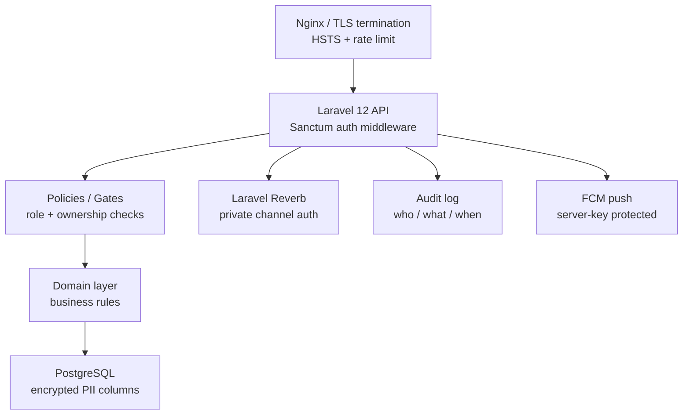
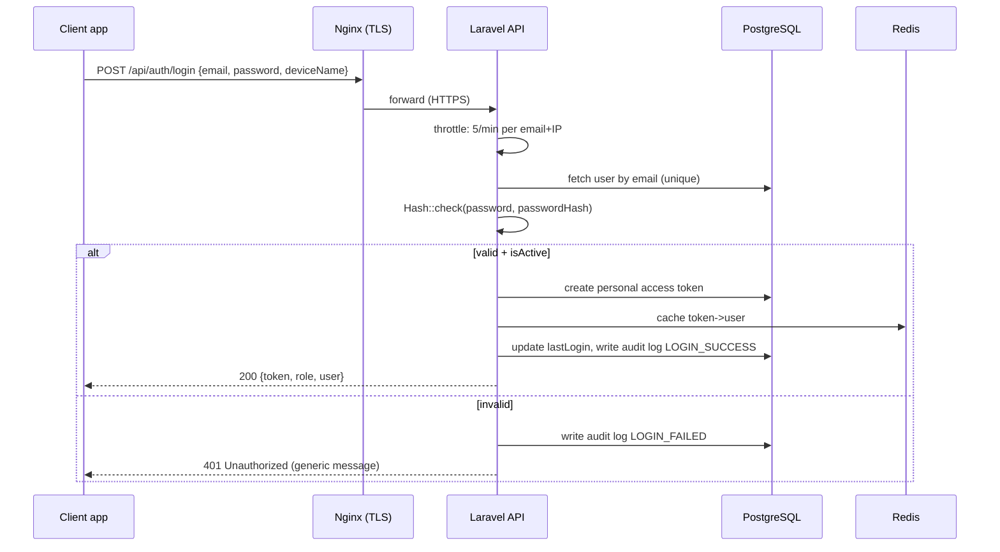
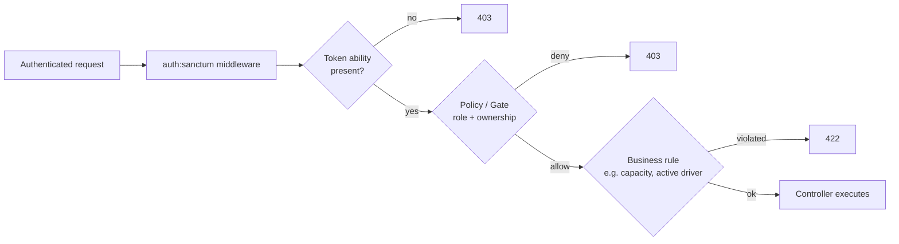
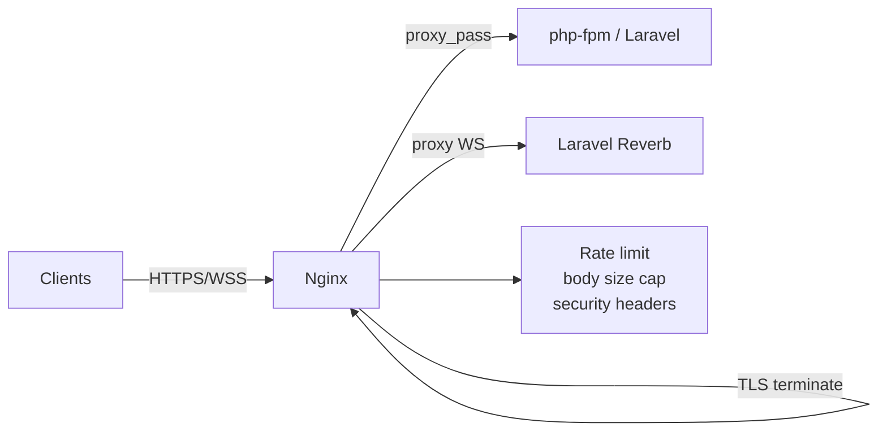

# CTMS Security Design

**Document:** 13 — Security Design
**System:** Campus Transport Management System (CTMS)
**Version:** 1.0
**Audience:** Backend engineers, DevOps, security reviewers, QA

---

## 1. Purpose & Scope

This document defines the security architecture for CTMS across authentication, authorization, data protection, transport security, secrets management, auditing, and abuse prevention. It maps directly to the SRS non-functional requirements: **HTTPS everywhere, JWT/Sanctum authentication, role-based authorization, and audit logs.**

Security is enforced at multiple layers so that a failure in one layer does not collapse the whole system:



| Layer | Control |
|-------|---------|
| Network edge | TLS 1.2+/1.3, HSTS, IP-level rate limiting, request size caps |
| Transport | HTTPS-only, WSS for Reverb, certificate pinning on mobile apps (recommended) |
| Application | Sanctum token auth, input validation, throttling middleware |
| Authorization | Laravel Policies + Gates, role checks, ownership checks |
| Data | Column encryption for PII, bcrypt/argon2 password hashing |
| Observability | Audit logs, failed-login tracking, incident/SOS alerting |

---

## 2. Authentication

### 2.1 Primary mechanism — Laravel Sanctum tokens

All three clients (Student Flutter app, Driver Flutter app, Admin Next.js dashboard) authenticate through **Laravel Sanctum personal access tokens**. Sanctum is chosen over full OAuth because CTMS is a first-party system with first-party clients; there is no third-party delegation requirement.

- The **mobile apps** use Sanctum **token-based** authentication (Bearer tokens) rather than cookie/session, because native apps do not participate in the SPA CSRF cookie flow.
- The **Admin dashboard** may use either the SPA cookie mode (with CSRF protection) or Bearer tokens; this design standardizes on **Bearer tokens for all clients** to keep the API stateless and uniform.

**JWT alternative.** If the deployment later requires stateless verification without a token-lookup round-trip (e.g. multiple independent services validating tokens without sharing the DB), Sanctum can be swapped for a JWT implementation (`tymon/jwt-auth` or Laravel Passport). Trade-offs:

| Aspect | Sanctum (chosen) | JWT |
|--------|------------------|-----|
| Revocation | Instant (delete DB row) | Hard — needs blocklist/short TTL |
| Statelessness | Token lookup per request (cached in Redis) | Fully stateless verify |
| Complexity | Low | Higher (key rotation, claims) |
| Multi-service verify | Needs shared DB/cache | Native |
| Fit for CTMS | Best — single API, instant logout | Only if service mesh appears |

### 2.2 Login flow



**Rules**
- Login response messages are **generic** ("Invalid credentials") — never reveal whether the email exists (prevents user enumeration).
- Only users with `isActive = true` may obtain a token. Deactivating a bus driver or student immediately blocks new logins; existing tokens are revoked (see 2.4).
- `UserRole` (ADMIN / DRIVER / STUDENT) is embedded in the token's abilities and returned to the client so the app renders the correct home screen. The server never trusts a client-sent role — role is always re-read server-side.

### 2.3 Token abilities (scopes)

Sanctum abilities restrict what a token can do, mapped to role:

| Role | Granted abilities |
|------|-------------------|
| ADMIN | `admin:*` (full management), `report:read`, `merge:approve`, `replacement:approve` |
| DRIVER | `trip:manage`, `gps:push`, `passenger:update`, `incident:report`, `sos:send` |
| STUDENT | `bus:view-own`, `eta:view`, `notification:read` |

Abilities are a defense-in-depth layer **in addition to** Policies — an ADMIN-only route checks both the ability and the Policy.

### 2.4 Token lifecycle

| Event | Action |
|-------|--------|
| Login | Issue token with `deviceName`, role abilities, `expires_at` set |
| Access token TTL | **Driver/Student: 30 days sliding**; **Admin: 12 hours** (higher privilege → shorter life) |
| Logout | Delete current token row (`currentAccessToken()->delete()`) |
| Logout all devices | Delete all tokens for the user |
| Password change | Revoke **all** tokens except the current session; force re-login on other devices |
| Account deactivation | Revoke all tokens immediately |
| Suspicious activity | Admin can revoke any user's tokens from dashboard |

A scheduled job (`sanctum:prune-expired`) purges expired tokens daily. Token strings are stored **hashed** (SHA-256) in `personal_access_tokens` — the plaintext is shown to the client exactly once.

### 2.5 Password hashing

- Passwords are stored in `passwordHash` using Laravel's `Hash` facade.
- Default driver: **bcrypt** with cost factor **12**. **argon2id** is the preferred alternative and can be enabled via `config/hashing.php` (`driver => 'argon2id'`, `memory`, `time`, `threads` tuned for the server).
- Rehash-on-login: `Hash::needsRehash()` upgrades hashes automatically when the cost/algorithm changes.
- Plaintext passwords are never logged, never returned, and excluded from every API resource and audit entry.

**Password policy (validated on register / change):** minimum 8 chars, at least one letter and one number, checked against Laravel's `Password::uncompromised()` (HaveIBeenPwned k-anonymity) rule.

---

## 3. Authorization (RBAC)

CTMS uses **role-based access control** with **ownership** (row-level) checks. Roles come from the domain model: ADMIN, DRIVER, STUDENT.

### 3.1 Permission matrix

Legend: **A** = Allow, **D** = Deny, **A\*** = Allow but only for own/assigned records.

| Action / Resource (FR) | Admin | Driver | Student |
|------------------------|:-----:|:------:|:-------:|
| Login / logout (FR-01) | A | A | A |
| Change own password / profile | A | A | A |
| Create/Update/Deactivate Bus (FR-02) | A | D | D |
| Assign Bus to route/driver (FR-02/03) | A | D | D |
| Register Driver (FR-03) | A | D | D |
| Register Student (FR-04) | A | D | D |
| Create Route / Stop / Schedule (FR-05) | A | D | D |
| Create Trip, assign bus+driver (FR-06) | A | D | D |
| Start Trip / End Trip (FR-06) | D | A\* | D |
| Push GPS location (FR-07) | D | A\* | D |
| Update passenger count +1/-1 (FR-08) | D | A\* | D |
| View live bus location (FR-07) | A | A\* | A\* |
| View ETA (FR-09) | A | A\* | A\* |
| Send / manage Notifications (FR-10) | A | D | D |
| Receive / read Notifications (FR-10) | A | A\* | A\* |
| Report Vehicle Incident (FR-11) | D | A\* | D |
| Send SOS | D | A\* | D |
| View incidents | A | A\* | D |
| Recommend/Approve Replacement Bus (FR-12) | A | D | D |
| Approve/Reject Bus Merge (FR-13) | A | D | D |
| View/Manage Maintenance tickets (FR-14) | A | D | D |
| View operational reports (FR-15) | A | D | D |
| View **own** assigned bus / route (Student) | A | n/a | A\* |

**Key ownership rules baked into A\*:**
- A Driver may only start/end/push GPS/update passengers for a **Trip whose `driverId` is their own**.
- A Student may only view the **Bus/Route assigned to them** (`Student.busId`, `Student.routeId`) — enforcing the business rule "students can only view their assigned bus."
- A Driver may only view live location for a trip they are actively driving.

### 3.2 Enforcement — Policies and Gates

Authorization is enforced server-side with **Laravel Policies** (per-model) and **Gates** (for non-model actions like `approveMerge`). The client UI hiding a button is convenience only; every mutation is re-authorized on the server.



**Example policy checks**

| Policy method | Rule |
|---------------|------|
| `TripPolicy@start` | `user->id === trip->driverId` AND `trip->status === SCHEDULED` AND bus not in MAINTENANCE |
| `TripPolicy@pushLocation` | `user->id === trip->driverId` AND `trip->status === RUNNING` |
| `StudentBusPolicy@view` | `student->busId === bus->id` |
| `BusMergePolicy@approve` | `user->role === ADMIN` |
| `ReplacementPolicy@approve` | `user->role === ADMIN` |
| `IncidentPolicy@report` | `user->id === trip->driverId` |

Policies are wired via `authorizeResource` in controllers and `Gate::authorize()` for standalone actions. Denials return **403** and are written to the audit log as `AUTHZ_DENIED`.

### 3.3 Business-rule guards (defense beyond RBAC)

These are enforced in the domain/service layer even for otherwise-authorized users:

- Passenger count may **never exceed `Bus.capacity`** — the `+1` handler rejects with 422 at capacity.
- **Only one active DRIVER per bus** during a trip — enforced by a unique constraint / status check.
- A **bus in MAINTENANCE or BREAKDOWN cannot be assigned** to a trip.
- **Bus merge** and **replacement bus** require an ADMIN approval record before taking effect.
- Every **VehicleIncident automatically creates a MaintenanceTicket** (1:1) — done transactionally.

---

## 4. Audit Logging

Every security-relevant and state-changing action is recorded in an append-only `audit_logs` table. This satisfies the SRS **audit logs** requirement and supports incident forensics.

### 4.1 Audit log model (who / what / when)

| Column | Type | Meaning |
|--------|------|---------|
| id | UUID | PK |
| actorId | UUID (FK user, nullable) | **Who** — null for anonymous/failed login |
| actorRole | enum UserRole | Role at time of action |
| action | string | **What** — e.g. `LOGIN_SUCCESS`, `TRIP_STARTED`, `MERGE_APPROVED` |
| entityType | string | Affected model, e.g. `Bus`, `Trip`, `MaintenanceTicket` |
| entityId | UUID (nullable) | Affected record |
| oldValues | jsonb (nullable) | Before-state (PII redacted) |
| newValues | jsonb (nullable) | After-state (PII redacted) |
| ipAddress | inet | Source IP |
| userAgent | string | Client / device |
| result | enum | `SUCCESS` / `DENIED` / `ERROR` |
| createdAt | timestamptz | **When** |

### 4.2 Logged events (minimum set)

| Category | Events |
|----------|--------|
| Auth | LOGIN_SUCCESS, LOGIN_FAILED, LOGOUT, PASSWORD_CHANGED, TOKEN_REVOKED |
| Access control | AUTHZ_DENIED |
| Fleet | BUS_CREATED, BUS_UPDATED, BUS_DEACTIVATED, BUS_ASSIGNED |
| People | DRIVER_REGISTERED, STUDENT_REGISTERED, ROUTE_CREATED |
| Trips | TRIP_STARTED, TRIP_ENDED, TRIP_CANCELLED |
| Safety | INCIDENT_REPORTED, SOS_SENT, REPLACEMENT_APPROVED |
| Optimization | MERGE_APPROVED, MERGE_REJECTED |
| Maintenance | TICKET_CREATED, TICKET_UPDATED |

**Guarantees**
- Audit rows are **immutable** — no UPDATE/DELETE via application code; write-only inserts.
- `oldValues`/`newValues` **redact PII** (aadhaar, license, guardian phone are masked before storage — see §6).
- Failed logins are counted per email+IP in Redis to feed lockout/throttling.
- Retention: audit logs kept ≥ 1 year; SOS/incident logs kept indefinitely.

---

## 5. Input Validation & Rate Limiting

### 5.1 Input validation

- Every endpoint uses a dedicated **Form Request** class with explicit rules — no controller trusts raw input.
- **Mass-assignment protection:** models use `$fillable` allowlists; role/ownership fields (`role`, `busId` on Student, `driverId` on Trip) are set server-side, never bound from request body.
- **Type/format rules:** UUIDs validated as `uuid`; coordinates validated as numeric within lat [-90,90] / lng [-180,180]; enums validated with `Rule::enum(...)` against `BusStatus`, `DriverStatus`, `TripStatus`, etc.; email `email:rfc,dns` + unique; dates/times typed.
- **SQL injection:** prevented by exclusive use of Eloquent/parameterized queries — no raw string-concatenated SQL.
- **XSS:** API is JSON-only; the Next.js dashboard escapes output by default. Any rich text (`description`, `remarks`) is sanitized/escaped on render.
- **File uploads** (`profilePhoto`, incident `imageUrl`): validated MIME type + max size, stored outside webroot / on object storage, served via signed URLs; filenames randomized.
- **GPS payloads (FR-07):** validated for plausible speed/accuracy; out-of-range or stale timestamps rejected to prevent location spoofing polluting analytics.

### 5.2 Rate limiting

Laravel `RateLimiter` named limiters, backed by Redis, applied via middleware:

| Limiter | Scope | Limit |
|---------|-------|-------|
| `login` | email + IP | 5 / minute, then exponential backoff |
| `api` (authenticated) | user id | 120 / minute |
| `gps` | driver token | 20 / minute (covers 5–10s interval + buffer flush) |
| `passenger` | driver token | 60 / minute |
| `sos` | driver token | 5 / minute (never fully block — safety) |
| `reports` | admin id | 30 / minute |
| Global (Nginx) | IP | connection + request-rate caps, body size ≤ 10 MB |

Exceeding a limit returns **429** with `Retry-After`. SOS is deliberately given a generous, non-zero floor so an emergency is never silently dropped.

---

## 6. PII Handling & Data Protection

### 6.1 Sensitive field inventory

| Field | Entity | Classification | Protection |
|-------|--------|----------------|-----------|
| aadhaarNumber | Driver | High (national ID) | Encrypted at rest + masked in all reads |
| drivingLicenseNumber | Driver | High | Encrypted at rest + masked |
| licenseExpiry | Driver | Medium | Plain (needed for expiry checks) |
| guardianPhone | Student | High | Encrypted at rest + masked |
| guardianName | Student | Medium | Plain, access-restricted |
| phone / email | User | Medium | Access-restricted, TLS in transit |
| dateOfBirth | User | Medium | Access-restricted |
| passwordHash | User | Critical | Bcrypt/argon2, never returned |
| addressLine1/2, city… | User | Medium | Access-restricted |
| latitude / longitude | TripLocation | Medium | Access-restricted; students see own bus only |

### 6.2 Encryption at rest

- `aadhaarNumber`, `drivingLicenseNumber`, and `guardianPhone` use Laravel's **`encrypted` cast** (AES-256-CBC via `APP_KEY`), so the plaintext exists only in memory during a request; the DB stores ciphertext.
- Because encrypted columns are non-searchable, if lookup is ever needed a **blind index** (HMAC of the value with a separate key) column is added — never a plaintext duplicate.
- Database-level: PostgreSQL volume encryption at the disk/host level plus restricted DB credentials (least privilege; the app role cannot DROP).

### 6.3 Masking

When these fields are returned in any API resource (e.g. admin viewing a driver), they are **masked** unless the requester has an explicit `pii:reveal` ability (ADMIN only, audited):

| Field | Masked form |
|-------|-------------|
| aadhaarNumber | `XXXX XXXX 1234` (last 4) |
| drivingLicenseNumber | `••••••7890` (last 4) |
| guardianPhone | `+91 ••••• •4321` (last 4) |

Every reveal of unmasked PII writes a `PII_REVEALED` audit entry (who/what/when).

### 6.4 Data minimization & subject rights

- Students/Drivers see only their own profile; the Student app never receives other students' data.
- API resources use allowlists — new model fields are **not** auto-exposed.
- Deactivation performs a soft-disable (`isActive = false`); a documented erasure procedure hard-deletes/anonymizes PII on request while preserving non-identifying operational aggregates.

---

## 7. Transport Security

### 7.1 HTTPS / TLS

- **All** traffic (REST API, dashboard, Reverb WebSockets) is HTTPS/WSS only. Plain HTTP on Nginx returns **301** to HTTPS.
- TLS **1.2 minimum, 1.3 preferred**; weak ciphers disabled; certificates from a trusted CA (Let's Encrypt/ACME with auto-renewal).
- **HSTS** header (`max-age=31536000; includeSubDomains; preload`).
- Security headers set at Nginx: `X-Content-Type-Options: nosniff`, `X-Frame-Options: DENY`, `Referrer-Policy: strict-origin-when-cross-origin`, `Content-Security-Policy` for the dashboard.
- **Mobile apps** should pin the server certificate/public key (certificate pinning) to resist MITM on untrusted campus/mobile networks.

### 7.2 Nginx responsibilities



- TLS termination, HTTP→HTTPS redirect, security headers, static asset serving, request-rate/body-size caps, WebSocket upgrade proxying to Reverb.
- Runs in Docker; internal app↔DB↔Redis traffic stays on a private Docker network not exposed to the host.

### 7.3 CORS

- API `cors.php` allows only the known dashboard origin(s) and mobile schemes; wildcard `*` is not used with credentials. Preflight cached.

---

## 8. Secrets Management

- All secrets live in **`.env`** (never in code): `APP_KEY`, DB credentials, `REDIS_PASSWORD`, `SANCTUM`/JWT keys, **Google Maps API key**, **FCM server key**, Reverb app keys.
- **`.env` is git-ignored**; only `.env.example` (keys, no values) is committed. No secret is ever committed to VCS.
- Production secrets injected via Docker secrets / environment at deploy time, not baked into images.
- **Google Maps key** is restricted by API (Routes, Places, Maps SDK) and by referrer/app package; server-side calls use an IP-restricted key. Client apps use a separately restricted key with quotas.
- **FCM server key** is used only server-side to send pushes; clients only hold registration tokens.
- Key rotation procedure documented; rotating `APP_KEY` requires re-encrypting the `encrypted` PII columns (documented migration).
- CI/CD stores secrets in the platform secret store; build logs scrub secret values.

---

## 9. Realtime Channel Authorization (Laravel Reverb)

Realtime GPS and notifications are delivered over Reverb WebSockets. Channels are **private/presence** and require server-side authorization on subscribe — a client cannot subscribe to arbitrary channels.

### 9.1 Channel design

| Channel | Type | Who may subscribe |
|---------|------|-------------------|
| `private-trip.{tripId}.location` | private | The Student(s) assigned to that trip's bus, the Driver of the trip, any Admin |
| `private-student.{studentId}` | private | Only that student (`user->id === studentId`), Admin |
| `private-admin.fleet` | private | Admin only |
| `private-driver.{driverId}` | private | Only that driver, Admin |

### 9.2 Enforcing "student sees only own bus"

The subscribe authorization callback (`routes/channels.php`) re-checks ownership on every subscription — mirroring the FR business rule:

```mermaid
sequenceDiagram
  participant S as Student app
  participant A as Laravel (Reverb auth)
  participant D as DB

  S->>A: subscribe private-trip.{tripId}.location (Bearer token)
  A->>A: authenticate token (Sanctum)
  A->>D: load trip -> busId; load student.busId
  alt student.busId === trip.busId
    A-->>S: 200 auth granted -> receives GPS stream
  else mismatch
    A-->>S: 403 subscription denied (audit AUTHZ_DENIED)
  end
```

- Authorization logic: a STUDENT is authorized for `private-trip.{tripId}.location` **only if** the trip's `busId` equals the student's assigned `busId`. This prevents a student from tracking any bus other than their own, even by guessing a `tripId`.
- Notification channel `private-student.{studentId}` authorizes only when `Auth::id() === studentId`.
- The WebSocket handshake carries the Sanctum bearer token; unauthenticated sockets are rejected before any channel logic runs.
- GPS events broadcast to the location channel are the same validated coordinates persisted to `TripLocation`; no client can publish onto these channels — only the server broadcasts.

---

## 10. OWASP-Aligned Security Checklist

Mapped to OWASP Top 10 (2021).

| OWASP category | CTMS control | Status |
|----------------|-------------|:------:|
| A01 Broken Access Control | Policies+Gates, token abilities, ownership checks, private-channel auth, students restricted to own bus | ✅ |
| A02 Cryptographic Failures | TLS 1.2+/1.3, HSTS, AES-256 encrypted PII columns, bcrypt/argon2 passwords | ✅ |
| A03 Injection | Eloquent/parameterized queries, Form Request validation, enum validation, JSON-only API | ✅ |
| A04 Insecure Design | Layered defense, business-rule guards (capacity, one-driver-per-bus), approval workflows for merge/replacement | ✅ |
| A05 Security Misconfiguration | Hardened Nginx, security headers, `.env` secrets, debug off in prod, least-privilege DB role | ✅ |
| A06 Vulnerable Components | Pinned Composer/npm deps, `composer audit` / `npm audit` in CI, regular updates | ✅ |
| A07 Identification & Auth Failures | Sanctum tokens, login throttling + lockout, generic error messages, password policy, short admin TTL | ✅ |
| A08 Software & Data Integrity | Signed Docker images, secrets not in VCS, CI integrity checks, immutable audit log | ✅ |
| A09 Logging & Monitoring Failures | Audit log (who/what/when), failed-login tracking, SOS/incident alerting, retention policy | ✅ |
| A10 SSRF | Server-side outbound calls restricted to known hosts (Google APIs, FCM); no user-supplied URLs fetched | ✅ |

### 10.1 Pre-release verification checklist

- [ ] `.env` absent from git history; `.env.example` has no values.
- [ ] `APP_DEBUG=false`, `APP_ENV=production` in prod.
- [ ] All PII casts (`aadhaarNumber`, `drivingLicenseNumber`, `guardianPhone`) confirmed `encrypted`.
- [ ] Every mutating route has a Policy/Gate; no route relies solely on client-side hiding.
- [ ] Rate limiters active on login, GPS, passenger, SOS, reports.
- [ ] Reverb channel auth denies cross-bus subscription (tested with a foreign `tripId`).
- [ ] TLS config scores A on SSL Labs; HSTS present.
- [ ] `composer audit` and `npm audit` clean or triaged.
- [ ] Audit log verified immutable (no update/delete path).
- [ ] Masking verified on all PII API responses; reveal is admin-only and audited.

---

## 11. Threat Summary

| Threat | Vector | Mitigation |
|--------|--------|-----------|
| Credential stuffing | Login endpoint | Throttle 5/min, lockout, `uncompromised` password check |
| Token theft | Stolen device/token | Short admin TTL, revoke-on-password-change, cert pinning, HTTPS |
| Student tracking others' bus | Guessing tripId on WS | Ownership check in channel auth |
| Driver spoofing another's trip | Forged driverId | TripPolicy ownership check server-side |
| PII leak | DB dump / API over-exposure | Column encryption, masking, resource allowlists |
| Location spoofing | Fake GPS payloads | Payload validation, plausibility checks, driver-token scoped |
| Capacity overflow / fraud | Passenger +1 abuse | Capacity guard, rate limit, audit trail |
| MITM on campus wifi | Intercepted traffic | TLS 1.2+/HSTS, certificate pinning |
| Secret leakage | Committed keys | `.env` git-ignored, restricted Maps/FCM keys, CI secret scan |

---

## Cross-references

- `02-srs.md` — full functional/non-functional requirements (FR-01…FR-15).
- `03-domain-model.md` — entity/field definitions and enums referenced here.
- `05-api-design.md` — endpoint contracts these controls wrap.
- `07-database-design.md` — column types, encryption, `audit_logs` DDL.
- `09-realtime-architecture.md` — Reverb channels and broadcast events.
- `11-deployment.md` — Docker/Nginx TLS configuration and secret injection.
- `14-testing-strategy.md` — security test cases and the pre-release checklist.
