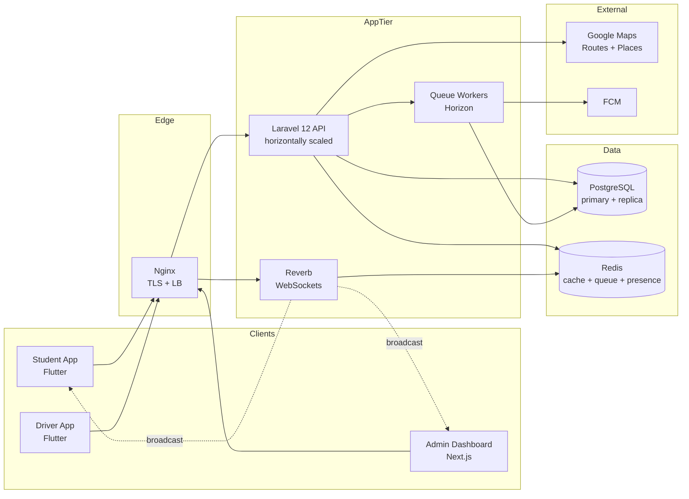
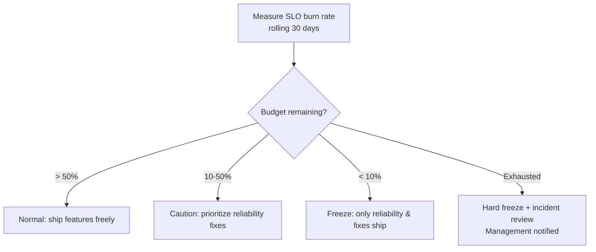
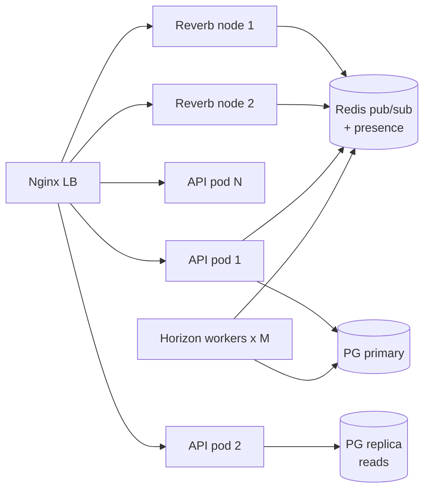
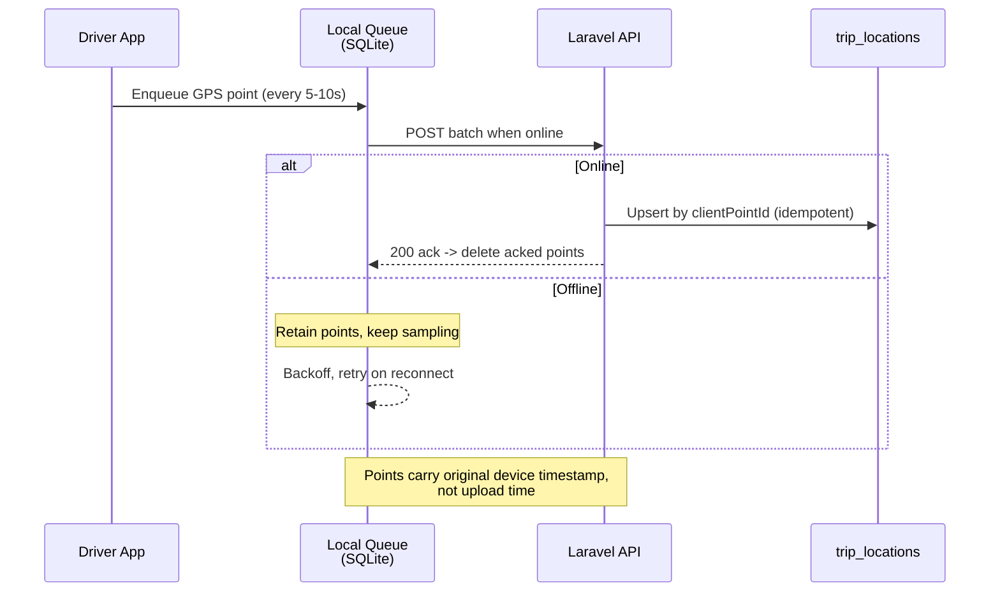
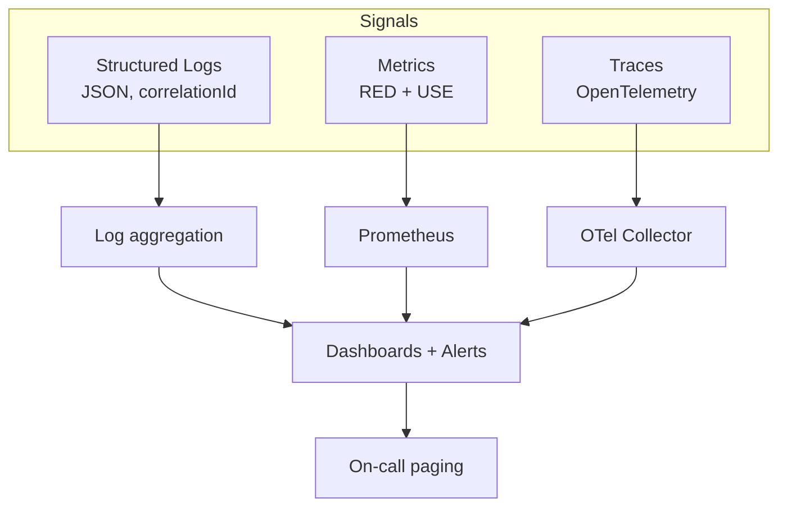

# Non-Functional Requirements & SLAs

**Campus Transport Management System (CTMS) — SRS v1.0**
**Document 14 — Non-Functional Requirements & Service Level Agreements**

---

## 1. Purpose & Scope

Functional requirements describe *what* CTMS does; this document defines *how well* it must do it. Every non-functional requirement (NFR) below is expressed as a **measurable budget** with an explicit **target**, a **measurement method**, and the **instrumentation** used to observe it in production. These budgets are the contract between the engineering team, the Transport Department, and College Management.

The document covers seven quality attributes:

| # | Attribute | Governs |
|---|-----------|---------|
| NFR-P | Performance | API latency, GPS ingest cadence, map render, broadcast fan-out |
| NFR-A | Availability | Uptime, error budget, redundancy, failover |
| NFR-S | Scalability | Student/bus/campus growth, horizontal scaling, data-store sizing |
| NFR-R | Reliability | Offline GPS buffering, retries, idempotency, delivery guarantees |
| NFR-M | Maintainability | Code health, deployability, change lead time |
| NFR-O | Observability | Logging, metrics, tracing, health checks, alerting |
| NFR-L | Localization & Accessibility | Language, timezone, WCAG conformance |

All budgets are enforced against the fixed stack: **Laravel 12 + Reverb, PostgreSQL, Redis, Flutter (Student/Driver apps), Next.js/React (Admin dashboard), Google Maps SDK + Routes API + Places API, Firebase Cloud Messaging (FCM), Docker + Nginx.**

---

## 2. Quality Attribute Overview

Each edge in this diagram is a place where a latency, availability, or reliability budget applies. The tables below allocate the budgets to these hops.

---

## 3. Performance (NFR-P)

### 3.1 API Latency Budgets

The SRS mandates **API response < 2s**. We refine this into a **p95 < 2s / p99 < 3s** budget measured at the Nginx edge (client-perceived), because averages hide the tail that students actually feel when a map fails to load.

| ID | Requirement | Target | Measurement Method | Instrument |
|----|-------------|--------|--------------------|------------|
| NFR-P1 | Read API latency (list/detail: bus, trip, route) | p95 < 500 ms, p99 < 1 s | Nginx `$request_time` histogram, excludes client network | Prometheus + Grafana |
| NFR-P2 | Write API latency (start trip, report incident, approve merge) | p95 < 800 ms, p99 < 1.5 s | Laravel middleware timing span | OpenTelemetry trace |
| NFR-P3 | Overall API envelope (all authenticated endpoints) | **p95 < 2 s, p99 < 3 s** | Edge latency histogram, 5-min rolling window | Prometheus |
| NFR-P4 | ETA calculation (FR-09, Google Routes round-trip incl. cache) | p95 < 1.2 s on cache miss, < 80 ms on cache hit | Span around Routes API call + Redis lookup | OTel + Redis stats |
| NFR-P5 | Authentication (FR-01, JWT/Sanctum issue) | p95 < 600 ms | Login endpoint timing | Prometheus |
| NFR-P6 | Database query budget per request | p95 < 150 ms aggregate; no N+1 | `pg_stat_statements` + query log | pgBadger / Telescope |

**Enforcement:** any endpoint breaching its p95 for 3 consecutive 5-minute windows raises a **latency SLO burn alert** (see §8.4). Load tests in CI (k6) fail the pipeline if p95 regresses > 15% versus the previous release baseline.

### 3.2 Real-Time GPS Ingest Cadence

FR-07 mandates GPS updates every **5–10 s**. This is both a client cadence and a server ingest budget.

| ID | Requirement | Target | Measurement Method | Instrument |
|----|-------------|--------|--------------------|------------|
| NFR-P7 | Driver app GPS emit interval | 1 sample every 5–10 s while trip `RUNNING` | Client telemetry: interval between `TripLocation` payloads | App analytics event |
| NFR-P8 | GPS ingest write latency (`TripLocation` persisted) | p95 < 300 ms from receipt to durable write | Server span receipt→commit | OTel |
| NFR-P9 | GPS point end-to-end freshness (driver emit → student sees marker) | p95 < 3 s, p99 < 5 s | Timestamp delta: `TripLocation.timestamp` vs client render time | Synthetic probe + client event |
| NFR-P10 | Ingest throughput headroom | Sustain 200 buses × 1 pt / 5 s = 40 pts/s, burst 3× | Load test sustained + burst | k6 |
| NFR-P11 | Location broadcast fan-out latency (Reverb) | p95 < 800 ms from ingest to WS frame delivered | Reverb publish→ack span | OTel + Reverb metrics |

> **Design note:** GPS points are written on a lightweight path — validated, appended to `trip_locations`, and published to Redis for Reverb fan-out. Heavy work (ETA recompute, geofence checks against `RouteStop.geofenceRadius`, delay calculation) is **debounced** and offloaded to queue workers so ingest never blocks on Google Maps.

### 3.3 Map Render & Client Performance

| ID | Requirement | Target | Measurement Method | Instrument |
|----|-------------|--------|--------------------|------------|
| NFR-P12 | Student live-tracking screen — first meaningful map paint | < 2.5 s on mid-tier Android (4-core, 4 GB) over 4G | Flutter frame timing / `TimeToFirstFrame` | Firebase Performance |
| NFR-P13 | Map marker update jank | ≥ 55 FPS while animating bus marker; no frame > 32 ms | Flutter `SchedulerBinding` frame callbacks | Firebase Performance |
| NFR-P14 | Admin dashboard fleet map — initial load (LCP) | < 3 s for ≤ 200 live buses | Web Vitals LCP | Vercel/RUM or web-vitals lib |
| NFR-P15 | Admin fleet map — interaction latency (pan/zoom, INP) | < 200 ms | Web Vitals INP | RUM |
| NFR-P16 | Cold app launch (Student/Driver) | < 3 s to interactive | Firebase Performance trace | Firebase |

**Map-specific tactics:** marker clustering above 50 visible buses; polyline simplification (Douglas-Peucker) on route rendering; Google Maps tile caching; ETA and route geometry cached in Redis keyed by `routeId` to avoid re-querying Routes API on every render.

---

## 4. Availability (NFR-A)

### 4.1 Uptime & Error Budget

The SRS targets **99.9% uptime**. That is the platform SLA. Different surfaces carry different budgets because a down reports page is not the same severity as a down live-tracking pipe during peak commute.

| ID | Service Surface | Uptime SLA | Monthly Error Budget | Downtime/Month |
|----|-----------------|-----------|----------------------|----------------|
| NFR-A1 | Core API (auth, trips, tracking) | **99.9%** | 0.1% | ~43.2 min |
| NFR-A2 | Real-time pipeline (Reverb + GPS ingest) during service hours* | 99.9% | 0.1% | ~43.2 min |
| NFR-A3 | Admin dashboard | 99.5% | 0.5% | ~3.6 hr |
| NFR-A4 | Reports & analytics (FR-15, batch/async) | 99.0% | 1.0% | ~7.2 hr |
| NFR-A5 | Notifications (FCM delivery attempt) | 99.5% | 0.5% | ~3.6 hr |

\* *Service hours = defined peak transport windows (e.g., 06:30–10:30, 15:30–19:30). SLA is measured against these windows, not 24×7, since the fleet is idle overnight.*

### 4.2 Error Budget Policy

- **Burn-rate alerts:** fast burn (2% budget in 1 hr) pages on-call immediately; slow burn (10% in 6 hr) opens a ticket.
- **Budget reset:** monthly, on the 1st.
- A breached SLA month triggers a blameless postmortem (see Document 15 — Deployment & Operations).

### 4.3 Redundancy & Failover

| Component | Redundancy Strategy | Failover Behavior | RTO / RPO |
|-----------|---------------------|-------------------|-----------|
| Nginx / edge | ≥ 2 instances behind a load balancer | LB health-checks drop dead node | RTO < 30 s |
| Laravel API | ≥ 3 stateless containers, N+1 sizing | LB reroutes; sessions in Redis/JWT so no stickiness needed | RTO < 30 s |
| Reverb (WS) | ≥ 2 nodes, shared Redis presence/pub-sub | Client auto-reconnect with backoff; presence rebuilt from Redis | RTO < 15 s |
| Queue workers (Horizon) | ≥ 2 worker containers | Jobs re-queued (at-least-once); no single point | RTO < 60 s |
| PostgreSQL | Primary + streaming replica (hot standby) | Promote replica; connection string via failover DNS/pooler | RTO < 5 min, RPO < 30 s |
| Redis | Primary + replica (Sentinel) | Sentinel promotes replica | RTO < 60 s, RPO seconds |
| Google Maps / FCM | External — no control | Circuit breaker + graceful degradation (§6.5) | Degrade, not fail |

**Zero-downtime deploys:** rolling container replacement behind Nginx; DB migrations are backward-compatible (expand/contract pattern) so old and new app versions run simultaneously during rollout.

---

## 5. Scalability (NFR-S)

### 5.1 Capacity Targets

The SRS requires **thousands of students, hundreds of buses, multi-campus support**. Concrete design envelope:

| Dimension | Launch (v1) | Design Ceiling (v1 arch) | Scaling Lever |
|-----------|-------------|--------------------------|---------------|
| Students (total accounts) | 5,000 | 50,000 | Read replicas, Redis cache, pagination |
| Concurrent live-tracking students | 2,000 | 15,000 | Reverb horizontal scale, channel sharding |
| Buses (active fleet) | 100 | 500 | GPS ingest workers, partitioned `trip_locations` |
| Concurrent running trips | 100 | 500 | Stateless API scale-out |
| GPS points ingested | 40/s sustained | 250/s burst | Batch writes, queue buffering |
| Campuses (tenants) | 1 | Many (multi-tenant) | Tenant scoping (§5.3) |
| Notifications/day (FCM) | 50,000 | 1,000,000 | Async queue + FCM batching |

### 5.2 Horizontal Scaling Model

- **API tier:** fully stateless (JWT/Sanctum auth, no server session). Scale by CPU (target < 60% avg) and p95 latency. HPA-style rule: add a pod when p95 > 1.2 s or CPU > 65% for 5 min.
- **Reverb tier:** scaled independently of the API. Redis is the shared pub/sub and presence backbone so any client can connect to any Reverb node. Channels are sharded per `campusId` and per `tripId` to bound fan-out. Scale by connection count (target < 8,000 connections/node).
- **Queue tier (Horizon):** dedicated worker pools per workload class — `gps` (high volume, low latency), `notifications` (FCM), `maintenance` (ticket creation from incidents, FR-14), `reports` (heavy, isolated). Pools scale independently so a report backlog never starves GPS.

### 5.3 Multi-Campus Tenancy Approach

CTMS uses a **shared-database, shared-schema, row-level tenancy** model, chosen for operational simplicity at "hundreds of buses" scale:

| Aspect | Approach |
|--------|----------|
| Tenant key | `campusId` (UUID) on every tenant-scoped table |
| Isolation | Global Laravel query scope auto-filters by the authenticated user's `campusId`; enforced in a base model trait so no query can leak cross-campus |
| Auth | JWT carries `campusId` + `role`; middleware rejects mismatched tenant access |
| Data-at-rest | Single PostgreSQL cluster; `trip_locations` partitioned by `campusId` + month for query locality and cheap pruning |
| Cache/presence | Redis keys namespaced `ctms:{campusId}:...` |
| Reports | Always tenant-scoped; cross-campus aggregation only for `super-admin` role |
| Growth path | A hot tenant can be extracted to a dedicated schema/DB without changing app code (scope trait already abstracts access) |

**Business-rule integrity holds per tenant:** "passenger count never exceeds capacity," "one active driver per bus," "bus in maintenance cannot be assigned," and approval workflows (merge/replacement) are all evaluated within a single `campusId` boundary.

### 5.4 Data-Store Sizing

| Store | Sizing Basis | Provision |
|-------|--------------|-----------|
| PostgreSQL — OLTP | Core entities ~ tens of MB; growth linear with students/buses | Start 4 vCPU / 16 GB; primary + 1 read replica |
| PostgreSQL — `trip_locations` | 200 buses × 8 h × (1 pt/5 s) ≈ 1.1 M rows/day ≈ 400 M rows/year | **Monthly partitions**, retain 90 days hot, archive/rollup older to aggregate table |
| PostgreSQL — `passenger_logs` | Bounded by boarding events, small | Standard tables |
| Redis | Cache (ETA, routes), queues, Reverb presence, rate-limit counters | Start 2 GB with `maxmemory-policy allkeys-lru`; separate logical DBs for cache vs queue |
| Object storage | `VehicleIncident.imageUrl` photos | S3-compatible bucket, lifecycle to cold after 180 days |

**Retention & rollup:** raw GPS beyond 90 days is compacted into a per-trip summary (path polyline, avg/max speed, distance) so historical reports (FR-15) stay fast without unbounded table growth.

---

## 6. Reliability (NFR-R)

### 6.1 Offline GPS Buffering & Sync

The SRS mandates **offline GPS buffering + automatic synchronization**. Drivers lose connectivity in tunnels, dead zones, and campus basements; the trip trail must not have holes.

| ID | Requirement | Target | Measurement Method |
|----|-------------|--------|--------------------|
| NFR-R1 | Local buffer capacity (offline duration) | ≥ 2 h of points survive offline | App test: airplane-mode soak |
| NFR-R2 | GPS point loss rate (end to end) | < 0.5% of emitted points | Emitted vs persisted counter reconciliation |
| NFR-R3 | Auto-sync on reconnect | Buffered points flushed within 30 s of connectivity | Reconnect probe |
| NFR-R4 | Timestamp fidelity | Persisted `TripLocation.timestamp` = device capture time | Payload validation |

### 6.2 Retry & Backoff Policy

| Operation | Retry Strategy | Max Attempts | Dead-letter |
|-----------|----------------|--------------|-------------|
| GPS batch upload (client) | Exponential backoff 2s→60s + jitter | Until acked (bounded by buffer) | Drop oldest only if buffer full |
| Queue jobs (Horizon) | Backoff 10s, 30s, 120s | 3 | `failed_jobs` table + alert |
| FCM notification send | Backoff on 5xx/quota | 3 | Log + mark `Notification` unsent |
| Google Routes/Places call | Backoff + circuit breaker | 2 | Serve last cached ETA |
| DB write on transient error | Immediate + 1 retry | 2 | Surface 503 to client |

### 6.3 Idempotency

- Every GPS point carries a client-generated `clientPointId`; the ingest endpoint **upserts** on `(tripId, clientPointId)` so retried batches never duplicate rows.
- State-changing commands (start trip, end trip, approve merge, assign replacement, report incident) accept an **`Idempotency-Key`** header; the API stores the key + response for 24 h in Redis and replays the stored response on duplicate submission — critical because mobile clients retry aggressively on flaky networks.
- Passenger increments (FR-08 +1/-1) are modeled as **`PassengerLog` events** (append-only, `action` Board/Exit, `countAfterAction`), not as a mutable counter, so a duplicated tap is detectable and the live count is a deterministic projection. Business rule "count ≤ capacity" is enforced server-side on each event.

### 6.4 Delivery Guarantees (At-Least-Once Broadcast)

| Channel | Guarantee | Ordering | Recovery |
|---------|-----------|----------|----------|
| GPS ingest → DB | At-least-once (idempotent upsert = effectively exactly-once) | By device timestamp | Buffer + resync |
| Reverb live broadcast | At-least-once, best-effort real-time | Per-trip channel monotonic | On reconnect, client fetches latest snapshot via REST, then resumes stream |
| Queue jobs | At-least-once (Horizon) | Not guaranteed; jobs are idempotent | Retry + dead-letter |
| FCM notifications (FR-10) | At-least-once send attempt | N/A | Retry; `isRead` tracked on `Notification` |

**Reconnect contract:** because WS broadcast is best-effort, the Student/Admin clients treat Reverb as a *live delta* on top of an authoritative REST snapshot. On (re)connect they `GET` the current trip position/ETA, then subscribe. This guarantees no permanently missed state even if a broadcast frame is dropped.

### 6.5 Graceful Degradation

| Failing Dependency | Degraded Behavior | User-Visible Effect |
|--------------------|-------------------|-----------------------|
| Google Routes API | Serve last cached ETA; fall back to straight-line distance ÷ avg speed | ETA marked "approximate" |
| Reverb down | Client polls REST every 10 s | Slightly staler marker, still tracking |
| FCM down | Notifications queued, retried; in-app `Notification` list still populated | Push delayed, in-app intact |
| PG replica down | Reads fail over to primary | Higher primary load, no outage |
| Redis cache down | Cache-miss straight to DB | Higher latency, still correct |

---

## 7. Maintainability (NFR-M)

| ID | Requirement | Target | Measurement Method |
|----|-------------|--------|--------------------|
| NFR-M1 | Automated test coverage (backend, critical paths) | ≥ 80% line, 100% of business rules covered | CI coverage report (PHPUnit/Pest) |
| NFR-M2 | CI pipeline duration (lint + test + build) | < 10 min | CI timing |
| NFR-M3 | Change lead time (merge → production) | < 1 day for standard change | Deployment metrics |
| NFR-M4 | Mean time to restore (MTTR) | < 1 h for Sev-1 | Incident records |
| NFR-M5 | Code style / static analysis | Zero lint errors; PHPStan level ≥ 6; Flutter/ESLint clean | CI gate |
| NFR-M6 | API contract stability | Versioned (`/api/v1`); no breaking change without version bump | Contract tests (OpenAPI) |
| NFR-M7 | Documentation currency | Domain model, ERD, API docs regenerated each release | Docs pipeline |
| NFR-M8 | Dependency hygiene | No known critical CVEs; monthly update window | `composer audit`, `npm audit`, Dependabot |

**Structural conventions:** single source of truth for the domain model (17 entities, shared enums `UserRole`/`BusStatus`/`DriverStatus`/`TripStatus`); business rules centralized in service/policy classes, never duplicated in controllers; database schema uses snake_case columns mapped from camelCase attributes; migrations follow expand/contract for zero-downtime.

---

## 8. Observability (NFR-O)

### 8.1 Three Pillars

### 8.2 Logging

| ID | Requirement | Target |
|----|-------------|--------|
| NFR-O1 | All logs structured JSON with `correlationId`, `campusId`, `userId`, `role` | 100% of services |
| NFR-O2 | Every request carries a trace/correlation id propagated client→API→worker | End-to-end |
| NFR-O3 | **Audit logs** (SRS security req) for all privileged mutations: assign, approve merge, approve replacement, deactivate bus, role changes | Immutable, retained ≥ 1 year |
| NFR-O4 | No PII (Aadhaar, license, phone, passwordHash) in logs | Redaction verified in CI |
| NFR-O5 | Log retention | 30 days hot, 1 year cold (audit) |

### 8.3 Metrics (RED + USE)

| Category | Metrics Tracked |
|----------|-----------------|
| **RED** (per endpoint & per WS channel) | Rate (req/s), Errors (% 4xx/5xx), Duration (p50/p95/p99) |
| **USE** (per host/container) | Utilization (CPU/mem), Saturation (queue depth, connection pool), Errors |
| **Domain KPIs** | Active trips, live buses reporting GPS, GPS points/s, ETA cache hit ratio, notifications sent/failed, passenger-count events/s, open incidents, pending merge/replacement approvals |
| **Data stores** | PG connections, replication lag, slow queries; Redis memory, evictions, queue depth (per Horizon pool) |
| **External** | Google Maps call rate, latency, quota %, error rate; FCM success/failure |

### 8.4 Alerting Thresholds

| Alert | Condition | Severity |
|-------|-----------|----------|
| API latency SLO burn | p95 > 2 s for 15 min | High → page |
| Availability fast burn | 2% error budget in 1 h | Critical → page |
| GPS ingest stalled | live buses reporting < 80% of running trips for 5 min | High → page |
| Reverb connection drop spike | reconnect rate > 3× baseline | Medium |
| Queue backlog | any pool depth > 1,000 or oldest job > 5 min | Medium |
| DB replication lag | > 10 s | High |
| Redis memory | > 85% maxmemory | Medium |
| Google Maps quota | > 80% daily quota | Medium → notify |
| Cert/permit/insurance data expiry (domain) | `insuranceExpiry`/`permitExpiry`/`licenseExpiry` < 15 days | Low → admin notify |

### 8.5 Health Checks

| Endpoint | Purpose | Checked By |
|----------|---------|------------|
| `/health/live` | Process alive (no deps) | Container orchestrator liveness |
| `/health/ready` | DB, Redis, migrations OK — accept traffic? | LB readiness / rolling deploy gate |
| `/health/deep` | Reverb reachable, queue draining, Google Maps reachable | Synthetic monitor (1/min) |

Synthetic probes exercise a **golden path** every minute: authenticate → fetch assigned bus → subscribe to a trip channel → receive a live GPS frame. Failure of the golden path pages on-call even if component health looks green.

---

## 9. Localization & Accessibility (NFR-L)

### 9.1 Localization

| ID | Requirement | Target |
|----|-------------|--------|
| NFR-L1 | UI string externalization (Flutter `intl`, Next.js i18n) | 100% strings; no hardcoded copy |
| NFR-L2 | Launch languages | English + one regional language; extensible |
| NFR-L3 | Timezone | Store timestamps in UTC; display in campus-local TZ |
| NFR-L4 | Date/number/currency formatting | Locale-aware; cost fields (`estimatedCost`) formatted per locale |
| NFR-L5 | RTL readiness | Layouts must not break under RTL (future-proofing) |

### 9.2 Accessibility

| ID | Requirement | Target | Measurement Method |
|----|-------------|--------|--------------------|
| NFR-L6 | Admin dashboard conformance | WCAG 2.1 AA | axe-core in CI + manual audit |
| NFR-L7 | Color contrast | ≥ 4.5:1 text, ≥ 3:1 UI/graphics; status colors (BusStatus) not color-only | Contrast checker |
| NFR-L8 | Screen-reader support | Semantic labels on all controls; Flutter `Semantics`, ARIA on web | TalkBack/VoiceOver/NVDA pass |
| NFR-L9 | Touch target size (mobile) | ≥ 48×48 dp — critical for Driver +1/-1 & SOS buttons | UI audit |
| NFR-L10 | Keyboard navigation (dashboard) | All actions reachable without mouse; visible focus | Manual audit |
| NFR-L11 | Dynamic type / text scaling | Support up to 200% without clipping | Device test |

**Driver-app safety-accessibility note:** the SOS and passenger-count controls must be large, high-contrast, and operable at a glance, since the driver may interact while the bus is stationary but under time pressure. These are treated as safety-critical UI, not merely accessible UI.

---

## 10. Requirement-to-SLA Traceability

| NFR Group | Backing SRS Requirement | Related FRs | Primary SLA |
|-----------|--------------------------|-------------|-------------|
| Performance | "API response < 2s; GPS 5–10s" | FR-07, FR-08, FR-09, FR-10 | p95 < 2 s; freshness < 5 s |
| Availability | "target uptime 99.9%" | All | 99.9% core; error-budget policy |
| Scalability | "multi-campus, thousands of students, hundreds of buses" | FR-02..FR-06 | 500 buses / 50k students / multi-tenant |
| Reliability | "offline GPS buffering, automatic synchronization" | FR-07, FR-11, FR-12 | < 0.5% GPS loss; at-least-once |
| Security | "HTTPS, JWT/Sanctum, RBAC, audit logs" | FR-01 | Audit log ≥ 1 yr; TLS everywhere |
| Maintainability | (engineering standard) | All | ≥ 80% coverage; MTTR < 1 h |
| Observability | (operational standard) | All | Golden-path probe 1/min |
| Localization/A11y | (usability standard) | FR-08, FR-10 | WCAG 2.1 AA |

---

## 11. Assumptions & Constraints Affecting NFRs

- Every bus has a GPS-enabled driver device with intermittent-but-usual internet during trips — this justifies offline buffering (§6.1) rather than assuming perfect connectivity.
- Google Maps and FCM are third-party: their availability is *outside* the 99.9% CTMS SLA, hence the circuit-breaker + degradation strategy (§6.5). Their outages count against **their** budget, not ours, but user-visible degradation is still designed for.
- SLAs are measured against **defined service hours** for real-time surfaces; overnight idle time is excluded from real-time availability math but included for the core API.
- Multi-campus row-level tenancy assumes trust in the application enforcement layer; a tenant requiring physical isolation triggers the schema/DB extraction growth path (§5.3).

---

## 12. Cross-references

- `01-srs-overview.md` — source SRS, scope, stakeholders
- `02-domain-model.md` — 17-entity model, enums, relationships
- `03-architecture.md` — component & deployment architecture
- `07-realtime-tracking.md` — GPS ingest, Reverb channels, presence
- `09-eta-notifications.md` — FR-09 ETA & FR-10 notification pipelines
- `11-security.md` — authentication, RBAC, audit logging detail
- `13-database-schema.md` — PostgreSQL schema, partitioning, retention
- `15-deployment-operations.md` — Docker/Nginx, CI/CD, incident & postmortem process
