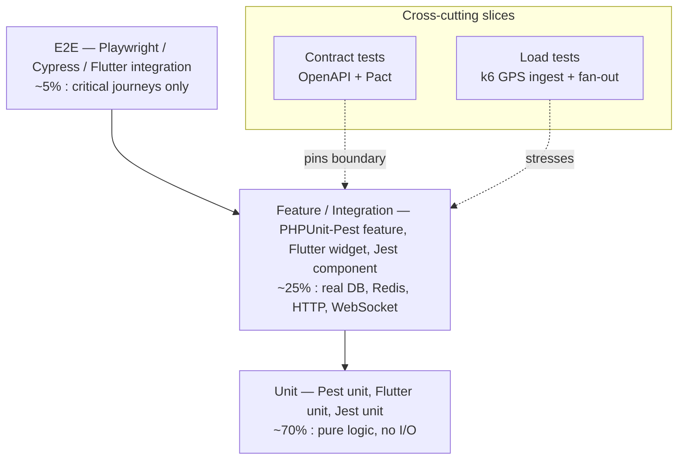
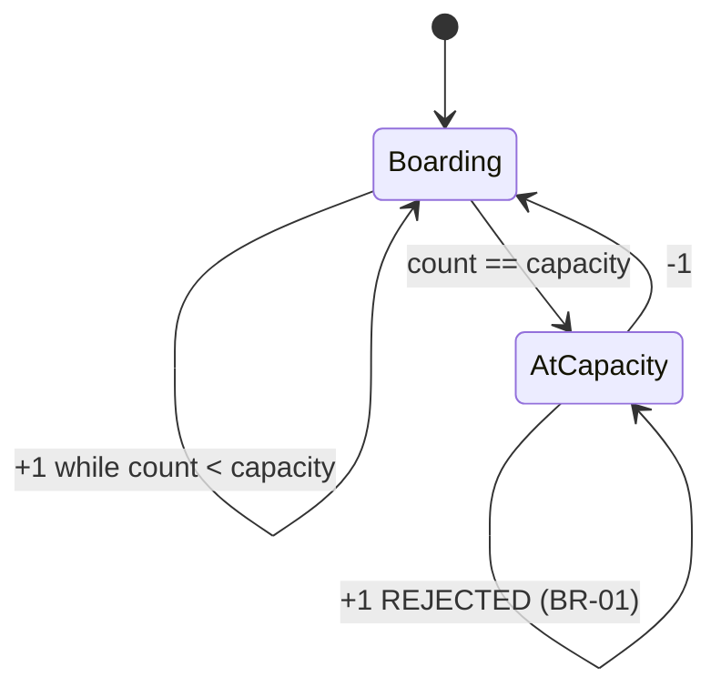
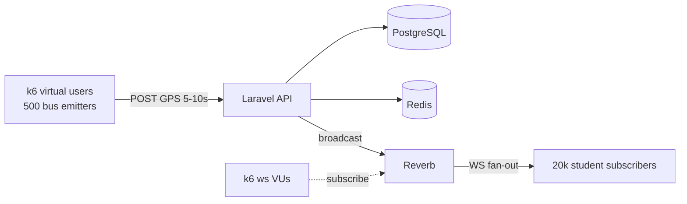
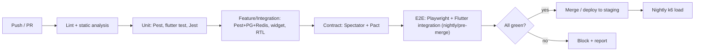

# Campus Transport Management System (CTMS) — Test Plan

**Document ID:** CTMS-DOC-15
**Version:** 1.0
**Status:** Baseline
**Related SRS:** CTMS SRS v1.0

---

## 1. Purpose & Scope

This Test Plan defines the strategy, tooling, environments, test data, and concrete
test cases used to validate the Campus Transport Management System (CTMS) across its
full stack: Laravel 12 REST API + Reverb WebSockets, PostgreSQL, Redis, the Flutter
Student and Driver apps, and the Next.js/React Admin dashboard.

The plan covers verification of every functional requirement (**FR-01 … FR-15**), all
seven codified business rules, the non-functional targets (API < 2s, GPS 5–10s cadence,
99.9% uptime), and the integration seams to Google Maps (Routes/Places) and Firebase
Cloud Messaging (FCM).

**In scope**

- Unit, feature/integration, contract, end-to-end (E2E), and load testing.
- Backend, both mobile apps, and the admin dashboard.
- Business-rule enforcement and role-based authorization.
- Real-time GPS ingest and tracking fan-out under load.

**Out of scope**

- Third-party service internals (Google Maps, FCM) — validated only at the contract/mock boundary.
- Hardware GPS device firmware.
- Future roadmap items (parent portal, RFID counting, AI demand prediction).

---

## 2. Test Strategy & Pyramid

CTMS follows a classic test pyramid: a broad, fast unit base; a substantial feature/
integration middle that exercises real DB, Redis, and HTTP layers; a thin, high-value
E2E cap driven through real UIs; plus two orthogonal slices — **contract tests** that
pin the API/app boundary, and **load tests** that stress the real-time path.

| Layer | Goal | Approx share | Speed | Runs on |
|-------|------|-------------|-------|---------|
| Unit | Pure business logic, enum/state transitions, calculators | ~70% | ms | Every push |
| Feature / Integration | Endpoint + DB + Redis + policy behavior, widget flows | ~25% | s | Every push |
| E2E | Critical cross-system journeys through real UI | ~5% | min | Pre-merge + nightly |
| Contract | Freeze request/response shapes between API and clients | slice | s | Every push |
| Load | Validate GPS cadence & fan-out at scale | slice | min | Nightly + pre-release |

**Guiding principles**

- Business rules (Section 8) are enforced in the domain layer and covered at unit **and** feature level — never only through the UI.
- Every FR has at least one feature-level happy-path test and one authorization/negative test.
- Real-time behavior is tested with an actual Reverb connection in integration, and at scale with k6.
- Tests are deterministic: time, GPS, Maps, and FCM are controlled via clocks, fixtures, and fakes.

---

## 3. Tooling Per Layer

| Component | Unit | Feature / Integration | E2E | Contract | Load |
|-----------|------|----------------------|-----|----------|------|
| **Laravel 12 API** | Pest (PHPUnit engine) | Pest feature tests w/ real PostgreSQL + Redis, `RefreshDatabase` | — | Spectator (OpenAPI) + Pact provider | k6 |
| **Reverb WebSockets** | Pest (event/broadcast unit) | Reverb test harness, fake WS client | driven via E2E | channel-auth contract | k6 (ws) + Artillery fallback |
| **Flutter Student app** | `flutter test` unit | `flutter test` widget | `integration_test` package + `flutter drive` | Pact consumer | — |
| **Flutter Driver app** | `flutter test` unit | `flutter test` widget | `integration_test` + `flutter drive` | Pact consumer | k6 (GPS emitter simulation) |
| **Next.js/React Admin** | Jest + React Testing Library | Jest + RTL (MSW-mocked API) | Playwright (primary) / Cypress (fallback) | Pact consumer + MSW | — |
| **Cross-system** | — | — | Playwright orchestrating seeded stack | OpenAPI schema gate in CI | k6 scenarios |

**Notes**

- **PHPUnit/Pest:** Pest is the authoring syntax over the PHPUnit engine; `php artisan test --parallel` in CI.
- **Flutter:** three tiers — `flutter test` (unit + widget under a headless VM) and `integration_test` (real device/emulator or `flutter drive` on a headless Chrome/Android emulator).
- **Next.js:** Jest for units/components, **Playwright** as the primary E2E driver (Cypress kept as a fallback for developer-local debugging).
- **API contract tests:** an OpenAPI 3.1 spec is the source of truth; Laravel responses validated with Spectator, and consumer-driven Pact contracts published by each client and verified against the provider.
- **Load tests:** **k6** scripts drive GPS ingest (hundreds of buses posting every 5–10s) and measure tracking fan-out latency to student subscribers over Reverb.

---

## 4. Test Environments

| Environment | Purpose | Backing services | Data | Refresh |
|-------------|---------|------------------|------|---------|
| **Local** | Developer inner loop | Dockerized PostgreSQL + Redis + Reverb; Maps/FCM faked | Seeder factories | On demand |
| **CI** | Automated gate on every push/PR | Ephemeral Postgres + Redis service containers; Reverb in-process; Maps/FCM stubbed | `TestSeeder` per run | Per pipeline run |
| **Staging** | Integration, E2E, contract verification, UAT | Full Docker + Nginx parity; Reverb; **sandbox** Google Maps keys; **test** FCM project | Anonymized seed dataset | Nightly reset |
| **Load** | k6 performance & soak | Production-sized Postgres + Redis; Reverb cluster; Maps mocked to isolate our latency | Synthetic fleet (500 buses, 20k students) | Per load run |
| **Pre-prod** | Final smoke + release sign-off | Production-equivalent | Masked prod-like | Per release |

**Environment rules**

- No test hits live Google Maps billing or the production FCM project; staging uses sandbox/test credentials.
- Every environment is provisioned from the same `docker-compose`/Nginx definitions to preserve parity.
- Secrets are injected via environment variables; no credentials in the repo or seeders.

---

## 5. Test Data & Seeding

Deterministic seed data is produced by Laravel factories and a layered seeder so that
every FR and business rule has a known fixture.

| Seeder | Produces | Notable fixtures |
|--------|----------|------------------|
| `RoleUserSeeder` | 2 Admins, 30 Drivers, 2,000 Students | 1 admin `admin@ctms.test`; drivers with valid & expired licenses |
| `FleetSeeder` | 60 Buses across all `BusStatus` | 1 `MAINTENANCE`, 1 `BREAKDOWN`, 1 at exact `capacity` |
| `RouteSeeder` | 25 Routes, RouteStops, Schedules | multi-stop route with geofences; one inactive route |
| `TripSeeder` | Trips across all `TripStatus` | 1 `RUNNING` trip with live `TripLocation` + `PassengerLog` |
| `IncidentSeeder` | VehicleIncidents + MaintenanceTickets | one incident of each `issueType`/`severity` |
| `MergeSeeder` | Two low-occupancy `RUNNING` trips | primed `BusMergeRecommendation` candidates |
| `LoadSeeder` | 500 buses, 20k students, 500 active trips | used only by the Load environment |

**Data conventions**

- UUID primary keys everywhere; camelCase attributes map to snake_case columns.
- Passwords hashed via the app hasher; a shared known password for test logins.
- Factory `states` express edge conditions: `Bus::factory()->atCapacity()`, `Bus::factory()->inMaintenance()`, `Driver::factory()->onTrip()`, `Trip::factory()->running()`.
- Time is controlled with `Carbon::setTestNow()` (backend) and injected clocks (Flutter) so ETA/delay assertions are stable.
- GPS streams are replayed from a recorded fixture (`trip_locations.jsonl`) for reproducible tracking tests.

---

## 6. Traceability Matrix (FR → primary test layer)

| FR | Requirement | Primary layer(s) | Key tooling |
|----|-------------|------------------|-------------|
| FR-01 | Authentication | Feature + E2E | Pest, Playwright |
| FR-02 | Bus Management | Feature | Pest |
| FR-03 | Driver Management | Feature | Pest |
| FR-04 | Student Management | Feature | Pest |
| FR-05 | Route Management | Feature + E2E | Pest, Playwright |
| FR-06 | Trip Management | Feature | Pest |
| FR-07 | Live GPS Tracking | Integration + Load | Pest+Reverb, k6 |
| FR-08 | Passenger Counter | Unit + Feature + Widget | Pest, Flutter |
| FR-09 | ETA Calculation | Unit + Feature (Maps mocked) | Pest, Pact |
| FR-10 | Notifications | Feature (FCM faked) | Pest |
| FR-11 | Vehicle Incident | Feature + Widget | Pest, Flutter |
| FR-12 | Replacement Bus | Feature + E2E | Pest, Playwright |
| FR-13 | Smart Bus Consolidation | Unit + Feature + E2E | Pest, Playwright |
| FR-14 | Maintenance | Feature (event-driven) | Pest |
| FR-15 | Reports | Feature | Pest |

---

## 7. Functional Test Cases (FR-01 … FR-15)

Each case: **ID | Precondition | Steps | Expected**. IDs follow `TC-<FR>-<n>`.

### FR-01 — Authentication (role-based secure login)

| ID | Precondition | Steps | Expected |
|----|--------------|-------|----------|
| TC-01-1 | Admin exists, `isActive=true` | POST `/api/auth/login` with valid admin email+password | 200; JWT/Sanctum token returned; `role=ADMIN`; `lastLogin` updated |
| TC-01-2 | Driver exists | Login via Driver app with valid creds | 200; token scoped to DRIVER; driver home screen loads |
| TC-01-3 | Student exists | Login via Student app | 200; token scoped to STUDENT |
| TC-01-4 | Any user | Login with wrong password | 401; generic invalid-credentials message; no token |
| TC-01-5 | User `isActive=false` | Attempt login | 403; account-disabled message |
| TC-01-6 | Valid token issued | Call Admin endpoint with Student token | 403 forbidden by role policy |

### FR-02 — Bus Management

| ID | Precondition | Steps | Expected |
|----|--------------|-------|----------|
| TC-02-1 | Admin logged in | POST `/api/buses` with valid busNumber, registrationNumber, capacity | 201; Bus created with `status=AVAILABLE`; UUID id |
| TC-02-2 | Bus exists | PUT `/api/buses/{id}` change model/mileage | 200; fields updated; `updatedAt` bumped |
| TC-02-3 | Bus exists, no active trip | PATCH deactivate → `status=OFFLINE` | 200; bus excluded from assignable list |
| TC-02-4 | Duplicate registrationNumber | POST with existing registrationNumber | 422 validation error |
| TC-02-5 | Driver token | POST `/api/buses` | 403 (only Admin) |

### FR-03 — Driver Management

| ID | Precondition | Steps | Expected |
|----|--------------|-------|----------|
| TC-03-1 | Admin logged in | POST `/api/drivers` with employeeId, drivingLicenseNumber, licenseExpiry | 201; Driver created, `status=AVAILABLE`, `available=true` |
| TC-03-2 | Driver + available Bus exist | POST assign driver to bus | 200; `assignedBusId` set; Bus.assignedDriver reflects driver |
| TC-03-3 | Driver already assigned to a bus | Assign same driver to a second bus | 422; driver already assigned |
| TC-03-4 | Duplicate employeeId | Register driver with existing employeeId | 422 validation error |

### FR-04 — Student Management

| ID | Precondition | Steps | Expected |
|----|--------------|-------|----------|
| TC-04-1 | Admin logged in | POST `/api/students` with rollNumber, department, admissionNumber | 201; Student created, `transportEnabled=false` by default |
| TC-04-2 | Student + Route + Bus exist | Assign routeId, busId, pickupStopId | 200; assignments persisted; `transportEnabled=true` |
| TC-04-3 | pickupStopId not on assigned route | Assign mismatched stop | 422; stop must belong to the route |
| TC-04-4 | Duplicate rollNumber | Register student with existing rollNumber | 422 validation error |

### FR-05 — Route Management

| ID | Precondition | Steps | Expected |
|----|--------------|-------|----------|
| TC-05-1 | Admin logged in | POST `/api/routes` with routeCode, source, destination | 201; Route `active=true` |
| TC-05-2 | Route exists | Add RouteStops with sequence, lat/lng, geofenceRadius | 201; stops ordered by `sequence` |
| TC-05-3 | Route exists | Create Schedule with dayOfWeek, departureTime | 201; schedule linked to route + bus |
| TC-05-4 | Duplicate sequence on same route | Add stop with existing sequence | 422; sequence must be unique per route |
| TC-05-5 | Route has active schedules | Deactivate route | 409 or warning; cannot deactivate route with active schedules |

### FR-06 — Trip Management

| ID | Precondition | Steps | Expected |
|----|--------------|-------|----------|
| TC-06-1 | Schedule, available Bus & Driver exist | POST `/api/trips` for today | 201; Trip `status=SCHEDULED`; bus/driver/route linked |
| TC-06-2 | Trip SCHEDULED | Driver starts trip | 200; `status=RUNNING`; `startTime` set; Driver `status=ON_TRIP` |
| TC-06-3 | Trip RUNNING | Driver ends trip | 200; `status=COMPLETED`; `endTime` set; Driver back to `AVAILABLE` |
| TC-06-4 | Bus in MAINTENANCE | Create trip with that bus | 422 (see BR-03) |
| TC-06-5 | Bus already on a RUNNING trip | Assign same bus to concurrent trip | 422 (see BR-02) |

### FR-07 — Live GPS Tracking

| ID | Precondition | Steps | Expected |
|----|--------------|-------|----------|
| TC-07-1 | Trip RUNNING, driver online | Driver app POSTs GPS every 5–10s | 202; TripLocation rows created; timestamps 5–10s apart |
| TC-07-2 | Student subscribed to bus channel | Trip broadcasts location | Student receives WS event on `trip.{id}` within fan-out SLA |
| TC-07-3 | Driver device offline mid-trip | Buffer GPS locally, then reconnect | On reconnect, buffered points sync in order; no gaps/dupes |
| TC-07-4 | Trip COMPLETED | POST GPS after end | 409/422; no location accepted after trip end |
| TC-07-5 | Update cadence | Measure inter-update interval over 5 min | All intervals within 5–10s window (NFR) |

### FR-08 — Passenger Counter

| ID | Precondition | Steps | Expected |
|----|--------------|-------|----------|
| TC-08-1 | Trip RUNNING, count=0, capacity=40 | Driver taps +1 | `currentPassengers=1`; PassengerLog `action=Board`, `countAfterAction=1` |
| TC-08-2 | count=5 | Driver taps −1 | `currentPassengers=4`; PassengerLog `action=Exit`, `countAfterAction=4` |
| TC-08-3 | count=0 | Driver taps −1 | Rejected; count stays 0; no negative log |
| TC-08-4 | count=capacity (40) | Driver taps +1 | Rejected (see BR-01); count stays 40; UI shows capacity-reached |
| TC-08-5 | Widget | Render counter, tap +1/−1 rapidly | Debounced; count consistent with backend after sync |

### FR-09 — ETA Calculation

| ID | Precondition | Steps | Expected |
|----|--------------|-------|----------|
| TC-09-1 | Trip RUNNING, Maps Routes API mocked | Request ETA for a student's stop | ETA minutes returned from mocked route; persisted for display |
| TC-09-2 | Maps API returns error/timeout | Request ETA | Graceful fallback (last-known ETA or distance-based estimate); no crash |
| TC-09-3 | Bus past student's stop | Request ETA | ETA indicates stop reached/passed; no negative ETA |
| TC-09-4 | Contract | Client consumes ETA response | Pact contract for ETA payload shape holds |

### FR-10 — Notifications

| ID | Precondition | Steps | Expected |
|----|--------------|-------|----------|
| TC-10-1 | Students on trip, FCM faked | Driver starts trip | `trip started` Notification created (`type` correct); FCM send dispatched to subscribers |
| TC-10-2 | Bus enters stop geofence | Geofence crossing detected | `bus nearing stop` notification to that stop's students only |
| TC-10-3 | Trip `delayMinutes` exceeds threshold | Delay computed | `delay` notification sent once (not duplicated per GPS tick) |
| TC-10-4 | Replacement approved | Replacement assigned | `replacement bus` notification to affected students |
| TC-10-5 | Trip COMPLETED | Driver ends trip | `trip completed` notification; Notification `isRead=false` initially |

### FR-11 — Vehicle Incident

| ID | Precondition | Steps | Expected |
|----|--------------|-------|----------|
| TC-11-1 | Trip RUNNING | Driver reports `issueType=breakdown`, severity, description, image | 201; VehicleIncident created, linked to trip/bus/driver; `reportedAt` set |
| TC-11-2 | Incident created | Observe side effects | MaintenanceTicket auto-created (see BR-07); Bus `status=BREAKDOWN` for breakdown type |
| TC-11-3 | Driver | Tap SOS | High-severity incident/alert raised; admin notified immediately |
| TC-11-4 | Widget | Submit incident form without required issueType | Validation blocks submit |

### FR-12 — Replacement Bus

| ID | Precondition | Steps | Expected |
|----|--------------|-------|----------|
| TC-12-1 | Breakdown incident open | System recommends replacements | Only `AVAILABLE` buses (not MAINTENANCE/BREAKDOWN) returned, ranked by ETA |
| TC-12-2 | Recommendation shown | Admin approves a replacement | ReplacementAssignment created `status=APPROVED`; students notified (see BR-05) |
| TC-12-3 | No approval | Replacement remains `PENDING` | No bus reassigned until admin approves |
| TC-12-4 | Non-admin | Attempt to approve replacement | 403 |

### FR-13 — Smart Bus Consolidation (merge)

| ID | Precondition | Steps | Expected |
|----|--------------|-------|----------|
| TC-13-1 | Two low-occupancy RUNNING trips | Engine evaluates merge | BusMergeRecommendation created with source/target passengers, `estimatedFuelSaved`, `distanceIncrease` |
| TC-13-2 | `sourcePassengers + targetPassengers > target capacity` | Evaluate merge | No recommendation (would breach capacity) |
| TC-13-3 | Recommendation PENDING | Admin approves | `status=APPROVED`; consolidation proceeds; affected students notified (see BR-04) |
| TC-13-4 | Recommendation PENDING | Admin rejects | `status=REJECTED`; no change to trips |
| TC-13-5 | Non-admin | Approve/reject merge | 403 |

### FR-14 — Maintenance

| ID | Precondition | Steps | Expected |
|----|--------------|-------|----------|
| TC-14-1 | VehicleIncident created | Inspect maintenance queue | MaintenanceTicket exists with `incidentId`, `busId`, generated `ticketNumber`, `status` open (see BR-07) |
| TC-14-2 | Ticket open | Technician sets repairStart/repairEnd, estimatedCost | 200; status transitions; remarks saved |
| TC-14-3 | Ticket resolved for a breakdown bus | Close ticket | Bus eligible to return to `AVAILABLE` |
| TC-14-4 | Bus in MAINTENANCE | Attempt trip assignment | 422 (see BR-03) |

### FR-15 — Reports

| ID | Precondition | Steps | Expected |
|----|--------------|-------|----------|
| TC-15-1 | Completed trips exist | GET `/api/reports/trips?from&to` | 200; counts, avg delay, avg speed aggregated correctly |
| TC-15-2 | Incidents exist | GET incident/maintenance report | 200; grouped by issueType/severity/status |
| TC-15-3 | Merge history exists | GET fuel-saving report | 200; sums `estimatedFuelSaved` across approved merges |
| TC-15-4 | Non-admin | Request reports | 403 |
| TC-15-5 | Large range | Request 90-day report | Responds < 2s (NFR) or streams/paginates |

---

## 8. Business-Rule Test Cases (explicit)

These rules are enforced in the domain layer and each has dedicated unit **and** feature
coverage. IDs follow `TC-BR-<n>`.

| ID | Business rule | Precondition | Steps | Expected |
|----|---------------|--------------|-------|----------|
| TC-BR-01 | Passenger count must never exceed capacity | Bus capacity=40, currentPassengers=40 | Driver taps +1 | Rejected; count stays 40; domain throws `CapacityExceeded`; no PassengerLog row |
| TC-BR-02 | Only one active driver per bus during a trip | Bus has a RUNNING trip with Driver A | Start a second RUNNING trip on same bus with Driver B | Rejected; 422; second trip not started |
| TC-BR-03 | A bus in maintenance cannot be assigned | Bus `status=MAINTENANCE` | Assign bus to a schedule/trip | Rejected; 422; assignment blocked |
| TC-BR-04 | Bus merge requires admin approval | BusMergeRecommendation `status=PENDING` | Consolidation attempted without admin approval | No merge occurs; remains PENDING; only Admin `approveMerge` transitions to APPROVED |
| TC-BR-05 | Replacement bus requires admin approval | ReplacementAssignment `status=PENDING` | Replacement attempted without admin approval | No reassignment; only Admin `assignReplacement` approves |
| TC-BR-06 | Students can only view their assigned bus | Student S1 assigned to Bus B1; Bus B2 also running | S1 requests tracking for B2 (`GET /api/buses/B2/track`) | 403; S1 can only read B1's live data |
| TC-BR-07 | Every incident creates a maintenance record | No tickets yet | Create a VehicleIncident | Exactly one MaintenanceTicket auto-created and linked (1:1); no incident left without a ticket |

**Enforcement notes**

- BR-01 is tested at unit level on the `PassengerCounter`/`Bus` aggregate and at feature level via FR-08 endpoints.
- BR-02 and BR-03 are guarded in the trip-assignment service and covered by concurrent-request feature tests.
- BR-04/BR-05 are policy-gated (`ADMIN` only); non-admin attempts return 403 and leave state unchanged.
- BR-06 is a Laravel Policy on the tracking/read endpoints and on the student WS channel authorization.
- BR-07 is verified by asserting the incident-created event synchronously (or via a processed queue) yields a `MaintenanceTicket`.

---

## 9. Load & Performance Testing (k6)

Two headline scenarios validate the real-time NFRs.

| Scenario | Simulates | Key metrics | Pass threshold |
|----------|-----------|-------------|----------------|
| **GPS ingest** | 500 buses POSTing GPS every 5–10s (~50–100 req/s sustained) | ingest p95 latency, error rate, DB write throughput | p95 < 2s; error rate < 0.1%; no dropped points |
| **Tracking fan-out** | 20,000 student subscribers on Reverb channels receiving updates | broadcast delay (ingest→client), connection stability | p95 fan-out delay < 2s; 0 dropped connections under steady state |
| **Soak** | Combined ingest + fan-out for 1 hour | memory/Redis growth, latency drift | No leak; latency stable within ±10% |
| **Spike** | Trip start storm (all morning trips begin within 2 min) | queue depth, notification lag | Recovers to steady state < 60s |

- k6 thresholds are encoded in the script (`http_req_duration`, `ws_session_duration`, custom trends) so a breach fails CI.
- Google Maps is mocked during load runs to isolate CTMS latency from third-party variance.
- Load runs execute nightly against the Load environment and are mandatory before any release.

---

## 10. Contract Testing

| Boundary | Consumer | Provider | Mechanism |
|----------|----------|----------|-----------|
| Auth & core REST | Flutter apps, Next.js admin | Laravel API | Consumer-driven Pact + OpenAPI/Spectator |
| ETA payload | Student app | Laravel API (wraps Maps) | Pact for FR-09 response shape |
| WS channel auth | Student/Driver apps | Reverb | Channel-authorization contract test |
| Admin dashboard data | Next.js (MSW) | Laravel API | OpenAPI schema validation in CI |

- The OpenAPI 3.1 document is the single source of truth; any drift between it and actual responses fails the pipeline.
- Client teams publish Pact files; the provider verification job runs on every backend change to catch breaking changes early.

---

## 11. CI/CD Integration

- Unit + feature + contract run on **every push**; E2E runs on pre-merge and nightly; load runs nightly and pre-release.
- Coverage gates: backend line coverage ≥ 80% on domain/service code; PRs may not lower coverage.

---

## 12. Entry & Exit Criteria

### Entry criteria (testing may begin)

- SRS FRs and business rules are baselined; the build compiles and deploys to the target environment.
- Migrations and seeders run cleanly; test data is available.
- All third-party fakes/mocks (Maps, FCM) and sandbox credentials are configured.
- Environment health checks (API, PostgreSQL, Redis, Reverb) pass.

### Exit criteria (a test cycle is complete)

- 100% of planned FR-01…FR-15 test cases executed.
- 100% of business-rule cases (TC-BR-01…07) passed — these are release-blocking.
- No open **Critical** or **High** defects; Medium defects triaged with owners/dates.
- Coverage thresholds met; contract tests green; k6 thresholds met on the Load environment.
- Regression suite green on staging; release notes and known-issues list updated.

---

## 13. Defect Severity Levels

| Severity | Definition | Examples | Target response |
|----------|------------|----------|-----------------|
| **S1 — Critical** | System unusable / data loss / safety or security breach; release blocker | Auth bypass, GPS ingest down, capacity rule not enforced, SOS not delivered | Immediate; fix before release |
| **S2 — High** | Major function broken, no acceptable workaround | Trip cannot start, notifications not sent, merge/replacement approval bypassable | Fix within cycle; blocks exit |
| **S3 — Medium** | Function impaired but workaround exists | ETA occasionally stale, report pagination glitch, widget debounce lag | Schedule for next iteration |
| **S4 — Low** | Cosmetic / minor | Label typo, spacing, non-blocking log noise | Backlog |

**Priority** is tracked separately from severity (a Low-severity item on a demo screen may be High priority). Defects are logged with: id, title, severity, priority, environment, steps, expected vs actual, evidence (logs/screenshots), and linked FR/BR/TC id.

---

## 14. Risks & Mitigations

| Risk | Impact | Mitigation |
|------|--------|-----------|
| Google Maps quota/latency variability | Flaky ETA tests, load noise | Mock Maps in CI/load; contract-test the boundary only |
| Real-time flakiness under load | False E2E failures | Deterministic GPS fixtures; retry-with-backoff only in E2E; k6 for true scale |
| Time-dependent assertions (ETA/delay) | Nondeterministic tests | Frozen clocks (`Carbon::setTestNow`, injected Flutter clocks) |
| Concurrent assignment races (BR-02) | Missed defects | Explicit concurrency tests + DB-level constraints |
| FCM test project limits | Notification tests blocked | Fake FCM transport; assert dispatch, not delivery |

---

## Cross-references

- `01-srs.md` — Software Requirements Specification (FR/NFR source).
- `03-domain-model.md` — entities, enums, relationships referenced by test data.
- `05-api-specification.md` — endpoint contracts validated by contract tests.
- `07-database-schema.md` — schema/seeding backing the test data plan.
- `09-realtime-architecture.md` — Reverb channels and GPS fan-out under test in FR-07 and load tests.
- `11-business-rules.md` — authoritative rule definitions mirrored in Section 8.
- `16-ci-cd-pipeline.md` — pipeline stages that run this plan.
- `17-deployment.md` — Docker/Nginx environments referenced in Section 4.
