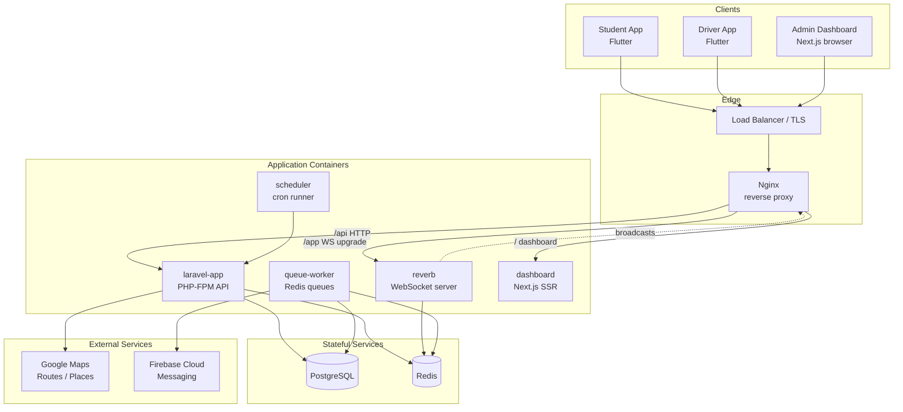
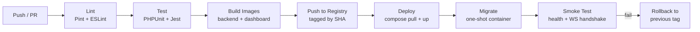

# Deployment & DevOps — Campus Transport Management System (CTMS)

**Document:** 16 — Deployment & DevOps
**System:** Campus Transport Management System (CTMS)
**Version:** 1.0
**Audience:** Platform / DevOps engineers, backend maintainers, release managers

---

## 1. Purpose & Scope

This document is the operational build blueprint for deploying and running CTMS in a containerized environment. It defines the container topology, the Nginx reverse-proxy configuration that fronts the Laravel 12 REST API, the Laravel Reverb WebSocket layer and the Next.js admin dashboard, the full environment-variable catalog, database migration and seeding strategy, the CI/CD pipeline, backups, monitoring/logging, secrets injection, and zero-downtime deployment.

The runtime stack is fixed:

| Layer | Technology |
|---|---|
| Student app | Flutter (built & shipped to stores — not deployed here) |
| Driver app | Flutter (built & shipped to stores — not deployed here) |
| Admin dashboard | Next.js / React (served as static export + Node SSR) |
| Backend API | Laravel 12 REST API |
| Realtime | Laravel Reverb (WebSockets) |
| Database | PostgreSQL |
| Cache / Queue / Presence | Redis |
| Maps | Google Maps SDK + Routes API + Places API |
| Push | Firebase Cloud Messaging (FCM) |
| Deployment | Docker + Nginx |

The **server-side** deliverables (API, Reverb, workers, dashboard, datastores) are the focus of this document. Mobile clients are covered by their own build docs; here they are only clients of the deployed API and WebSocket endpoints.

---

## 2. Deployment Topology

The production deployment is a single logical stack that can be replicated per campus (multi-campus scalability). Nginx is the only component exposed to the public internet; everything else lives on a private Docker network.



**Traffic classes handled at the edge:**

- **HTTP REST API** — `/api/*` from all three clients, proxied to `laravel-app` (PHP-FPM).
- **WebSocket** — `/app/*` (Reverb) carrying live GPS location broadcasts, passenger-count updates, ETA refreshes, and notifications; requires HTTP `Upgrade` handling.
- **Static / SSR dashboard** — `/` served by the Next.js container for Admin users.

---

## 3. Docker Compose Service Map

CTMS runs as a set of cooperating containers. The API image and the worker/scheduler/reverb images share the **same Laravel codebase image** but start with different entrypoints, which keeps builds cheap and behavior consistent.

| Service | Base image | Role | Exposed | Depends on | Scale |
|---|---|---|---|---|---|
| `nginx` | `nginx:1.27-alpine` | Reverse proxy, TLS termination, static asset serving, WS upgrade | `80`, `443` (public) | laravel-app, reverb, dashboard | 1–2 |
| `laravel-app` | custom `php:8.3-fpm` | REST API (FR-01..FR-15), request handling, broadcasting events | `9000` (internal FPM) | postgres, redis | N (stateless) |
| `reverb` | custom (Laravel image) | Laravel Reverb WebSocket server for realtime GPS/ETA/notifications | `8080` (internal) | redis | 1–2 |
| `queue-worker` | custom (Laravel image) | Processes Redis queues: notifications (FCM), ETA calc, merge recs, maintenance ticket creation | — | postgres, redis | N |
| `scheduler` | custom (Laravel image) | Runs `schedule:work` — daily trip generation, report rollups, cleanup | — | postgres, redis | 1 |
| `postgres` | `postgres:16-alpine` | Primary relational datastore (17 entities) | `5432` (internal) | — | 1 (+replica) |
| `redis` | `redis:7-alpine` | Cache, queues, session/presence, Reverb scaling backplane | `6379` (internal) | — | 1 (+replica) |
| `dashboard` | `node:20-alpine` | Next.js/React admin dashboard (SSR + static) | `3000` (internal) | laravel-app | 1–2 |

> **Why separate worker/scheduler/reverb from the API:** GPS ingestion (every 5–10 s per active bus) and fan-out notifications must never block synchronous API request latency (target < 2 s). Isolating queues and the WebSocket server lets each scale independently.

### 3.1 Example `docker-compose.yml`

```yaml
services:
  nginx:
    image: ctms/nginx:${TAG:-latest}
    build: ./docker/nginx
    ports:
      - "80:80"
      - "443:443"
    volumes:
      - ./docker/nginx/conf.d:/etc/nginx/conf.d:ro
      - certs:/etc/nginx/certs:ro
      - dashboard_static:/var/www/dashboard:ro
    depends_on: [laravel-app, reverb, dashboard]
    restart: unless-stopped

  laravel-app:
    image: ctms/backend:${TAG:-latest}
    build:
      context: .
      dockerfile: docker/php/Dockerfile
    env_file: .env
    command: php-fpm
    depends_on: [postgres, redis]
    restart: unless-stopped
    healthcheck:
      test: ["CMD", "php", "artisan", "octane:status"]
      interval: 30s
      timeout: 5s
      retries: 3

  reverb:
    image: ctms/backend:${TAG:-latest}
    env_file: .env
    command: php artisan reverb:start --host=0.0.0.0 --port=8080
    depends_on: [redis]
    restart: unless-stopped

  queue-worker:
    image: ctms/backend:${TAG:-latest}
    env_file: .env
    command: php artisan queue:work redis --queue=high,notifications,default --sleep=1 --tries=3 --max-time=3600
    depends_on: [postgres, redis]
    restart: unless-stopped
    deploy:
      replicas: 3

  scheduler:
    image: ctms/backend:${TAG:-latest}
    env_file: .env
    command: php artisan schedule:work
    depends_on: [postgres, redis]
    restart: unless-stopped

  postgres:
    image: postgres:16-alpine
    environment:
      POSTGRES_DB: ${DB_DATABASE}
      POSTGRES_USER: ${DB_USERNAME}
      POSTGRES_PASSWORD: ${DB_PASSWORD}
    volumes:
      - pgdata:/var/lib/postgresql/data
    restart: unless-stopped

  redis:
    image: redis:7-alpine
    command: redis-server --requirepass ${REDIS_PASSWORD} --appendonly yes
    volumes:
      - redisdata:/data
    restart: unless-stopped

  dashboard:
    image: ctms/dashboard:${TAG:-latest}
    build: ./dashboard
    env_file: ./dashboard/.env
    expose:
      - "3000"
    depends_on: [laravel-app]
    restart: unless-stopped

volumes:
  pgdata:
  redisdata:
  certs:
  dashboard_static:
```

---

## 4. Nginx Reverse-Proxy Outline

Nginx multiplexes three upstreams behind one host: the JSON API (PHP-FPM), the Reverb WebSocket endpoint, and the Next.js dashboard. The critical detail is the WebSocket `Upgrade`/`Connection` header pass-through for the Reverb location, plus a longer `proxy_read_timeout` so idle GPS sockets are not dropped.

```nginx
# /etc/nginx/conf.d/ctms.conf

upstream php_api    { server laravel-app:9000; }
upstream reverb_ws  { server reverb:8080; }
upstream next_dash  { server dashboard:3000; }

map $http_upgrade $connection_upgrade {
    default upgrade;
    ''      close;
}

server {
    listen 443 ssl http2;
    server_name transport.college.edu;

    ssl_certificate     /etc/nginx/certs/fullchain.pem;
    ssl_certificate_key /etc/nginx/certs/privkey.pem;

    client_max_body_size 12m;   # incident images upload

    # --- REST API (FR-01..FR-15) ---
    location /api/ {
        root /var/www/backend/public;
        try_files $uri /index.php?$query_string;
        fastcgi_pass php_api;
        include fastcgi_params;
        fastcgi_read_timeout 30s;
    }

    # --- Reverb WebSocket (live GPS / ETA / notifications) ---
    location /app/ {
        proxy_pass http://reverb_ws;
        proxy_http_version 1.1;
        proxy_set_header Upgrade $http_upgrade;
        proxy_set_header Connection $connection_upgrade;
        proxy_set_header Host $host;
        proxy_set_header X-Forwarded-For $proxy_add_x_forwarded_for;
        proxy_read_timeout 300s;
        proxy_send_timeout 300s;
    }

    # --- Admin dashboard (Next.js SSR + static) ---
    location / {
        proxy_pass http://next_dash;
        proxy_set_header Host $host;
        proxy_set_header X-Forwarded-Proto $scheme;
    }
}

server {
    listen 80;
    server_name transport.college.edu;
    return 301 https://$host$request_uri;
}
```

**Notes**

- HTTP → HTTPS redirect enforces the HTTPS non-functional requirement.
- `client_max_body_size 12m` accommodates `VehicleIncident.imageUrl` uploads (breakdown / accident photos).
- The `map $http_upgrade` block is mandatory; without it Reverb connections fall back to failed handshakes and clients silently lose realtime GPS.
- For horizontal scaling, `reverb_ws` and `php_api` upstreams can list multiple container replicas; Redis is the Reverb scaling backplane.

---

## 5. Environment Variable Catalog

All configuration is injected via environment (12-factor). Secrets are never baked into images. The catalog below is authoritative for the backend `.env`; the dashboard has a small subset prefixed `NEXT_PUBLIC_` for browser exposure.

### 5.1 Application

| Variable | Example | Notes |
|---|---|---|
| `APP_NAME` | `CTMS` | App display name |
| `APP_ENV` | `production` | `local` / `staging` / `production` |
| `APP_KEY` | `base64:…` | Laravel encryption key (secret) |
| `APP_DEBUG` | `false` | MUST be false in production |
| `APP_URL` | `https://transport.college.edu` | Canonical URL |
| `APP_TIMEZONE` | `Asia/Kolkata` | Trip scheduling / ETA timestamps |
| `LOG_CHANNEL` | `stack` | Log stack (see §9) |
| `LOG_LEVEL` | `info` | `debug` only in staging |

### 5.2 Database (PostgreSQL)

| Variable | Example | Notes |
|---|---|---|
| `DB_CONNECTION` | `pgsql` | Fixed |
| `DB_HOST` | `postgres` | Compose service name |
| `DB_PORT` | `5432` | |
| `DB_DATABASE` | `ctms` | |
| `DB_USERNAME` | `ctms_app` | Least-privilege app role |
| `DB_PASSWORD` | `…` | Secret |

### 5.3 Redis (cache / queue / presence)

| Variable | Example | Notes |
|---|---|---|
| `REDIS_HOST` | `redis` | |
| `REDIS_PORT` | `6379` | |
| `REDIS_PASSWORD` | `…` | Secret |
| `CACHE_STORE` | `redis` | |
| `QUEUE_CONNECTION` | `redis` | Drives queue-worker |
| `SESSION_DRIVER` | `redis` | |

### 5.4 Reverb (WebSockets)

| Variable | Example | Notes |
|---|---|---|
| `BROADCAST_CONNECTION` | `reverb` | |
| `REVERB_APP_ID` | `ctms` | |
| `REVERB_APP_KEY` | `…` | Public key used by Flutter/Next clients |
| `REVERB_APP_SECRET` | `…` | Secret (server signing) |
| `REVERB_HOST` | `transport.college.edu` | Public host clients connect to |
| `REVERB_PORT` | `443` | Behind Nginx TLS |
| `REVERB_SCHEME` | `https` | |
| `REVERB_SERVER_HOST` | `0.0.0.0` | Bind inside container |
| `REVERB_SERVER_PORT` | `8080` | Internal port |

### 5.5 Google Maps

| Variable | Example | Notes |
|---|---|---|
| `GOOGLE_MAPS_SERVER_KEY` | `…` | Server key for Routes API (ETA — FR-09), Places; IP-restricted |
| `GOOGLE_MAPS_ROUTES_ENDPOINT` | `https://routes.googleapis.com` | Routes API base |
| `GOOGLE_MAPS_PLACES_KEY` | `…` | Places autocomplete for stop creation |

> The Flutter/Next **client** map keys (Maps SDK render keys) live in the respective client build configs, not in the backend `.env`, and are restricted by app bundle / referrer.

### 5.6 Firebase Cloud Messaging (FCM)

| Variable | Example | Notes |
|---|---|---|
| `FCM_PROJECT_ID` | `ctms-college` | Firebase project |
| `FCM_CREDENTIALS_PATH` | `/run/secrets/fcm.json` | Mounted service-account JSON (secret) |
| `FCM_DEFAULT_TOPIC` | `ctms_broadcast` | Announcement fan-out |

### 5.7 Dashboard (Next.js — public subset)

| Variable | Example | Notes |
|---|---|---|
| `NEXT_PUBLIC_API_BASE` | `https://transport.college.edu/api` | REST base |
| `NEXT_PUBLIC_REVERB_KEY` | `…` | Matches `REVERB_APP_KEY` |
| `NEXT_PUBLIC_REVERB_HOST` | `transport.college.edu` | |
| `NEXT_PUBLIC_MAPS_JS_KEY` | `…` | Referrer-restricted browser Maps key |

---

## 6. Migration & Seeding Strategy

### 6.1 Migrations

- **Framework:** Laravel migrations, one file per entity/relationship, snake_case columns mapping the camelCase domain attributes (e.g. `firstName` → `first_name`, `busId` → `bus_id`).
- **Primary keys:** UUID (`uuid` column, `$table->uuid('id')->primary()`), not auto-increment — required for multi-campus merge safety.
- **Order:** users → students/drivers/admins → buses → routes → route_stops → schedules → trips → trip_locations → passenger_logs → vehicle_incidents → maintenance_tickets → bus_merge_recommendations → replacement_assignments → notifications → announcements. Foreign keys added after referenced tables exist.
- **Enums:** implemented as Postgres `varchar` + a `CHECK` constraint (or native `CREATE TYPE`) for `UserRole`, `BusStatus`, `DriverStatus`, `TripStatus` and the per-entity status/type enums, mirroring the SRS enum values exactly.
- **Indexing:** hot-path indexes on `trip_locations(trip_id, timestamp)` (GPS history), `trips(trip_date, status)`, `notifications(receiver_id, is_read)`, `students(bus_id)`, `students(route_id)`.
- **Execution:** migrations run as a **discrete deploy step** (`php artisan migrate --force`) from a one-shot container, never inside the FPM entrypoint, to avoid races when the API scales to N replicas (see §7 and §8).

### 6.2 Seeding

| Seeder | Environment | Contents |
|---|---|---|
| `RoleEnumSeeder` | all | Baseline reference data / enum lookups |
| `AdminSeeder` | all | Bootstrap super-admin (credentials from env, forced password change) |
| `DemoFleetSeeder` | staging only | Sample buses, routes, stops, drivers, students for QA |
| `TripDemoSeeder` | local only | Fabricated trips + GPS tracks for UI development |

Production seeds are limited to enums and the bootstrap Admin; no fake operational data ever runs in production.

```bash
# Deploy migration step (one-shot container)
php artisan migrate --force
php artisan db:seed --class=RoleEnumSeeder --force
php artisan db:seed --class=AdminSeeder --force
```

---

## 7. CI/CD Pipeline

The pipeline is stage-gated: nothing reaches production without passing lint and tests, and the same immutable image that passed tests is what gets deployed.



| Stage | Tooling | Gate / Output |
|---|---|---|
| **Lint** | Laravel Pint (PHP), ESLint + TypeScript (dashboard) | Fails on style / type errors |
| **Test** | PHPUnit / Pest (feature + unit, incl. business rules), Jest/RTL (dashboard) | Coverage threshold; all green required |
| **Build images** | Docker Buildx, multi-stage; `ctms/backend` and `ctms/dashboard` | Immutable images tagged `:$GIT_SHA` and `:latest` |
| **Push** | Push to container registry (GHCR / private) | Image available to deploy hosts |
| **Deploy** | SSH / runner → `docker compose pull && docker compose up -d` | Rolling replace of stateless services |
| **Migrate** | One-shot `laravel-app` container runs `migrate --force` | Schema advanced once, before traffic shift completes |
| **Smoke test** | `curl /api/health`, Reverb handshake probe, dashboard 200 | Auto-rollback to previous `:$GIT_SHA` on failure |

**Branch policy:** `main` deploys to production, `develop` deploys to staging. Tags (`v1.x`) trigger versioned production releases. Migrations are always forward-compatible (expand/contract) so a rollback of code never breaks against a just-migrated schema.

---

## 8. Zero-Downtime Deployment

Because live GPS ingestion and student tracking are continuous, deploys must not drop trips in progress.

1. **Stateless API replicas** — `laravel-app` runs N replicas behind Nginx. Deploy replaces them one at a time (rolling), so at least one replica always serves `/api`.
2. **Expand/contract migrations** — schema changes are additive first (add nullable column / new table), backfilled by a queue job, then the old column is dropped in a *later* release. No migration is destructive within the same deploy as the code that depends on it.
3. **Reverb draining** — during a `reverb` restart, clients auto-reconnect (Flutter/JS clients implement backoff). Redis holds the presence/broadcast backplane so a second Reverb replica keeps broadcasting while the first restarts. Offline GPS buffering on the driver app (a reliability requirement) means any GPS points produced during a brief reconnect window are re-sent on reconnect.
4. **Queue graceful stop** — `queue:work` uses `--max-time` and receives `SIGTERM`; the worker finishes its in-flight job before exiting, so notifications and ticket creation are not lost.
5. **Migrate before cutover** — the one-shot migration container runs and completes before the new API replicas begin serving; the `--force` flag is required in non-interactive production.
6. **Health-gated traffic** — Nginx only forwards to replicas passing their healthcheck; a failed new image never receives traffic.

---

## 9. Monitoring, Logging & Backups

### 9.1 Logging

| Source | Destination | Notes |
|---|---|---|
| Laravel API | `stack` → `stderr` (JSON) | Collected by Docker log driver; shipped to central store |
| Reverb | container `stderr` | Connection counts, handshake failures |
| Queue worker | `stderr` + failed_jobs table | Failed jobs persisted for replay |
| Nginx | access + error logs | Request latency, 5xx, WS upgrade errors |
| Audit log | `audit_logs` table (Postgres) | Security requirement — every Admin action (assign, approve merge, approve replacement) recorded with actor + timestamp |

- Structured JSON logging; correlate by request-id header propagated Nginx → API → queue.
- Application errors optionally forwarded to Sentry-style aggregator via DSN env var.

### 9.2 Monitoring

| Signal | Target | Alert when |
|---|---|---|
| API p95 latency | < 2 s | > 2 s for 5 min |
| Uptime | 99.9% | Health endpoint failing |
| GPS ingest lag | 5–10 s cadence | No `trip_locations` insert for an active trip > 30 s |
| Queue depth | near-zero | Backlog > threshold (notification delay) |
| Reverb connections | steady | Sudden drop (proxy / cert issue) |
| Postgres / Redis | healthy | Connection saturation, disk > 80% |

Metrics are exposed via a `/api/health` (liveness) and `/api/health/ready` (readiness: DB + Redis reachable) and scraped by the platform monitor.

### 9.3 Backups (PostgreSQL)

- **Nightly logical dump** via `pg_dump` from the scheduler (or a sidecar cron), gzip-compressed, uploaded to off-host object storage with 30-day retention.
- **Point-in-time recovery** via WAL archiving for the production primary; RPO target ≤ 15 min.
- **Redis** is treated as ephemeral (cache/queue) but runs `appendonly yes` so in-flight queue jobs survive a restart; it is *not* the source of truth.
- **Restore drills** run quarterly against a staging instance to validate the dump chain.

```bash
# Nightly backup (cron / scheduler task)
pg_dump -h postgres -U "$DB_USERNAME" -d "$DB_DATABASE" -Fc \
  | gzip > "/backups/ctms_$(date +%F).dump.gz"
# Upload to object storage, then prune > 30 days.
```

---

## 10. Secrets Injection

- Secrets (`APP_KEY`, `DB_PASSWORD`, `REDIS_PASSWORD`, `REVERB_APP_SECRET`, `GOOGLE_MAPS_SERVER_KEY`, FCM service-account JSON) are **never** committed and **never** baked into images.
- On the deploy host they are provided as **Docker secrets** / mounted files under `/run/secrets/` (e.g. `FCM_CREDENTIALS_PATH=/run/secrets/fcm.json`) or injected from the CI/CD platform's secret store into the container environment at `up` time.
- The registry image is generic; only the runtime `.env`/secret mounts differ between staging and production.
- Google Maps server keys are IP-restricted to the backend egress; browser/app keys are referrer/bundle-restricted separately.
- Rotating a secret is a config-only redeploy (no image rebuild): update the secret store, `docker compose up -d` the affected services.

---

## 11. Operational Runbook (Quick Reference)

| Task | Command |
|---|---|
| Pull & deploy new tag | `TAG=$SHA docker compose pull && docker compose up -d` |
| Run migrations | `docker compose run --rm laravel-app php artisan migrate --force` |
| Tail API logs | `docker compose logs -f laravel-app` |
| Restart Reverb only | `docker compose up -d --no-deps reverb` |
| Scale workers | `docker compose up -d --scale queue-worker=6` |
| Clear/warm cache | `php artisan config:cache && php artisan route:cache` |
| Manual backup | see §9.3 |

---

## Cross-references

- `01-srs.md` — System requirements & functional scope (FR-01..FR-15)
- `03-architecture.md` — High-level system architecture
- `08-database-schema.md` — PostgreSQL schema, columns, indexes referenced in §6
- `09-api-specification.md` — REST endpoints fronted by Nginx `/api`
- `11-realtime-websockets.md` — Laravel Reverb channels & broadcast events
- `13-security.md` — Auth, JWT/Sanctum, audit logging, secrets policy
- `15-testing-strategy.md` — Test suites gating the CI/CD pipeline (§7)
- `17-monitoring-observability.md` — Detailed metrics, dashboards, alerting
