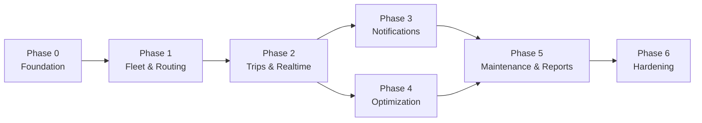
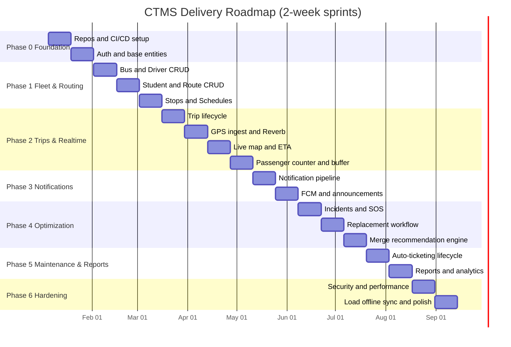

# CTMS — Project Plan & Roadmap

**Document:** 17-project-plan.md
**System:** Campus Transport Management System (CTMS)
**Version:** 1.0
**Audience:** Engineering leadership, delivery managers, backend / mobile / frontend / QA / DevOps leads

This document translates the CTMS SRS v1.0 into an executable, phased delivery plan. It defines a
seven-phase roadmap (Phase 0 through Phase 6), each with concrete goals, deliverables, exit criteria, and
mapped functional requirements (FR-01..FR-15). It closes with a sprint-level Gantt schedule, a Work
Breakdown Structure (WBS), and a suggested team composition.

The plan assumes a **fixed technology stack**: Laravel 12 REST API + Laravel Reverb (WebSockets),
PostgreSQL, Redis, Flutter (Student + Driver apps), Next.js/React (Admin dashboard), Google Maps SDK +
Routes API + Places API, Firebase Cloud Messaging (FCM), Docker + Nginx.

---

## 1. Planning Principles

The roadmap is built around a small set of delivery principles that keep the build honest and shippable.

| # | Principle | What it means in practice |
|---|-----------|---------------------------|
| P1 | **Vertical slices** | Every phase ships an end-to-end capability (DB -> API -> app UI), not a horizontal layer. |
| P2 | **Foundation first** | Auth, base entities, CI, and the deployment pipeline exist before feature work starts. |
| P3 | **Realtime is a phase, not a feature** | GPS ingest, Reverb broadcasting, and the live map are treated as a dedicated hardening-heavy phase. |
| P4 | **Business rules are gates** | Capacity limits, single-active-driver, maintenance-lockout, and approval workflows are enforced server-side and tested per phase. |
| P5 | **Offline is designed in** | Driver-app GPS buffering and sync are built into the tracking phase and stress-tested in hardening. |
| P6 | **Each phase is demoable** | Exit criteria are observable behaviours, not "code complete". |

**Sprint model:** two-week sprints. Estimates below are indicative for a ~7-person cross-functional team
and assume parallel backend/mobile/frontend workstreams.

---

## 2. Phase Overview

| Phase | Name | Primary Outcome | Mapped FRs | Indicative Duration |
|-------|------|-----------------|------------|---------------------|
| 0 | Foundation | Repos, CI/CD, auth, base entity schema | FR-01 | 2 sprints |
| 1 | Fleet & Routing | CRUD for buses, drivers, students, routes, stops, schedules | FR-02, FR-03, FR-04, FR-05 | 3 sprints |
| 2 | Trips & Realtime Tracking | Trip lifecycle, GPS ingest, Reverb, live map, ETA, passenger counter | FR-06, FR-07, FR-08, FR-09 | 4 sprints |
| 3 | Notifications | Reverb + FCM notification pipeline | FR-10 | 2 sprints |
| 4 | Optimization | Merge recommendations + replacement workflow | FR-11, FR-12, FR-13 | 3 sprints |
| 5 | Maintenance & Reports | Auto-ticketing, maintenance lifecycle, analytics | FR-14, FR-15 | 2 sprints |
| 6 | Hardening | Security, load, offline sync, availability, polish | NFRs (all) | 2 sprints |

---

## 3. Phase Details

### Phase 0 — Foundation

**Goals**

- Stand up the monorepo/polyrepo structure, CI, and containerized local + staging environments.
- Implement role-based authentication (Admin / Driver / Student) with JWT/Sanctum.
- Land the abstract `User` base and role tables plus the enum catalog as the schema backbone.

**Deliverables**

| Deliverable | Detail |
|-------------|--------|
| Repositories | `ctms-api` (Laravel 12), `ctms-admin` (Next.js), `ctms-student` (Flutter), `ctms-driver` (Flutter) |
| CI/CD | GitHub Actions: lint, PHPUnit/Pest, Flutter test, build; Docker image publish |
| Docker Compose | api, postgres, redis, reverb, nginx services for local + staging parity |
| Auth | `POST /auth/login`, `/auth/logout`, `/auth/change-password`; role-guarded middleware; audit-log scaffold |
| Base schema | `users` (abstract fields), `students`, `drivers`, `admins`, plus `UserRole`, `BusStatus`, `DriverStatus`, `TripStatus` enums |
| Seed data | One admin, sample drivers/students for downstream phases |

**Exit criteria**

- All three role types can log in from their respective clients and receive a scoped token.
- `changePassword` and `updateProfile` work; `lastLogin` updates on login.
- CI runs green on every push; staging deploy via Docker is reproducible from a clean checkout.
- Audit-log rows are written for auth events.

**Mapped FRs:** FR-01.

---

### Phase 1 — Fleet & Routing

**Goals**

- Deliver full CRUD and assignment for the fleet and academic-transport domain.
- Enforce foundational business rules at the data layer.

**Deliverables**

| Deliverable | Detail |
|-------------|--------|
| Bus Management | Create/update/deactivate/assign buses; `status(BusStatus)` transitions; capacity, insurance/permit expiry fields |
| Driver Management | Register drivers, license/aadhaar fields, `assignedBusId`, `available`, `status(DriverStatus)` |
| Student Management | Register students, assign `busId`/`routeId`/`pickupStopId`, `transportEnabled` flag |
| Route Management | Routes with `source`/`destination`/`totalDistance`/`estimatedDuration`; `RouteStop` with lat/long, sequence, geofence radius, expected arrival |
| Schedule Management | `Schedule` per route/bus with `dayOfWeek`, departure/arrival times |
| Admin dashboard UI | List + form screens for all of the above with validation |

**Business rules landed this phase**

- A bus in `MAINTENANCE` (or `BREAKDOWN`) cannot be assigned to a schedule/trip.
- Students can only reference routes/stops that exist and are `active`.

**Exit criteria**

- Admin can build a complete route (with ordered stops) and a weekly schedule end-to-end.
- A student assigned to a route/stop is visible in the student app's "assigned bus" screen (static data, pre-tracking).
- Referential integrity and enum constraints verified; maintenance-lockout rule blocks invalid assignment with a clear error.

**Mapped FRs:** FR-02, FR-03, FR-04, FR-05.

---

### Phase 2 — Trips & Realtime Tracking

**Goals**

- Implement the trip lifecycle and the realtime GPS pipeline that is the heart of CTMS.
- Deliver live tracking on the student map with ETA and the driver passenger counter.

**Deliverables**

| Deliverable | Detail |
|-------------|--------|
| Trip lifecycle | `startTrip`/`endTrip`; `Trip.status` SCHEDULED -> RUNNING -> COMPLETED/CANCELLED; derives from `Schedule` |
| GPS ingest | `POST /trips/{id}/locations` (batch-capable) writing `TripLocation`; 5-10s cadence |
| Reverb broadcasting | Per-trip channel broadcasting location + passenger updates to subscribed students |
| Live map | Flutter student map via Google Maps SDK showing bus marker, route polyline, current stop |
| ETA | `FR-09` ETA via Google Maps Routes API, cached in Redis, exposed on trip + student views |
| Passenger counter | Driver `+1 / -1` buttons -> `PassengerLog` (Board/Exit) + `Trip.passengerCount` |
| Offline GPS buffering (v1) | Driver app queues fixes when offline; flush on reconnect |

**Business rules landed this phase**

- **Passenger count must never exceed bus capacity** — server rejects a `+1` beyond `Bus.capacity`.
- **Only one active driver per bus during a trip** — enforced when starting a trip.

**Exit criteria**

- Driver starts a trip; student sees the bus move on the map within one GPS interval.
- ETA is displayed and refreshes as the bus progresses; `delayMinutes`/`averageSpeed` computed on trip.
- Passenger counter respects capacity; `PassengerLog` reconciles with `Trip.passengerCount`.
- Killing the driver's network for 60s and restoring it results in no lost GPS points (buffered + synced).

**Mapped FRs:** FR-06, FR-07, FR-08, FR-09.

---

### Phase 3 — Notifications

**Goals**

- Deliver the student notification pipeline over both realtime (Reverb) and push (FCM) channels.

**Deliverables**

| Deliverable | Detail |
|-------------|--------|
| Notification model | `Notification` (receiverId, title, message, type, isRead, sentAt) persisted per event |
| Event triggers | trip started, bus nearing stop (geofence), delay, route change, replacement bus, trip completed |
| FCM integration | Device-token registration; background/terminated push delivery |
| Reverb integration | In-app live banners for foregrounded students |
| Announcements | `Announcement` broadcast by `audience` with publish/expire windows |
| Notification center | Student app list with read/unread state |

**Exit criteria**

- Each of the six notification triggers fires the correct `type` and reaches the assigned students only.
- Geofence "nearing stop" uses `RouteStop.geofenceRadius` and fires once per stop approach.
- Push arrives when the app is backgrounded/terminated; in-app banner arrives when foregrounded.
- `isRead` toggles and persists.

**Mapped FRs:** FR-10.

---

### Phase 4 — Optimization

**Goals**

- Deliver the incident-driven replacement workflow and the smart bus-consolidation recommendation engine, both gated by admin approval.

**Deliverables**

| Deliverable | Detail |
|-------------|--------|
| Vehicle incident | Driver reports breakdown/accident/tyre/engine/battery with severity, description, image, geo; `sendSOS` |
| Replacement recommendation | System lists available replacement buses/drivers (respecting maintenance lockout) |
| Replacement assignment | `ReplacementAssignment` with etaMinutes; admin approves -> assignment applied; students notified |
| Merge recommendation engine | Detect low-occupancy overlapping trips; produce `BusMergeRecommendation` with fuel-saved / distance-increase estimates |
| Merge approval | Admin approves/rejects; on approval, passengers consolidated and affected students notified |

**Business rules landed this phase**

- **Replacement bus requires admin approval** before it becomes active.
- **Bus merge requires admin approval**; rejection leaves both trips untouched.
- A `BREAKDOWN` bus is excluded from the replacement candidate pool.

**Exit criteria**

- A reported incident surfaces a ranked replacement candidate list; admin approval reassigns the trip and notifies students (feeds Phase 3 triggers).
- The merge engine flags at least one qualifying low-occupancy scenario in test data with correct fuel/distance estimates.
- Approve/reject paths both leave the system in a consistent state; audit log records the approver.

**Mapped FRs:** FR-11, FR-12, FR-13.

---

### Phase 5 — Maintenance & Reports

**Goals**

- Close the incident -> maintenance loop automatically and deliver operational analytics.

**Deliverables**

| Deliverable | Detail |
|-------------|--------|
| Auto-ticketing | Every `VehicleIncident` creates a `MaintenanceTicket` (ticketNumber, status, technician) |
| Maintenance lifecycle | Repair start/end, estimated cost, remarks; bus returns to `AVAILABLE` on close |
| Reports | Operational + analytics: trips/day, on-time %, occupancy, incidents, fuel saved, maintenance cost |
| Dashboard analytics | Admin charts and exportable reports |

**Business rules landed this phase**

- **Every incident creates a maintenance record** — verified by a 1:1 incident-to-ticket invariant.

**Exit criteria**

- Reporting an incident produces a maintenance ticket automatically with no manual step.
- Closing a ticket transitions the bus status correctly and unblocks assignment.
- Reports render with accurate figures against seeded/known data and export cleanly.

**Mapped FRs:** FR-14, FR-15.

---

### Phase 6 — Hardening

**Goals**

- Meet the non-functional requirements: performance, availability, security, scalability, reliability, and product polish.

**Deliverables**

| Deliverable | Detail |
|-------------|--------|
| Security | HTTPS everywhere, JWT/Sanctum review, role-based authorization audit, complete audit logging, dependency scanning |
| Performance | API responses < 2s under load; Redis caching of ETA and hot reads; DB indexing/query tuning |
| Load testing | GPS ingest at target fleet scale (hundreds of buses, thousands of students) |
| Offline sync | Full validation of driver GPS buffering + automatic synchronization under flaky networks |
| Availability | 99.9% uptime posture: health checks, graceful Reverb reconnection, Nginx tuning, container restart policy |
| Scalability | Multi-campus data isolation validated |
| Polish | UX pass across all three clients, error states, empty states, accessibility |

**Exit criteria**

- Load test sustains target GPS throughput with p95 API latency < 2s.
- Security review passes with no high-severity findings; every mutating action is authorized and audited.
- Offline sync loses zero GPS points across a scripted connectivity-loss scenario.
- Uptime/health monitoring is live and alerting.

**Mapped FRs:** All non-functional requirements (performance, availability, security, scalability, reliability).

---

## 4. Roadmap — Gantt

---

## 5. Work Breakdown Structure (WBS)

| WBS | Work Package | Phase | Owner Discipline | Key Outputs |
|-----|--------------|-------|------------------|-------------|
| 1.0 | **Foundation** | 0 | DevOps + Backend | Repos, CI/CD, Docker, staging |
| 1.1 | Repo & pipeline setup | 0 | DevOps | GitHub Actions, image registry |
| 1.2 | Auth & RBAC | 0 | Backend | Login, tokens, guards, audit scaffold |
| 1.3 | Base schema & enums | 0 | Backend | User/Student/Driver/Admin tables, enums |
| 2.0 | **Fleet & Routing** | 1 | Backend + Frontend | Domain CRUD |
| 2.1 | Bus & Driver management | 1 | Backend + Frontend | FR-02, FR-03 endpoints + UI |
| 2.2 | Student management | 1 | Backend + Frontend | FR-04 endpoints + UI |
| 2.3 | Route, stop & schedule | 1 | Backend + Frontend | FR-05 endpoints + UI |
| 3.0 | **Trips & Realtime** | 2 | Backend + Flutter | Realtime tracking |
| 3.1 | Trip lifecycle API | 2 | Backend | FR-06 |
| 3.2 | GPS ingest & Reverb | 2 | Backend | FR-07 broadcasting |
| 3.3 | Student live map | 2 | Flutter | Map, polyline, current stop |
| 3.4 | ETA service | 2 | Backend | FR-09, Redis cache |
| 3.5 | Passenger counter | 2 | Flutter + Backend | FR-08, PassengerLog |
| 3.6 | Offline GPS buffering | 2 | Flutter | Queue + sync |
| 4.0 | **Notifications** | 3 | Backend + Flutter | FR-10 |
| 4.1 | Notification model & triggers | 3 | Backend | Event fan-out |
| 4.2 | FCM + Reverb delivery | 3 | Backend + Flutter | Push + in-app |
| 4.3 | Announcements | 3 | Backend + Frontend | Audience broadcast |
| 5.0 | **Optimization** | 4 | Backend + Frontend | FR-11..FR-13 |
| 5.1 | Incident reporting & SOS | 4 | Flutter + Backend | FR-11 |
| 5.2 | Replacement workflow | 4 | Backend + Frontend | FR-12 |
| 5.3 | Merge recommendation engine | 4 | Backend + Frontend | FR-13 |
| 6.0 | **Maintenance & Reports** | 5 | Backend + Frontend | FR-14, FR-15 |
| 6.1 | Auto-ticketing lifecycle | 5 | Backend | FR-14 |
| 6.2 | Reports & analytics | 5 | Backend + Frontend | FR-15 |
| 7.0 | **Hardening** | 6 | All | NFRs |
| 7.1 | Security & audit review | 6 | Backend + DevOps | HTTPS, RBAC, audit |
| 7.2 | Performance & load | 6 | Backend + DevOps | < 2s API, GPS scale |
| 7.3 | Offline sync & reliability | 6 | Flutter + Backend | Zero-loss sync |
| 7.4 | UX polish & QA sign-off | 6 | Frontend + Flutter + QA | Release candidate |

---

## 6. Team & Roles

Suggested cross-functional team of seven, scalable per phase load.

| Role | Count | Primary Responsibilities | Peak Phases |
|------|-------|--------------------------|-------------|
| **Backend Engineer (Laravel/Reverb)** | 2 | REST API, WebSockets, GPS ingest, business-rule enforcement, PostgreSQL/Redis, ETA & FCM integration | 0, 2, 4 |
| **Flutter Engineer** | 2 | Student + Driver apps, live map, passenger counter, offline buffering, push handling | 2, 3, 4 |
| **Frontend Engineer (Next.js/React)** | 1 | Admin dashboard: CRUD screens, approvals, analytics/reports | 1, 4, 5 |
| **QA Engineer** | 1 | Test plans, business-rule & regression testing, realtime/offline scenarios, load-test support | 2, 5, 6 |
| **DevOps Engineer** | 1 | CI/CD, Docker + Nginx, staging/prod, monitoring, security & load tooling | 0, 6 |

**Shared leadership:** A tech lead / architect (may be one of the senior backend engineers) owns the domain
model, cross-cutting concerns, and phase exit sign-off. A delivery/product owner manages sprint scope and
stakeholder demos.

---

## 7. Cross-Phase Dependencies & Risks

| Dependency / Risk | Impact | Mitigation |
|-------------------|--------|------------|
| Google Maps API quotas/costs (Routes, Places) | ETA & map features | Cache ETA in Redis; batch requests; monitor quota in Phase 2 |
| Reverb scaling under fleet-wide GPS load | Realtime latency | Load test in Phase 6; per-trip channels; horizontal scaling |
| Offline sync correctness | Data loss / duplicate points | Idempotent ingest keys; scripted connectivity tests in Phase 2 & 6 |
| Approval workflows blocking operations | Delayed replacement during incidents | Clear admin alerts; SLA on approval; SOS surfaced prominently |
| Multi-campus data isolation | Security/scalability | Tenancy design validated in Phase 6 |

---

## 8. Definition of Done (per phase)

A phase is Done when: all mapped FRs pass acceptance tests; relevant business rules are enforced
server-side and covered by tests; CI is green; the capability is demoed on real clients against staging; and
the phase exit criteria above are observably met.

---

## Cross-references

- `01-srs.md` — Software Requirements Specification (source FRs and NFRs)
- `02-domain-model.md` — Entity definitions, enums, relationships
- `05-api-spec.md` — REST endpoints referenced in phase deliverables
- `07-realtime-architecture.md` — Reverb channels and GPS ingest design
- `10-notifications.md` — Notification triggers and FCM integration
- `12-optimization-workflows.md` — Merge and replacement algorithms
- `14-maintenance.md` — Auto-ticketing and maintenance lifecycle
- `15-reports-analytics.md` — Reporting and analytics specification
- `18-testing-strategy.md` — Test plans backing phase exit criteria
- `19-deployment-devops.md` — CI/CD, Docker, Nginx, monitoring
