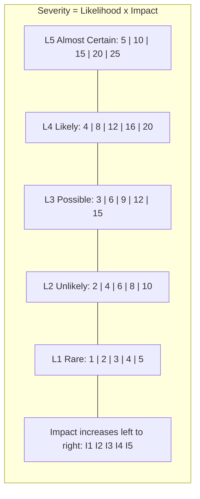
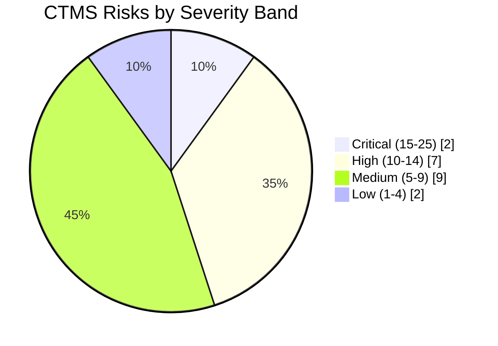
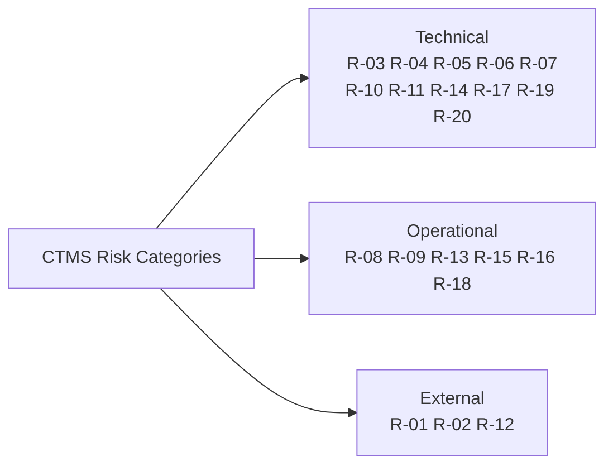
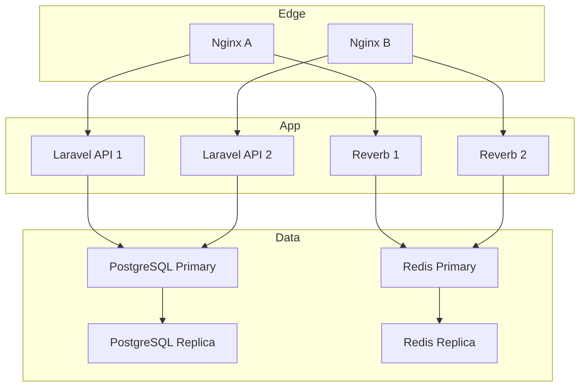
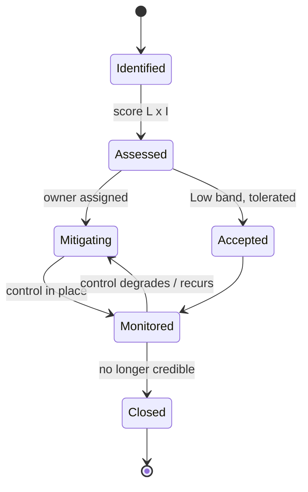

# CTMS Risk Register

**Document:** 18 — Risk Register
**System:** Campus Transport Management System (CTMS)
**SRS Baseline:** v1.0
**Status:** Living document — reviewed at each sprint boundary and after every production incident.

---

## 1. Purpose & Scope

This Risk Register is the single authoritative catalogue of engineering, operational, and external risks that threaten the delivery, availability, or integrity of the Campus Transport Management System. It exists so that the team does not "discover" foreseeable failure modes in production — GPS drift, a Google Maps bill spike, a Reverb fan-out meltdown at 8:00 AM peak, or a passenger count that silently blows past bus capacity because of a race between two `+1` taps.

Each risk carries a stable ID (`R-NN`), a category, a scored likelihood and impact, a derived severity, a concrete mitigation, and a named owner role. Risks are cross-cut against the functional requirements (FR-01..FR-15), the fixed tech stack (Laravel 12 + Reverb, PostgreSQL, Redis, Flutter, Next.js/React, Google Maps, FCM, Docker + Nginx), and the business rules from the SRS.

Scope covers the whole platform: Student app, Driver app, Admin dashboard, backend API + WebSocket layer, database, cache, maps integration, notification pipeline, and deployment topology.

---

## 2. Scoring Legend

Risk is scored on two independent 1–5 axes. **Severity = Likelihood × Impact**, bucketed into a qualitative band. Scores are deliberately coarse — the goal is prioritisation, not false precision.

### 2.1 Likelihood (probability the risk materialises within a 12-month operating window)

| Score | Label | Meaning |
|:-----:|-------|---------|
| 1 | Rare | Not expected; would be surprising. Requires a chain of unlikely events. |
| 2 | Unlikely | Could happen, but no strong reason to expect it. |
| 3 | Possible | Reasonable chance; has happened to comparable systems. |
| 4 | Likely | Expected to occur at least once in the window under normal operation. |
| 5 | Almost Certain | Will occur, probably repeatedly, unless actively controlled. |

### 2.2 Impact (consequence if the risk materialises, worst realistic case)

| Score | Label | Meaning |
|:-----:|-------|---------|
| 1 | Negligible | Cosmetic or trivially recoverable; no user-visible harm. |
| 2 | Minor | Localised degradation; workaround exists; a few users affected. |
| 3 | Moderate | A module is impaired for a period; many users affected; manual recovery. |
| 4 | Major | Core service (tracking, trips, notifications) down or wrong; campus-wide disruption. |
| 5 | Severe | Safety, legal/privacy breach, data loss, or total outage during peak transport hours. |

### 2.3 Severity Bands (Likelihood × Impact)

| Score range | Band | Response expectation |
|:-----------:|------|----------------------|
| 1 – 4 | 🟢 Low | Accept and monitor. Review quarterly. |
| 5 – 9 | 🟡 Medium | Mitigate on the roadmap; assign owner; track. |
| 10 – 14 | 🟠 High | Active mitigation required before or during the affected release. |
| 15 – 25 | 🔴 Critical | Blocker-class. Must have a designed control before go-live. |

### 2.4 Severity Matrix

### 2.5 Owner Roles

| Owner tag | Responsible party |
|-----------|-------------------|
| BE | Backend Lead (Laravel/Reverb/DB) |
| MOB | Mobile Lead (Flutter — driver & student apps) |
| FE | Frontend Lead (Next.js admin dashboard) |
| DEV | DevOps / SRE (Docker, Nginx, deploy, monitoring) |
| SEC | Security & Compliance Officer |
| PO | Product Owner / Transport Dept liaison |
| OPS | Transport Operations (Admin users, drivers) |

---

## 3. Risk Register (Master Table)

Severity band is derived from the L×I product using the legend above.

| ID | Risk | Category | Likelihood | Impact | Severity | Mitigation | Owner |
|----|------|----------|:----------:|:------:|----------|------------|:-----:|
| R-01 | **Google Maps cost overrun / quota exhaustion.** Routes API + Places API + SDK calls scale with trips × students × refresh rate; billing spikes or daily quota hit stops ETA (FR-09) and geocoding. | External | 4 | 4 | 🟠 16 High | Server-side ETA computation only (never from client keys); cache Routes responses in Redis keyed by `routeId+stopSequence` with TTL; debounce ETA recompute to per-stop, not per-GPS-ping; set hard billing alerts + quota caps in GCP; fall back to last-known ETA + straight-line estimate on quota error. | BE |
| R-02 | **Google Maps outage / API deprecation.** Upstream 5xx, key revocation, or API version sunset breaks ETA and map tiles. | External | 2 | 4 | 🟡 8 Medium | Circuit breaker around Maps calls; degrade gracefully to cached route polyline + geofence-based "approaching stop" logic that needs no external call; monitor Google status; abstract Maps behind a single `MapsGateway` service to swap providers. | BE |
| R-03 | **GPS accuracy drift & jitter.** Consumer-grade device GPS gives noisy fixes, tunnels/urban canyons cause jumps; bus appears off-route or teleports, corrupting ETA and geofence stop detection (FR-07, FR-09). | Technical | 4 | 3 | 🟠 12 High | Client-side smoothing (discard fixes with `accuracy` worse than threshold); server-side sanity filter on `TripLocation.speed`/distance-delta; snap-to-route using route polyline; use `geofenceRadius` per `RouteStop` rather than exact-point matching. | MOB |
| R-04 | **Driver device battery drain from continuous GPS + WebSocket.** 5–10s GPS + persistent socket over a multi-hour trip drains the phone; driver disables location or app is killed by OS. | Technical | 4 | 4 | 🟠 16 High | Use Android foreground service / iOS background location with a persistent notification; adaptive interval (5s moving, slower when stationary at a stop); batch buffered points on reconnect; in-app battery/permission health check before `startTrip`; recommend in-vehicle charging in driver SOP. | MOB |
| R-05 | **Connectivity loss during trip.** Assumption "drivers have internet" fails in dead zones; GPS stream and passenger updates stop; students see a frozen bus. | Technical | 4 | 3 | 🟠 12 High | Offline GPS buffering on device (NFR reliability) with monotonic local timestamps; queue `PassengerLog` and `TripLocation` writes; auto-sync ordered replay on reconnect; server accepts backfilled points by `timestamp`; student app shows "last updated Xs ago" honesty indicator. | MOB |
| R-06 | **Reverb WebSocket scaling / fan-out under peak load.** Morning peak: hundreds of buses emitting every 5–10s, thousands of students subscribed; broadcast fan-out saturates Reverb, raising latency past the 2s NFR or dropping messages. | Technical | 3 | 4 | 🟠 12 High | Per-trip broadcast channels so a student only subscribes to their assigned bus (also enforces the "view only assigned bus" rule); Redis pub/sub backend for Reverb; horizontal scale Reverb behind Nginx with sticky sessions; throttle server-side broadcast to max 1 emit/2s per trip regardless of ingest rate; load-test at 2× projected peak before go-live. | DEV |
| R-07 | **PII exposure — Aadhaar & driving licence.** `Driver.aadhaarNumber`, `drivingLicenseNumber`, plus student guardian contacts are sensitive; leak causes legal/regulatory and trust damage. | Technical | 3 | 5 | 🟠 15 Critical | Encrypt Aadhaar/licence at rest (Laravel encrypted casts); never return them in list/API responses — masked by default, full value behind an explicit audited admin scope; TLS/HTTPS everywhere; role-based authorization; immutable audit log on every PII read; data-retention policy; exclude from logs and error traces. | SEC |
| R-08 | **Driver non-adoption of +1 / −1 passenger discipline.** Passenger counter (FR-08) depends on driver diligence; forgotten taps make `currentPassengers`, occupancy, and merge recommendations (FR-13) wrong. | Operational | 4 | 3 | 🟠 12 High | Large, glove-friendly +/− UI; per-stop count prompt on geofence entry; running total always visible; end-of-trip reconciliation screen; flag trips where boarded ≠ exited; treat counts as advisory for safety-critical decisions; roadmap RFID/NFC (FUTURE) to remove human step. | MOB |
| R-09 | **Merge / replacement recommendation edge cases.** Bus consolidation (FR-13) or replacement (FR-12) suggests an invalid target: over-capacity merge, bus in `MAINTENANCE`, driver on `LEAVE`, or trips too far apart geographically. | Operational | 3 | 4 | 🟠 12 High | Recommendation engine validates against business rules pre-surfacing: exclude `BusStatus` MAINTENANCE/BREAKDOWN/OFFLINE and `DriverStatus` LEAVE/OFF_DUTY; enforce `mergedPassengers ≤ targetBus.capacity`; cap `distanceIncrease`; require admin approval (never auto-apply); log rejected recommendations to tune thresholds. | BE |
| R-10 | **Capacity-cap race condition.** Two near-simultaneous `+1` taps (retry, double-tap, reconnect replay) push `currentPassengers` past `capacity`, violating the hard business rule. | Technical | 3 | 3 | 🟡 9 Medium | Server-authoritative counting: client sends board/exit *events*, server derives count; atomic increment guarded by a DB row lock / conditional `UPDATE ... WHERE currentPassengers < capacity`; idempotency key per tap to dedupe replays; reject over-capacity board with a clear driver-facing message. | BE |
| R-11 | **Multi-campus data isolation failure.** Scalability target is multi-campus; a missing tenant scope leaks one college's buses/students/routes into another's dashboard or reports. | Technical | 2 | 5 | 🟡 10 Medium | Tenant/campus foreign key on all core tables; global query scope enforced at the Eloquent model layer (not per-controller); tenant assertion in JWT claims and re-checked server-side; automated tests that a cross-tenant ID returns 404, not 403+data; audit any query missing a tenant filter in CI. | BE |
| R-12 | **FCM delivery unreliability.** Push notifications (FR-10) can be delayed, deduped, throttled, or silently dropped by FCM/OS; students miss "bus nearing stop" or "trip started". | External | 3 | 3 | 🟡 9 Medium | Treat push as best-effort, not guaranteed: mirror every notification to an in-app `Notification` feed (source of truth) so nothing is lost; retry with backoff on FCM transient errors; token refresh handling; collapse keys to avoid stale-notification pile-up; monitor delivery/failure rates. | BE |
| R-13 | **Single points of failure in infrastructure.** One PostgreSQL primary, one Redis, one Reverb node, or one Nginx host — any single failure takes down the whole platform during transport hours. | Operational | 3 | 5 | 🟠 15 Critical | PostgreSQL primary + streaming replica with failover; Redis persistence + replica; run ≥2 API and Reverb replicas behind Nginx; health checks + auto-restart in Docker; documented restore runbook + tested backups; graceful degradation (tracking read-only) if write path is down. | DEV |
| R-14 | **JWT/Sanctum auth weaknesses.** Long-lived tokens, no revocation, or role confusion let a student call driver/admin endpoints (FR-01 authorization). | Technical | 2 | 4 | 🟡 8 Medium | Short-lived access tokens + refresh; server-side role check on every endpoint (`UserRole` enum) not just at login; token revocation on password change/logout; deny-by-default policies; audit-log privilege-sensitive actions (approveMerge, assignReplacement). | SEC |
| R-15 | **SOS / incident signal lost or ignored.** Driver SOS or `VehicleIncident` report (FR-11) fails to reach admin promptly due to connectivity or queue backlog — a safety issue. | Operational | 2 | 5 | 🟡 10 Medium | SOS uses the highest-priority path: immediate socket emit + FCM high-priority + persisted record, whichever lands first; offline queue with aggressive retry; admin dashboard audible/persistent alert until acknowledged; auto-create `MaintenanceTicket` per business rule so nothing is dropped. | BE |
| R-16 | **ETA / stop-arrival inaccuracy erodes trust.** Even with Maps working, traffic modelling and count drift make ETAs wrong; students stop trusting the app. | Operational | 3 | 2 | 🟡 6 Medium | Use Google Routes traffic-aware mode; show ETA as a range with confidence; recalibrate on each stop geofence crossing; expose `delayMinutes` transparently; notify on delay (FR-10) rather than silently missing. | PO |
| R-17 | **Data volume growth on TripLocation.** GPS every 5–10s per trip generates high-volume `TripLocation` rows; unpartitioned table degrades query and backup performance. | Technical | 3 | 3 | 🟡 9 Medium | Time-partition `TripLocation` by `tripDate`/month; index on `(tripId, timestamp)`; downsample or archive raw points after trip completion (retain summary + polyline); keep only recent points hot in Redis for live view. | BE |
| R-18 | **Scope-driven schedule slip.** Broad module set (13 modules, 15 FRs) risks over-commitment; core tracking ships late or half-tested. | Operational | 3 | 3 | 🟡 9 Medium | Phase delivery: P1 auth+bus/route/trip+GPS+tracking; P2 notifications+incidents+replacement; P3 merge+analytics; defer FUTURE items (parent portal, RFID, AI); definition-of-done includes load + offline tests. | PO |
| R-19 | **Nginx/TLS or WebSocket-proxy misconfiguration.** Incorrect proxy/upgrade or timeout settings drop WebSocket upgrades or long-poll, breaking live tracking despite backend being healthy. | Technical | 2 | 3 | 🟢 6 Medium | Version-controlled Nginx config with WebSocket `Upgrade`/`Connection` headers and adequate `proxy_read_timeout`; staging parity with prod; automated smoke test that opens a Reverb channel post-deploy; TLS cert auto-renewal monitoring. | DEV |
| R-20 | **Duplicate/erroneous domain fields & schema drift.** Source model had a stray "employee name" on Driver; unmanaged drift between docs, migrations, and code causes bugs. | Technical | 2 | 2 | 🟢 4 Low | Single canonical domain model (name comes from `User`, not `Driver`); migrations reviewed against the data model doc; enum values (`BusStatus`, `DriverStatus`, `TripStatus`, `UserRole`) centralised; CI check that DB enums match code enums. | BE |

---

## 4. Severity Distribution

| Band | Count | Risk IDs |
|------|:-----:|----------|
| 🔴 Critical | 2 | R-07, R-13 |
| 🟠 High | 7 | R-01, R-03, R-04, R-05, R-06, R-08, R-09 |
| 🟡 Medium | 9 | R-02, R-10, R-11, R-12, R-14, R-15, R-16, R-17, R-18 |
| 🟢 Low | 2 | R-19, R-20 |

> Note: R-07 and R-13 score 15 (band boundary) and are treated as Critical-class blockers; R-11 and R-15 also score 10 and are managed at the top of the Medium band.

---

## 5. Category Breakdown

| Category | Count | Character | Primary owners |
|----------|:-----:|-----------|----------------|
| Technical | 11 | Architecture, data, device, security | BE, MOB, SEC, DEV |
| Operational | 6 | Human process, infra ops, delivery | OPS, PO, DEV, BE |
| External | 3 | Third-party dependency (Google, FCM) | BE |

---

## 6. Top-Risk Deep Dives

The four highest-severity risks (Critical band or top of High band) warrant explicit control design before go-live.

### 6.1 R-07 — PII Exposure (Aadhaar & Licence) · 🟠 15 Critical

**Threat.** `Driver.aadhaarNumber` and `drivingLicenseNumber` are regulated identifiers; `Student.guardianPhone`/`guardianName` are personal. A leak via an over-broad API response, a log line, or a stack trace is a legal and reputational event.

**Control design.**

| Layer | Control |
|-------|---------|
| Storage | Laravel encrypted casts on `aadhaarNumber`, `drivingLicenseNumber`; DB column encryption at rest. |
| Transport | HTTPS/TLS enforced; HSTS at Nginx. |
| API | Fields excluded from default serializers; masked (`XXXX-XXXX-1234`) in any UI; full value only via a dedicated, policy-gated endpoint. |
| Access | Role-based authorization; only Admin with an explicit scope; every read written to the audit log. |
| Observability | PII scrubbing in log/exception pipeline; retention + purge policy. |

### 6.2 R-13 — Infrastructure Single Points of Failure · 🟠 15 Critical

**Threat.** A single primary DB, cache, socket, or proxy failing during peak hours takes down live tracking, trips, and notifications simultaneously.

**Control design.** Redundant instances at every tier behind Nginx load balancing; PostgreSQL streaming replication with tested failover; Redis replica; Docker health checks with auto-restart; backups verified by periodic restore drills; degrade to read-only tracking if the write path is impaired.

### 6.3 R-04 — Driver Device Battery / Location Kill · 🟠 16 High

**Threat.** Continuous 5–10s GPS plus a persistent WebSocket over a multi-hour trip drains the driver phone; the OS kills the background app or the driver disables location, silently ending the GPS stream (FR-07) with no fallback since one bus = one GPS device (assumption).

**Control design.** Proper foreground/background location service with a persistent notification; adaptive sampling (slower while parked at a stop, per `geofenceRadius`); local buffering + ordered resync on reconnect (shared control with R-05); a pre-trip health check that blocks `startTrip` if location permission or battery-optimisation exemptions are missing; operational SOP for in-vehicle charging.

### 6.4 R-01 — Google Maps Cost / Quota · 🟠 16 High

**Threat.** ETA (FR-09) and geocoding costs scale with trips × students × refresh frequency. Naive per-GPS-ping ETA calls or client-side keys can 10× the bill or hit daily quota mid-peak, killing ETA campus-wide.

**Control design.**

| Control | Detail |
|---------|--------|
| Server-only keys | No Maps key ever ships in the Flutter apps for billable calls; ETA computed backend-side. |
| Caching | Redis cache of Routes responses per `routeId + stopSequence` segment; TTL tuned to traffic volatility. |
| Debounce | Recompute ETA per stop-geofence event, not per GPS ping. |
| Guardrails | GCP billing alerts + hard quota caps; per-day budget. |
| Degradation | On quota/error, fall back to last cached ETA + geometric estimate; surface as approximate. |

---

## 7. Risk Lifecycle & Governance

| Activity | Cadence | Responsible |
|----------|---------|-------------|
| Register review | Every sprint boundary | PO |
| Re-scoring after incident | Within 48h of any Sev-3+ incident | Owner + SEC |
| New-risk intake | Continuous (any team member raises `R-NN`) | PO triages |
| Critical/High control sign-off | Before affected release ships | DEV + BE + SEC |
| Executive summary | Monthly to College Management | PO |

**Register conventions.** IDs are never reused. A closed risk keeps its ID with status `Closed`. Likelihood/impact changes are recorded with a date and rationale in version control alongside this document.

---

## 8. Assumptions Underlying These Scores

These SRS assumptions, if violated, would raise several likelihoods materially and should themselves be monitored:

- Every bus has a GPS-enabled driver device (violation amplifies R-03, R-04).
- Drivers have internet during trips (violation amplifies R-05, R-12, R-15).
- Students have registered college accounts (affects R-11, R-14).
- Google Maps services are available (directly R-01, R-02, R-16).

---

## 9. Cross-references

- `01-srs.md` — functional/non-functional requirements baseline (FR-01..FR-15).
- `03-architecture.md` — system topology, Reverb, Redis, and failover design (R-06, R-13, R-19).
- `05-data-model.md` — entity/enum definitions referenced by R-07, R-10, R-11, R-20.
- `09-security-and-privacy.md` — auth, encryption, audit-log controls (R-07, R-14).
- `11-realtime-and-tracking.md` — GPS pipeline, offline buffering, WebSocket channels (R-03, R-04, R-05, R-06).
- `13-maps-and-eta.md` — Google Maps gateway, caching, quota strategy (R-01, R-02, R-16).
- `15-notifications.md` — FCM + in-app notification mirror (R-12, R-15).
- `17-deployment-and-ops.md` — Docker/Nginx, redundancy, runbooks (R-13, R-19).
- `19-test-strategy.md` — load, offline, and cross-tenant test coverage (R-06, R-05, R-11).
