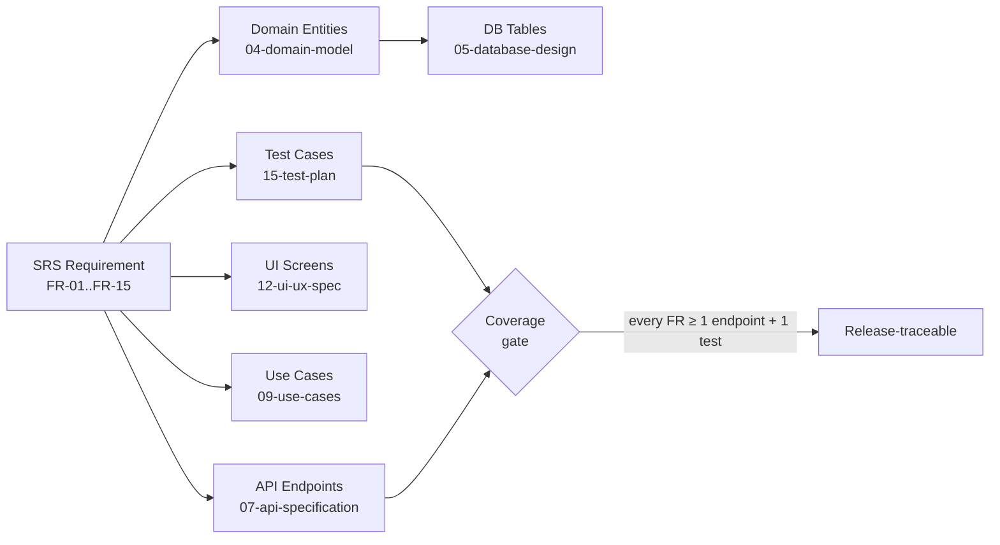
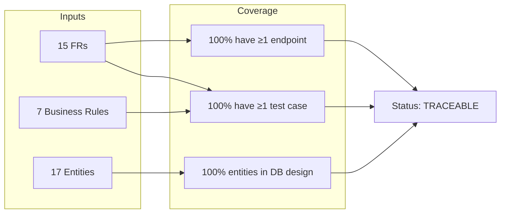

# CTMS — Requirements Traceability Matrix

**Document ID:** CTMS-DOC-19
**Document:** 19 — Requirements Traceability Matrix (RTM)
**System:** Campus Transport Management System (CTMS)
**Version:** 1.0
**Status:** Baseline
**Related SRS:** CTMS SRS v1.0

---

## 1. Purpose

This Requirements Traceability Matrix is the single, auditable bridge between the fifteen
functional requirements (**FR-01 … FR-15**) of the CTMS SRS and everything the engineering
suite produces to satisfy them: the domain entities that hold their state, the REST endpoints
that expose them, the client screens users touch, the use cases that describe their behavior,
and the test cases that prove they work.

It exists to answer four questions with evidence, not assertion:

1. **Coverage** — does every requirement have at least one endpoint and one test case?
2. **Realization** — is every domain entity actually persisted in the database design?
3. **Bidirectionality** — can we trace forward (requirement → build → test) and backward
   (a test, screen, or table → the requirement it serves)?
4. **Gaps** — where is something specified but not yet built, tested, or surfaced?

The matrix is derived from and stays consistent with the authored sibling documents:
`04-domain-model.md`, `07-api-specification.md`, `09-use-cases.md`, `12-ui-ux-spec.md`, and
`15-test-plan.md`. Where those documents disagree in cosmetic detail (path prefixes, notification
enum spellings), this RTM notes the discrepancy rather than silently choosing one.

---

## 2. How to Read This Matrix

- **ID conventions.** Requirements are `FR-01…FR-15`. Use cases are `UC-01…UC-13`. Functional
  test cases are `TC-<FR>-<n>` (e.g. `TC-08-4`). Business-rule test cases are `TC-BR-01…07`.
  Student screens are `S1…S8`, Driver screens `D1…D9`, Admin screens `A0…A12`.
- **Endpoints** are shown relative to the API base `/api/v1` (see `07-api-specification.md §2.1`).
- **Entities** use the canonical names and camelCase attributes from the domain model; DB column
  names map to snake_case in `05-database-design.md` / `06-data-dictionary.md`.

---

## 3. Master Traceability Matrix (FR-01 … FR-15)

The core of this document: one row per functional requirement, tracing it across all five
engineering axes. Endpoint lists are representative of the resource group; the full method/path
catalog lives in `07-api-specification.md`.

| FR ID | Requirement | Domain Entities | API Endpoints | UI Screens | Use Cases | Test Case IDs |
|-------|-------------|-----------------|---------------|------------|-----------|---------------|
| **FR-01** | Authentication — role-based secure login | User, Admin, Driver, Student | `POST /auth/login`, `POST /auth/logout`, `GET /auth/me`, `POST /auth/refresh`, `POST /auth/change-password`, `POST /auth/fcm-token` | S1, S2, S8 · D1, D2, D9 · A0 | UC-01 | TC-01-1 … TC-01-6 |
| **FR-02** | Bus Management — create, update, deactivate, assign | Bus, Admin | `GET/POST /buses`, `GET/PUT /buses/{id}`, `PATCH /buses/{id}/status`, `DELETE /buses/{id}`, `POST /buses/{id}/assign-driver`, `POST /buses/{id}/assign-route`, `GET /buses/available` | S3 · A2 | UC-03 | TC-02-1 … TC-02-5 |
| **FR-03** | Driver Management — register drivers, assign buses | Driver, User, Bus, Admin | `GET/POST /drivers`, `GET/PUT /drivers/{id}`, `PATCH /drivers/{id}/status`, `DELETE /drivers/{id}`, `POST /drivers/{id}/assign-bus`, `GET /drivers/available` | D9 · A3 | UC-03 | TC-03-1 … TC-03-4 |
| **FR-04** | Student Management — register students, assign routes | Student, User, Route, Bus, RouteStop, Admin | `GET/POST /students`, `GET/PUT /students/{id}`, `DELETE /students/{id}`, `POST /students/{id}/assign-route`, `GET /students/me/bus` | S3 · A4 | UC-04 | TC-04-1 … TC-04-4 |
| **FR-05** | Route Management — routes, stops, schedules | Route, RouteStop, Schedule | `GET/POST /routes`, `GET/PUT/DELETE /routes/{id}`, `GET/POST /routes/{routeId}/stops`, `PUT/DELETE /stops/{id}`, `PATCH /routes/{routeId}/stops/reorder`, `GET/POST /schedules`, `GET/PUT/DELETE /schedules/{id}` | S5 · A5, A6 | UC-02 | TC-05-1 … TC-05-5 |
| **FR-06** | Trip Management — daily trips, assign bus & driver | Trip, Schedule, Bus, Driver, Route | `GET/POST /trips`, `GET /trips/{id}`, `GET /trips/today`, `POST /trips/{id}/start`, `POST /trips/{id}/end`, `PATCH /trips/{id}/cancel` | D3, D4, D8 · A6, A7 | UC-03, UC-05, UC-12 | TC-06-1 … TC-06-5 |
| **FR-07** | Live GPS Tracking — updates every 5–10 s | TripLocation, Trip, Bus | `POST /trips/{id}/tracking/gps`, `GET /trips/{id}/tracking/latest`, `GET /trips/{id}/tracking/history` | S4 · D5 · A1 | UC-05, UC-06 | TC-07-1 … TC-07-5 |
| **FR-08** | Passenger Counter — driver +1 / −1 | PassengerLog, Trip, Bus | `POST /trips/{id}/passengers/increment`, `POST /trips/{id}/passengers/decrement`, `GET /trips/{id}/passengers/log`, `GET /trips/{id}/passengers/count` | D5 | UC-07 | TC-08-1 … TC-08-5 |
| **FR-09** | ETA Calculation — Google Maps Routes API | Trip, TripLocation, RouteStop, Student | `GET /trips/{id}/eta`, `GET /trips/{id}/tracking/latest` | S4 | UC-06 | TC-09-1 … TC-09-4 |
| **FR-10** | Notifications — trip lifecycle & alerts | Notification, Announcement, Student, User | `GET /notifications`, `GET /notifications/unread-count`, `PATCH /notifications/{id}/read`, `PATCH /notifications/read-all`, `GET/POST /announcements` | S6, S7 · A12 | UC-11 | TC-10-1 … TC-10-5 |
| **FR-11** | Vehicle Incident — breakdown / accident / etc. + SOS | VehicleIncident, Trip, Bus, Driver | `GET /incidents`, `POST /trips/{id}/incidents`, `GET /incidents/{id}`, `PATCH /incidents/{id}/status`, `POST /trips/{id}/sos` | D6, D7 · A10 | UC-08 | TC-11-1 … TC-11-4 |
| **FR-12** | Replacement Bus — recommend + admin approval | ReplacementAssignment, VehicleIncident, Bus, Driver | `GET /incidents/{id}/replacement/recommendations`, `POST /incidents/{id}/replacement/assign`, `POST /replacements/{id}/approve`, `POST /replacements/{id}/reject`, `GET /replacements/{id}` | A9 | UC-09 | TC-12-1 … TC-12-4 |
| **FR-13** | Smart Bus Consolidation — merge low-occupancy trips | BusMergeRecommendation, Trip, Bus, Admin | `GET /merge/recommendations`, `POST /merge/recommendations/generate`, `GET /merge/recommendations/{id}`, `POST /merge/recommendations/{id}/approve`, `POST /merge/recommendations/{id}/reject` | A8 | UC-10 | TC-13-1 … TC-13-5 |
| **FR-14** | Maintenance — auto-create tickets from incidents | MaintenanceTicket, VehicleIncident, Bus | `GET /maintenance/tickets`, `GET /maintenance/tickets/{id}`, `PATCH /maintenance/tickets/{id}`, `POST /maintenance/tickets/{id}/close` | D6 · A10 | UC-08 | TC-14-1 … TC-14-4 |
| **FR-15** | Reports — operational reports & analytics | Trip, VehicleIncident, MaintenanceTicket, BusMergeRecommendation, PassengerLog, Route, Bus | `GET /reports/trips`, `GET /reports/occupancy`, `GET /reports/incidents`, `GET /reports/fuel-savings`, `GET /reports/maintenance`, `GET /reports/analytics/dashboard` | D8 · A1, A11 | UC-12, UC-13 | TC-15-1 … TC-15-5 |

> **Real-time note.** FR-07, FR-09, and FR-10 also traverse the Laravel Reverb WebSocket surface
> (channel `trip.{id}` for GPS/ETA fan-out and per-user notification channels) documented in
> `08-realtime-events.md`. The RTM tracks the REST contract here; the WS contract is verified by
> the channel-authorization contract tests in `15-test-plan.md §10`.

---

## 4. Business-Rule Traceability

The seven codified business rules are cross-cutting invariants that ride on top of the FRs. Each
is realized in the domain layer, exposed (and enforced) through specific endpoints, and pinned by
a dedicated `TC-BR` case with unit **and** feature coverage.

| BR | Business Rule | Owning FR(s) | Enforcing Endpoint(s) | Use Cases | Test Case |
|----|---------------|--------------|-----------------------|-----------|-----------|
| BR-01 | Passenger count must never exceed capacity | FR-08 | `POST /trips/{id}/passengers/increment` (`422 CAPACITY_EXCEEDED`) | UC-07, UC-10 | TC-BR-01, TC-08-4 |
| BR-02 | Only one active driver per bus during a trip | FR-06 | `POST /trips/{id}/start` (`409 CONFLICT`) | UC-03 | TC-BR-02, TC-06-5 |
| BR-03 | A bus in maintenance cannot be assigned | FR-02, FR-06 | `POST /trips`, `POST /schedules`, `POST /buses/{id}/assign-*` (`409/422`) | UC-03, UC-05, UC-08 | TC-BR-03, TC-06-4, TC-14-4 |
| BR-04 | Bus merge requires admin approval | FR-13 | `POST /merge/recommendations/{id}/approve` (ADMIN policy) | UC-10 | TC-BR-04, TC-13-3, TC-13-5 |
| BR-05 | Replacement bus requires admin approval | FR-12 | `POST /replacements/{id}/approve` (ADMIN policy) | UC-09 | TC-BR-05, TC-12-3, TC-12-4 |
| BR-06 | Students can only view their assigned bus | FR-04, FR-07 | `GET /students/me/bus`, `GET /trips/{id}/tracking/latest` (ownership policy → `403`) | UC-04, UC-06 | TC-BR-06 |
| BR-07 | Every incident creates a maintenance record | FR-11, FR-14 | `POST /trips/{id}/incidents` (atomic ticket creation) | UC-08 | TC-BR-07, TC-11-2, TC-14-1 |

---

## 5. Non-Functional Requirement Traceability

Non-functional targets are traced to the endpoints/behaviors they constrain and the test scenario
that measures them (see `14-non-functional.md` and `15-test-plan.md §9`).

| NFR | Target | Realized by | Verifying Test |
|-----|--------|-------------|----------------|
| Performance (API) | Response < 2 s | All REST endpoints; Redis caching of ETA/location | TC-15-5; k6 GPS-ingest p95 < 2 s |
| Performance (GPS) | Update interval 5–10 s | `POST /trips/{id}/tracking/gps` cadence + rate bucket | TC-07-1, TC-07-5 |
| Availability | 99.9 % uptime | Docker + Nginx, Reverb cluster, health checks | k6 soak scenario |
| Security | HTTPS, Sanctum, RBAC, audit logs | Bearer middleware, role policies, audit log on writes | TC-01-4/5/6, TC-BR-04/05/06 |
| Scalability | Multi-campus, thousands of students | Stateless API, Redis, paginated lists | k6 Load env (500 buses / 20k students) |
| Reliability | Offline GPS buffering + auto-sync | Batch GPS ingest (`202`), idempotency key | TC-07-3 |

---

## 6. Coverage Summary

### 6.1 Endpoint & Test Coverage per FR

Confirmation that **every FR maps to at least one endpoint and at least one test case**. "Screen"
counts distinct client screens; "UC" counts mapped use cases.

| FR ID | ≥1 Endpoint | ≥1 Test Case | Screens | Use Cases | Verdict |
|-------|:-----------:|:------------:|:-------:|:---------:|:-------:|
| FR-01 | ✅ (6) | ✅ (6) | 6 | 1 | COVERED |
| FR-02 | ✅ (9) | ✅ (5) | 2 | 1 | COVERED |
| FR-03 | ✅ (8) | ✅ (4) | 2 | 1 | COVERED |
| FR-04 | ✅ (5) | ✅ (4) | 2 | 1 | COVERED |
| FR-05 | ✅ (12) | ✅ (5) | 3 | 1 | COVERED |
| FR-06 | ✅ (6) | ✅ (5) | 5 | 3 | COVERED |
| FR-07 | ✅ (3 REST + WS) | ✅ (5) | 3 | 2 | COVERED |
| FR-08 | ✅ (4) | ✅ (5) | 1 | 1 | COVERED |
| FR-09 | ✅ (2) | ✅ (4) | 1 | 1 | COVERED |
| FR-10 | ✅ (6 REST + WS/FCM) | ✅ (5) | 3 | 1 | COVERED |
| FR-11 | ✅ (5) | ✅ (4) | 3 | 1 | COVERED |
| FR-12 | ✅ (5) | ✅ (4) | 1 | 1 | COVERED |
| FR-13 | ✅ (5) | ✅ (5) | 1 | 1 | COVERED |
| FR-14 | ✅ (4) | ✅ (4) | 2 | 1 | COVERED |
| FR-15 | ✅ (6) | ✅ (5) | 3 | 2 | COVERED |

**Result: 15 / 15 functional requirements are fully covered.** Every FR has at least one REST
endpoint and at least one functional test case. Every business rule (BR-01…BR-07) has a dedicated
`TC-BR` case. Every use case (UC-01…UC-13) traces to at least one FR (per `09-use-cases.md §3`).

### 6.2 Domain Entity → Database Coverage

Confirmation that **every domain entity appears in the database design** (`05-database-design.md` /
`06-data-dictionary.md`). `User` is an abstract base realized as a `users` table with a role
discriminator plus role-specific tables for `Student`, `Driver`, and `Admin` (single-table +
extension pattern per the domain model).

| # | Domain Entity | Persisted As (table) | In DB Design | Referenced by FR |
|---|---------------|----------------------|:------------:|------------------|
| 1 | User (abstract) | `users` | ✅ | FR-01 |
| 2 | Student | `students` | ✅ | FR-04 |
| 3 | Driver | `drivers` | ✅ | FR-03 |
| 4 | Admin | `admins` | ✅ | FR-01…FR-15 (actor) |
| 5 | Bus | `buses` | ✅ | FR-02 |
| 6 | Route | `routes` | ✅ | FR-05 |
| 7 | RouteStop | `route_stops` | ✅ | FR-05 |
| 8 | Schedule | `schedules` | ✅ | FR-05, FR-06 |
| 9 | Trip | `trips` | ✅ | FR-06 |
| 10 | TripLocation | `trip_locations` | ✅ | FR-07 |
| 11 | PassengerLog | `passenger_logs` | ✅ | FR-08 |
| 12 | VehicleIncident | `vehicle_incidents` | ✅ | FR-11 |
| 13 | MaintenanceTicket | `maintenance_tickets` | ✅ | FR-14 |
| 14 | BusMergeRecommendation | `bus_merge_recommendations` | ✅ | FR-13 |
| 15 | ReplacementAssignment | `replacement_assignments` | ✅ | FR-12 |
| 16 | Notification | `notifications` | ✅ | FR-10 |
| 17 | Announcement | `announcements` | ✅ | FR-10 |

**Result: 17 / 17 domain entities are represented in the database design.** No orphan entity
(an entity with no backing table) and no orphan requirement (an FR with no owning entity).

### 6.3 Reverse Traceability Spot-Check

Backward tracing confirms no build artifact is disconnected from a requirement.

| Artifact | Traces back to | Requirement |
|----------|----------------|-------------|
| `passenger_logs` table | PassengerLog entity | FR-08 |
| Admin screen A8 (Merge Approvals) | BusMergeRecommendation | FR-13 |
| `POST /trips/{id}/sos` | VehicleIncident (SOS variant) | FR-11 |
| TC-BR-07 | MaintenanceTicket auto-create | FR-11 / FR-14 |
| Reverb channel `trip.{id}` | TripLocation broadcast | FR-07 |

---

## 7. Gap Analysis & Flags

No **blocking** gaps: every FR is covered by endpoints and tests, and every entity is persisted.
The items below are minor consistency and completeness flags surfaced during cross-document
reconciliation. They are documentation/hardening items, not missing functionality.

| # | Severity | Flag | Detail | Recommended Action |
|---|:--------:|------|--------|--------------------|
| G-1 | Info | Path-prefix drift | `07-api-specification.md` versions endpoints under `/api/v1`; the test plan writes `/api/...` without the version segment. | Standardize test-plan paths to include `/api/v1`; behavior unaffected. |
| G-2 | Info | Notification enum spelling | API spec uses `TRIP_STARTED`, `BUS_NEARING_STOP`, `ROUTE_CHANGE`, `REPLACEMENT_BUS`, `TRIP_COMPLETED`; use-case doc abbreviates (`BUS_NEARING`, `ROUTE_CHANGE`, `REPLACEMENT`). | Adopt the API-spec enum values as canonical in the data dictionary. |
| G-3 | Info | Auth mechanism wording | SRS NFR says "JWT/Sanctum"; API spec commits to **Laravel Sanctum** personal access tokens. | Treat Sanctum as the authoritative choice; drop "JWT" ambiguity from the SRS. |
| G-4 | Low | `Announcement` has no dedicated FR | Announcements (S7, A12) are folded under FR-10 Notifications but are a distinct entity/flow (audience, publish/expire window). | Acceptable as a sub-feature of FR-10; consider an explicit FR if scope grows. |
| G-5 | Low | Reports read-only entities | FR-15 reads across Trip/Incident/Merge/Maintenance but owns no write endpoint or table of its own. | Expected for an analytics requirement; no action — reporting is a projection. |
| G-6 | Low | SOS lacks a first-class entity | `POST /trips/{id}/sos` returns an `sosId` but SOS is modeled as a high-severity `VehicleIncident`, not a separate table. | Confirm SOS is persisted as a `VehicleIncident` row; document the mapping in the data dictionary. |
| G-7 | Info | `PassengerLog.action` enum casing | Domain/API use `Board`/`Exit` (title case) while other enums are UPPER_SNAKE. | Cosmetic; keep as authored but note the intentional exception in the data dictionary. |

**Overall status: TRACEABLE — release-ready from a requirements-coverage standpoint.** All 15 FRs,
7 business rules, and 17 entities are fully traced across design, API, UI, use cases, and tests.
Open flags are informational or low severity and do not block baseline.

---

## 8. Traceability Health at a Glance

| Dimension | Total | Covered | Coverage |
|-----------|:-----:|:-------:|:--------:|
| Functional requirements (FR) | 15 | 15 | 100% |
| Business rules (BR) | 7 | 7 | 100% |
| Use cases (UC) | 13 | 13 | 100% |
| Domain entities → DB | 17 | 17 | 100% |
| FRs with ≥ 1 endpoint | 15 | 15 | 100% |
| FRs with ≥ 1 test case | 15 | 15 | 100% |

---

## Cross-references

- `00-srs.md` — authoritative FR/NFR definitions traced by this matrix.
- `04-domain-model.md` — entities, attributes, and enums (the entity axis).
- `05-database-design.md` — PostgreSQL tables confirming entity persistence.
- `06-data-dictionary.md` — column-level mapping and enum value catalog.
- `07-api-specification.md` — REST endpoint contracts (the API axis).
- `08-realtime-events.md` — Reverb channels for FR-07 / FR-09 / FR-10 fan-out.
- `09-use-cases.md` — UC-01…UC-13 and their FR mapping (the use-case axis).
- `12-ui-ux-spec.md` — Student/Driver/Admin screen inventories (the UI axis).
- `15-test-plan.md` — TC-* functional and TC-BR business-rule cases (the test axis).
